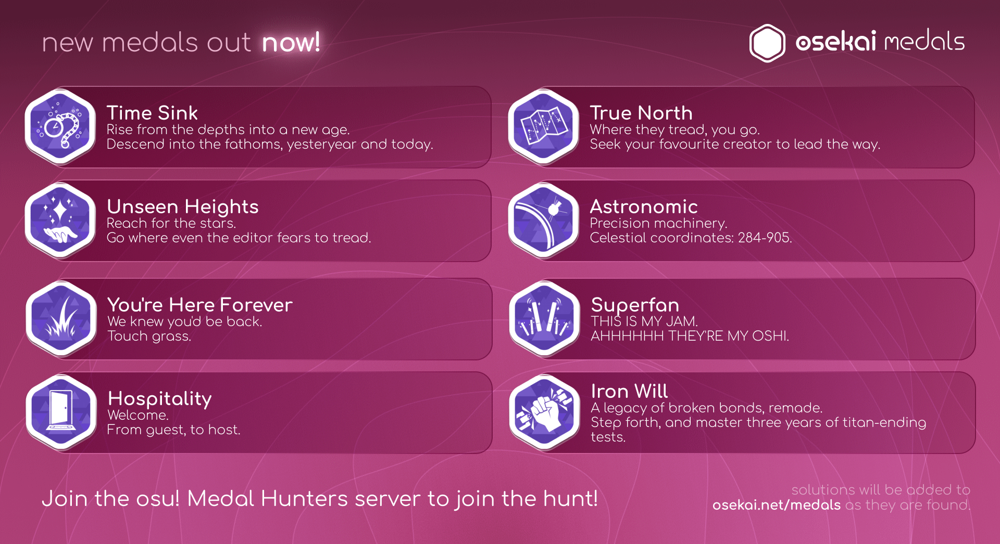

# Historia de osu! de 2023

## Enero

En la segunda semana de enero, [peppy](https://osu.ppy.sh/users/2) fue entrevistado por [MongoDB](https://es.wikipedia.org/wiki/MongoDB), el equipo responsable del desarrollo de [Realm](https://realm.io/), una base de datos usada en osu!(lazer). En la entrevista, hablaron de temas como el origen de osu!, la forma en la que osu! genera ingresos, el desarrollo y la infraestructura de osu! así como la transición a osu!(lazer).[^interview-mongodb]

Gracias a una actualización de osu!(lazer) el 21 de enero, los mappers ahora podían establecer el punto de vista previa de un beatmap en el [editor de beatmaps](/wiki/Client/Beatmap_editor). Al mismo tiempo, se rediseñó la barra de progreso del juego de la skin «argon» y se añadió la posibilidad de cambiar la cobertura de la pantalla del mod [Fade In](/wiki/Gameplay/Game_modifier/Fade_In). Por último, se habilitaron los [puntos de rendimiento](/wiki/Performance_points) para las puntuaciones, lo que provocó un aumento en la actividad de los jugadores. Justo después de la actualización, las puntuaciones diarias aumentaron de 103 000 el día anterior a 302 000, y el número de jugadores simultáneos pasó de unos 200 a 1600.[^lazer-jan-21]

[osu!stream](/wiki/osu!stream), un juego diseñado específicamente para dispositivos de mano y con elementos de juego únicos, recibió una adaptación a [Android](https://es.wikipedia.org/wiki/Android) tras las aportaciones de [ThePooN](https://osu.ppy.sh/users/718454) y otros. Hasta ese momento, solo estaba disponible en [iOS](https://es.wikipedia.org/wiki/IOS). En 2011, cuando comenzó el desarrollo de la versión para iOS, no estaba prevista su implementación en Android debido a las restricciones relacionadas con el audio en la infraestructura de Android, que afectarían en gran medida a la experiencia de juego.[^osu-stream-twitter][^osu-stream-pr]

La página de descargas del sitio web de osu! fue rediseñada, con una opción de descarga adicional para osu!(lazer). Antes de este cambio, solo se podía descargar osu!(stable) a través del sitio web, mientras que para descargar osu!(lazer) había que hacerlo desde su [repositorio de GitHub](https://github.com/ppy/osu). El botón de descarga de osu!(lazer) se colocó en la parte derecha de la página, con osu!(stable) a la izquierda, con el objetivo final de intercambiarlos para que osu!(lazer) destaque más.[^lazer-download]

## Febrero

El [lenguaje de marcado](https://es.wikipedia.org/wiki/Lenguaje_de_marcado) [BBCode](/wiki/BBCode), que se usa en los foros de osu! y en varias partes del sitio web, adquirió una forma de resaltar texto en línea con la implementación de la etiqueta `[c]`.[^c-tag]

## Marzo

En el concurso [Skin of the Year](https://osu.ppy.sh/home/news/2023-02-09-skin-of-the-year-2022) de 2022, los usuarios pudieron votar por su skin favorita. Los tres primeros lugares, ocupados por [- Koshiin -](https://osu.ppy.sh/users/19135423), [moonstaar](https://osu.ppy.sh/users/27339355) y [BatuhanYtho](https://osu.ppy.sh/users/12091015) respectivamente, recibieron insignias personalizadas como premio del concurso. Cada finalista, desde el puesto número 1 al número 10, recibió diferentes cantidades de osu!supporter.[^soty-results]

[EEEEEEEEEEEEEEE](https://osu.ppy.sh/users/2927048) jugó todos los beatmaps clasificados en el [modo de juego osu!](/wiki/Game_mode/osu!) hasta el 12 de marzo y, por lo tanto, fue el tercero en recibir el [título de usuario](/wiki/Community/User_title) [osu!completionist](/wiki/People/Completionists).[^completionist-tweet]

## Abril

Se añadió otra etiqueta a la sintaxis de BBCode. La etiqueta `[imagemap]` permitiría añadir varias zonas con hipervínculos a una sola imagen.[^imagemap-tag]

Para celebrar el 15º aniversario en 2022, osu! puso a la venta una alfombrilla de escritorio en la tienda como oferta por tiempo limitado.[^desk-mat]

## Mayo

[osudaily.net](https://osudaily.net/) proporcionó datos que se remontaban a 2016 para incluirlos en las estadísticas del perfil que muestran el rango más alto que ha alcanzado un jugador.[^highest-rank]

A finales de mayo se publicaron [nuevas medallas](https://www.reddit.com/r/osugame/comments/13vma49/new_medals_are_out/).

## Junio

En el segundo lanzamiento del mes, 2 semanas después, el [modo de juego](/wiki/Game_mode) osu! en osu!(lazer) recibió el mod Synesthesia, que coloreaba los [objetos](/wiki/Gameplay/Hit_object) según la temporización.[^synesthesia-mod] Además, se añadió un panel de búsqueda al selector de mods para facilitar la búsqueda de los mods.[^mod-search] El campo de búsqueda podría activarse presionando `Tabulador` para no interferir con los atajos de teclado normales.

::: Infobox

:::

La tercera temporada del [osu!monthly](/wiki/Community/osu!monthly) finalizó con la [9ª edición](https://osu.ppy.sh/home/news/2023-06-26-osumonthly-9), que resumió los acontecimientos más importantes de la comunidad a partir de marzo de 2023. Debido principalmente a la disolución del equipo de mapping del proyecto[^mapping-team-disbanding] y al gran trabajo necesario para redactar las ediciones del osu!monthly, el equipo del osu!monthly decidió dejar el proyecto en pausa por el momento. En varias discusiones se consideró la posibilidad de reorganizar el trabajo y publicar en su lugar ediciones estacionales o anuales.[^monthly-discord][^writing-proposal] [0x84f](https://osu.ppy.sh/users/7944724), uno de los responsables del proyecto de la tercera temporada, también hizo encuestas públicas para averiguar qué le interesaba a la comunidad y qué le gustaría ver en la sección de noticias del sitio web de osu! en general.[^news-content-1][^news-content-2]

Como homenaje a las dos primeras temporadas que se publicaron en formato PDF, el 9º osu!monthly se realizó [como revista](https://assets.ppy.sh/media/osu-monthly/2023-03/osu-monthly-2023-03.pdf) en lugar de las habituales noticias. Incluyó noticias sobre el mapping, el skinning y los acontecimientos de la comunidad, así como entrevistas con [EEEEEEEEEEEEEEE](https://osu.ppy.sh/users/2927048) y [pishifat](https://osu.ppy.sh/users/3178418).

## Julio

[Una actualización del sitio web](https://osu.ppy.sh/home/changelog/web/2023.725.0) permitió a los usuarios actualizar el país que aparece en sus perfiles, siempre y cuando no coincidiera con el país desde el cual hayan estado iniciando sesión de manera constante durante los últimos 6 meses y que el usuario no estuviera inscrito en ningún torneo en curso. En el pasado, era posible cambiar el país mostrado poniéndose en contacto con el [equipo de soporte de cuentas](/wiki/People/Account_support_team) y proporcionando una prueba de residencia, pero esta opción se dejó de ofrecer a partir de diciembre de 2021 debido a la transmisión de datos sensibles, así como a los frecuentes casos de abuso.[^flag-pr][^flag-issue][^flag-news]

## Agosto

Desde mayo hasta agosto, se organizó el concurso de skins [Icons of an Era](https://osu.ppy.sh/home/news/2023-05-10-skinning-contest-icons-of-an-era) para celebrar los 15 años de osu! en forma de [skins](/wiki/Skin) que representaban beatmaps o mascotas populares. [Spoo](https://osu.ppy.sh/users/11805037), [Chromasia](https://osu.ppy.sh/users/7306251) y [thetasigma](https://osu.ppy.sh/users/6234482) obtuvieron el primer, segundo y tercer lugar del concurso, respectivamente. Los premios incluyeron una insignia personalizada y diversas cantidades de osu!supporter.[^icons-of-an-era]

::: Infobox

:::

[Dynam1cNET](https://osu.ppy.sh/users/12540789) implementó un lienzo personalizado similar al de [r/place](https://es.wikipedia.org/wiki/Place_(Reddit)) en su página de perfil, permitiendo a cualquier usuario *colocar* píxeles de colores en él.[^me-page-place]

## Noviembre

Varias personas fueron elogiadas y galardonadas con una insignia de contribuidor de la comunidad por su notable ayuda a la comunidad de osu! en 2022 y 2023.[^contributors]

## Diciembre

Paralelamente a la última actualización de este año, el osu! team quería que más gente probara osu!(lazer) y diera su opinión a través del foro antes de finalizar las mecánicas de la jugabilidad y permitir que se otorgaran [puntos de rendimiento](/wiki/Performance_points) por las puntuaciones.[^feedback] Se aplicaron los siguientes cambios notables:

- Se redujo la penalización por fallar en combos altos (`combo^1,5` comparado con `combo^2`).
- La relación entre combo y precisión se reequilibró, haciendo que la precisión tenga más peso en la puntuación.
- El sistema de grados de osu!catch en osu!(lazer) se cambió para que coincidiera con el sistema de grados de osu!(stable) para simplificar la obtención de valores de alta precisión.
- Se ajustó la mecánica de los sliders para que los sliders rápidos sean más fáciles de jugar.[^lazer-12-18]

El [Winter Fanart Contest](https://osu.ppy.sh/home/news/2023-11-07-winter-fanart-contest) de 2023 se desarrolló bajo un tema donde «las mascotas de osu! estén disfrutando de un festín navideño». Debido a este amplio tema, los participantes tuvieron mucha libertad y creatividad para los diseños. Todos los finalistas obtuvieron tres meses de osu!supporter, mientras que los 3 ganadores recibieron una [insignia de perfil](/wiki/Community/Profile_badge) personalizada además de todo esto.[^winter-fanart]

Al igual que en otros [canales de lanzamiento](/wiki/Client/Release_stream), el número de usuarios en osu!(lazer) se hizo visible en el sitio web.[^lazer-user-count]

## Referencias

[^lazer-jan-21]: [Vídeo de YouTube por pishifat (21/1/2023) «lazer updates - January 21, 2023»](https://www.youtube.com/watch?v=P6Y9B1pyIcw)
[^interview-mongodb]: [Tuit de @ppy (12/1/2023)](https://twitter.com/ppy/status/1613534700295028739)
[^osu-stream-twitter]: [Tuit de @ppy (12/1/2023)](https://twitter.com/ppy/status/1613460209703456769)
[^osu-stream-pr]: [Solicitud de cambios por Beyley (22/8/2021) «Add android support»](https://github.com/ppy/osu-stream/pull/27)
[^lazer-download]: [Solicitud de cambios por nanaya (13/12/2022) «New download page»](https://github.com/ppy/osu-web/pull/9638)

[^c-tag]: [Solicitud de cambios por nanaya (2/2/2023) «Add bbcode tag for inline code»](https://github.com/ppy/osu-web/pull/9829)

[^soty-results]: [Publicación de noticia por RockRoller (5/3/2023) «Skin of the Year 2022: Results»](https://osu.ppy.sh/home/news/2023-03-05-skin-of-the-year-2022-results)
[^completionist-tweet]: [Tuit de @osugame (15/3/2023)](https://twitter.com/osugame/status/1635888223590453250)

[^imagemap-tag]: [Solicitud de cambios por nanaya (9/3/2023) «Add imagemap support to bbcode»](https://github.com/ppy/osu-web/pull/9972)
[^desk-mat]: [Tuit de @osugame (4/4/2023)](https://twitter.com/osugame/status/1643288319860801536)

[^highest-rank]: [Tuit de @ppy (13/5/2023)](https://twitter.com/ppy/status/1657250346291593217)

[^mod-search]: [Solicitud de cambios por Cootz (6/5/2023) «Add mod search»](https://github.com/ppy/osu/pull/23414)
[^synesthesia-mod]: [Solicitud de cambios por jtbiddle (13/5/2023) «Add "Synesthesia" mod for osu! ruleset»](https://github.com/ppy/osu/pull/23520)
[^mapping-team-disbanding]: [Mensaje de discord de 0x84f (31/5/2023)](https://discord.com/channels/188630481301012481/1003689172420276246/1113463478057971722)
[^monthly-discord]: [Mensaje de discord de 0x84f (17/4/2023)](https://discord.com/channels/188630481301012481/1003689172420276246/1097626728328876062)
[^writing-proposal]: [«The “osu! writing team” proposal» en Documentos de Google](https://docs.google.com/document/d/1vWSy64g8HxNsoEoL5uGVarH1cpYH0zWDRmmIoZyjOgY/edit)
[^news-content-1]: [Hilo del foro por 0x84f (31/5/2023) «What content do you want to see in the news section on the front page?»](https://osu.ppy.sh/community/forums/topics/1772564?n=1)
[^news-content-2]: [Hilo de Reddit por u/EDMSerbia (31/5/2023) «What content do you want to see in the news section on the osu! website?»](https://www.reddit.com/r/osugame/comments/13wpu7g/what_content_do_you_want_to_see_in_the_news/)

[^flag-pr]: [Solicitud de cambios por nanaya (21/7/2023) «Allow changing country from account settings»](https://github.com/ppy/osu-web/pull/10398)
[^flag-issue]: [Problema abierto por peppy en GitHub (18/7/2023) «Add support for user initiated flag changes»](https://github.com/ppy/osu-web/issues/10382)
[^flag-news]: [Publicación de noticia por Blushing y Walavouchey (28/7/2023) «Enabling Country Flag Changes»](https://osu.ppy.sh/home/news/2023-07-28-enabling-country-flag-changes)

[^icons-of-an-era]: [Publicación de noticia por RockRoller (10/8/2023) «Skinning Contest: Icons of an Era - Results»](https://osu.ppy.sh/home/news/2023-08-10-skinning-contest-icons-of-an-era-results)
[^me-page-place]: [Hilo del foro por Dynam1cNET (19/8/2023) «I've made a r/place clone for my about me section»](https://osu.ppy.sh/community/forums/topics/1809912?n=1)

[^contributors]: [Publicación de noticia por el osu! team (19/11/2023) «Community Contributors: 2022 & 2023»](https://osu.ppy.sh/home/news/2023-11-19-community-contributors-2022-2023)

[^feedback]: [Hilo del foro por peppy (18/12/2023) «osu!(lazer) 2023.1218.0 release feedback»](https://osu.ppy.sh/community/forums/topics/1858702?n=1)
[^lazer-12-18]: [Publicación de noticia por Walavouchey (18/12/2023) «osu!(lazer) Updates & Preparing For Ranked Play»](https://osu.ppy.sh/home/news/2023-12-18-osulazer-updates-preparing-for-ranked-play)
[^winter-fanart]: [Publicación de noticia por Ephemeral (7/12/2023) «Winter 2023 Fanart Contest Results»](https://osu.ppy.sh/home/news/2023-12-07-winter-fanart-contest-results)
[^lazer-user-count]: [Tuit de @ppy (15/12/2023)](https://twitter.com/ppy/status/1735606671031091389)
