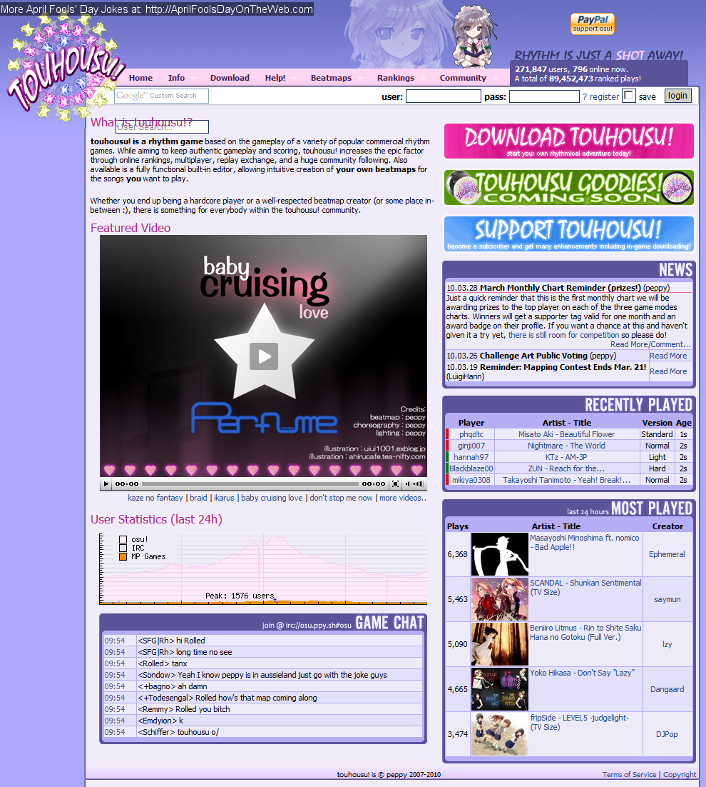
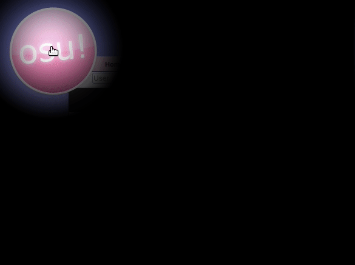
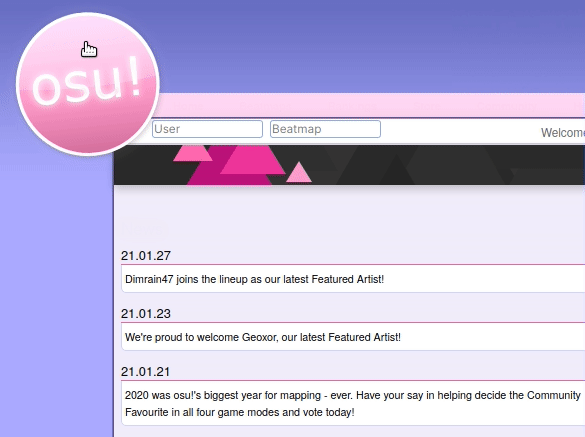
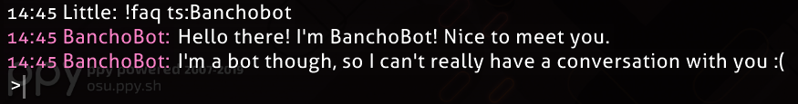

---
tags:
  - april fools
  - april 1st
  - 1 april
  - april 1
  - april fools day
  - joke
  - history
  - legacy
---

# History of osu! April Fools' day jokes

*For the complete history of osu!, see: [History of osu!](/wiki/History_of_osu!)*

Every year, the [osu! team](/wiki/People/osu!_team) likes to play pranks on the community on April Fools' day. This article lists all April Fools' day jokes that have been played on the osu! community since 2009.

## 2009

### "Lemon Tree" gets ranked

The [beatmap](/wiki/Beatmap) ["Best of No.1 Hits - Lemon Tree (MillhioreF)"](https://osu.ppy.sh/beatmapsets/57878#osu/174267) was [ranked](/wiki/Beatmap/Category#ranked) on 1 April 2009, as part of that year's April Fools' joke. The beatmap was very much an in-joke within the community with users sarcastically claiming that such a beatmap should be kept ranked forever.[^lemontree-reddit][^lemontree-post-machol30][^lemontree-post-peppy] Its ranked status was removed by the moderation team shortly afterwards.[^lemontree-post-machol30]

After some time, the original beatmap was removed at the request of its creator; however, it was eventually re-uploaded on 24 August 2012 by [MillhioreF](https://osu.ppy.sh/users/941094) for archival purposes.[^lemontree-post-millhioref]

## 2010

### touhosu!

For the 2010 April Fools' prank, the osu! website along with the in-game main menu screen was changed to theme with characters and references to the [Touhou Project](https://en.wikipedia.org/wiki/Touhou_Project). The changes included an addition of the character Marisa Kirisame and a display of differently-coloured butterflies in a circular pattern across the main menu and website, along with the swapping of the name "osu!" to "touhosu!" in certain areas across the website.[^touhousu-ontheweb][^touhousu-osudev-2021-01-27][^touhousu-forums]

The joke largely stems from a [long-standing feature request](https://osu.ppy.sh/community/forums/topics/19307) to create a [game mode](/wiki/Game_mode) based on the currently-existing [osu!catch](/wiki/Game_mode/osu!catch) game mode with the core gameplay from the Touhou Project games.

There was also a report at the time of [Ephemeral](https://osu.ppy.sh/users/102335) jokingly remarking that buying an osu!supporter tag would show a naked Marisa Kirisame on the main menu screen instead of a fully clothed one. However, this claim was only a joke and was quickly disproven by others.[^touhousu-forums-2]

## 2011

### osu!core

"osu!core" is the name given to osu!'s 2011 April Fools' day prank. The prank caused every single beatmap's audio to be pitched and sped up in the style of [Nightcore](https://en.wikipedia.org/wiki/Nightcore) remixes. Although just an April Fools' day prank, it later became a reality when the [Nightcore mod](/wiki/Gameplay/Game_modifier/Nightcore) was introduced as an actual playable [game modifier](/wiki/Gameplay/Game_modifier) in osu! later on.[^nightcore-yt][^nightcore-frontpage][^fl-forums]

## 2012

### Flashlight/Hidden mod on website

On 1 April 2012, the entire osu! website had a 50% chance of either the [Flashlight (FL) mod](/wiki/Gameplay/Game_modifier/Flashlight) or [Hidden (HD) mod](/wiki/Gameplay/Game_modifier/Hidden) being "enabled" on the website per page load (3/10 for HD; 1/5 for FL). A modern recreation of what the prank looked like for users at the time is shown below.[^fl-ontheweb][^fl-forums-2][^fl-forums-3][^fl-forums-4][^fl-osudev-2021-01-29]

### Bad Apple ranking chart

The "Bad Apple Ranking Chart" was a joke ranking chart based on a variety of beatmaps that featured the song "Bad Apple!!" as part of osu!'s 2012 April Fools' joke. Announced via [a newspost](https://osu.ppy.sh/community/forums/posts/1431905) on 1 April 2012, the ranking chart actually functioned as a real working chart at the time and displayed the top 40 players who obtained the highest [ranked score](/wiki/Gameplay/Score/Ranked_score) in any one of the handpicked selections of "Bad Apple!!" beatmaps.[^bad-apple-chart][^bad-apple-news] An excerpt from the aforementioned newspost is inscribed below:

> We decided to dedicate this chart to the greatest song and video ever created, Bad Apple!!. You can find the awesome chart here
>
> Now, as this is a chart of epic proportions, we needed to make our prize a little better this time! The winners will receive a Lily White poster and a hand drawn picture of Reimu. (A printer is required to receive these prizes)
>
> Look forward to our next charts, the Renai Circulation and Irony charts!

—Cyclone, "Bad Apple Ranking Chart!"[^bad-apple-news]

The chart was opened on 1 April 2012 and closed on 2 April 2012. At the end of the ranking period, [Mesita](https://osu.ppy.sh/users/201459) was the number one player with a ranked score of 145,623,328.[^bad-aple-frontpage]

The beatmaps included in the ranking chart are listed below:

- [nomico - Bad Apple!! (James)](https://osu.ppy.sh/beatmapsets/6252)
- [REDALiCE - Bad Apple!! (Rena-chan)](https://osu.ppy.sh/beatmapsets/10353)
- [Masayoshi Minoshima ft. nomico - Bad Apple!! (Ephemeral)](https://osu.ppy.sh/beatmapsets/10435)
- [Masayoshi Minoshima ft. nomico - Bad Apple!! (ignorethis)](https://osu.ppy.sh/beatmapsets/13177)
- [Masayoshi Minoshima feat. StrawbellyCake - Bad Apple!! (German Version) (Larto)](https://osu.ppy.sh/beatmapsets/13664)
- [Masayoshi Minoshima feat. Larto & nomico - Awesome Apple!! (Larto)](https://osu.ppy.sh/beatmapsets/14475)
- [Masayoshi Minoshima feat. nomico - Bad Apple!! (ouranhshc)](https://osu.ppy.sh/beatmapsets/18260)
- [Spiritsoulxx - Bad Apple!! (Tony)](https://osu.ppy.sh/beatmapsets/23760)
- [Kommisar - Bad Apple!! (Chiptune Ver.) (Sushi)](https://osu.ppy.sh/beatmapsets/28222)
- [Kalafina - Bad MagiApple (Makar8000)](https://osu.ppy.sh/beatmapsets/32003)

The "Bad Apple!!" music video had been some sort of an in-joke at the time with remixes of the song combined with other ironic twists being a prevalent occurrence in beatmaps at the time, hence its appearance as an April Fools' joke. <!--citation needed-->

## 2013

### BanchoBot becomes a tsundere

On 1 April 2013, [BanchoBot](/wiki/BanchoBot) was turned into a [tsundere](https://en.wikipedia.org/wiki/Tsundere). On this April Fools' day, every time a user would issue a command to BanchoBot or prompt it to speak in a public chat, its chat messages would be replaced with stereotypical tsundere-like responses to a romantic interest.[^banchobot-reddit][^banchobot-forums][^banchobot-forums-2][^banchobot-tweet][^banchobot-forums-3][^banchobot-forums-4]

## 2014

### Shiba Inu appears in osu!

On 1 April 2014, the osu! main menu screen was temporarily changed (shown below) to include multi-coloured, grammatically incorrect statements accompanied by the famous image of a certain [Shiba Inu](https://en.wikipedia.org/wiki/Shiba_Inu) in the style of the [Doge meme](https://en.wikipedia.org/wiki/Doge_(meme)) that was popular at that time.[^shiba-inu-reddit][^shiba-inu-reddit-2][^shiba-inu-forums]

## 2015

### osu!coins

*See also: [osu!coin](/wiki/History_of_osu!/April_Fools/osu!coin)*

On 31 March 2015, [peppy](https://osu.ppy.sh/users/2) released [a newspost](https://osu.ppy.sh/home/news/2015-03-31-osucoins) that announced the addition of a new in-game currency, called "osu!coins".[^osu-coins-news][^osu-coins-ontheweb] The newspost explained what the in-game currency was and how it worked along with a specially-created [osu!academy video](https://www.youtube.com/watch?v=BImc5McuK1o). Along with this, peppy also joked that his reasoning behind the change was due to the fact that the current monetary gain from player donations would not have been enough to buy him a personal jet within his lifetime:

> At the current rate of return, it would be unlikely for me to purchase a personal jet within my lifetime, which is one of my primary life goals. Thus I held discussions with the team on alternate forms of monetisation, studying the current trends in similar free-to-play games currently available on the market.

—peppy, "osu!coins"[^osu-coins-news]

*Note: Under [Coordinated Universal Time (UTC)](https://en.wikipedia.org/wiki/Coordinated_Universal_Time), the post was posted on 31 March 2015. However, at the time of the publication, peppy was currently living in Australia, where the current date was 1 April 2015.*

In short, in order to play or restart a [beatmap](/wiki/Beatmap), users must have spent one [osu!coin](/wiki/History_of_osu!/April_Fools/osu!coin), and once they ran out of osu!coins, they would either have to stop playing and wait until the next day, or pay real money to get more osu!coins. In spite of this description, however, actual gameplay was not affected, and users could just continue playing as normal, even if all their osu!coins were depleted.[^osu-coins-news][^osu-coins-yt][^osu-coins-yt-2]

The main screen of osu! also had a barrage of slowly rising osu!coins in the background, along with a slightly changed main theme, in which the exclamation "circles!" was replaced with a robotic-sounding "and buy the coins" before the beat drop. Additional new textures, sound effects, animations, and music were created for this prank, including a counter that would display the amount of coins players had throughout their plays.[^osu-coins-yt-2][^osu-coins-yt-3] <!--needs further verification-->

The update was generally well-received by players and saw some actual support for a future implementation without the monetisation. Despite this, peppy rolled back the implementation of osu!coins the following day with [a remark in its corresponding changelog update](https://osu.ppy.sh/comments/121803) about the feedback.[^osu-coins-yt-4][^osu-coins-forums][^osu-coins-changelog]

## 2016

### osu! in virtual reality

On 1 April 2016, [a newspost](https://osu.ppy.sh/home/news/2016-04-01-oculus-rift-to-be-supported-as-an-input-method) was published detailing the announcement of plans to add support for the [Oculus Rift](https://en.wikipedia.org/wiki/Oculus_Rift) as a new [input method](/wiki/Gameplay/Input_device) in osu!. The post, written by [Evrien](https://osu.ppy.sh/users/791660), referenced many quotes from a supposed interview of [peppy](https://osu.ppy.sh/users/2) in which he explained his reasoning for the announcement and ideas for how the concept might work.[^osu-vr-news]

Regarding how players might use the Oculus Rift as an input method, the newspost describes that "the player will experience a first person point-of-view of the cursor as it travels to and from hit-objects on screen…" and will hit hit objects by "…having the player produce vowel-like sounds using their mouth". No actual in-game changes were made related to using the Oculus Rift or a similar [virtual reality (VR)](https://en.wikipedia.org/wiki/Virtual_reality) device to control osu!.[^osu-vr-news]

*Notice: McOsu is developed separately from and has no direct affiliation with osu! or ppy Pty Ltd.*

However, even though the official osu! developers have/had no intention of genuinely adding VR support, the idea of osu! in VR piqued interest in the minds of some fans. This interest eventually culminated into an unofficial fan project that was started shortly afterwards that aimed to create a free and open source client to practice osu! [beatmaps](/wiki/Beatmap) in with more features and [game modifiers](/wiki/Gameplay/Game_modifier) including the ability to play in VR. Named "[McOsu](https://store.steampowered.com/app/607260/McOsu)", the project was completed and released on [Steam](https://en.wikipedia.org/wiki/Steam_(service)) on 20 March 2017.[^osu-vr-reddit][^osu-vr-yt][^osu-vr-gameskinny][^osu-vr-mcosu]

### Dancing Auto mod cursor/dancing pippi

"Dancing pippi" (also known as "dancing Auto mod cursor") is the nickname given to one of osu!'s April Fools' jokes for 2016 in which an update was released that caused the game cursor in [Auto](/wiki/Gameplay/Game_modifier/Auto) mod [replays](/wiki/Gameplay/Replay) to circle around the current [hit object](/wiki/Gameplay/Hit_object) in pixel-perfect fashion before eventually hitting the object right on time, in contrast to the Auto mod's usual robotic and perfectly straight movements. The aforementioned update was rolled back in a subsequent one the next day.[^osu-auto-yt][^osu-auto-yt-2][^osu-auto-yt-3][^osu-auto-reddit] <!--still needs official official verification-->

### Free osu! supporter tags

On 1 April 2016 many osu! players were surprised to discover that they had suddenly and inexplicably received an [osu! supporter tag](https://osu.ppy.sh/home/support) despite never having bought or being gifted one. The supporter tag that was given to players was fully functional and acted just like a regular supporter tag; however, the change was rolled back the next day.[^supporter-tag-forums][^supporter-tag-forums-2][^supporter-tag-frontpage][^supporter-tag-forums-3][^supporter-tag-forums-4][^supporter-tag-reddit][^supporter-tag-forums-5]

### Spinning osu! cookie on website

As part of the handful of April Fools' day jokes for 2016, the [osu! cookie](/wiki/Brand_identity_guidelines) on the osu! website would occasionally spin 180 degrees clockwise and then quickly spin back upright 180 degrees in the same direction.[^osu-cookie-forums][^osu-cookie-frontpage][^osu-cookie-forums-2][^osu-cookie-forums-3]

## 2017

As announced in a [tweet by peppy](https://twitter.com/ppy/status/848021525663842304), there was no April Fools' day joke for osu! in 2017 due to development on the [lazer](/wiki/Client/Release_stream/Lazer) version of the osu! client.

## 2018

### Rotating osu! cookie

On 1 April 2018 the [osu! cookie](/wiki/Brand_identity_guidelines) on the main menu screen would slowly rotate clockwise as time passed, and the cookie in the song selection screen would slowly rotate anticlockwise. Hovering over these cookies would enlarge them just as usual, but would also cause them to rotate faster.[^osu-cookie-web-reddit][^osu-cookie-web-reddit-2][^osu-cookie-web-reddit-3][^osu-cookie-web-forums][^osu-cookie-web-forums-2]

## 2019

### Sneezing girl sound effect

For the April Fools' day of 2019, there was approximately a 1 in 20 chance of hearing the sound effect of a high-pitched girl sneezing upon opening a beatmap.[^sneeze-reddit][^sneeze-reddit-2][^sneeze-forums]

## 2020

### MillhioreF joins the Featured Artists

[MillhioreF](https://osu.ppy.sh/users/941094) — a long-time osu! moderator, developer and [Easy mod](/wiki/Gameplay/Game_modifier/Easy) player — was announced in [a newspost](https://osu.ppy.sh/home/news/2020-04-01-new-featured-artist-millhioref) to have "joined" the list of [Featured Artists](/wiki/People/Featured_Artists) as "Millhiore Firianno Biscotti" on 1 April 2020 with a selection of five songs to boot:[^irish-fa]

- Waltz o' the Irish
- The Waltzing Irishman
- An Irish Waltz
- A Waltz From The Geographical Region Known as Ireland but Also as Éire
- There's Gold Beneath Your Waltzing Rainbow (feat. Mismagius)

["MillhioreF - Waltz o' the Irish (MillhioreF)"](https://osu.ppy.sh/beatmapsets/73348#osu/326585) — a long-running joke beatmap within the community — was also [Loved](/wiki/Beatmap/Category#loved) on 31 March 2020 as part of this joke.

### Sneezing girl sound effect

April Fools' day 2020 recycled the same joke from the previous year, which caused an approximately 1 in 20 chance of hearing the sound effect of a high-pitched girl sneezing upon opening a beatmap.[^sneeze-2-reddit][^sneeze-2-reddit-2]

## 2021

### Sneezing girl sound effect

April Fools' day 2021 recycled the same joke from the previous two years, which was a 1 in 20 chance of hearing a sound effect of a high-pitched girl sneezing upon opening a beatmap.[^sneeze-2-forums][^sneeze-2-forums-2]

## References

[^lemontree-reddit]: [Reddit post by u/5522Luca in r/osugame (2017-04-10) "Reminder the Osu! April Fools 2009? This beatmap was ranked."](https://www.reddit.com/r/osugame/comments/64it62/reminder_the_osu_april_fools_2009_this_beatmap/)
[^lemontree-post-machol30]: [Forum post by machol30 (2009-04-03) in "Best of No.1 Hits - Lemon Tree"](https://osu.ppy.sh/community/forums/posts/106774)
[^lemontree-post-peppy]: [Forum post by peppy (2009-04-01) in "Best of No.1 Hits - Lemon Tree"](https://osu.ppy.sh/community/forums/posts/105679)
[^lemontree-post-millhioref]: [Beatmap by MillhioreF (2012-08-24) "Best of No.1 Hits - Lemon Tree"](https://osu.ppy.sh/beatmapsets/57878#osu/174267)

[^touhousu-ontheweb]: ["osu.ppy.sh - Changed osu! to touhousu! throughout the website as well as the game." on April Fools' Day On The Web](http://aprilfoolsdayontheweb.com/joke/8120/?size=1)
[^touhousu-osudev-2021-01-27]: [Discord message by Nivalyx in #osu-wiki in osu!dev (2021-01-27)](https://discord.com/channels/188630481301012481/218677502141399041/804215894762848296)
[^touhousu-forums]: [Forum thread by rcmero (2010-04-01) "touhousu! - April Fools joke? [Resolved]"](https://osu.ppy.sh/community/forums/topics/27612)
[^touhousu-forums-2]: [Forum thread by rulingvenus (2010-04-01) "Naked Marisa????"](https://osu.ppy.sh/community/forums/topics/27531)

[^nightcore-yt]: [YouTube video by Nyaruko (2011-03-31) "When osu! tries to do April Fools"](https://www.youtube.com/watch?v=qD5ep6Fykao)
[^nightcore-frontpage]: ["osu! — rhythm is just a click away" (2011-04-01) on Wayback Machine](https://web.archive.org/web/20110401175252/http://osu.ppy.sh/)

[^fl-forums]: [Forum post by Melty Bagle (2012-03-31) in "[Archived] 'Flashlight mod' on the site...?"](https://osu.ppy.sh/community/forums/posts/1430529)
[^fl-ontheweb]: ["osu.ppy.sh — 'Flashlight' mode on beatmap search page" on April Fools' Day On The Web](http://aprilfoolsdayontheweb.com/joke/11484/?size=1)
[^fl-forums-2]: [Forum thread by ----- (2012-03-31) "[Archived] 'flashlight mod' on the site...?"](https://osu.ppy.sh/community/forums/topics/79076)
[^fl-forums-3]: [Forum post by peppy (2012-04-01) in "[Archived] 'flashlight mod' on the site...?"](https://osu.ppy.sh/community/forums/posts/1433063)
[^fl-forums-4]: [Forum thread by kreph (2012-03-31) "[Archived] Flashlight bugs the website for some browsers"](https://osu.ppy.sh/community/forums/topics/79077)
[^fl-osudev-2021-01-29]: [Discord message by spaceman_atlas in #osu-wiki in osu!dev (2021-01-29)](https://discord.com/channels/188630481301012481/218677502141399041/804814051209117696)

[^bad-apple-chart]: [Bad Apple Ranking Chart! (2012-04-04)](https://osu.ppy.sh/rankings/osu/charts?spotlight=50)
[^bad-apple-news]: [News post by Cyclone (2012-04-01) "Bad Apple!! Ranking Chart"](https://osu.ppy.sh/community/forums/topics/79128)
[^bad-aple-frontpage]: ["osu! — rhythm is just a click away" (2012-04-03) on Wayback Machine](https://web.archive.org/web/20120403135741/http://osu.ppy.sh/)

[^banchobot-reddit]: [Reddit comment by u/Sakuya_Lv9 in r/osugame (2014-04-02) in "April 1st"](https://www.reddit.com/r/osugame/comments/2201so/comment/cgi4zav)
[^banchobot-forums]: [Forum post by Jazz (2013-04-02) in "Your prediction of osu! April Fools"](https://osu.ppy.sh/community/forums/posts/2215004)
[^banchobot-forums-2]: [Forum post by Brian OA (Off-Topic) in "Your prediction of osu! April Fools"](https://osu.ppy.sh/community/forums/posts/2215194)
[^banchobot-tweet]: [Tweet by @little_2d (2019-06-27)](https://twitter.com/little_2d/status/1144316731407683584)
[^banchobot-forums-3]: [Forum post by kingking9 (2013-06-04) in "osu! Community Localisation Project"](https://osu.ppy.sh/community/forums/posts/2342998)
[^banchobot-forums-4]: [Forum post by peppy in (2013-06-04) "osu! Community Localisation Project"](https://osu.ppy.sh/community/forums/posts/2343044)

[^shiba-inu-reddit]: [Reddit post by u/mystry08 in r/osugame (2014-04-01) "Can we save the start screen doge?"](https://www.reddit.com/r/osugame/comments/21vh6r/can_we_save_the_start_screen_doge/)
[^shiba-inu-reddit-2]: [Reddit post by u/dalollypop in r/osugame (2014-03-31) "Very April, Such fool, Much peppy. wow"](https://www.reddit.com/r/osugame/comments/21u293/very_april_such_fool_much_peppy_wow/)
[^shiba-inu-forums]: [Forum thread by Decuke (2014-03-31) "Doge on Osu!"](https://osu.ppy.sh/community/forums/topics/198112)

[^osu-coins-news]: [News post by peppy (2015-03-31) "osu!coins!"](https://osu.ppy.sh/home/news/2015-03-31-osucoins)
[^osu-coins-ontheweb]: ["osu.ppy.sh — osu!coins! (fake business model, obviously a joke from blog & video)" on April Fools' Day On The Web](http://aprilfoolsdayontheweb.com/joke/20150013/?size=1)
[^osu-coins-yt]: [YouTube video by synonia (2015-04-01) "Osu! Coin generator 14 coins in 30 seconds"](https://www.youtube.com/watch?v=Cmt646ujDFc)
[^osu-coins-yt-2]: [YouTube video by osu! (2014-03-31) "Introduction to osu!coins (April Fools'2015)"](https://www.youtube.com/watch?v=BImc5McuK1o)
[^osu-coins-yt-3]: [YouTube video by BananCho (2017-10-19) "Osu!Coins."](https://www.youtube.com/watch?v=0yWlUzG_tb8&t=39s)
[^osu-coins-yt-4]: [YouTube video by TheRexster (2015-03-31) "HOW TO GET OSU COINS VERY FAST!"](https://www.youtube.com/watch?v=wRVd5Bdf9rk)
[^osu-coins-forums]: [Forum thread by Terriama (2015-10-19) "April Fools"](https://osu.ppy.sh/community/forums/topics/377157)
[^osu-coins-changelog]: [Changelog comment by peppy (2015-04-01) in "Cutting Edge 20150401"](https://osu.ppy.sh/comments/121803)

[^osu-vr-news]: [News post by Evrien (1 April 2016) "Oculus Rift to be Supported as an Input Method (April Fools!)"](https://osu.ppy.sh/home/news/2016-04-01-oculus-rift-to-be-supported-as-an-input-method)
[^osu-vr-reddit]: [Reddit post by u/Omgforz in r/osugame (2016-08-02) "McOsu Alpha 20 Public release (custom practice client)"](https://www.reddit.com/r/osugame/comments/4vuksd/mcosu_alpha_20_public_release_custom_practice/)
[^osu-vr-yt]: [YouTube video by Omgforz (2016-08-02) "McOsu Alpha 20 (custom practice client +download)"](https://www.youtube.com/watch?v=PCLpOdcMQuc)
[^osu-vr-gameskinny]: ["What Even Is McOsu? Because It's Not Osu!" on GameSkinny](https://www.gameskinny.com/mhaa0/what-even-is-mcosu-because-its-not-osu)
[^osu-vr-mcosu]: ["McKay42/McOsu" on GitHub](https://github.com/McKay42/McOsu)

[^osu-auto-yt]: [YouTube video by HoLLy (31 March 2016) - "osu!'s april fools 2016 (auto mod improvement)"](https://www.youtube.com/watch?v=r9SCbYG4GYs)
[^osu-auto-yt-2]: [YouTube video by Hubz (7 January 2021) - "osu! 2016 april fools (dancing pippi)"](https://www.youtube.com/watch?v=fYTdPqhAns0)
[^osu-auto-yt-3]: [YouTube video by mightyaleks (31 March 2016) - "Osu! Dancing Auto-cursor and retard Spin | 1st April 2016"](https://www.youtube.com/watch?v=5Tj-1sgHl9g)
[^osu-auto-reddit]: [Reddit post by u/osuisgameforweebs in r/osugame (2016-03-31) "Something about the april fools joke dancing that some might not have noticed"](https://www.reddit.com/r/osugame/comments/4crlw1/something_about_the_april_fools_joke_dancing_that/)

[^supporter-tag-forums]: [Forum thread by -AlieN (2016-03-31) "[resolved] April Fools??!??!??"](https://osu.ppy.sh/community/forums/topics/437855)
[^supporter-tag-forums-2]: [Forum post by Epipheralis (2016-04-01) in "april fools"](https://osu.ppy.sh/community/forums/posts/5006805)
[^supporter-tag-frontpage]: ["osu!" (2016-04-01) on Wayback Machine](https://web.archive.org/web/20160401001507/https://osu.ppy.sh/)
[^supporter-tag-forums-3]: [Forum thread by Bearial1 (2016-04-01) "[resolved] Why am I a supporter?"](https://osu.ppy.sh/community/forums/topics/438118)
[^supporter-tag-forums-4]: [Forum thread by noah4678 (2016-04-01) "[resolved] says im a supporter"](https://osu.ppy.sh/community/forums/topics/438119)
[^supporter-tag-reddit]: [Reddit post by u/CraftyDart in r/osugame (2016-04-01) "The best April Fools day ever."](https://www.reddit.com/r/osugame/comments/4cshv3/the_best_april_fools_day_ever/)
[^supporter-tag-forums-5]: [Forum thread by Trosk- (2016-03-31) "[resolved] [confirmed] Regarding osu!supporter/Auto mod"](https://osu.ppy.sh/community/forums/topics/437902)

[^osu-cookie-forums]: [Forum post by Birdy (2016-03-31) in "april fools")](https://osu.ppy.sh/community/forums/posts/5005957)
[^osu-cookie-frontpage]: ["osu!" (2016-04-01) on Wayback Machine](https://web.archive.org/web/20160401001507/https://osu.ppy.sh/)
[^osu-cookie-forums-2]: [Forum thread by Rilene (2016-03-31) "osu logo"](https://osu.ppy.sh/community/forums/topics/437755)
[^osu-cookie-forums-3]: [Forum post by Trosk- (2016-03-31) in "[resolved] [confirmed] Regarding osu!supporter/Auto mod"](https://osu.ppy.sh/community/forums/posts/5006190)

[^osu-cookie-web-reddit]: [Reddit post by u/[deleted] in r/osugame (2018-03-31) "New April Fools Update now has a rotating osu! Logo"](https://www.reddit.com/r/osugame/comments/88kq23/new_april_fools_update_now_has_a_rotating_osu_logo/)
[^osu-cookie-web-reddit-2]: [Reddit post by u/hi_im_marc in r/osugame (2018-03-31) "April Fools Patch Is Out Get Ready To Get BAMBOOZLED!!!1"](https://www.reddit.com/r/osugame/comments/88kbit/april_fools_patch_is_out_get_ready_to_get/)
[^osu-cookie-web-reddit-3]: [Reddit post by u/AdriaLOL in r/osugame (2018-04-01) "haha, nice april fools peppy XD"](https://www.reddit.com/r/osugame/comments/88qlwk/haha_nice_april_fools_peppy_xd/)
[^osu-cookie-web-forums]: [Forum thread by Aochie (2018-04-02) "The osu! logo is moving?"](https://osu.ppy.sh/community/forums/topics/724377)
[^osu-cookie-web-forums-2]: [Forum thread by Jreen (2018-04-01) "[resolved] Osu! Logo Sideways?"](https://osu.ppy.sh/community/forums/topics/724094)

[^sneeze-reddit]: [Reddit post by u/jivko500 in r/osugame (2019-04-01) "The April Fools joke in osu"](https://www.reddit.com/r/osugame/comments/b83pnl/the_april_fools_joke_in_osu/)
[^sneeze-reddit-2]: [Reddit post by u/anoymaly2152 in r/osugame (2019-04-01) "Bless you, Pippi."](https://www.reddit.com/r/osugame/comments/b848ro/bless_you_pippi/)
[^sneeze-forums]: [Forum thread by Brainage (2019-04-01) "No April Fools in the changelog?"](https://osu.ppy.sh/community/forums/topics/888939)

[^irish-fa]: [News post by Ephemeral (2020-04-01) "New Featured Artist: MillhioreF"](https://osu.ppy.sh/home/news/2020-04-01-new-featured-artist-millhioref)

[^sneeze-2-reddit]: [Reddit post by u/not_pingu in r/osugame (2020-04-01) "Does anybody sometimes hear the "achoo"? (sorry for bad quality)"](https://www.reddit.com/r/osugame/comments/fsxfpk/does_anybody_sometimes_hear_the_achoo_sorry_for/)
[^sneeze-2-reddit-2]: [Reddit post by u/ohmaytt in r/osugame (2020-04-01) "This year's osu! April Fool's Day joke"](https://www.reddit.com/r/osugame/comments/fsq30l/this_years_osu_april_fools_day_joke/)
[^sneeze-2-forums]: [Forum thread by MilkyIQ (2021-04-01) "Is this not the third year in a row that we get sneezing girl?"](https://osu.ppy.sh/community/forums/topics/1286906)
[^sneeze-2-forums-2]: [Forum thread by GreatTurtleKing (2021-04-01) "i heard like a sneeze when i just started to play a song"](https://osu.ppy.sh/community/forums/topics/1286396)
