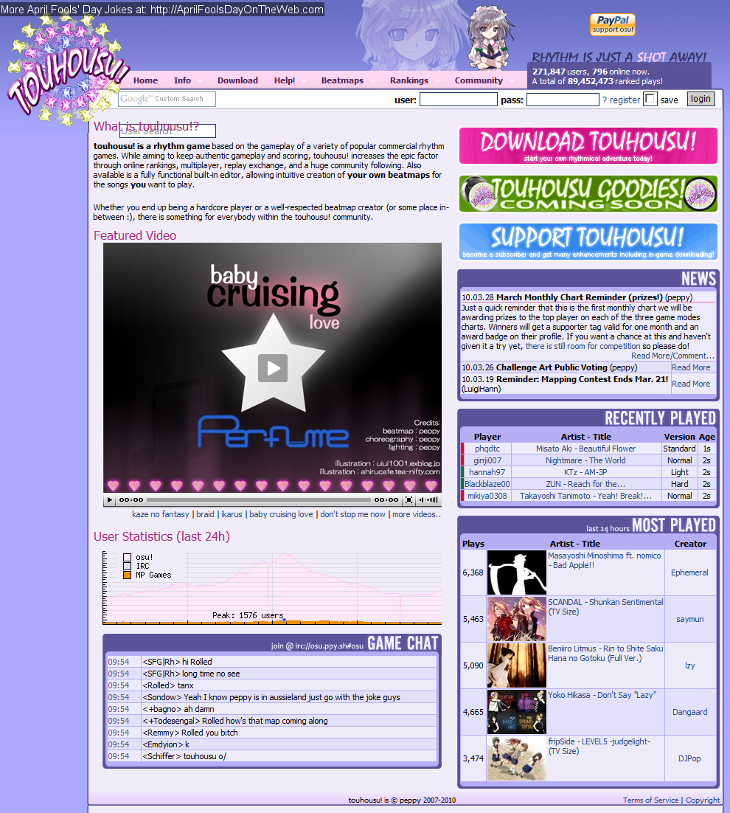

---
tags:
  - april fools
  - april 1st
  - 1 april
  - april 1
  - april fools day
  - joke
  - history
  - legacy
  - poisson d'avril
  - 1er avril
  - 1 avril
  - le jour des poissons d'avril
  - blague
  - histoire
no_native_review: true
---

# L'histoire d'osu! Blagues de poisson d'avril

*Pour l'histoire complète d'osu!, voir : [L'histoire d'osu!](/wiki/History_of_osu!)*

Chaque année, l'[équipe osu!](/wiki/People/The_Team) aime faire des farces à la communauté le jour du poisson d'avril. Cet article répertorie toutes les blagues du poisson d'avril qui ont été jouées sur la communauté d'osu! depuis 2009.

## 2009

### "Lemon Tree" est classée

La [beatmap](/wiki/Beatmap) ["Best of No.1 Hits - Lemon Tree (MillhioreF)"](https://osu.ppy.sh/beatmapsets/57878#osu/174267) a été [classée](/wiki/Beatmap/Category#classée) le 1er avril 2009, dans le cadre du poisson d'avril de cette année-là. La beatmap était une blague très populaire au sein de la communauté, les utilisateurs affirmant sarcastiquement qu'une telle beatmap devrait rester classée pour toujours [[1,2,3]][r]. Son statut classée a été supprimé par l'équipe de modération peu de temps après [[2]][r].

Après un certain temps, la beatmap originale a été supprimée à la demande de son créateur, mais il a finalement été rechargé le 24 août 2012 par [MillhioreF](https://osu.ppy.sh/users/941094) à des fins d'archivage [[4]][r].

---

## 2010

### touhosu!

Pour le poisson d'avril 2010, le site web d'osu! ainsi que l'écran du menu principal du jeu ont été modifiés pour mettre en scène des personnages et des références au [Projet Touhou](https://fr.wikipedia.org/wiki/Touhou_Project). Les modifications comprenaient l'ajout du personnage de Marisa Kirisame et l'affichage de papillons de couleurs différentes dans un motif circulaire sur le menu principal et le site web, ainsi que le remplacement du nom "osu!" par "touhosu!" à certains endroits du site web [[5,6,7]][r].

La plaisanterie découle en grande partie d'une [demande de fonctionnalité de longue date](https://osu.ppy.sh/community/forums/topics/19307) visant à créer un [mode de jeu](/wiki/Game_mode) basé sur le mode de jeu actuel [osu!catch](/wiki/Game_mode/osu!catch) avec le gameplay principal des jeux du projet Touhou [[8]][r].

Il a également été rapporté à l'époque que [Ephemeral](https://osu.ppy.sh/users/102335) avait fait remarquer en plaisantant que l'achat d'un tag osu!supporter ferait apparaître une Marisa Kirisame nue sur l'écran du menu principal au lieu d'une Marisa entièrement habillée. Cependant, cette affirmation n'était qu'une blague et a été rapidement réfutée par d'autres [[9]][r].

---

## 2011

### osu!core

"osu!core" est le nom donné à la farce d'osu! du jour des poissons d'avril 2011. Cette farce a eu pour effet d'accélérer le son de chaque beatmap dans le style des remixes de [Nightcore](https://fr.wikipedia.org/wiki/Nightcore). Bien qu'il ne s'agisse que d'un poisson d'avril, il est devenu réalité lorsque le mod [Nightcore](/wiki/Game_modifier/Nightcore) a été introduit en tant que [modificateurs de jeu](/wiki/Game_modifier) jouable dans osu! plus tard [[10,11,12,13]][r].

---

## 2012

### Les mods Flashlight/Hidden sur le site web

Le 1er avril 2012, l'ensemble du site web d'osu! avait 50 % de chances que le mod [Flashlight (FL)](/wiki/Game_modifier/Flashlight) ou le mod [Hidden (HD)](/wiki/Game_modifier/Hidden) soit "activé" sur le site Web par chargement de page (3/10 pour HD ; 1/5 pour FL). Une reconstitution moderne de ce à quoi ressemblait la farce pour les utilisateurs de l'époque est présentée ci-dessous [[14,15,16,17,18,19]][r].

### Bad Apple Ranking Chart

Le "Bad Apple Ranking Chart" était un tableau de classement de blague basé sur une variété de beatmaps qui mettait en vedette la chanson "Bad Apple !!!" dans le cadre de la blague du poisson d'avril 2012 d'osu!. Annoncé par le biais d'un [newspost](https://osu.ppy.sh/community/forums/posts/1431905) le 1er avril 2012, le tableau de classement fonctionnait en fait comme un véritable tableau de travail à l'époque et affichait les 40 meilleurs joueurs ayant obtenu le meilleur [score classé](/wiki/Score#ranked-score) dans l'une des sélections de beatmaps "Bad Apple !!!" [[20,21,22]][r]. Un extrait de l'article de presse susmentionné est inscrit ci-dessous :

> Nous avons décidé de dédier cette charte à la meilleure chanson et vidéo jamais créée, Bad Apple !!!. Vous pouvez trouver le super tableau ici

> Comme il s'agit d'un tableau aux proportions épiques, nous devions améliorer notre prix cette fois-ci ! Les gagnants recevront un poster de Lily White et une image dessinée à la main de Reimu. (Une imprimante est nécessaire pour recevoir ces prix)

> Attendez avec impatience nos prochains graphiques, les graphiques Renai Circulation et Irony !

— Cyclone, "Bad Apple Ranking Chart!" [[21,22]][r]

Le classement a été ouvert le 1er avril 2012 et fermé le 2 avril 2012. A la fin de la période de classement, [Mesita](https://osu.ppy.sh/users/201459) était le joueur numéro un avec un score classé de 145,623,328 [[23]][r].

Les beatmaps inclus dans le tableau de classement sont énumérés ci-dessous :

- [nomico - Bad Apple!! (James)](https://osu.ppy.sh/beatmapsets/6252)
- [REDALiCE - Bad Apple!! (Rena-chan)](https://osu.ppy.sh/beatmapsets/10353)
- [Masayoshi Minoshima ft. nomico - Bad Apple!! (Ephemeral)](https://osu.ppy.sh/beatmapsets/10435)
- [Masayoshi Minoshima ft. nomico - Bad Apple!! (ignorethis)](https://osu.ppy.sh/beatmapsets/13177)
- [Masayoshi Minoshima feat. StrawbellyCake - Bad Apple!! (German Version) (Larto)](https://osu.ppy.sh/beatmapsets/13664)
- [Masayoshi Minoshima feat. Larto & nomico - Awesome Apple!! (Larto)](https://osu.ppy.sh/beatmapsets/14475)
- [Masayoshi Minoshima feat. nomico - Bad Apple!! (ouranhshc)](https://osu.ppy.sh/beatmapsets/18260)
- [Spiritsoulxx - Bad Apple!! (Tony)](https://osu.ppy.sh/beatmapsets/23760)
- [Kommisar - Bad Apple!! (Chiptune Ver.) (Sushi)](https://osu.ppy.sh/beatmapsets/28222)
- [Kalafina - Bad MagiApple (Makar8000)](https://osu.ppy.sh/beatmapsets/32003)

Le clip de "Bad Apple!!!" était une sorte de blague à l'époque, les remixes de la chanson combinés à d'autres tournures ironiques étant monnaie courante dans les beatmaps de l'époque, d'où son apparition en tant que poisson d'avril.

---

## 2013

### BanchoBot devient un tsundere

Le 1er avril 2013, [BanchoBot](/wiki/BanchoBot) a été transformé en [tsundere](https://fr.wikipedia.org/wiki/Tsundere). En ce jour de poisson d'avril, chaque fois qu'un utilisateur donnait une commande à BanchoBot ou l'invitait à parler dans un chat public, ses messages de chat étaient remplacés par des réponses stéréotypées de type tsundere à un intérêt romantique [[24,25,26,27,28,29]][r].

---

## 2014

### Shiba Inu apparaît dans osu!

Le 1er avril 2014, l'écran du menu principal d'osu! a été temporairement modifié (illustré ci-dessous) pour inclure des déclarations multicolores et grammaticalement incorrectes accompagnées de la célèbre image d'un certain [Shiba Inu](https://fr.wikipedia.org/wiki/Shiba_(chien)) dans le style du [Doge meme](https://fr.wikipedia.org/wiki/Doge_(mème)) qui était populaire à l'époque [[14,30,31,32]][r].

---

## 2015

### osu!coins

*Voir également : [osu!coin](/wiki/osu!coin)*

Le 31 mars 2015, [peppy](https://osu.ppy.sh/users/2) a publié [un message](https://osu.ppy.sh/home/news/2015-03-31-osucoins) annonçant l'ajout d'une nouvelle monnaie en jeu, appelée "osu!coins!" [[33,34]][r]. L'article expliquait ce qu'était cette monnaie et comment elle fonctionnait, et présentait une vidéo spécialement créée pour l'occasion, intitulée [osu!academy](https://www.youtube.com/watch?v=BImc5McuK1o). En outre, peppy a également plaisanté sur le fait que ce changement était motivé par le fait que le gain monétaire actuel provenant des dons des joueurs n'aurait pas été suffisant pour lui permettre de s'acheter un jet personnel de son vivant :

> Au taux de rendement actuel, il serait peu probable que je puisse acheter un jet personnel de mon vivant, ce qui est l'un de mes principaux objectifs de vie. J'ai donc discuté avec l'équipe des autres formes de monétisation possibles, en étudiant les tendances actuelles des jeux gratuits similaires actuellement disponibles sur le marché.

— peppy, "osu!coins" [[33]][r]

*Remarque : En [temps universel coordonné (UTC)](https://fr.wikipedia.org/wiki/Temps_universel_coordonné), le message a été publié le 31 mars 2015. Cependant, au moment de la publication, peppy vivait actuellement en Australie, où la date actuelle était le 1er avril 2015.*

En bref, pour jouer ou redémarrer une [beatmap](/wiki/Beatmap), les utilisateurs devaient avoir dépensé 1 osu!coin, et une fois qu'ils n'avaient plus d'osu!coins, ils devaient soit arrêter de jouer et attendre le jour suivant, soit payer de l'argent réel pour obtenir plus d'osu!coins. Malgré cette description, le jeu n'était pas affecté et les utilisateurs pouvaient continuer à jouer normalement, même si toutes leurs pièces d'osu!coins étaient épuisées [[33,35,36,37]][r].

L'écran principal d'osu! comportait également un barrage d'osu!coins qui montaient lentement en arrière-plan, ainsi qu'un thème principal légèrement modifié, dans lequel l'exclamation "circles!" était remplacée par un "and buy the coins" à la sonorité robotique avant le beat drop. De nouvelles textures, des effets sonores, des animations et de la musique ont été créés pour cette farce, y compris un compteur qui affiche le nombre de pièces dont disposent les joueurs tout au long de leurs parties. [[37,38]][r].

La mise à jour a été généralement bien accueillie par les joueurs et a bénéficié d'un soutien réel pour une mise en œuvre future sans monétisation. Malgré cela, peppy a annulé l'implémentation d'osu!coins le jour suivant avec [une remarque dans la mise à jour du journal des modifications](https://osu.ppy.sh/comments/121803) sur les commentaires [[35,39,40,41]][r].

---

## 2016

### osu! en réalité virtuelle

Le 1er avril 2016, [un billet](https://osu.ppy.sh/home/news/2016-04-01-oculus-rift-to-be-supported-as-an-input-method) a été publié détaillant l'annonce de plans visant à ajouter le support de l'[Oculus Rift](https://fr.wikipedia.org/wiki/Oculus_Rift) comme nouvelle [méthode d'entrée](/wiki/Gameplay/Input_device) dans osu!. Le message, écrit par [Evrien](https://osu.ppy.sh/users/791660), fait référence à de nombreuses citations d'une supposée interview de [peppy](https://osu.ppy.sh/users/2) dans laquelle il explique son raisonnement pour l'annonce et ses idées sur la façon dont le concept pourrait fonctionner [[42]][r].

En ce qui concerne la façon dont les joueurs peuvent utiliser l'Oculus Rift comme méthode d'entrée, le billet d'information décrit que "le joueur aura un point de vue à la première personne du curseur qui se déplace vers et depuis les objets à l'écran..." et qu'il frappera les objets en "... demandant au joueur de produire des sons semblables à des voyelles avec sa bouche". Aucun changement réel n'a été apporté au jeu en ce qui concerne l'utilisation de l'Oculus Rift ou d'un dispositif similaire de [réalité virtuelle (VR)](https://fr.wikipedia.org/wiki/Réalité_virtuelle) pour contrôler osu! [[42]][r].

*Avis : McOsu est développé séparément de et n'a aucune affiliation directe avec osu! ou ppy Pty Ltd.*

Cependant, même si les développeurs officiels d'osu! n'ont pas eu l'intention d'ajouter un véritable support VR, l'idée d'osu! en VR a suscité l'intérêt de certains fans. Cet intérêt a fini par déboucher sur un projet de fans non officiel qui a été lancé peu après et qui visait à créer un client gratuit et open source pour pratiquer osu!. Le but était de créer un client libre et open source permettant de jouer à osu! avec plus de fonctionnalités et de [beatmaps](/wiki/Beatmap) et des [modificateurs de jeu](/wiki/Game_modifier), y compris la possibilité de jouer en VR. Nommé "[McOsu](https://store.steampowered.com/app/607260/McOsu)", le projet a été achevé et publié sur [Steam](https://fr.wikipedia.org/wiki/Steam) le 20 mars 2017 [[43,44,45,46]][r].

### Dancing Auto mod cursor"/dancing pippi

"Dancing pippi" (également connu sous le nom de "dancing Auto mod cursor") est le surnom donné à l'une des blagues d'avril 2016 d'osu!. En 2016, une mise à jour a été publiée afin de faire en sorte que le curseur du mod [Auto](/wiki/Game_modifier/Auto) pendant les [replays](/wiki/Replay) tourne autour de l'[objet](/wiki/Hit_object) actuel à la perfection avant de finir par toucher l'objet juste au bon moment, contrairement aux mouvements robotiques et parfaitement droits habituels du mod Auto. La mise à jour susmentionnée a été annulée par une autre mise à jour le jour suivant [[47,48,49,50]][r].

### Tags osu!supporter gratuit

Le 1er avril 2016, de nombreux joueurs d'osu! ont eu la surprise de découvrir qu'ils avaient soudainement et inexplicablement reçu un tag [osu!supporter](https://osu.ppy.sh/home/support) alors qu'ils n'en avaient jamais acheté ni reçu en cadeau. Le tag de supporter qui a été donné aux joueurs était entièrement fonctionnel et agissait comme un tag de supporter ordinaire ; cependant, le changement a été annulé le jour suivant [[51,52,53,54,55,56,57]][r].

### Spinning osu! cookie on website

Dans le cadre de la poignée de blagues du poisson d'avril 2016, le [osu! cookie](/wiki/Brand_identity_guidelines) du site web d'osu! tournait occasionnellement de 180 degrés dans le sens des aiguilles d'une montre, puis repartait rapidement à la verticale de 180 degrés dans la même direction [[58,59,60,61]][r].

---

## 2017

Comme annoncé dans un [tweet de peppy](https://twitter.com/ppy/status/848021525663842304), il n'y a pas eu de blague du poisson d'avril pour osu! en 2017 en raison du développement de osu!lazer.

---

## 2018

### l'osu! cookie en rotation

Le 1er avril 2018, le [osu! cookie](/wiki/Brand_identity_guidelines) de l'écran du menu principal tournait lentement dans le sens des aiguilles d'une montre au fur et à mesure que le temps passait, et le cookie de l'écran de sélection des beatmaps tournait lentement dans le sens inverse des aiguilles d'une montre. En passant la souris sur ces cookies, vous les agrandissez comme d'habitude, mais vous les faites tourner plus vite [[62,63,64,65,66,67]][r].

---

## 2019

### Effet sonore d'une fille qui éternue

Pour le poisson d'avril 2019, il y avait environ 1 chance sur 20 d'entendre l'effet sonore d'une fille haut perchée qui éternue en ouvrant une beatmap [[68,69,70]][r].

---

## 2020

### MillhioreF rejoint les Featured Artists

[MillhioreF](https://osu.ppy.sh/users/941094), un modérateur, développeur et joueur du mod [Easy](/wiki/Game_modifier/Easy) de longue date d'osu! - a été annoncé dans [un article](https://osu.ppy.sh/home/news/2020-04-01-new-featured-artist-millhioref) comme ayant "rejoint" la liste des [Featured Artists](/wiki/Featured_Artists) en tant que "Millhiore Firianno Biscotti" le 1er avril 2020 avec une sélection de cinq chansons pour commencer [[71]][r] :

- Waltz o' the Irish
- The Waltzing Irishman
- An Irish Waltz
- A Waltz From The Geographical Region Known as Ireland but Also as Éire
- There's Gold Beneath Your Waltzing Rainbow (feat. Mismagius)

["MillhioreF - Waltz o' the Irish (MillhioreF)"](https://osu.ppy.sh/beatmapsets/73348#osu/326585), une beatmap de blague de longue date au sein de la communauté a également été [Loved](/wiki/Beatmap/Category#loved) le 31 mars 2020 dans le cadre de cette blague.

### Effet sonore d'une fille qui éternue

Le poisson d'avril 2020 a recyclé la même blague de l'année précédente, ce qui a entraîné une probabilité d'environ 1 sur 20 d'entendre l'effet sonore d'une fille haut perchée éternuant en ouvrant une beatmap [[72,73]][r].

---

## 2021

### Effet sonore d'une fille qui éternue

Le poisson d'avril 2021 a recyclé la même blague que les deux années précédentes, à savoir une chance sur 20 d'entendre un effet sonore d'une fille haut perchée éternuant en ouvrant un beatmap [[74,75]][r].

---

## Références

1. [Reddit post (r/osugame) [u/5522Luca] - "Reminder the Osu! April Fools 2009? This beatmap was ranked."](https://www.reddit.com/r/osugame/comments/64it62/reminder_the_osu_april_fools_2009_this_beatmap/)
2. [osu! forum comment (Beatmap Graveyard) [machol30] - "Best of No.1 Hits - Lemon Tree"](https://osu.ppy.sh/community/forums/topics/95725?start=106774)
3. [osu! forum comment (Beatmap Graveyard) [peppy] - "Best of No.1 Hits - Lemon Tree"](https://osu.ppy.sh/community/forums/topics/95725?start=105679)
4. [osu! beatmap - "Best of No.1 Hits - Lemon Tree" (MillhioreF)](https://osu.ppy.sh/beatmapsets/57878#osu/174267)
5. [April Fools' Day On The Web entry - "Changed osu! to touhousu! throughout the website as well as the game."](http://aprilfoolsdayontheweb.com/joke/8120/?size=1)
6. [Discord message (osu!dev) [Nivalyx#9577] - 27 January 2021 (05:06 UTC)](https://discord.com/channels/188630481301012481/218677502141399041/804215894762848296)
7. [osu! forum thread (Resolved Issues) [rcmero] - "touhousu! - April Fools joke? [Resolved]"](https://osu.ppy.sh/community/forums/topics/27612)
8. [osu! wiki article - "Touhosu!"](/wiki/Glossary/Touhosu!)
9. [osu! forum thread (General Discussion) [rulingvenus] - "Naked Marisa????"](https://osu.ppy.sh/community/forums/topics/27531)
10. [osu! wiki article - "Nightcore (mod)"](/wiki/Game_modifier/Nightcore)
11. [YouTube video [Nyaruko] (31 March 2011) - "When osu! tries to do April Fools"](https://www.youtube.com/watch?v=qD5ep6Fykao)
12. [osu! - "Home Page" (1 April 2011)](https://web.archive.org/web/20110401175252/http://osu.ppy.sh/)
13. [osu! forum comment (Resolved Issues) [Melty Bagle] - "[Archived] 'Flashlight mod' on the site...?"](https://osu.ppy.sh/community/forums/posts/1430529)
14. [Discord message (osu!dev) [Тик#5580] - 28 January 2021 (08:05 UTC)](https://discord.com/channels/188630481301012481/218677502141399041/804260860331687946)
15. [April Fools' Day On The Web entry - "'Flashlight' mode on beatmap search page"](http://aprilfoolsdayontheweb.com/joke/11484/?size=1)
16. [osu! forum thread (Resolved Issues) [-----] - "[Archived] "flashlight mod" on the site...?"](https://osu.ppy.sh/community/forums/topics/79076)
17. [osu! forum comment (Resolved Issues) [peppy] - "[Archived] "flashlight mod" on the site...?"](https://osu.ppy.sh/community/forums/topics/79076?start=1433063)
18. [osu! forum thread (Resolved Issues) [kreph] - "[Archived] Flashlight bugs the website for some browsers"](https://osu.ppy.sh/community/forums/topics/79077)
19. [Discord message (osu!dev) [spaceman_atlas#0391] - 29 January 2021 (20:43 UTC)](https://discord.com/channels/188630481301012481/218677502141399041/804814051209117696)
20. [Bad Apple!! Ranking Chart, 4 April 2012](https://osu.ppy.sh/rankings/osu/charts?spotlight=50)
21. [osu! newspost [Cyclone] (1 April 2012) - "Bad Apple!! Ranking Chart"](https://osu.ppy.sh/community/forums/topics/79128?start=1431905)
22. [Discord message (osu!dev) [Тик#5580] - 29 January 2021 (19:39 UTC)](https://discord.com/channels/188630481301012481/218677502141399041/804797922021081138)
23. [osu! - "Home Page" (3 April 2012)](https://web.archive.org/web/20120403135741/http://osu.ppy.sh/)
24. [Reddit comment (r/osugame) [u/Saluya_Lv9] - "April 1st"](https://www.reddit.com/r/osugame/comments/2201so/april_1st/)
25. [osu! forum comment (Off-Topic) [Jazz] - "Your prediction of osu! April Fools"](https://osu.ppy.sh/community/forums/topics/125391?start=2215004)
26. [osu! forum comment (Off-Topic) [Brian OA] - "Your prediction of osu! April Fools"](https://osu.ppy.sh/community/forums/topics/125391?start=2215194)
27. [Tweet [@little_2d] - 27 June 2019](https://twitter.com/little_2d/status/1144316731407683584)
28. [osu! forum comment (Development) [kingking9] - "osu! Community Localisation Project"](https://osu.ppy.sh/community/forums/topics/104342?start=2342998)
29. [osu! forum comment (Development) [peppy] - "osu! Community Localisation Project"](https://osu.ppy.sh/community/forums/topics/104342?start=2343044)
30. [Reddit comment (r/osugame) [u/mystry08] - "Can we save the start screen doge?"](https://www.reddit.com/r/osugame/comments/21vh6r/can_we_save_the_start_screen_doge/)
31. [Reddit comment (r/osugame) [u/dalollypop] - "Very April, Such fool, Much peppy. wow"](https://www.reddit.com/r/osugame/comments/21u293/very_april_such_fool_much_peppy_wow/)
32. [osu! forum thread (Off-Topic) [Decuke] - "Doge on Osu!"](https://osu.ppy.sh/community/forums/topics/198112)
33. [osu! newspost [peppy] (31 March 2015) - "osu!coins!"](https://osu.ppy.sh/home/news/2015-03-31-osucoins)
34. [April Fools' Day On The Web entry - "osu!coins! (fake business model, obviously a joke from blog & video)"](http://aprilfoolsdayontheweb.com/joke/20150013/?size=1)
35. [osu! wiki article - "osu!coin"](/wiki/osu!coin)
36. [YouTube video [synonia] (1 April 2015) - "Osu! Coin generator 14 coins in 30 seconds"](https://www.youtube.com/watch?v=Cmt646ujDFc)
37. [YouTube video [osu!] (31 March 2015) - "Introduction to osu!coins (April Fools'2015)"](https://www.youtube.com/watch?v=BImc5McuK1o)
38. [YouTube video [BananCho] (19 October 2017) - "Osu!Coins."](https://www.youtube.com/watch?v=0yWlUzG_tb8&t=39s)
39. [YouTube video [TheRexster] (31 March 2015) - "HOW TO GET OSU COINS VERY FAST!"](https://www.youtube.com/watch?v=wRVd5Bdf9rk)
40. [osu! forum thread (General Discussion) [Terriama] - "April Fools"](https://osu.ppy.sh/community/forums/topics/377157)
41. [osu! changelog comment [peppy] - "Cutting Edge 20150401"](https://osu.ppy.sh/comments/121803)
42. [osu! newspost [Evrien] (1 April 2016) - "Oculus Rift to be Supported as an Input Method (April Fools!)"](https://osu.ppy.sh/home/news/2016-04-01-oculus-rift-to-be-supported-as-an-input-method)
43. [Reddit post (r/osugame) [u/Omgforz] - "McOsu Alpha 20 Public release (custom practice client)"](https://www.reddit.com/r/osugame/comments/4vuksd/mcosu_alpha_20_public_release_custom_practice/)
44. [YouTube video [Omgforz] (2 August 2016) - "McOsu Alpha 20 (custom practice client +download)"](https://www.youtube.com/watch?v=PCLpOdcMQuc)
45. [GameSkinny - "What Even Is McOsu? Because It's Not Osu!"](https://www.gameskinny.com/mhaa0/what-even-is-mcosu-because-its-not-osu)
46. [GitHub - "McKay42/McOsu"](https://github.com/McKay42/McOsu)
47. [YouTube video [HoLLy] (31 March 2016) - "osu!'s april fools 2016 (auto mod improvement)"](https://www.youtube.com/watch?v=r9SCbYG4GYs)
48. [YouTube video [Hubz] (7 January 2021) - "osu! 2016 april fools (dancing pippi)"](https://www.youtube.com/watch?v=fYTdPqhAns0)
49. [YouTube video [mightyaleks] (31 March 2016) - "Osu! Dancing Auto-cursor and retard Spin | 1st April 2016"](https://www.youtube.com/watch?v=5Tj-1sgHl9g)
50. [Reddit post (r/osugame) [u/osuisgameforweebs] - "Something about the april fools joke dancing that some might not have noticed"](https://www.reddit.com/r/osugame/comments/4crlw1/something_about_the_april_fools_joke_dancing_that/)
51. [osu! forum thread (Resolved Issues) [-AlieN] - "[resolved] April Fools??!??!??"](https://osu.ppy.sh/community/forums/topics/437855)
52. [osu! forum comment (Off-Topic) [Epipheralis] - "april fools"](https://osu.ppy.sh/community/forums/topics/437866?start=5006805)
53. [osu! - "Home Page" (1 April 2016)](https://web.archive.org/web/20160401001507/https://osu.ppy.sh/)
54. [osu! forum thread (Resolved Issues) [Bearial1] - "[resolved] Why am I a supporter?"](https://osu.ppy.sh/community/forums/topics/438118)
55. [osu! forum thread (Resolved Issues) [noah4678] - "[resolved] says im a supporter"](https://osu.ppy.sh/community/forums/topics/438119)
56. [Reddit post (r/osugame) [u/CraftyDart] - "The best April Fools day ever."](https://www.reddit.com/r/osugame/comments/4cshv3/the_best_april_fools_day_ever/)
57. [osu! forum thread (Resolved Issues) [Trosk-] - "[resolved] [confirmed] Regarding osu!supporter/Auto mod"](https://osu.ppy.sh/community/forums/topics/437902)
58. [osu! forum comment (Off-Topic) [Birdy] - "april fools")](https://osu.ppy.sh/community/forums/posts/5005957)
59. [osu! - "Home Page" (1 April 2016)](https://web.archive.org/web/20160401001507/https://osu.ppy.sh/)
60. [osu! forum thread (Off-Topic) [Rilene] - "osu logo"](https://osu.ppy.sh/community/forums/topics/437755)
61. [osu! forum comment (Resolved Issues) [Trosk-] - "[resolved] [confirmed] Regarding osu!supporter/Auto mod"](https://osu.ppy.sh/community/forums/topics/437902?start=5006190)
62. [Reddit post (r/osugame) [u/[deleted]] - "New April Fools Update now has a rotating osu! Logo"](https://www.reddit.com/r/osugame/comments/88kq23/new_april_fools_update_now_has_a_rotating_osu_logo/?st=JFGBCI5G&sh=49cf8677)
63. [Reddit post (r/osugame) [u/hi_im_marc] - "April Fools Patch Is Out Get Ready To Get BAMBOOZLED!!!1"](https://www.reddit.com/r/osugame/comments/88kbit/april_fools_patch_is_out_get_ready_to_get/)
64. [Reddit post (r/osugame) [u/AdriaLOL] - "haha, nice april fools peppy XD"](https://www.reddit.com/r/osugame/comments/88qlwk/haha_nice_april_fools_peppy_xd/)
65. [osu! forum thread (General Discussion) [Aochie] - "The osu! logo is moving?"](https://osu.ppy.sh/community/forums/topics/724377)
66. [osu! forum thread (Resolved Issues [Jreen] - "[resolved] Osu! Logo Sideways?"](https://osu.ppy.sh/community/forums/topics/724094)
67. [osu! wiki article - "History of osu! 2018"](/wiki/History_of_osu!/2018#april)
68. [Reddit post (r/osugame) [u/jivko500] - "The April Fools joke in osu"](https://www.reddit.com/r/osugame/comments/b83pnl/the_april_fools_joke_in_osu/)
69. [Reddit post (r/osugame) [u/anoymaly2152] - "Bless you, Pippi."](https://www.reddit.com/r/osugame/comments/b848ro/bless_you_pippi/)
70. [osu! forum thread (Off-Topic) [Brainage] - "No April Fools in the changelog?"](https://osu.ppy.sh/community/forums/topics/888939)
71. [osu! newspost [Ephemeral] (1 April 2020) - "New Featured Artist: MillhioreF"](https://osu.ppy.sh/home/news/2020-04-01-new-featured-artist-millhioref)
72. [Reddit post (r/osugame) [u/not_pingu] - "Does anybody sometimes hear the "achoo"? (sorry for bad quality)"](https://www.reddit.com/r/osugame/comments/fsxfpk/does_anybody_sometimes_hear_the_achoo_sorry_for/)
73. [Reddit post (r/osugame) [u/ohmaytt] - "This year's osu! April Fool's Day joke"](https://www.reddit.com/r/osugame/comments/fsq30l/this_years_osu_april_fools_day_joke/)
74. [osu! forum thread (Gameplay & Rankings) [MilkyIQ] - "Is this not the third year in a row that we get sneezing girl?"](https://osu.ppy.sh/community/forums/topics/1286906)
75. [osu! forum thread (Help) [GreatTurtleKing] - "i heard like a sneeze when i just started to play a song"](https://osu.ppy.sh/community/forums/topics/1286396)

[r]: #références
