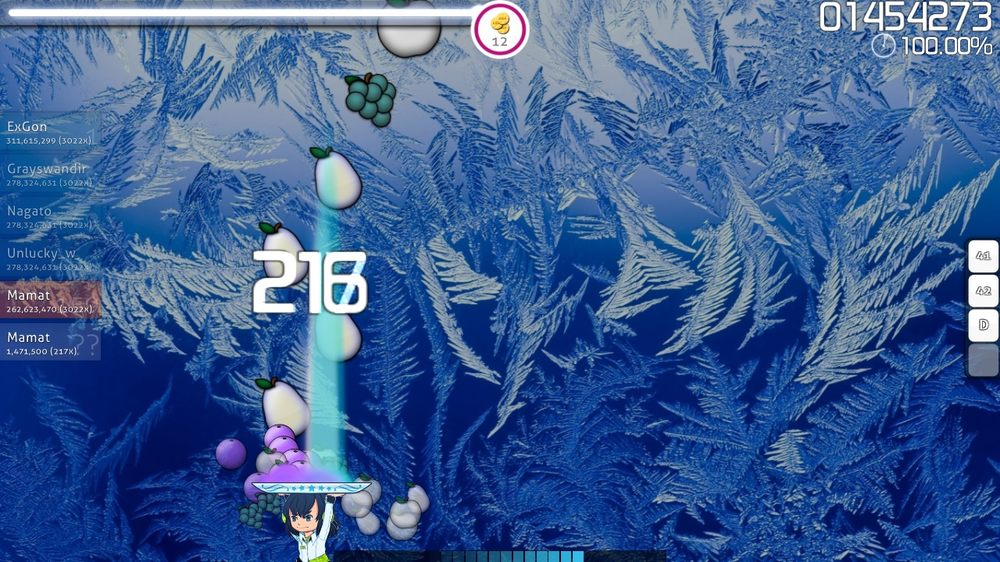
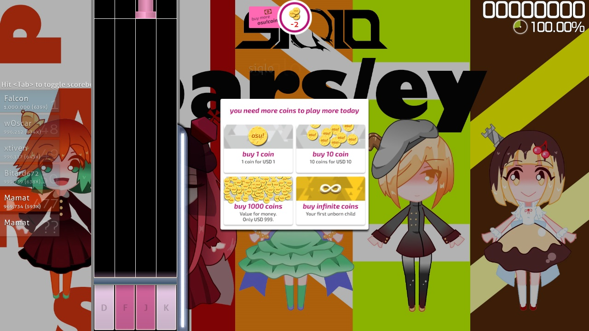

# osu!coin

The **osu!coin** was a joke, in-game currency mocking other free-to-play monetisation schemes. It was introduced for April Fools, 2015, and allowed players to play a single [beatmap](/wiki/Beatmap) in exchange for an osu!coin.

## Release

The [official release statement](https://osu.ppy.sh/home/news/2015-03-31-osucoins) explains that the osu!coin was introduced as a way to fund ::{ flag=AU }:: [peppy](https://osu.ppy.sh/users/2)'s private jet as the current monetisation scheme wouldn't allow him to buy it in his lifetime. The statement continues, explaining that each new player would start off with 10 osu!coins, and would be given 10 more for each passing day. Existing users would get an additional two osu!coins as an added bonus. Players could then gain more osu!coins by obtaining [combo](/wiki/Gameplay/Combo_(score_multiplier)). A single osu!coin would be obtained for every 100x combo.

When players would run out of osu!coins, they would be unable to play any beatmaps. Though they could purchase more — out of their own will — with the exchange rates:

- $1 USD = 1 osu!coin
- $10 USD = 10 osu!coins
- $999 USD = 1000 osu!coins
- first unborn child = infinite osu!coins (unborn child will work for osu!)

The following day, peppy rolled back the implementation of osu!coins, opened a new subdomain for the osu!web redesign and ended with a [remark regarding bug fixes and minor improves](https://osu.ppy.sh/comments/121803).

## Reception

Though the release of the osu!coin added additional graphical elements, it had no practical effect on the gameplay experience, as players could keep playing past the zero coin limit. Conversely, there was no way to pay for extra osu!coins either (though the option was listed as available).

The update was generally well-received by players as a welcome change of pace from the otherwise strict stream of news.

## Additional Resources

- osu!academy introduces osu!coins: [Introduction to osu!coins (April Fools' 2015)](https://www.youtube.com/watch?v=BImc5McuK1o)
- peppy announces osu!coins: [osu!coins!](https://osu.ppy.sh/home/news/2015-03-31-osucoins)
