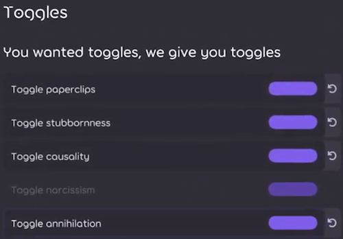

---
tags:
  - april fools
  - april 1st
  - 1 april
  - april 1
  - april fools day
  - joke
  - history
  - legacy
  - первоапрельские шутки
  - 1 апреля
  - день дурака
  - история
  - розыгрыш
  - традиция
---

# История первоапрельских шуток osu!

*За полной историей osu! обращайтесь к статье: [История osu!](/wiki/History_of_osu!)*

Каждый год [команда osu!](/wiki/People/osu!_team) любит разыгрывать сообщество в День смеха. В этой статье перечислены все первоапрельские шутки, которые были разыграны в сообществе osu! начиная с 2009 года.

## 2009

### Ранк «Lemon Tree»

[Карта](/wiki/Beatmap) [«Best of No.1 Hits - Lemon Tree (MillhioreF)»](https://osu.ppy.sh/beatmapsets/57878#osu/174267) была [ранкнута](/wiki/Beatmap/Category#ranked) 1 апреля 2009 года в рамках первоапрельского розыгрыша. Эта карта была своеобразной внутренней шуткой сообщества: пользователи с иронией утверждали, что такая карта должна оставаться ранкнутой навсегда.[^lemontree-reddit][^lemontree-post-machol30][^lemontree-post-peppy] Вскоре после этого модераторы сняли с неё статус ранкнутой.[^lemontree-post-machol30]

Спустя некоторое время оригинальная карта была удалена по просьбе создателя; однако 24 августа 2012 года [MillhioreF](https://osu.ppy.sh/users/941094) загрузил её повторно для архивных целей.[^lemontree-post-millhioref]

## 2010

### touhosu!

В рамках розыгрыша 2010 года сайт osu! и главное меню игры были изменены в тематике персонажей и отсылок к [Touhou Project](https://en.wikipedia.org/wiki/Touhou_Project). Изменения включали добавление персонажа Марисы Кирисамэ, отображение разноцветных бабочек, кружащихся по кругу на главном экране и сайте, а также замену названия «osu!» на «touhosu!» в некоторых местах сайта.[^touhousu-ontheweb][^touhousu-osudev-2021-01-27][^touhousu-forums]

Эта шутка во многом возникла из [давнего запроса функции](https://osu.ppy.sh/community/forums/topics/19307) о создании [игрового режима](/wiki/Game_mode) на основе существующего [osu!catch](/wiki/Game_mode/osu!catch) с геймплеем из игр Touhou Project.

Также сообщалось, что [Ephemeral](https://osu.ppy.sh/users/102335) в шутку заметил, что покупка тега osu!supporter покажет на главном экране обнажённую Марису Кирисамэ вместо одетой. Однако это заявление было лишь шуткой и быстро было опровергнуто другими.[^touhousu-forums-2]

## 2011

### osu!core

«osu!core» — это название первоапрельской шутки 2011 года. Розыгрыш заключался в том, что аудио всех карт было поднято по тону и ускорено в стиле ремиксов [Nightcore](https://en.wikipedia.org/wiki/Nightcore). Хотя это была просто шутка, позже она стала реальностью, когда в osu! был добавлен мод [Nightcore](/wiki/Gameplay/Game_modifier/Nightcore) как игровой модификатор.[^nightcore-yt][^nightcore-frontpage][^fl-forums]

## 2012

### Моды Flashlight/Hidden на сайте

1 апреля 2012 года весь сайт osu! с вероятностью 50% при каждой загрузке страницы «включал» либо мод [Flashlight (FL)](/wiki/Gameplay/Game_modifier/Flashlight), либо [Hidden (HD)](/wiki/Gameplay/Game_modifier/Hidden) (3/10 для HD, 1/5 для FL). Современная реконструкция того, как это выглядело для пользователей, показана ниже.[^fl-ontheweb][^fl-forums-2][^fl-forums-3][^fl-forums-4][^fl-osudev-2021-01-29]

### Рейтинг-чарт «Bad Apple»

«Bad Apple Ranking Chart» — это шуточный рейтинг-чарт, основанный на различных картах, содержащих песню «Bad Apple!!», и являвшийся частью розыгрыша 2012 года. Анонсированный [через новостной пост](https://osu.ppy.sh/community/forums/posts/1431905) 1 апреля 2012 года, чарт в то время действительно работал и отображал топ-40 игроков, набравших наибольший [ранк score](/wiki/Gameplay/Score/Ranked_score) на любой из выбранных карт с «Bad Apple!!».[^bad-apple-chart][^bad-apple-news] Ниже приведена выдержка из упомянутого новостного поста:

> Мы решили посвятить этот чарт величайшей песне и видео из когда-либо созданных — Bad Apple!!. Вы можете найти потрясающий чарт здесь.
>
> Итак, поскольку это чарт эпических масштабов, нам нужно было сделать приз немного лучше на этот раз! Победители получат постер с Лили Уайт и рисунок Рейму от руки. (Для получения призов потребуется принтер)
>
> Ждите наших следующих чартов — Renai Circulation и Irony!

— Cyclone, «Bad Apple Ranking Chart!»[^bad-apple-news]

Чарт был открыт 1 апреля 2012 года и закрыт 2 апреля 2012 года. По итогам [Mesita](https://osu.ppy.sh/users/201459) занял первое место с ранк-скором 145 623 328.[^bad-aple-frontpage]

Карты, включённые в чарт, перечислены ниже:

- [nomico - Bad Apple!! (James)](https://osu.ppy.sh/beatmapsets/6252)
- [REDALiCE - Bad Apple!! (Rena-chan)](https://osu.ppy.sh/beatmapsets/10353)
- [Masayoshi Minoshima ft. nomico - Bad Apple!! (Ephemeral)](https://osu.ppy.sh/beatmapsets/10435)
- [Masayoshi Minoshima ft. nomico - Bad Apple!! (ignorethis)](https://osu.ppy.sh/beatmapsets/13177)
- [Masayoshi Minoshima feat. StrawbellyCake - Bad Apple!! (German Version) (Larto)](https://osu.ppy.sh/beatmapsets/13664)
- [Masayoshi Minoshima feat. Larto & nomico - Awesome Apple!! (Larto)](https://osu.ppy.sh/beatmapsets/14475)
- [Masayoshi Minoshima feat. nomico - Bad Apple!! (ouranhshc)](https://osu.ppy.sh/beatmapsets/18260)
- [Spiritsoulxx - Bad Apple!! (Tony)](https://osu.ppy.sh/beatmapsets/23760)
- [Kommisar - Bad Apple!! (Chiptune Ver.) (Sushi)](https://osu.ppy.sh/beatmapsets/28222)
- [Kalafina - Bad MagiApple (Makar8000)](https://osu.ppy.sh/beatmapsets/32003)

Клип на «Bad Apple!!» был в то время своего рода внутренней шуткой, а ремиксы этой песни с ироничными изменениями часто появлялись в картах, поэтому она и стала частью розыгрыша. <!--нужно подтверждение-->

## 2013

### BanchoBot становится цундэре

1 апреля 2013 года [BanchoBot](/wiki/BanchoBot) превратился в [цундэре](https://en.wikipedia.org/wiki/Tsundere). В этот день каждый раз, когда пользователь отправлял команду BanchoBot или вызывал его в публичном чате, его сообщения заменялись стереотипными цундэре-ответами, адресованными объекту романтического интереса.[^banchobot-reddit][^banchobot-forums][^banchobot-forums-2][^banchobot-tweet][^banchobot-forums-3][^banchobot-forums-4]

*Всем привет! Я Банчобот! Приятно познакомиться.*  
*Я всё же бот, так что я не могу с вами по-настоящему поговарить :(*

*Эмм? Вы хотите узнать обо мне больше?*
*Вы идиот... >//<*

## 2014

### Появление сиба-ину в osu!

1 апреля 2014 года главное меню osu! было временно изменено (показано ниже) — на нём появились разноцветные, грамматически некорректные фразы в сопровождении знаменитого изображения [сиба-ину](https://en.wikipedia.org/wiki/Shiba_Inu) в стиле мема [Doge](https://en.wikipedia.org/wiki/Doge_(meme)), который был популярен в то время.[^shiba-inu-reddit][^shiba-inu-reddit-2][^shiba-inu-forums]

## 2015

### osu!coins

*См. также: [osu!coin](/wiki/History_of_osu!/April_Fools/osu!coin)*

31 марта 2015 года [peppy](https://osu.ppy.sh/users/2) опубликовал [новостной пост](https://osu.ppy.sh/home/news/2015-03-31-osucoins), в котором анонсировал добавление новой внутриигровой валюты — «osu!coins».[^osu-coins-news][^osu-coins-ontheweb] В посте объяснялось, что это за валюта и как она работает, а также было приложено специальное [видео от osu!academy](https://www.youtube.com/watch?v=BImc5McuK1o). Кроме того, peppy пошутил, что причина в том, что текущий доход от пожертвований игроков не позволит ему купить личный самолёт при жизни:

> При нынешней скорости возврата инвестиций покупка личного самолёта в течение моей жизни маловероятна, а это одна из моих главных жизненных целей. Поэтому я провёл переговоры с командой об альтернативных способах монетизации, изучив текущие тенденции в аналогичных бесплатных играх на рынке.

— peppy, «osu!coins»[^osu-coins-news]

*Примечание: по [Всемирному координированному времени (UTC)](https://en.wikipedia.org/wiki/Coordinated_Universal_Time) пост был опубликован 31 марта 2015 года. Однако на момент публикации peppy жил в Австралии, где уже было 1 апреля 2015 года.*

Если кратко, для игры или перезапуска [карты](/wiki/Beatmap) нужно было потратить одну [osu!coin](/wiki/History_of_osu!/April_Fools/osu!coin), а когда монеты заканчивались, игроки должны были либо прекратить игру до следующего дня, либо заплатить реальные деньги за новые монеты. Однако, несмотря на описание, реальный геймплей не пострадал — пользователи могли продолжать играть как обычно, даже если все монеты были потрачены.[^osu-coins-news][^osu-coins-yt][^osu-coins-yt-2]

На главном экране osu! также появился фон с медленно поднимающимися монетами, а главная тема была слегка изменена: восклицание «circles!» было заменено на роботизированное «and buy the coins» перед дропом. Для этого розыгрыша были созданы новые текстуры, звуковые эффекты, анимации и музыка, включая счётчик монет, отображаемый во время игры.[^osu-coins-yt-2][^osu-coins-yt-3] <!--нужна дополнительная проверка-->

Обновление в целом было хорошо принято игроками, и некоторые высказали поддержку его будущей реализации без монетизации. Несмотря на это, на следующий день peppy откатил внедрение osu!coins с [замечанием в соответствующем обновлении чейнджлога](https://osu.ppy.sh/comments/121803) по поводу отзывов.[^osu-coins-yt-4][^osu-coins-forums][^osu-coins-changelog]

## 2016

### osu! в виртуальной реальности

1 апреля 2016 года был опубликован [новостной пост](https://osu.ppy.sh/home/news/2016-04-01-oculus-rift-to-be-supported-as-an-input-method) с подробностями о планах добавить поддержку [Oculus Rift](https://en.wikipedia.org/wiki/Oculus_Rift) как нового [устройства ввода](/wiki/Gameplay/Input_device) в osu!. Пост, написанный [Evrien](https://osu.ppy.sh/users/791660), содержал цитаты из предполагаемого интервью с [peppy](https://osu.ppy.sh/users/2), в котором он объяснял причины объявления и идеи о том, как эта концепция могла бы работать.[^osu-vr-news]

Что касается того, как игроки могли бы использовать Oculus Rift как устройство ввода, в посте описывалось, что «игрок будет видеть курсор от первого лица, перемещающийся к объектам на экране и обратно…» и что для попадания по объектам нужно будет «…производить звуки, похожие на гласные, ртом». Никаких реальных изменений в игре, связанных с использованием Oculus Rift или аналогичных устройств [виртуальной реальности (VR)](https://en.wikipedia.org/wiki/Virtual_reality), не было внесено.[^osu-vr-news]

*Примечание: McOsu разрабатывается отдельно и не имеет прямого отношения к osu! или ppy Pty Ltd.*

Тем не менее, хотя официальные разработчики osu! не имели намерения добавлять поддержку VR всерьёз, идея osu! в VR заинтересовала некоторых фанатов. Этот интерес в конечном итоге привёл к созданию неофициального фанатского проекта, который вскоре после этого был запущен с целью создания бесплатного клиента с открытым исходным кодом для тренировок на [картах](/wiki/Beatmap) osu! с дополнительными функциями и [модами](/wiki/Gameplay/Game_modifier), включая возможность игры в VR. Проект получил название «[McOsu](https://store.steampowered.com/app/607260/McOsu)» и был завершён и выпущен в [Steam](https://en.wikipedia.org/wiki/Steam_(service)) 20 марта 2017 года.[^osu-vr-reddit][^osu-vr-yt][^osu-vr-gameskinny][^osu-vr-mcosu]

### Танцующий курсор мода Auto / танцующий пиппи

«Танцующий пиппи» (также известный как «танцующий курсор мода Auto») — это прозвище одной из первоапрельских шуток 2016 года, в рамках которой было выпущено обновление, заставляющее курсор в [реплеях](/wiki/Gameplay/Replay) с модом [Auto](/wiki/Gameplay/Game_modifier/Auto) кружить вокруг текущего [объекта](/wiki/Gameplay/Hit_object) с идеальной точностью до пикселя, а затем попадать по нему точно вовремя, в отличие от обычного роботизированного и идеально прямого движения мода Auto. Это обновление было откачено на следующий день.[^osu-auto-yt][^osu-auto-yt-2][^osu-auto-yt-3][^osu-auto-reddit] <!--всё ещё требует официального подтверждения-->

### Бесплатные теги osu!supporter

1 апреля 2016 года многие игроки osu! были удивлены, обнаружив, что у них внезапно и необъяснимо появился [тег osu!supporter](https://osu.ppy.sh/home/support), хотя они никогда не покупали его и им не одаривали. Выданный тег был полностью функциональным и работал как обычный, однако изменения были откатаны на следующий день.[^supporter-tag-forums][^supporter-tag-forums-2][^supporter-tag-frontpage][^supporter-tag-forums-3][^supporter-tag-forums-4][^supporter-tag-reddit][^supporter-tag-forums-5]

### Вращающаяся печенька osu! на сайте

В рамках нескольких первоапрельских шуток 2016 года [печенька osu!](/wiki/Brand_identity_guidelines) на сайте osu! иногда поворачивалась на 180 градусов по часовой стрелке, а затем быстро возвращалась обратно на 180 градусов в том же направлении.[^osu-cookie-forums][^osu-cookie-frontpage][^osu-cookie-forums-2][^osu-cookie-forums-3]

## 2017

Как было объявлено в [твите peppy](https://twitter.com/ppy/status/848021525663842304), в 2017 году первоапрельской шутки в osu! не было из-за разработки [osu!(lazer)](/wiki/Client/Release_stream/Lazer).

## 2018

### Вращающаяся печенька osu!

1 апреля 2018 года [печенька osu!](/wiki/Brand_identity_guidelines) на главном экране медленно вращалась по часовой стрелке, а печенька на экране выбора карт — против часовой. Наведение на эти печеньки увеличивало их, как обычно, но также ускоряло вращение.[^osu-cookie-web-reddit][^osu-cookie-web-reddit-2][^osu-cookie-web-reddit-3][^osu-cookie-web-forums][^osu-cookie-web-forums-2]

## 2019

### Звук чихающей девушки

В День смеха 2019 года при открытии карты с вероятностью примерно 1 к 20 можно было услышать звук высокого женского чиха.[^sneeze-reddit][^sneeze-reddit-2][^sneeze-forums]

Начиная с 2019 года эта шутка повторялась каждый год (только в osu!(stable)).[^sneeze-2-reddit][^sneeze-2-reddit-2][^sneeze-2-forums][^sneeze-2-forums-2][^sneeze-3-reddit][^sneeze-3-forums]

## 2020

### MillhioreF присоединяется к Featured Artists

[MillhioreF](https://osu.ppy.sh/users/941094) — давний модератор osu!, разработчик и игрок, использующий [мод Easy](/wiki/Gameplay/Game_modifier/Easy), — был анонсирован в [новостном посте](https://osu.ppy.sh/home/news/2020-04-01-new-featured-artist-millhioref) как «присоединившийся» к списку [Featured Artists](/wiki/People/Featured_Artists) под именем «Millhiore Firianno Biscotti» 1 апреля 2020 года с подборкой из пяти песен:[^irish-fa]

- Waltz o' the Irish
- The Waltzing Irishman
- An Irish Waltz
- A Waltz From The Geographical Region Known as Ireland but Also as Éire
- There's Gold Beneath Your Waltzing Rainbow (feat. Mismagius)

Карта [«MillhioreF - Waltz o' the Irish (MillhioreF)»](https://osu.ppy.sh/beatmapsets/73348#osu/326585) — давняя шуточная карта в сообществе — также была добавлена в [Loved](/wiki/Beatmap/Category#loved) 31 марта 2020 года в рамках этой шутки.

## 2026

### Дополнительные переключатели

::: Infobox

:::

На боковой панели настроек в [osu!(lazer)](/wiki/Client/Release_stream/Lazer) 1 апреля 2026 года появился новый раздел `Toggles`,[^2026] с текстом «Вы хотели переключатели, мы даём вам переключатели» и одним переключателем ниже. Этот переключатель при нажатии создавал новые переключатели с забавными названиями вроде «переключатель хаоса» или «переключатель энтропии» для комического эффекта.

Активация любого переключателя выбирала или снимала выбор других переключателей и применяла случайные эффекты, некоторые из которых сохранялись даже во время игры на карте:

- Значок osu!, двигающийся по экрану как [заставка DVD](https://en.wikipedia.org/wiki/DVD_screensaver)
- osu!, выполняющий бочку[^barrel-roll]
- Новая цветовая схема интерфейса меню
- Различные звуковые эффекты, например искажённый звук
- Окно игры слегка наклонено

При нажатии слишком большого количества переключателей osu! в конце концов «падал» — проигрывался звук разбитого стекла, изображение приближалось и исчезало в чёрном, затем игра возвращалась в нормальное состояние. Однако в разделе `Toggles` появлялся текст «…на самом деле, больше никаких переключателей для вас», а ниже — кнопка с надписью «Но, пожалуйста, peppy», которая при нажатии издавала звуковой сигнал и отображала текст «нет». Нажатие кнопки достаточное количество раз сбрасывало раздел `Toggles` и отображало один случайный переключатель, как описано выше.

Этот раздел переключателей был добавлен в ответ на многочисленные запросы в [обсуждениях GitHub](https://github.com/ppy/osu/discussions) и на форуме [Feature Requests](https://osu.ppy.sh/community/forums/4), в которых предлагалось добавить переключатели для различных функций. [Разработчики](/wiki/People/Developers) хотят избежать загромождения меню настроек.[^toggles-comment]

## Примечания и ссылки

[^lemontree-reddit]: [Пост на Reddit от u/5522Luca в r/osugame (2017-04-10) «Reminder the Osu! April Fools 2009? This beatmap was ranked.»](https://www.reddit.com/r/osugame/comments/64it62/reminder_the_osu_april_fools_2009_this_beatmap/)
[^lemontree-post-machol30]: [Пост на форуме от machol30 (2009-04-03) в «Best of No.1 Hits - Lemon Tree»](https://osu.ppy.sh/community/forums/posts/106774)
[^lemontree-post-peppy]: [Пост на форуме от peppy (2009-04-01) в «Best of No.1 Hits - Lemon Tree»](https://osu.ppy.sh/community/forums/posts/105679)
[^lemontree-post-millhioref]: [Карта от MillhioreF (2012-08-24) «Best of No.1 Hits - Lemon Tree»](https://osu.ppy.sh/beatmapsets/57878#osu/174267)

[^touhousu-ontheweb]: [«osu.ppy.sh - Changed osu! to touhousu! throughout the website as well as the game.» on April Fools' Day On The Web](http://aprilfoolsdayontheweb.com/joke/8120/?size=1)
[^touhousu-osudev-2021-01-27]: [Сообщение в Discord от Nivalyx в #osu-wiki в osu!dev (2021-01-27)](https://discord.com/channels/188630481301012481/218677502141399041/804215894762848296)
[^touhousu-forums]: [Тема на форуме от rcmero (2010-04-01) «touhousu! - April Fools joke? [Resolved]»](https://osu.ppy.sh/community/forums/topics/27612)
[^touhousu-forums-2]: [Тема на форуме от rulingvenus (2010-04-01) «Naked Marisa????»](https://osu.ppy.sh/community/forums/topics/27531)

[^nightcore-yt]: [Видео на YouTube от Nyaruko (2011-03-31) «When osu! tries to do April Fools»](https://www.youtube.com/watch?v=qD5ep6Fykao)
[^nightcore-frontpage]: [«osu! — rhythm is just a click away» (2011-04-01) на Wayback Machine](https://web.archive.org/web/20110401175252/http://osu.ppy.sh/)

[^fl-forums]: [Пост на форуме от Melty Bagle (2012-03-31) в «[Archived] 'Flashlight mod' on the site...?»](https://osu.ppy.sh/community/forums/posts/1430529)
[^fl-ontheweb]: [«osu.ppy.sh — 'Flashlight' mode on beatmap search page» on April Fools' Day On The Web](http://aprilfoolsdayontheweb.com/joke/11484/?size=1)
[^fl-forums-2]: [Тема на форуме от ----- (2012-03-31) «[Archived] 'flashlight mod' on the site...?»](https://osu.ppy.sh/community/forums/topics/79076)
[^fl-forums-3]: [Пост на форуме от peppy (2012-04-01) в «[Archived] 'flashlight mod' on the site...?»](https://osu.ppy.sh/community/forums/posts/1433063)
[^fl-forums-4]: [Тема на форуме от kreph (2012-03-31) «[Archived] Flashlight bugs the website for some browsers»](https://osu.ppy.sh/community/forums/topics/79077)
[^fl-osudev-2021-01-29]: [Сообщение в Discord от spaceman_atlas в #osu-wiki в osu!dev (2021-01-29)](https://discord.com/channels/188630481301012481/218677502141399041/804814051209117696)

[^bad-apple-chart]: [Bad Apple Ranking Chart! (2012-04-04)](https://osu.ppy.sh/rankings/osu/charts?spotlight=50)
[^bad-apple-news]: [Новостной пост от Cyclone (2012-04-01) «Bad Apple!! Ranking Chart»](https://osu.ppy.sh/community/forums/topics/79128)
[^bad-aple-frontpage]: [«osu! — rhythm is just a click away» (2012-04-03) на Wayback Machine](https://web.archive.org/web/20120403135741/http://osu.ppy.sh/)

[^banchobot-reddit]: [Комментарий на Reddit от u/Sakuya_Lv9 в r/osugame (2014-04-02) в «April 1st»](https://www.reddit.com/r/osugame/comments/2201so/comment/cgi4zav)
[^banchobot-forums]: [Пост на форуме от Jazz (2013-04-02) в «Your prediction of osu! April Fools»](https://osu.ppy.sh/community/forums/posts/2215004)
[^banchobot-forums-2]: [Пост на форуме от Brian OA (Off-Topic) в «Your prediction of osu! April Fools»](https://osu.ppy.sh/community/forums/posts/2215194)
[^banchobot-tweet]: [Твит от @little_2d (2019-06-27)](https://twitter.com/little_2d/status/1144316731407683584)
[^banchobot-forums-3]: [Пост на форуме от kingking9 (2013-06-04) в «osu! Community Localisation Project»](https://osu.ppy.sh/community/forums/posts/2342998)
[^banchobot-forums-4]: [Пост на форуме от peppy (2013-06-04) в «osu! Community Localisation Project»](https://osu.ppy.sh/community/forums/posts/2343044)

[^shiba-inu-reddit]: [Пост на Reddit от u/mystry08 в r/osugame (2014-04-01) «Can we save the start screen doge?»](https://www.reddit.com/r/osugame/comments/21vh6r/can_we_save_the_start_screen_doge/)
[^shiba-inu-reddit-2]: [Пост на Reddit от u/dalollypop в r/osugame (2014-03-31) «Very April, Such fool, Much peppy. wow»](https://www.reddit.com/r/osugame/comments/21u293/very_april_such_fool_much_peppy_wow/)
[^shiba-inu-forums]: [Тема на форуме от Decuke (2014-03-31) «Doge on Osu!»](https://osu.ppy.sh/community/forums/topics/198112)

[^osu-coins-news]: [Новостной пост от peppy (2015-03-31) «osu!coins!»](https://osu.ppy.sh/home/news/2015-03-31-osucoins)
[^osu-coins-ontheweb]: [«osu.ppy.sh — osu!coins! (fake business model, obviously a joke from blog & video)» on April Fools' Day On The Web](http://aprilfoolsdayontheweb.com/joke/20150013/?size=1)
[^osu-coins-yt]: [Видео на YouTube от synonia (2015-04-01) «Osu! Coin generator 14 coins in 30 seconds»](https://www.youtube.com/watch?v=Cmt646ujDFc)
[^osu-coins-yt-2]: [Видео на YouTube от osu! (2014-03-31) «Introduction to osu!coins (April Fools'2015)»](https://www.youtube.com/watch?v=BImc5McuK1o)
[^osu-coins-yt-3]: [Видео на YouTube от BananCho (2017-10-19) «Osu!Coins.»](https://www.youtube.com/watch?v=0yWlUzG_tb8&t=39s)
[^osu-coins-yt-4]: [Видео на YouTube от TheRexster (2015-03-31) «HOW TO GET OSU COINS VERY FAST!»](https://www.youtube.com/watch?v=wRVd5Bdf9rk)
[^osu-coins-forums]: [Тема на форуме от Terriama (2015-10-19) «April Fools»](https://osu.ppy.sh/community/forums/topics/377157)
[^osu-coins-changelog]: [Комментарий в чейнджлоге от peppy (2015-04-01) в «Cutting Edge 20150401»](https://osu.ppy.sh/comments/121803)

[^osu-vr-news]: [Новостной пост от Evrien (1 апреля 2016) «Oculus Rift to be Supported as an Input Method (April Fools!)»](https://osu.ppy.sh/home/news/2016-04-01-oculus-rift-to-be-supported-as-an-input-method)
[^osu-vr-reddit]: [Пост на Reddit от u/Omgforz в r/osugame (2016-08-02) «McOsu Alpha 20 Public release (custom practice client)»](https://www.reddit.com/r/osugame/comments/4vuksd/mcosu_alpha_20_public_release_custom_practice/)
[^osu-vr-yt]: [Видео на YouTube от Omgforz (2016-08-02) «McOsu Alpha 20 (custom practice client +download)»](https://www.youtube.com/watch?v=PCLpOdcMQuc)
[^osu-vr-gameskinny]: [«What Even Is McOsu? Because It's Not Osu!» on GameSkinny](https://www.gameskinny.com/mhaa0/what-even-is-mcosu-because-its-not-osu)
[^osu-vr-mcosu]: [«McKay42/McOsu» on GitHub](https://github.com/McKay42/McOsu)

[^osu-auto-yt]: [Видео на YouTube от HoLLy (31 марта 2016) — «osu!'s april fools 2016 (auto mod improvement)»](https://www.youtube.com/watch?v=r9SCbYG4GYs)
[^osu-auto-yt-2]: [Видео на YouTube от Hubz (7 января 2021) — «osu! 2016 april fools (dancing pippi)»](https://www.youtube.com/watch?v=fYTdPqhAns0)
[^osu-auto-yt-3]: [Видео на YouTube от mightyaleks (31 марта 2016) — «Osu! Dancing Auto-cursor and retard Spin | 1st April 2016»](https://www.youtube.com/watch?v=5Tj-1sgHl9g)
[^osu-auto-reddit]: [Пост на Reddit от u/osuisgameforweebs в r/osugame (2016-03-31) «Something about the april fools joke dancing that some might not have noticed»](https://www.reddit.com/r/osugame/comments/4crlw1/something_about_the_april_fools_joke_dancing_that/)

[^supporter-tag-forums]: [Тема на форуме от -AlieN (2016-03-31) «[resolved] April Fools??!??!??»](https://osu.ppy.sh/community/forums/topics/437855)
[^supporter-tag-forums-2]: [Пост на форуме от Epipheralis (2016-04-01) в «april fools»](https://osu.ppy.sh/community/forums/posts/5006805)
[^supporter-tag-frontpage]: [«osu!» (2016-04-01) на Wayback Machine](https://web.archive.org/web/20160401001507/https://osu.ppy.sh/)
[^supporter-tag-forums-3]: [Тема на форуме от Bearial1 (2016-04-01) «[resolved] Why am I a supporter?»](https://osu.ppy.sh/community/forums/topics/438118)
[^supporter-tag-forums-4]: [Тема на форуме от noah4678 (2016-04-01) «[resolved] says im a supporter»](https://osu.ppy.sh/community/forums/topics/438119)
[^supporter-tag-reddit]: [Пост на Reddit от u/CraftyDart в r/osugame (2016-04-01) «The best April Fools day ever.»](https://www.reddit.com/r/osugame/comments/4cshv3/the_best_april_fools_day_ever/)
[^supporter-tag-forums-5]: [Тема на форуме от Trosk- (2016-03-31) «[resolved] [confirmed] Regarding osu!supporter/Auto mod»](https://osu.ppy.sh/community/forums/topics/437902)

[^osu-cookie-forums]: [Пост на форуме от Birdy (2016-03-31) в «april fools»](https://osu.ppy.sh/community/forums/posts/5005957)
[^osu-cookie-frontpage]: [«osu!» (2016-04-01) на Wayback Machine](https://web.archive.org/web/20160401001507/https://osu.ppy.sh/)
[^osu-cookie-forums-2]: [Тема на форуме от Rilene (2016-03-31) «osu logo»](https://osu.ppy.sh/community/forums/topics/437755)
[^osu-cookie-forums-3]: [Пост на форуме от Trosk- (2016-03-31) в «[resolved] [confirmed] Regarding osu!supporter/Auto mod»](https://osu.ppy.sh/community/forums/posts/5006190)

[^osu-cookie-web-reddit]: [Пост на Reddit от u/[deleted] в r/osugame (2018-03-31) «New April Fools Update now has a rotating osu! Logo»](https://www.reddit.com/r/osugame/comments/88kq23/new_april_fools_update_now_has_a_rotating_osu_logo/)
[^osu-cookie-web-reddit-2]: [Пост на Reddit от u/hi_im_marc в r/osugame (2018-03-31) «April Fools Patch Is Out Get Ready To Get BAMBOOZLED!!!1»](https://www.reddit.com/r/osugame/comments/88kbit/april_fools_patch_is_out_get_ready_to_get/)
[^osu-cookie-web-reddit-3]: [Пост на Reddit от u/AdriaLOL в r/osugame (2018-04-01) «haha, nice april fools peppy XD»](https://www.reddit.com/r/osugame/comments/88qlwk/haha_nice_april_fools_peppy_xd/)
[^osu-cookie-web-forums]: [Тема на форуме от Aochie (2018-04-02) «The osu! logo is moving?»](https://osu.ppy.sh/community/forums/topics/724377)
[^osu-cookie-web-forums-2]: [Тема на форуме от Jreen (2018-04-01) «[resolved] Osu! Logo Sideways?»](https://osu.ppy.sh/community/forums/topics/724094)

[^sneeze-reddit]: [Пост на Reddit от u/jivko500 в r/osugame (2019-04-01) «The April Fools joke in osu»](https://www.reddit.com/r/osugame/comments/b83pnl/the_april_fools_joke_in_osu/)
[^sneeze-reddit-2]: [Пост на Reddit от u/anoymaly2152 в r/osugame (2019-04-01) «Bless you, Pippi.»](https://www.reddit.com/r/osugame/comments/b848ro/bless_you_pippi/)
[^sneeze-forums]: [Тема на форуме от Brainage (2019-04-01) «No April Fools in the changelog?»](https://osu.ppy.sh/community/forums/topics/888939)

[^sneeze-2-reddit]: [Пост на Reddit от u/not_pingu в r/osugame (2020-04-01) «Does anybody sometimes hear the "achoo"? (sorry for bad quality)»](https://www.reddit.com/r/osugame/comments/fsxfpk/does_anybody_sometimes_hear_the_achoo_sorry_for/)
[^sneeze-2-reddit-2]: [Пост на Reddit от u/ohmaytt в r/osugame (2020-04-01) «This year's osu! April Fool's Day joke»](https://www.reddit.com/r/osugame/comments/fsq30l/this_years_osu_april_fools_day_joke/)
[^sneeze-2-forums]: [Тема на форуме от MilkyIQ (2021-04-01) «Is this not the third year in a row that we get sneezing girl?»](https://osu.ppy.sh/community/forums/topics/1286906)
[^sneeze-2-forums-2]: [Тема на форуме от GreatTurtleKing (2021-04-01) «i heard like a sneeze when i just started to play a song»](https://osu.ppy.sh/community/forums/topics/1286396)

[^sneeze-3-reddit]: [Пост на Reddit от u/Clone_C1 в r/osugame (2022-04-01) «Is peppy trolling, I hear some anime girl sneezing or something when select a song?»](https://www.reddit.com/r/osugame/comments/ttjurr/is_peppy_trolling_i_hear_some_anime_girl_sneezing/)
[^sneeze-3-forums]: [Тема на форуме от Antonio225 (2022-04-01) «Osu! Sneezing sound»](https://osu.ppy.sh/community/forums/topics/1550108)

[^irish-fa]: [Новостной пост от Ephemeral (2020-04-01) «New Featured Artist: MillhioreF»](https://osu.ppy.sh/home/news/2020-04-01-new-featured-artist-millhioref)

[^2026]: [Исходный код osu!(lazer)](https://github.com/ppy/osu/commit/3edc428c3a084896ec6fcb4f09528cdd0668c0ef)
[^barrel-roll]: Отсылка к мему из [Star Fox 64](https://en.wikipedia.org/wiki/Star_Fox_64), где Peppy Hare советует игроку «Сделай бочку!», то есть поворот на 360 градусов.
[^toggles-comment]: [Комментарий на GitHub от peppy (2023-04-16)](https://github.com/ppy/osu/pull/23200#issuecomment-1510138723)
