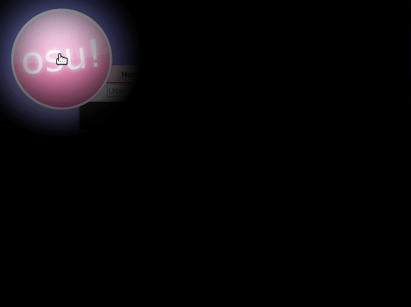

---
tags:
  - 愚人节
  - 4月1日
  - 4月1日
  - 愚人节
  - 玩笑
  - 历史
  - 传承
---

# osu! 愚人节玩笑历史

*如需了解 osu! 的完整历史，请参阅：[osu! 历史](/wiki/History_of_osu!)*

每年，[osu! 团队](/wiki/People/osu!_team) 都喜欢在愚人节当天与社区开些玩笑。本文列出了自 2009 年以来 osu! 社区经历的所有愚人节玩笑。

## 2009 年

### “Lemon Tree”被上架

[谱面](/wiki/Beatmap) ["Best of No.1 Hits - Lemon Tree (MillhioreF)"](https://osu.ppy.sh/beatmapsets/57878#osu/174267) 于 2009 年 4 月 1 日被[上架](/wiki/Beatmap/Category#ranked)，作为当年愚人节玩笑的一部分。这个谱面很大程度上是社区内的一个梗，用户们开玩笑说这样的谱面应该永远保持上架状态。[^lemontree-reddit][^lemontree-post-machol30][^lemontree-post-peppy] 不久后，其上架状态被审核团队移除。[^lemontree-post-machol30]

一段时间后，原谱面应其创作者的要求被删除；但最终于 2012 年 8 月 24 日由 [MillhioreF](https://osu.ppy.sh/users/941094) 重新上传，用于存档目的。[^lemontree-post-millhioref]

## 2010 年

### touhosu!

作为 2010 年愚人节恶作剧，osu! 网站以及游戏内的主菜单界面改用带有[东方 Project (Touhou Project)](https://www.qiuwenbaike.cn/wiki/%E4%B8%9C%E6%96%B9Project) 人物与元素的主题。这些变化包括添加了角色雾雨魔理沙，并在主菜单和网站的某些区域显示不同颜色的蝴蝶，呈圆形图案排列，同时将网站某些区域的名称“osu!”替换为“touhosu!”。[^touhousu-ontheweb][^touhousu-osudev-2021-01-27][^touhousu-forums]

这个玩笑很大程度上源于一个[长期存在的功能请求](https://osu.ppy.sh/community/forums/topics/19307)，即基于现有的 [osu!catch](/wiki/Game_mode/osu!catch) 游戏模式，结合东方 Project 游戏的核心玩法，创建一个新的[游戏模式](/wiki/Game_mode)。

当时还有报道称，[Ephemeral](https://osu.ppy.sh/users/102335) 开玩笑说，购买 osu!supporter 标签会在主菜单界面显示一个裸体的雾雨魔理沙，而不是穿着衣服的。然而，这个说法只是个玩笑，很快被其他人揭穿。[^touhousu-forums-2]

## 2011 年

### osu!core

"osu!core" 是 osu! 2011 年愚人节恶作剧的名称。这个恶作剧导致每张谱面的音频都被调整音高并加快速度，风格类似于 [Nightcore](https://en.wikipedia.org/wiki/Nightcore) 混音。虽然这只是一个愚人节玩笑，但在 [Nightcore 模组](/wiki/Gameplay/Game_modifier/Nightcore)后来作为可玩的[游戏模式](/wiki/Gameplay/Game_modifier) 被引入 osu! 时，便成为了现实。[^nightcore-yt][^nightcore-frontpage][^fl-forums]

## 2012 年

### 网站上的 Flashlight/Hidden 模组

2012 年 4 月 1 日，每次加载 osu! 网站时，整个页面有 50% 的几率会 "启用" [Flashlight (FL) 模组](/wiki/Gameplay/Game_modifier/Flashlight) 或 [Hidden (HD) 模组](/wiki/Gameplay/Game_modifier/Hidden)（HD 概率 3/10；FL 概率 1/5）。下图展示了那时用户观感的现代版重现。[^fl-ontheweb][^fl-forums-2][^fl-forums-3][^fl-forums-4][^fl-osudev-2021-01-29]

### Bad Apple 排行榜月赛

"Bad Apple 排行榜挑战" 是osu! 2012 年愚人节玩笑的一部分，是一个基于多张包含歌曲 "Bad Apple!!" 的谱面的搞笑排行榜挑战。通过 [一篇新闻帖](https://osu.ppy.sh/community/forums/posts/1431905) 于 2012 年 4 月 1 日宣布，这个排行榜挑战在当时实际上是一个正常运作的挑战，显示了在精选的任何一张 "Bad Apple!!" 谱面中获得最高[Ranked得分](/wiki/Gameplay/Score/Ranked_score) 的前 40 名玩家。[^bad-apple-chart][^bad-apple-news] 上述新闻帖的摘录如下：

> 我们决定将这个挑战献给有史以来最伟大的歌曲和视频，Bad Apple!!。你可以在这里找到这个很棒的挑战
>
> 现在，由于这是一个史诗级的挑战，我们需要让这次奖品更好一些！获胜者将获得一张 Lily White 海报和一张手绘的 Reimu 图片。（需要打印机才能领取这些奖品）
>
> 敬请期待我们的下一个挑战，Renai Circulation 和 Irony 挑战！

—Cyclone, "Bad Apple Ranking Chart!"[^bad-apple-news]

该挑战于 2012 年 4 月 1 日开启，并于 2012 年 4 月 2 日结束。在排名期结束时，[Mesita](https://osu.ppy.sh/users/201459) 以 145,623,328 的得分位居第一。[^bad-aple-frontpage]

该排行榜挑战中包含的谱面如下：

- [nomico - Bad Apple!! (James)](https://osu.ppy.sh/beatmapsets/6252)
- [REDALiCE - Bad Apple!! (Rena-chan)](https://osu.ppy.sh/beatmapsets/10353)
- [Masayoshi Minoshima ft. nomico - Bad Apple!! (Ephemeral)](https://osu.ppy.sh/beatmapsets/10435)
- [Masayoshi Minoshima ft. nomico - Bad Apple!! (ignorethis)](https://osu.ppy.sh/beatmapsets/13177)
- [Masayoshi Minoshima feat. StrawbellyCake - Bad Apple!! (German Version) (Larto)](https://osu.ppy.sh/beatmapsets/13664)
- [Masayoshi Minoshima feat. Larto & nomico - Awesome Apple!! (Larto)](https://osu.ppy.sh/beatmapsets/14475)
- [Masayoshi Minoshima feat. nomico - Bad Apple!! (ouranhshc)](https://osu.ppy.sh/beatmapsets/18260)
- [Spiritsoulxx - Bad Apple!! (Tony)](https://osu.ppy.sh/beatmapsets/23760)
- [Kommisar - Bad Apple!! (Chiptune Ver.) (Sushi)](https://osu.ppy.sh/beatmapsets/28222)
- [Kalafina - Bad MagiApple (Makar8000)](https://osu.ppy.sh/beatmapsets/32003)

"Bad Apple!!" 音乐视频在当时某种程度上是一个内部梗，将这首歌与其他讽刺性转折混合的混音版本在谱面中普遍存在，因此它作为愚人节玩笑出现。<!--citation needed-->

## 2013 年

### BanchoBot 的傲娇

2013 年 4 月 1 日，[BanchoBot](/wiki/BanchoBot) 变成了[Tsundere](https://en.wikipedia.org/wiki/Tsundere)。在这个愚人节，每当用户向 BanchoBot 发出命令或提示它在公共聊天中说话时，它的聊天消息都会被替换为像galgame游戏一样的傲娇式回应。[^banchobot-reddit][^banchobot-forums][^banchobot-forums-2][^banchobot-tweet][^banchobot-forums-3][^banchobot-forums-4]

## 2014 年

### 神烦狗(Doge)出现在 osu! 中

2014 年 4 月 1 日，osu! 主菜单界面被临时更改（如下所示），加入了多色的、语法错误的语句，并配以当时流行的 [Doge  meme](https://en.wikipedia.org/wiki/Doge_(meme)) 风格中某只著名[柴犬](https://en.wikipedia.org/wiki/Shiba_Inu) 的图片。[^shiba-inu-reddit][^shiba-inu-reddit-2][^shiba-inu-forums]

## 2015 年

### osu!coins

*另见：[osu!coin](/wiki/History_of_osu!/April_Fools/osu!coin)*

2015 年 3 月 31 日，[peppy](https://osu.ppy.sh/users/2) 发布了[一篇新闻帖](https://osu.ppy.sh/home/news/2015-03-31-osucoins)，宣布增加一种新的游戏内货币，称为 "osu!coins"。[^osu-coins-news][^osu-coins-ontheweb] 这篇新闻帖解释了这种游戏内货币是什么以及它是如何工作的，并附带了一个特别制作的 [osu!academy 视频](https://www.youtube.com/watch?v=BImc5McuK1o)。与此同时，peppy 还开玩笑说，他做出这一改变的原因是由于当前玩家捐赠带来的货币收益不足以让他有生之年买得起私人飞机：

> 按照目前的回报率，我有生之年不太可能买到私人飞机，这是我人生的主要目标之一。因此，我与团队讨论了其他的盈利模式，研究了目前市场上类似免费游戏中流行的趋势。

—peppy, "osu!coins"[^osu-coins-news]

*注意：根据[协调世界时 (UTC)](https://en.wikipedia.org/wiki/Coordinated_Universal_Time)，该帖子发布于 2015 年 3 月 31 日。然而，在发布时，peppy 居住在澳大利亚，那里的当前日期是 2015 年 4 月 1 日。*

简而言之，为了游玩或重试[谱面](/wiki/Beatmap)，用户必须花费一个 [osu!coin](/wiki/History_of_osu!/April_Fools/osu!coin)，一旦他们的 osu!coins 用完了，他们要么停止玩并等到第二天，要么支付真实货币来获得更多的 osu!coins。尽管有这样的描述，实际的游戏玩法并未受到影响，用户即使所有 osu!coins 都耗尽了，也可以像往常一样继续玩。[^osu-coins-news][^osu-coins-yt][^osu-coins-yt-2]

osu! 的主菜单背景中也有一大堆缓缓升起的 osu!coins，主主题曲也略有改变，其中 "circles!" 的惊叹声在节拍下降之前被一个机器人般的 "and buy the coins" 所取代。为这个恶作剧创建了新的纹理、音效、动画和音乐，包括一个计数器，会在玩家游玩过程中显示他们拥有的硬币数量。[^osu-coins-yt-2][^osu-coins-yt-3] <!--需要进一步验证-->

这次更新普遍受到玩家欢迎，并看到了一些对未来实现无货币化版本的实际支持。尽管如此，peppy 在第二天回滚了 osu!coins 的实现，并在[相应的更新日志评论](https://osu.ppy.sh/comments/121803) 中提到了反馈。[^osu-coins-yt-4][^osu-coins-forums][^osu-coins-changelog]

## 2016 年

### VR中的 osu!

2016 年 4 月 1 日，[一篇新闻帖](https://osu.ppy.sh/home/news/2016-04-01-oculus-rift-to-be-supported-as-an-input-method) 详细宣布了计划，将增加对 [Oculus Rift](https://en.wikipedia.org/wiki/Oculus_Rift) 作为 osu! 中新的[输入设备](/wiki/Gameplay/Input_device) 的支持。这篇由 [Evrien](https://osu.ppy.sh/users/791660) 撰写的帖子，引用了对 [peppy](https://osu.ppy.sh/users/2) 所谓采访中的许多引述，其中他解释了他做出这一宣布的理由以及这个概念可能如何实现的想法。[^osu-vr-news]

关于玩家可能如何使用 Oculus Rift 作为输入设备，新闻帖描述道："玩家将体验光标在屏幕上移动到击中对象时的第一人称视角……"，并通过"……让玩家用嘴发出元音般的声音" 来击中对象。实际上，游戏内没有做出与使用 Oculus Rift 或类似的[虚拟现实 (VR)](https://en.wikipedia.org/wiki/Virtual_reality) 设备来控制 osu! 相关的更改。[^osu-vr-news]

*注意：McOsu 是独立开发的，与 osu! 或 ppy Pty Ltd 没有直接关联。*

然而，尽管官方 osu! 开发者没有/从来没有真正打算添加 VR 支持，但 osu! 在 VR 中的想法引起了一些粉丝的兴趣。这种兴趣最终在不久后凝聚成一个非官方的粉丝项目，旨在创建一个免费的开源客户端，用于练习 osu! [谱面](/wiki/Beatmap)，并提供更多功能和[游戏模组](/wiki/Gameplay/Game_modifier)，包括在 VR 中游玩的能力。该项目名为 "[McOsu](https://store.steampowered.com/app/607260/McOsu)"，于 2017 年 3 月 20 日完成并在 [Steam](https://en.wikipedia.org/wiki/Steam_(service)) 上发布。[^osu-vr-reddit][^osu-vr-yt][^osu-vr-gameskinny][^osu-vr-mcosu]

### Dancing Auto 模式 / Dancing pippi

"Dancing pippi"（也称为 "Dancing Auto 模式"）是 osu! 2016 年愚人节玩笑之一的昵称。该玩笑发布了一个更新，导致 [Auto](/wiki/Gameplay/Game_modifier/Auto) 模组[回放](/wiki/Gameplay/Replay)中的游戏光标以像素完美的方式环绕当前的[击中对象](/wiki/Gameplay/Hit_object)，然后最终准时击中对象，这与 Auto 模组通常的机械且完美的直线运动形成对比。上述更新在第二天随后的更新中被回滚。[^osu-auto-yt][^osu-auto-yt-2][^osu-auto-yt-3][^osu-auto-reddit] <!--仍需要官方验证-->

### 免费的 osu! supporter 标签

2016 年 4 月 1 日，许多 osu! 玩家惊讶地发现，他们突然莫名其妙地收到了一个 [osu! supporter 标签](https://osu.ppy.sh/home/support)，尽管他们从未购买过或被赠送过。给予玩家的 supporter 标签功能齐全，就像普通的 supporter 标签一样；然而，这个变化在第二天被回滚了。[^supporter-tag-forums][^supporter-tag-forums-2][^supporter-tag-frontpage][^supporter-tag-forums-3][^supporter-tag-forums-4][^supporter-tag-reddit][^supporter-tag-forums-5]

### 网站上旋转的 osu! cookie

作为 2016 年多个愚人节玩笑的一部分，osu! 网站上的 [osu! cookie](/wiki/Brand_identity_guidelines) 偶尔会顺时针旋转 180 度，然后迅速沿同一方向逆时针旋转回正。[^osu-cookie-forums][^osu-cookie-frontpage][^osu-cookie-forums-2][^osu-cookie-forums-3]

## 2017 年

根据 [peppy 的一条推文](https://twitter.com/ppy/status/848021525663842304) 宣布，由于 [lazer](/wiki/Client/Release_stream/Lazer) 版本 osu! 客户端的开发，2017 年 osu! 没有愚人节玩笑。

## 2018 年

### 旋转的 osu! cookie

2018 年 4 月 1 日，主菜单界面上的 [osu! cookie](/wiki/Brand_identity_guidelines) 会随着时间的推移缓慢顺时针旋转，而歌曲选择界面中的大粉饼会缓慢逆时针旋转。将鼠标悬停在这些大粉饼上会像往常一样放大它们，但也会导致它们旋转得更快。[^osu-cookie-web-reddit][^osu-cookie-web-reddit-2][^osu-cookie-web-reddit-3][^osu-cookie-web-forums][^osu-cookie-web-forums-2]

## 2019 年

### 女孩打喷嚏的音效

对于 2019 年的愚人节，打开谱面时，大约有 1/20 的几率会听到一个高音调女孩打喷嚏的音效。[^sneeze-reddit][^sneeze-reddit-2][^sneeze-forums]

## 2020 年

### MillhioreF 加入精选艺术家

[MillhioreF](https://osu.ppy.sh/users/941094) —— 一位长期的 osu! 版主、开发者和 [Easy 模式](/wiki/Gameplay/Game_modifier/Easy) 玩家 —— 在 2020 年 4 月 1 日的[一篇新闻帖](https://osu.ppy.sh/home/news/2020-04-01-new-featured-artist-millhioref) 中被宣布以 "Millhiore Firianno Biscotti" 的身份 "加入" 了 [Featured Artists](/wiki/People/Featured_Artists) 列表，并附带了五首歌曲：[^irish-fa]

- Waltz o' the Irish
- The Waltzing Irishman
- An Irish Waltz
- A Waltz From The Geographical Region Known as Ireland but Also as Éire
- There's Gold Beneath Your Waltzing Rainbow (feat. Mismagius)

作为这个玩笑的一部分，["MillhioreF - Waltz o' the Irish (MillhioreF)"](https://osu.ppy.sh/beatmapsets/73348#osu/326585) —— 社区中长期存在的一个梗谱面 —— 也在 2020 年 3 月 31 日被 [Loved](/wiki/Beatmap/Category#loved)。

### 女孩打喷嚏的音效

2020 年的愚人节重复使用了前一年的相同玩笑，即打开谱面时，大约有 1/20 的几率会听到一个高音调女孩打喷嚏的音效。[^sneeze-2-reddit][^sneeze-2-reddit-2]

## 2021 年

### 女孩打喷嚏的音效

2021 年的愚人节重复了前两年的相同玩笑，即打开谱面时，有 1/20 的几率会听到一个高音调女孩打喷嚏的音效。[^sneeze-2-forums][^sneeze-2-forums-2]

## 参考文献

[^lemontree-reddit]: [Reddit 帖子，作者 u/5522Luca 在 r/osugame (2017-04-10) "Reminder the Osu! April Fools 2009? This beatmap was ranked."](https://www.reddit.com/r/osugame/comments/64it62/reminder_the_osu_april_fools_2009_this_beatmap/)
[^lemontree-post-machol30]: [论坛帖子，作者 machol30 (2009-04-03) 在 "Best of No.1 Hits - Lemon Tree" 中](https://osu.ppy.sh/community/forums/posts/106774)
[^lemontree-post-peppy]: [论坛帖子，作者 peppy (2009-04-01) 在 "Best of No.1 Hits - Lemon Tree" 中](https://osu.ppy.sh/community/forums/posts/105679)
[^lemontree-post-millhioref]: [谱面，作者 MillhioreF (2012-08-24) "Best of No.1 Hits - Lemon Tree"](https://osu.ppy.sh/beatmapsets/57878#osu/174267)

[^touhousu-ontheweb]: ["osu.ppy.sh - 将网站和游戏中的 osu! 更改为 touhousu!" 在 April Fools' Day On The Web 上](http://aprilfoolsdayontheweb.com/joke/8120/?size=1)
[^touhousu-osudev-2021-01-27]: [Discord 消息，作者 Nivalyx 在 #osu-wiki 频道，osu!dev 服务器 (2021-01-27)](https://discord.com/channels/188630481301012481/218677502141399041/804215894762848296)
[^touhousu-forums]: [论坛主题，作者 rcmero (2010-04-01) "touhousu! - April Fools joke? [Resolved]"](https://osu.ppy.sh/community/forums/topics/27612)
[^touhousu-forums-2]: [论坛主题，作者 rulingvenus (2010-04-01) "Naked Marisa????"](https://osu.ppy.sh/community/forums/topics/27531)

[^nightcore-yt]: [YouTube 视频，作者 Nyaruko (2011-03-31) "When osu! tries to do April Fools"](https://www.youtube.com/watch?v=qD5ep6Fykao)
[^nightcore-frontpage]: ["osu! — rhythm is just a click away" (2011-04-01) 在 Wayback Machine 上](https://web.archive.org/web/20110401175252/http://osu.ppy.sh/)

[^fl-forums]: [论坛帖子，作者 Melty Bagle (2012-03-31) 在 "[Archived] 'Flashlight mod' on the site...?" 中](https://osu.ppy.sh/community/forums/posts/1430529)
[^fl-ontheweb]: ["osu.ppy.sh — 'Flashlight' mode on beatmap search page" 在 April Fools' Day On The Web 上](http://aprilfoolsdayontheweb.com/joke/11484/?size=1)
[^fl-forums-2]: [论坛主题，作者 ----- (2012-03-31) "[Archived] 'flashlight mod' on the site...?"](https://osu.ppy.sh/community/forums/topics/79076)
[^fl-forums-3]: [论坛帖子，作者 peppy (2012-04-01) 在 "[Archived] 'flashlight mod' on the site...?" 中](https://osu.ppy.sh/community/forums/posts/1433063)
[^fl-forums-4]: [论坛主题，作者 kreph (2012-03-31) "[Archived] Flashlight bugs the website for some browsers"](https://osu.ppy.sh/community/forums/topics/79077)
[^fl-osudev-2021-01-29]: [Discord 消息，作者 spaceman_atlas 在 #osu-wiki 频道，osu!dev 服务器 (2021-01-29)](https://discord.com/channels/188630481301012481/218677502141399041/804814051209117696)

[^bad-apple-chart]: [Bad Apple 排行榜挑战！ (2012-04-04)](https://osu.ppy.sh/rankings/osu/charts?spotlight=50)
[^bad-apple-news]: [新闻帖，作者 Cyclone (2012-04-01) "Bad Apple!! Ranking Chart"](https://osu.ppy.sh/community/forums/topics/79128)
[^bad-aple-frontpage]: ["osu! — rhythm is just a click away" (2012-04-03) 在 Wayback Machine 上](https://web.archive.org/web/20120403135741/http://osu.ppy.sh/)

[^banchobot-reddit]: [Reddit 评论，作者 u/Sakuya_Lv9 在 r/osugame (2014-04-02) 中，回复 "April 1st"](https://www.reddit.com/r/osugame/comments/2201so/comment/cgi4zav)
[^banchobot-forums]: [论坛帖子，作者 Jazz (2013-04-02) 在 "Your prediction of osu! April Fools" 中](https://osu.ppy.sh/community/forums/posts/2215004)
[^banchobot-forums-2]: [论坛帖子，作者 Brian OA (Off-Topic) 在 "Your prediction of osu! April Fools" 中](https://osu.ppy.sh/community/forums/posts/2215194)
[^banchobot-tweet]: [推文，作者 @little_2d (2019-06-27)](https://twitter.com/little_2d/status/1144316731407683584)
[^banchobot-forums-3]: [论坛帖子，作者 kingking9 (2013-06-04) 在 "osu! Community Localisation Project" 中](https://osu.ppy.sh/community/forums/posts/2342998)
[^banchobot-forums-4]: [论坛帖子，作者 peppy (2013-06-04) 在 "osu! Community Localisation Project" 中](https://osu.ppy.sh/community/forums/posts/2343044)

[^shiba-inu-reddit]: [Reddit 帖子，作者 u/mystry08 在 r/osugame (2014-04-01) "Can we save the start screen doge?"](https://www.reddit.com/r/osugame/comments/21vh6r/can_we_save_the_start_screen_doge/)
[^shiba-inu-reddit-2]: [Reddit 帖子，作者 u/dalollypop 在 r/osugame (2014-03-31) "Very April, Such fool, Much peppy. wow"](https://www.reddit.com/r/osugame/comments/21u293/very_april_such_fool_much_peppy_wow/)
[^shiba-inu-forums]: [论坛主题，作者 Decuke (2014-03-31) "Doge on Osu!"](https://osu.ppy.sh/community/forums/topics/198112)

[^osu-coins-news]: [新闻帖，作者 peppy (2015-03-31) "osu!coins!"](https://osu.ppy.sh/home/news/2015-03-31-osucoins)
[^osu-coins-ontheweb]: ["osu.ppy.sh — osu!coins! (fake business model, obviously a joke from blog & video)" 在 April Fools' Day On The Web 上](http://aprilfoolsdayontheweb.com/joke/20150013/?size=1)
[^osu-coins-yt]: [YouTube 视频，作者 synonia (2015-04-01) "Osu! Coin generator 14 coins in 30 seconds"](https://www.youtube.com/watch?v=Cmt646ujDFc)
[^osu-coins-yt-2]: [YouTube 视频，作者 osu! (2014-03-31) "Introduction to osu!coins (April Fools'2015)"](https://www.youtube.com/watch?v=BImc5McuK1o)
[^osu-coins-yt-3]: [YouTube 视频，作者 BananCho (2017-10-19) "Osu!Coins."](https://www.youtube.com/watch?v=0yWlUzG_tb8&t=39s)
[^osu-coins-yt-4]: [YouTube 视频，作者 TheRexster (2015-03-31) "HOW TO GET OSU COINS VERY FAST!"](https://www.youtube.com/watch?v=wRVd5Bdf9rk)
[^osu-coins-forums]: [论坛主题，作者 Terriama (2015-10-19) "April Fools"](https://osu.ppy.sh/community/forums/topics/377157)
[^osu-coins-changelog]: [更新日志评论，作者 peppy (2015-04-01) 在 "Cutting Edge 20150401" 中](https://osu.ppy.sh/comments/121803)

[^osu-vr-news]: [新闻帖，作者 Evrien (2016 年 4 月 1 日) "Oculus Rift to be Supported as an Input Method (April Fools!)"](https://osu.ppy.sh/home/news/2016-04-01-oculus-rift-to-be-supported-as-an-input-method)
[^osu-vr-reddit]: [Reddit 帖子，作者 u/Omgforz 在 r/osugame (2016-08-02) "McOsu Alpha 20 Public release (custom practice client)"](https://www.reddit.com/r/osugame/comments/4vuksd/mcosu_alpha_20_public_release_custom_practice/)
[^osu-vr-yt]: [YouTube 视频，作者 Omgforz (2016-08-02) "McOsu Alpha 20 (custom practice client +download)"](https://www.youtube.com/watch?v=PCLpOdcMQuc)
[^osu-vr-gameskinny]: ["What Even Is McOsu? Because It's Not Osu!" 在 GameSkinny 上](https://www.gameskinny.com/mhaa0/what-even-is-mcosu-because-its-not-osu)
[^osu-vr-mcosu]: ["McKay42/McOsu" 在 GitHub 上](https://github.com/McKay42/McOsu)

[^osu-auto-yt]: [YouTube 视频，作者 HoLLy (2016 年 3 月 31 日) - "osu!'s april fools 2016 (auto mod improvement)"](https://www.youtube.com/watch?v=r9SCbYG4GYs)
[^osu-auto-yt-2]: [YouTube 视频，作者 Hubz (2021 年 1 月 7 日) - "osu! 2016 april fools (dancing pippi)"](https://www.youtube.com/watch?v=fYTdPqhAns0)
[^osu-auto-yt-3]: [YouTube 视频，作者 mightyaleks (2016 年 3 月 31 日) - "Osu! Dancing Auto-cursor and retard Spin | 1st April 2016"](https://www.youtube.com/watch?v=5Tj-1sgHl9g)
[^osu-auto-reddit]: [Reddit 帖子，作者 u/osuisgameforweebs 在 r/osugame (2016-03-31) "Something about the april fools joke dancing that some might not have noticed"](https://www.reddit.com/r/osugame/comments/4crlw1/something_about_the_april_fools_joke_dancing_that/)

[^supporter-tag-forums]: [论坛主题，作者 -AlieN (2016-03-31) "[resolved] April Fools??!??!??"](https://osu.ppy.sh/community/forums/topics/437855)
[^supporter-tag-forums-2]: [论坛帖子，作者 Epipheralis (2016-04-01) 在 "april fools" 中](https://osu.ppy.sh/community/forums/posts/5006805)
[^supporter-tag-frontpage]: ["osu!" (2016-04-01) 在 Wayback Machine 上](https://web.archive.org/web/20160401001507/https://osu.ppy.sh/)
[^supporter-tag-forums-3]: [论坛主题，作者 Bearial1 (2016-04-01) "[resolved] Why am I a supporter?"](https://osu.ppy.sh/community/forums/topics/438118)
[^supporter-tag-forums-4]: [论坛主题，作者 noah4678 (2016-04-01) "[resolved] says im a supporter"](https://osu.ppy.sh/community/forums/topics/438119)
[^supporter-tag-reddit]: [Reddit 帖子，作者 u/CraftyDart 在 r/osugame (2016-04-01) "The best April Fools day ever."](https://www.reddit.com/r/osugame/comments/4cshv3/the_best_april_fools_day_ever/)
[^supporter-tag-forums-5]: [论坛主题，作者 Trosk- (2016-03-31) "[resolved] [confirmed] Regarding osu!supporter/Auto mod"](https://osu.ppy.sh/community/forums/topics/437902)

[^osu-cookie-forums]: [论坛帖子，作者 Birdy (2016-03-31) 在 "april fools" 中](https://osu.ppy.sh/community/forums/posts/5005957)
[^osu-cookie-frontpage]: ["osu!" (2016-04-01) 在 Wayback Machine 上](https://web.archive.org/web/20160401001507/https://osu.ppy.sh/)
[^osu-cookie-forums-2]: [论坛主题，作者 Rilene (2016-03-31) "osu logo"](https://osu.ppy.sh/community/forums/topics/437755)
[^osu-cookie-forums-3]: [论坛帖子，作者 Trosk- (2016-03-31) 在 "[resolved] [confirmed] Regarding osu!supporter/Auto mod" 中](https://osu.ppy.sh/community/forums/posts/5006190)

[^osu-cookie-web-reddit]: [Reddit 帖子，作者 u/[已删除] 在 r/osugame (2018-03-31) "New April Fools Update now has a rotating osu! Logo"](https://www.reddit.com/r/osugame/comments/88kq23/new_april_fools_update_now_has_a_rotating_osu_logo/)
[^osu-cookie-web-reddit-2]: [Reddit 帖子，作者 u/hi_im_marc 在 r/osugame (2018-03-31) "April Fools Patch Is Out Get Ready To Get BAMBOOZLED!!!1"](https://www.reddit.com/r/osugame/comments/88kbit/april_fools_patch_is_out_get_ready_to_get/)
[^osu-cookie-web-reddit-3]: [Reddit 帖子，作者 u/AdriaLOL 在 r/osugame (2018-04-01) "haha, nice april fools peppy XD"](https://www.reddit.com/r/osugame/comments/88qlwk/haha_nice_april_fools_peppy_xd/)
[^osu-cookie-web-forums]: [论坛主题，作者 Aochie (2018-04-02) "The osu! logo is moving?"](https://osu.ppy.sh/community/forums/topics/724377)
[^osu-cookie-web-forums-2]: [论坛主题，作者 Jreen (2018-04-01) "[resolved] Osu! Logo Sideways?"](https://osu.ppy.sh/community/forums/topics/724094)

[^sneeze-reddit]: [Reddit 帖子，作者 u/jivko500 在 r/osugame (2019-04-01) "The April Fools joke in osu"](https://www.reddit.com/r/osugame/comments/b83pnl/the_april_fools_joke_in_osu/)
[^sneeze-reddit-2]: [Reddit 帖子，作者 u/anoymaly2152 在 r/osugame (2019-04-01) "Bless you, Pippi."](https://www.reddit.com/r/osugame/comments/b848ro/bless_you_pippi/)
[^sneeze-forums]: [论坛主题，作者 Brainage (2019-04-01) "No April Fools in the changelog?"](https://osu.ppy.sh/community/forums/topics/888939)

[^irish-fa]: [新闻帖，作者 Ephemeral (2020-04-01) "New Featured Artist: MillhioreF"](https://osu.ppy.sh/home/news/2020-04-01-new-featured-artist-millhioref)

[^sneeze-2-reddit]: [Reddit 帖子，作者 u/not_pingu 在 r/osugame (2020-04-01) "Does anybody sometimes hear the "achoo"? (sorry for bad quality)"](https://www.reddit.com/r/osugame/comments/fsxfpk/does_anybody_sometimes_hear_the_achoo_sorry_for/)
[^sneeze-2-reddit-2]: [Reddit 帖子，作者 u/ohmaytt 在 r/osugame (2020-04-01) "This year's osu! April Fool's Day joke"](https://www.reddit.com/r/osugame/comments/fsq30l/this_years_osu_april_fools_day_joke/)
[^sneeze-2-forums]: [论坛主题，作者 MilkyIQ (2021-04-01) "Is this not the third year in a row that we get sneezing girl?"](https://osu.ppy.sh/community/forums/topics/1286906)
[^sneeze-2-forums-2]: [论坛主题，作者 GreatTurtleKing (2021-04-01) "i heard like a sneeze when i just started to play a song"](https://osu.ppy.sh/community/forums/topics/1286396)
