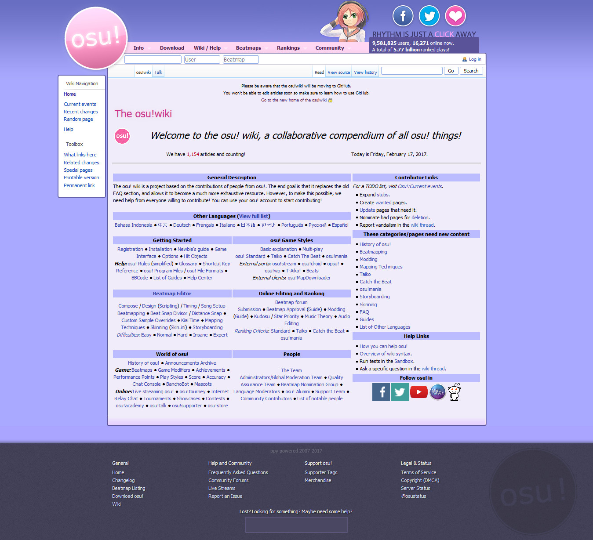
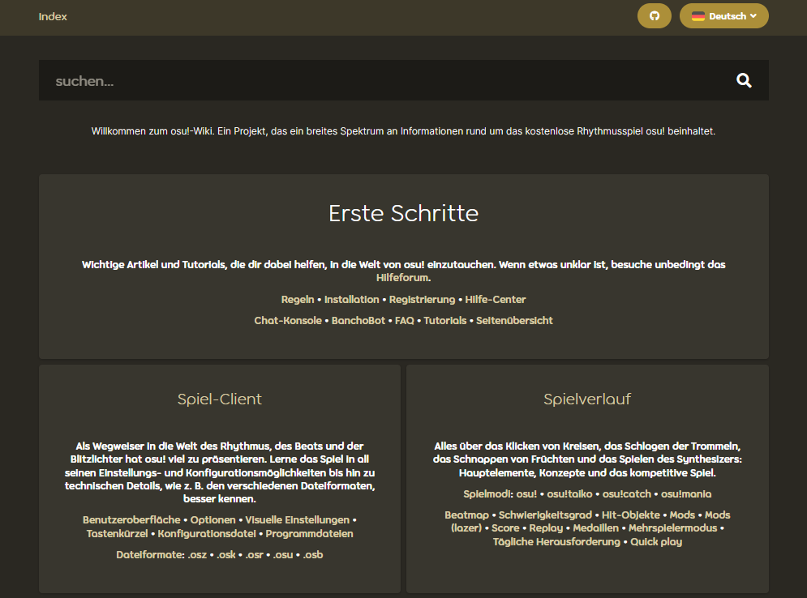

# Geschichte des osu!-Wikis

::: alert-note
**Siehe auch:** [Betreuer des osu!-Wikis](/wiki/People/osu!_wiki_maintainers)
:::

Dieser Artikel enthält die wichtigsten Ereignisse in der **Geschichte des osu!-Wikis** von der MediaWiki-Ära bis zur Gegenwart.

## MediaWiki (2011 bis 2017)

### 2011

#### Dezember

- **05.12.2011:** Das Grundgerüst des osu!-Wikis wurde aufgebaut, wobei ::{ flag=AU }:: [Ephemeral](https://osu.ppy.sh/users/102335) die ersten Bearbeitungen vornahm.
- **06.12.2011:** Das osu!-Wiki [wurde veröffentlicht](https://osu.ppy.sh/community/forums/topics/68525).

### 2012

#### November

- **29.11.2012:** ::{ flag=MX }:: [Repflez](https://osu.ppy.sh/users/201392) und ::{ flag=RU }:: [Dellirium](https://osu.ppy.sh/users/519032) wurden als MediaWiki-Admins des osu!-Wikis [hinzugefügt](https://osu.ppy.sh/community/forums/posts/1944044).

### 2013

#### Januar

- **27.01.2013:** ::{ flag=AU }:: [peppy](https://osu.ppy.sh/users/2) integrierte das osu!-Wiki in die [Hauptseite](https://osu.ppy.sh/community/forums/posts/2082803).

### 2014

#### Dezember

- **Unbekanntes Datum:** Das osu!-Wiki wurde zu einem wahren Informationszentrum für osu!, nachdem wesentliche Artikel wie das [osu!-Team](/wiki/People/osu!_team) und die [Regeln](/wiki/Rules) in das Wiki verschoben wurden.
- **Unbekanntes Datum:** ::{ flag=NZ }:: [deadbeat](https://osu.ppy.sh/users/128370) und ::{ flag=DE }:: [Loctav](https://osu.ppy.sh/users/71366) wurden als MediaWiki-Admins des osu!-Wikis hinzugefügt.

### 2015

#### Dezember

- **Unbekanntes Datum:** Das osu!-Wiki erhielt einen Zustrom an Mitwirkenden, die Artikel in ihre Muttersprachen übersetzten.
- **Unbekanntes Datum:** ::{ flag=RU }:: [Dellirium](https://osu.ppy.sh/users/519032)s Position als Admin wurde durch ::{ flag=FR }:: [Shiro](https://osu.ppy.sh/users/113005) ersetzt.

### 2016

#### Februar

- **22.02.2016:** ::{ flag=PL }:: [Ukami](https://osu.ppy.sh/users/820865) und ::{ flag=PL }:: [Galkan](https://osu.ppy.sh/users/169570) wurden als MediaWiki-Admins des osu!-Wikis hinzugefügt.

#### April

- **01.04.2016:** ::{ flag=PH }:: [Nathanael](https://osu.ppy.sh/users/2295078) wurde als MediaWiki-Admin des osu!-Wikis hinzugefügt.

#### August

- **30.08.2016:** Das osu!-Wiki, das auf MediaWiki lief, wurde gegen das GitHub-Repository ausgetauscht. Das alte osu!-Wiki blieb jedoch zugänglich, bis die GitHub-Version mit allen Seiten bereit zum Einsatz war und alle Bilder übertragen wurden.

### 2017

#### Juni

- **26.06.2017:** Das osu!-Wiki, das auf MediaWiki lief, wurde [offiziell außer Dienst gestellt](https://discord.com/channels/188630481301012481/218677502141399041/328851556453711872). Die Links zum alten Wiki leiteten ab sofort zur GitHub-Version des Wikis weiter. [Ein Schnappschuss des alten Wikis ohne die Funktionen von MediaWiki befindet sich hier](https://web.archive.org/web/20171115173938/https://osu.ppy.sh/old-wiki/Main_Page).

## GitHub-Repository (2016 bis heute)

### 2016

#### August

- **26.08.2016:** ::{ flag=AU }:: [peppy](https://osu.ppy.sh/users/2) [erstellte das osu-wiki-Repository](https://github.com/ppy/osu-wiki/tree/3433cbeeda9303a470647cad1c338d43f4272a2e).

#### September

- **02.09.2016:** ::{ flag=US }:: [craftu](https://osu.ppy.sh/users/16468119) und ::{ flag=US }:: [XYLOO](https://osu.ppy.sh/users/27809907) schlossen die Übertragung des Großteils der alten Inhalte des osu!-Wikis von MediaWiki in das Repository ab. Dabei blieben nur die Bilder übrig und durch die Unterschiede zwischen der [Wikisyntax](https://de.wikipedia.org/wiki/Hilfe:Wikisyntax) (MediaWiki) und [Markdown](https://de.wikipedia.org/wiki/Markdown) (GitHub) enstanden einige Syntaxfehler.

### 2017

#### Januar

- **26.01.2017:** In einem [Development-Blogbeitrag](https://blog.ppy.sh/post/156390386433/2017-01-dev-meeting) sprach ::{ flag=AU }:: [Ephemeral](https://osu.ppy.sh/users/102335) über die bevorstehende Einbindung des osu!-Wikis in die osu!-Webseite.
- **Unbekanntes Datum:** ::{ flag=JP }:: [nanaya](https://osu.ppy.sh/users/2387883) stellte die Backend-Unterstützung des neuen osu!-Wikis fertig, wodurch das Wiki vollständig in die osu!-Webseite integriert werden konnte.

#### Mai

- **22.05.2017:** Das [osu!news-Archiv](https://osunews.tumblr.com/), welches zuvor auf Tumblr bereitgestellt wurde, wurde in das osu!-Wiki übertragen.
- **30.05.2017:** [Seitenweiterleitung](https://github.com/ppy/osu-web/pull/1144) wurde dem Wiki hinzugefügt.

#### Juni

- **Unbekanntes Datum:** ::{ flag=PL }:: [TPGPL](https://osu.ppy.sh/users/3944705) wurde ein spezieller Schreibzugriff für das Repository des osu!-Wikis erteilt.
- **19.06.2017:** Eine [Suchfunktion](https://github.com/ppy/osu-web/pull/1259) wurde dem Wiki hinzugefügt.

### 2018

#### Februar

- **07.02.2018:** [Artikel-Tags](https://github.com/ppy/osu-web/pull/2331) wurden dem Wiki hinzugefügt, um bessere Suchergebnisse zu ermöglichen.

### 2021

#### Mai

- **12.05.2021:** [Infoboxen](https://github.com/ppy/osu-web/pull/7546) wurden dem Wiki hinzugefügt.

#### Juni

- **01.06.2021:** ::{ flag=ID }:: [GPR](https://osu.ppy.sh/users/10721349) implementierte das [osu!-Wiki-Overlay](https://github.com/ppy/osu/pull/12950) in [osu!(lazer)](/wiki/Client/Release_stream/Lazer), welches es ermöglicht, auf einige Seiten des Wikis direkt im osu!(lazer)-Client zuzugreifen.

#### August

- **08.08.2021:** [Galerieunterstützung](https://github.com/ppy/osu-web/pull/8126) wurde dem Wiki hinzugefügt.
- **12.08.2021:** [Fußnoten](https://github.com/ppy/osu-web/pull/8125) wurden dem Wiki hinzugefügt.

### 2026

#### Juli

- **06.07.2026:** Um Kopfnoten stärker hervorzuheben, wurden [hervorgehobene Meldungen](https://github.com/ppy/osu-web/pull/13079) hinzugefügt, welche die Kopfnoten mit einem Symbol und einer farbigen vertikalen Linie an der linken Seite darstellen.
- **30.07.2026:** Eine [Nutzerkarten-Komponente](https://github.com/ppy/osu-web/pull/13125) wurde hinzugefügt, die beim Hovern eines Profil-Links eine Karte mit verschiedenen Nutzerstatistiken anzeigt, ähnlich wie das [BBCode](/wiki/BBCode)-Tag `[profile]`.
