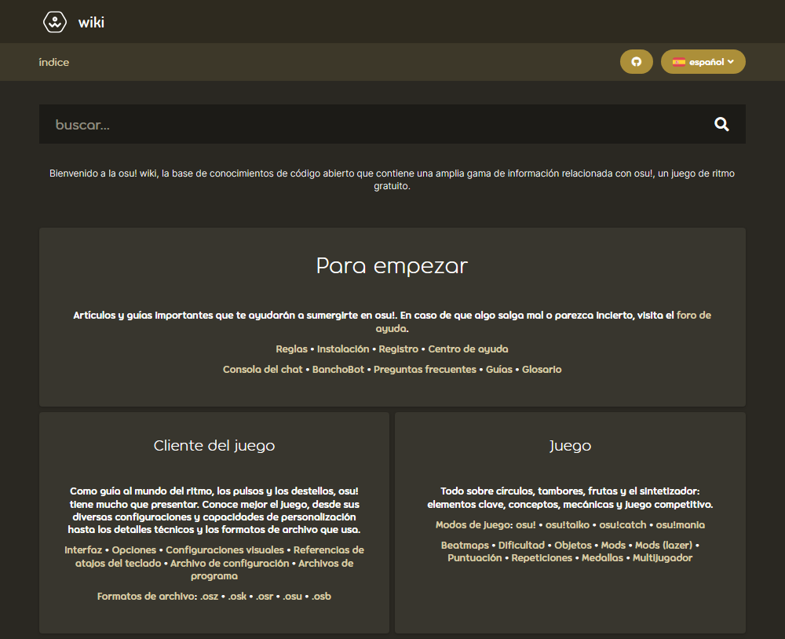

# Historia de la osu! wiki

*Véase también: [Mantenedores de la osu! wiki](/wiki/People/osu!_wiki_maintainers)*

Este artículo detalla los principales eventos de la **historia de la osu! wiki** desde la era MediaWiki hasta la actualidad.

## MediaWiki (2011 - 2017)

| Fecha | Descripción |
| :-- | :-- |
| **5/12/2011** | La base de la osu! wiki se puso en marcha, con ::{ flag=AU }:: [Ephemeral](https://osu.ppy.sh/users/102335) haciendo las primeras ediciones. |
| **6/12/2011** | La osu! wiki [se hizo pública](https://osu.ppy.sh/community/forums/topics/68525). |
| **29/11/2012** | ::{ flag=MX }:: [Repflez](https://osu.ppy.sh/users/201392) y ::{ flag=RU }:: [Dellirium](https://osu.ppy.sh/users/519032) fueron [añadidos](https://osu.ppy.sh/community/forums/posts/1944044) a los administradores de la Mediawiki de osu!. |
| **27/1/2013** | ::{ flag=AU }:: [peppy](https://osu.ppy.sh/users/2) integró la osu! wiki con el [diseño del sitio principal](https://osu.ppy.sh/community/forums/posts/2082803). |
| **Diciembre de 2014 (fecha exacta desconocida)** | La osu! wiki se convirtió en un verdadero centro de información de osu! después de que las páginas principales como [osu! team](/wiki/People/osu!_team) y las [reglas](/wiki/Rules) se migraran a la wiki. |
| **Diciembre de 2014 (fecha exacta desconocida)** | ::{ flag=NZ }:: [deadbeat](https://osu.ppy.sh/users/128370) y ::{ flag=DE }:: [Loctav](https://osu.ppy.sh/users/71366) fueron añadidos a los administradores de la Mediawiki de osu!. |
| **Diciembre de 2015 (fecha exacta desconocida)** | La osu! wiki recibió una avalancha de contribuidores que tradujeron los artículos a sus lenguas nativas. |
| **Diciembre de 2015 (fecha exacta desconocida)** | ::{ flag=RU }:: El puesto de administrador de [Dellirium](https://osu.ppy.sh/users/519032) fue ocupado por ::{ flag=FR }:: [Shiro](https://osu.ppy.sh/users/113005). |
| **22/2/2016** | ::{ flag=PL }:: [Ukami](https://osu.ppy.sh/users/820865) y ::{ flag=PL }:: [Galkan](https://osu.ppy.sh/users/169570) fueron añadidos a los administradores de la Mediawiki de osu!. |
| **1/4/2016** | ::{ flag=PH }:: [Nathanael](https://osu.ppy.sh/users/2295078) fue añadido a los administradores de la Mediawiki de osu!. |
| **30/8/2016** | La osu! wiki que funcionaba en MediaWiki empezó a quedar obsoleta en favor de la versión del repositorio de GitHub, aunque seguiría siendo accesible hasta que la versión de GitHub estuviera lista para ser desplegada con todas las páginas e imágenes portadas. |
| **26/6/2017** | La osu! wiki que funcionaba con MediaWiki fue [oficialmente desmantelada](https://discord.com/channels/188630481301012481/218677502141399041/328851556453711872). Los enlaces a la antigua wiki redirigirán a la nueva wiki alojada en GitHub. [Una vista de la antigua wiki sin las funcionalidades de MediaWiki se puede encontrar aquí](https://web.archive.org/web/20171115173938/https://osu.ppy.sh/old-wiki/Main_Page). |

## Repositorio de GitHub (2016 - presente)

| Fecha | Descripción |
| :-- | :-- |
| **26/8/2016** | ::{ flag=AU }:: [peppy](https://osu.ppy.sh/users/2) [creó el repositorio `osu-wiki`](https://github.com/ppy/osu-wiki/tree/3433cbeeda9303a470647cad1c338d43f4272a2e). |
| **2/9/2016** | ::{ flag=US }:: [craftu](https://osu.ppy.sh/users/16468119) y ::{ flag=US }:: [XYLOO](https://osu.ppy.sh/users/27809907) terminaron de portar la mayoría del contenido de la osu! wiki heredada de MediaWiki al repositorio, dejando solo las imágenes y ciertos errores de sintaxis debido a las diferencias entre el lenguaje [Wikitext](https://es.wikipedia.org/wiki/Ayuda:Edición) de MediaWiki y [Markdown](https://es.wikipedia.org/wiki/Markdown) de GitHub. |
| **26/1/2017** | ::{ flag=AU }:: [Ephemeral](https://osu.ppy.sh/users/102335) habló de la próxima integración del repositorio de GitHub con el propio sitio web de osu! en [una publicación del blog de desarrollo](https://blog.ppy.sh/post/156390386433/2017-01-dev-meeting). |
| **Enero de 2017 (fecha exacta desconocida)** | ::{ flag=JP }:: [nanaya](https://osu.ppy.sh/users/2387883) finalizó el soporte del backend de la nueva osu! wiki, permitiendo que la wiki esté completamente integrada con el sitio web de osu!. |
| **22/5/2017** | El [archivo de osu!news](https://osunews.tumblr.com/), que antes estaba alojado en Tumblr, fue trasladado a la osu! wiki. |
| **30/5/2017** | [Se añadieron redireccionamientos de páginas](https://github.com/ppy/osu-web/pull/1144) a la wiki. |
| **Junio de 2017 (fecha exacta desconocida)** | ::{ flag=PL }:: [TPGPL](https://osu.ppy.sh/users/3944705) recibió acceso especial de escritura al repositorio de la osu! wiki. |
| **Junio de 2017 (fecha exacta desconocida)** | Se añadió la [funcionalidad de búsqueda](https://github.com/ppy/osu-web/pull/2331) a la wiki. |
| **7/2/2018** | Se añadieron las [etiquetas para los artículos](https://github.com/ppy/osu-web/pull/2331) a la wiki para permitir mejores resultados de búsqueda. |
| **2018-2021** | *No documentado* |
| **12/5/2021** | Se añadieron los [cuadros de información](https://github.com/ppy/osu-web/pull/7546) a la wiki. |
| **1/6/2021** | ::{ flag=ID }:: [GPR](https://osu.ppy.sh/users/10721349) implementó el [overlay de la osu! wiki](https://github.com/ppy/osu/pull/12950) en [osu!(lazer)](/wiki/Client/Release_stream/Lazer), permitiendo acceder a ciertas páginas de la wiki directamente desde el cliente osu!(lazer). |
| **8/8/2021** | Se añadió [soporte para las galerías](https://github.com/ppy/osu-web/pull/8126) a la wiki. |
| **12/8/2021** | Se añadieron las [notas a pie de página](https://github.com/ppy/osu-web/pull/8125) a la wiki. |
