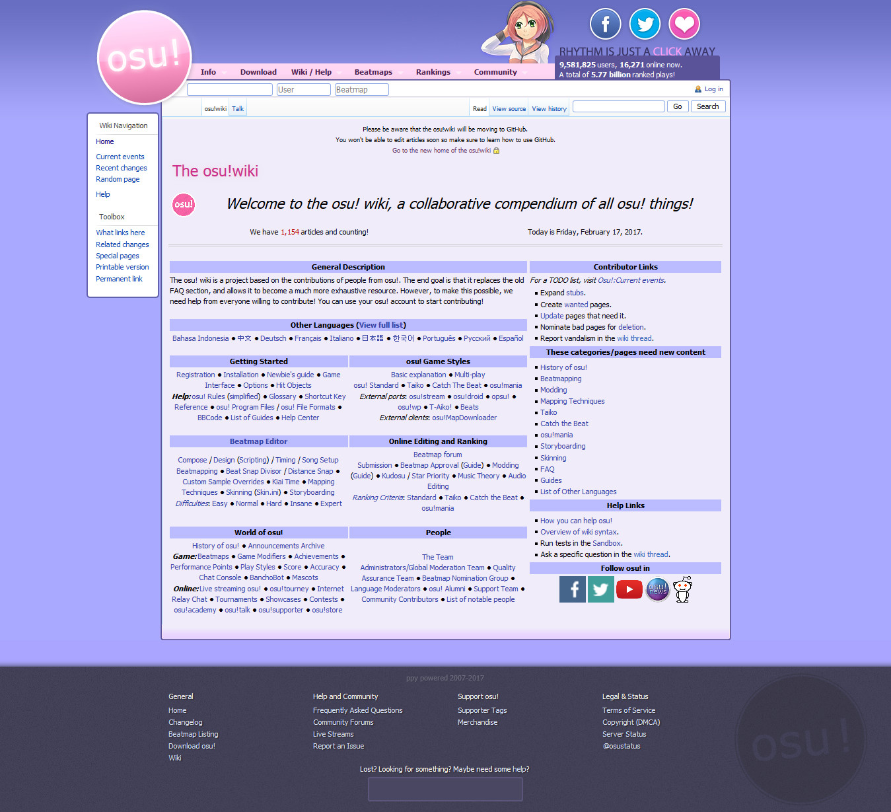

# Historia de la osu! wiki

## MediaWiki (2011 - 2017)

| Fecha, Hora | Descripción |
| :-- | :-- |
| 5/12/2011 | Primera edición de la osu! wiki por ::{ flag=AU }:: [Ephemeral](https://osu.ppy.sh/users/102335). |
| 16/12/2011 | [La osu! wiki ya está abierta al público](https://osu.ppy.sh/community/forums/topics/68525). |
| 11/2012 | La osu! wiki ahora tiene 3 administradores (se suman ::{ flag=PL }:: [[Dellirium]](https://osu.ppy.sh/users/519032) y ::{ flag=MX }:: [Repflez](https://osu.ppy.sh/users/201392)). Antes, ::{ flag=AU }:: [peppy](https://osu.ppy.sh/users/2) era el único administrador. |
| 27/1/2013 (06:12 UTC) | ::{ flag=AU }:: [peppy](https://osu.ppy.sh/users/2) integró la osu! wiki con el diseño del sitio web oficial. [Enlace a la publicación de peppy](https://osu.ppy.sh/community/forums/posts/2082803). |
| 2014 | La osu! wiki se convierte oficialmente en un centro de información, reemplazando las versiones web de [osu! team](/wiki/People/osu!_team) y [Reglas](/wiki/Rules). También, ahora la osu! wiki tiene 5 administradores (se suman ::{ flag=DE }:: [Loctav](https://osu.ppy.sh/users/71366) y ::{ flag=NZ }:: [deadbeat](https://osu.ppy.sh/users/128370)). |
| 2015 | La osu! wiki fue traducida a otros idiomas. ::{ flag=FR }:: [Shiro](https://osu.ppy.sh/users/113005) reemplazó a ::{ flag=PL }:: [[Dellirium]](https://osu.ppy.sh/users/519032) como uno de los administradores de la osu! wiki. |
| 22/2/2016 | La osu! wiki ahora tiene 8 administradores (se suman ::{ flag=PL }:: [Ukami](https://osu.ppy.sh/users/820865) y ::{ flag=PL }:: [Galkan](https://osu.ppy.sh/users/169570)). |
| 1/4/2016 | Se unió otro administrador a la osu! wiki (::{ flag=PH }:: [Nathanael](https://osu.ppy.sh/users/2295078)). |
| 30/8/2016 | La osu! wiki que se ejecuta en MediaWiki está obsoleta en favor de la versión del repositorio de GitHub. La osu! wiki actual permanecerá hasta que la versión de GitHub esté lista para implementarse con todas las páginas e imágenes portadas. |
| 6/2017 | La osu! wiki en MediaWiki es declarada como obsoleta. Su enlace ahora envia a la nueva interfaz de osu!web usando los recursos de la osu! wiki creados en el repositorio de GitHub. [Una copia de seguridad temporal de esta página sin funciones de MediaWiki puede ser vista aquí](https://web.archive.org/web/20171115173938/https://osu.ppy.sh/old-wiki/Main_Page). |

## Repositorio de GitHub (2016 - presente)

| Fecha | Descripción |
| :-- | :-- |
| 26/8/2016 | ::{ flag=AU }:: [peppy](https://osu.ppy.sh/users/2) [creó el repositorio osu-wiki](https://github.com/ppy/osu-wiki/tree/3433cbeeda9303a470647cad1c338d43f4272a2e). ::{ flag=US }:: [craftu](https://osu.ppy.sh/users/16468119) y ::{ flag=US }:: [XYLOO](https://osu.ppy.sh/users/27809907) portaron el contenido de MediaWiki al repositorio en una semana. |
| 9/2016 | La mayoría de las páginas excepto las imágenes se movieron al repositorio, con errores de sintaxis sin resolver, debido a las diferencias entre Markdown y MediaWiki. |
| 1/2017 | Soporte de la osu! wiki en osu!web hecho por ::{ flag=JP }:: [nanaya](https://osu.ppy.sh/users/2387883). |
| 5/1/2017 | El proyecto osu! wiki es sugerido por ::{ flag=AU }:: [Ephemeral](https://osu.ppy.sh/users/102335). |
| 26/1/2017 | La osu! wiki es mencionada en el blog de ::{ flag=AU }:: [peppy](https://osu.ppy.sh/users/2). |
| 22/5/2017 | El [archivo de osu!news ahora es almacenado en la osu! wiki](https://github.com/ppy/osu-wiki/pull/252) (solo en formato de texto). |
| 30/5/2017 | La redirección de página [es finalmente implementada](https://github.com/ppy/osu-web/pull/1144) en la osu! wiki. |
| 6/2017 | ::{ flag=PL }:: [TPGPL](https://osu.ppy.sh/users/3944705) es promovido con acceso de escritura en el repositorio osu-wiki. Un servicio de búsqueda en osu!web es añadido para la osu! wiki |
| 7/2/2018 | El etiquetado de artículos [se ha implementado](https://github.com/ppy/osu-web/pull/2331) para mejorar los resultados de búsqueda de los artículos de la wiki. |
| 2018–2021 | *No documentado* |
| 12/5/2021 | [Primera implementación](https://github.com/ppy/osu-web/pull/7546) de las cajas de información que podrían mejorar la funcionalidad en los artículos. |
| 1/6/2021 | Se ha añadido una [implementación básica](https://github.com/ppy/osu/pull/12950) de la osu! wiki en [osu!(lazer)](/wiki/Client/Release_stream/Lazer) (solo en inglés). |
| 8/8/2021 | [Se implementó](https://github.com/ppy/osu-web/pull/8126) la función de galerías. Ahora, las imágenes de un artículo se pueden ver a la vez en una galería. |
| 12/8/2021 | [Se añadió](https://github.com/ppy/osu-web/pull/8125) el soporte de notas al pie. Esto permite agregar enlaces a notas y referencias para colocarlas en una sección específica al final de cada artículo. |
