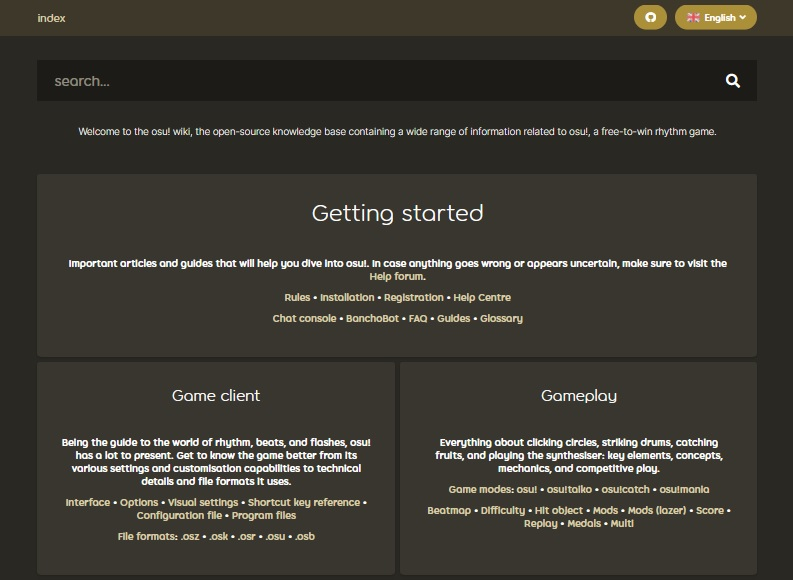

# Sejarah osu! wiki

*Lihat juga: [Pengelola osu! wiki](/wiki/People/osu!_wiki_maintainers)*

Artikel ini merincikan berbagai peristiwa penting dalam **sejarah osu! wiki** mulai dari era MediaWiki hingga saat ini.

<!--The documentation for the years 2018 to 2021 is missing.-->

## MediaWiki (2011 - 2017)

### 2011

#### Desember

- **2011-12-05:** Landasan awal osu! wiki mulai dirintis, dengan ::{ flag=AU }:: [Ephemeral](https://osu.ppy.sh/users/102335) membuat beberapa penyuntingan awal.
- **2011-12-06:** osu! wiki [resmi dirilis secara publik](https://osu.ppy.sh/community/forums/topics/68525).

### 2012

#### November

- **2012-11-29:** ::{ flag=MX }:: [Repflez](https://osu.ppy.sh/users/201392) dan ::{ flag=RU }:: [Dellirium](https://osu.ppy.sh/users/519032) [ditambahkan](https://osu.ppy.sh/community/forums/posts/1944044) ke tim admin osu! wiki di Mediawiki.

### 2013

#### January

- **2013-01-27:** ::{ flag=AU }:: [peppy](https://osu.ppy.sh/users/2) memadankan tampilan osu! wiki dengan tampilan [situs utama osu!](https://osu.ppy.sh/community/forums/posts/2082803).

### 2014

#### Desember

- **Tanggal yang tidak diketahui:** osu! wiki menjadi pusat informasi osu! yang hakiki setelah berbagai halaman inti seperti [tim osu!](/wiki/People/osu!_team) dan [Peraturan](/wiki/Rules) dipindahkan ke osu! wiki.
- **Tanggal yang tidak diketahui:** ::{ flag=NZ }:: [deadbeat](https://osu.ppy.sh/users/128370) dan ::{ flag=DE }:: [Loctav](https://osu.ppy.sh/users/71366) ditambahkan ke tim admin osu! wiki di MediaWiki.

### 2015

#### Desember

- **Tanggal yang tidak diketahui:** osu! wiki menerima banyak kontributor baru yang membantu menerjemahkan berbagai artikel ke dalam bahasa mereka masing-masing.
- **Tanggal yang tidak diketahui:** Posisi ::{ flag=RU }:: [Dellirium](https://osu.ppy.sh/users/519032) sebagai admin digantikan oleh ::{ flag=FR }:: [Shiro](https://osu.ppy.sh/users/113005).

### 2016

#### Februari

- **2016-02-22:** ::{ flag=PL }:: [Ukami](https://osu.ppy.sh/users/820865) dan ::{ flag=PL }:: [Galkan](https://osu.ppy.sh/users/169570) ditambahkan ke tim admin osu! wiki di MediaWiki.

#### April

- **2016-04-01:** ::{ flag=PH }:: [Nathanael](https://osu.ppy.sh/users/2295078) ditambahkan ke tim admin osu! wiki di MediaWiki.

#### Agustus

- **2016-08-30:** osu! wiki yang berjalan di MediaWiki mulai dipensiunkan dan digantikan oleh osu! wiki versi repositori GitHub, walaupun wiki ini masih dapat diakses hingga seluruh halaman dan gambar selesai dipindahkan dan wiki versi GitHub ini siap untuk diluncurkan.

### 2017

#### Juni

- **2017-06-26:** osu! wiki yang berjalan di MediaWiki [secara resmi dipensiunkan](https://discord.com/channels/188630481301012481/218677502141399041/328851556453711872). Tautan yang masih mengarah ke wiki versi lawas kini dialihkan ulang ke wiki baru yang berbasis di GitHub. [Cuplikan wiki versi lawas ini (tanpa fungsionalitas MediaWiki) dapat ditemukan pada halaman ini](https://web.archive.org/web/20171115173938/https://osu.ppy.sh/old-wiki/Main_Page).

## Repositori GitHub (2016 - sekarang)

### 2016

#### Agustus

- **2016-08-26:** ::{ flag=AU }:: [peppy](https://osu.ppy.sh/users/2) [membuat repositori osu-wiki](https://github.com/ppy/osu-wiki/tree/3433cbeeda9303a470647cad1c338d43f4272a2e).

#### September

- **2016-09-02:** ::{ flag=US }:: [craftu](https://osu.ppy.sh/users/16468119) and ::{ flag=US }:: [XYLOO](https://osu.ppy.sh/users/27809907) selesai memindahkan sebagian besar konten osu! wiki lawas dari MediaWiki ke repositori GitHub, menyisakan hanya gambar dan kesalahan sintaks tertentu yang tidak dapat dipindahkan karena perbedaan bahasa antara [Wikitext](https://en.wikipedia.org/wiki/Help:Wikitext) yang digunakan oleh MediaWiki dan [Markdown](https://en.wikipedia.org/wiki/Markdown) yang digunakan oleh GitHub.

### 2017

#### Januari

- **2017-01-26:**::{ flag=AU }:: [Ephemeral](https://osu.ppy.sh/users/102335) berbicara seputar rencana integrasi antara repositori Github dengan situs web osu! itu sendiri pada [postingan blog pengembangan](https://blog.ppy.sh/post/156390386433/2017-01-dev-meeting).
- **Tanggal yang tidak diketahui:** ::{ flag=JP }:: [nanaya](https://osu.ppy.sh/users/2387883) merampungkan dukungan backend untuk osu! wiki yang baru, yang memungkinkan wiki ini untuk dapat sepenuhnya terintegrasi dengan situs web osu!.

#### Mei

- **2017-05-22:** [Arsip berita osu!](https://osunews.tumblr.com/), yang sebelumnya di-host di Tumblr, dipindahkan ke osu! wiki.
- **2017-05-30:** Fitur [pengalihan halaman](https://github.com/ppy/osu-web/pull/1144) ditambahkan ke osu! wiki.

#### Juni

- **Tanggal yang tidak diketahui:** ::{ flag=PL }:: [TPGPL](https://osu.ppy.sh/users/3944705) diberikan izin tulis khusus ke repositori osu! wiki.
- **Tanggal yang tidak diketahui:** [Fungsi pencarian](https://github.com/ppy/osu-web/pull/2331) ditambahkan ke osu! wiki.

### 2018

#### Februari

- **2018-02-07:** Fitur [tag artikel](https://github.com/ppy/osu-web/pull/2331) ditambahkan ke osu! wiki untuk memungkinkan hasil pencarian yang lebih akurat.

### 2021

#### Mei

- **2021-05-12:** Fitur [kotak informasi](https://github.com/ppy/osu-web/pull/7546) (*infobox*) ditambahkan ke osu! wiki.

#### Juni

- **2021-06-01:** ::{ flag=ID }:: [GPR](https://osu.ppy.sh/users/10721349) mengimplementasikan [overlay osu! wiki](https://github.com/ppy/osu/pull/12950) di [osu!(lazer)](/wiki/Client/Release_stream/Lazer), yang memungkinkan halaman wiki tertentu untuk dapat diakses secara langsung dari dalam klien osu!(lazer).

#### Agustus

- **2021-08-08:** [Dukungan galeri](https://github.com/ppy/osu-web/pull/8126) ditambahkan ke osu! wiki.
- **2021-08-12:** Fitur [catatan kaki](https://github.com/ppy/osu-web/pull/8125) ditambahkan ke osu! wiki.
