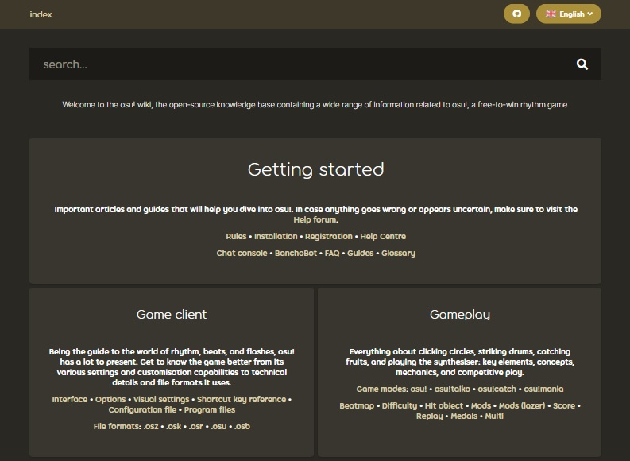

# Historia wiki osu!

::: alert-note
**Zobacz także:** [Zarządcy osu! wiki](/wiki/People/osu!_wiki_maintainers)
:::

W tym artykule przedstawiono ważne wydarzenia w **historii osu! wiki**, od czasów MediaWiki do dzisiejszych.

## MediaWiki (2011 - 2017)

### 2011

#### Grudzień

- **05.12.2011:** Stworzono podstawy osu! wiki. Pierwsze zmiany zostały wprowadzone przez użytkownika ::{ flag=AU }:: [Ephemeral](https://osu.ppy.sh/users/102335).
- **06.12.2011:** osu! wiki [zostało upublicznione](https://osu.ppy.sh/community/forums/topics/68525).

### 2012

#### Listopad

- **29.11.2012** Użytkownicy ::{ flag=MX }:: [Repflez](https://osu.ppy.sh/users/201392) oraz ::{ flag=RU }:: [Dellirium](https://osu.ppy.sh/users/519032) [zostali dodani](https://osu.ppy.sh/community/forums/posts/1944044) do grona administratorów osu! wiki na MediaWiki.

### 2013

#### Styczeń

- **27.01.2013:** ::{ flag=AU }:: [peppy](https://osu.ppy.sh/users/2) ujednolicił wygląd osu! wiki z [wyglądem strony osu!](https://osu.ppy.sh/community/forums/posts/2082803).

### 2014

#### Grudzień

- **Nieznana data:** osu! wiki stało się oficjalnym centrum wiedzy o osu! po przeniesieniu do niej stron takich jak [Zespół](/wiki/People/osu!_team) czy [Zasady](/wiki/Rules).
- **Nieznana data:** Użytkownicy ::{ flag=NZ }:: [deadbeat](https://osu.ppy.sh/users/128370) oraz ::{ flag=DE }:: [Loctav](https://osu.ppy.sh/users/71366) zostali dodani do grona administratorów osu! wiki na MediaWiki.

### 2015

#### Grudzień

- **Nieznana data:** osu! wiki zyskało wielu nowych współautorów, którzy wykonali tłumaczenia artykułów na swoje ojczyste języki.
- **Nieznana data:** Użytkownik ::{ flag=RU }:: [Dellirium](https://osu.ppy.sh/users/519032) zostaje zastąpiony na swoim stanowisku administratora przez ::{ flag=FR }:: [Shiro](https://osu.ppy.sh/users/113005).

### 2016

#### Luty

- **22.02.2016:** Użytkownicy ::{ flag=PL }:: [Ukami](https://osu.ppy.sh/users/820865) oraz ::{ flag=PL }:: [Galkan](https://osu.ppy.sh/users/169570) zostali dodani do grona administratorów osu! wiki na MediaWiki.

#### Kwiecień

- **01.04.2016:** Użytkownik ::{ flag=PH }:: [Nathanael](https://osu.ppy.sh/users/2295078) został dodany do grona administratorów osu! wiki na MediaWiki.

#### Sierpień

- **30.08.2016:** osu! wiki bazujące na MediaWiki zaczęto wycofywać na rzecz wersji opartej o repozytorium GitHub, jednak pozostało dostępne do czasu pełnego zakończenia migracji wszystkich stron i obrazów.

### 2017

#### Czerwiec

- **26.06.2017:** osu! wiki bazujące na MediaWiki zostało [oficjalnie zamknięte](https://discord.com/channels/188630481301012481/218677502141399041/328851556453711872). Wszystkie linki przenoszące do starej wersji wiki od tego momentu przekierowują do nowej wiki opartej o repozytorium GitHub. [Tutaj można znaleźć archiwum starej wersji wiki pozbawionej różnych funkcji MediaWiki](https://web.archive.org/web/20171115173938/https://osu.ppy.sh/old-wiki/Main_Page).

## Repozytorium GitHub (2016 - dziś)

### 2016

#### Sierpień

- **26.08.2016:** ::{ flag=AU }:: [peppy](https://osu.ppy.sh/users/2) [utworzył repozytorium osu-wiki](https://github.com/ppy/osu-wiki/tree/3433cbeeda9303a470647cad1c338d43f4272a2e).

#### Wrzesień

- **02.09.2016:** Użytkownicy ::{ flag=US }:: [craftu](https://osu.ppy.sh/users/16468119) oraz ::{ flag=US }:: [XYLOO](https://osu.ppy.sh/users/27809907) ukończyli migrację większości zawartości starej wersji osu! wiki do repozytorium GitHub. Pozostały jedynie obrazy oraz błędy składniowe wynikające z różnic pomiędzy [wikikodem](https://pl.wikipedia.org/wiki/Pomoc:Formatowanie_tekstu) MediaWiki a używanym przez GitHub językiem [Markdown](https://pl.wikipedia.org/wiki/Markdown).

### 2017

#### Styczeń

- **26.01.2017:** Użytkownik ::{ flag=AU }:: [Ephemeral](https://osu.ppy.sh/users/102335) we [wpisie na blogu poświęconymu rozwojowi gry](https://blog.ppy.sh/post/156390386433/2017-01-dev-meeting) wspomniał o nadchodzącej integracji repozytorium GitHub ze stroną internetową osu!.
- **Nieznana data:**  Użytkownik ::{ flag=JP }:: [nanaya](https://osu.ppy.sh/users/2387883) ukończył pracę nad backendem nowej wersji osu! wiki, umożliwiając jej pełną integrację ze stroną internetową osu!.

#### Maj

- **22.05.2017:** [Archiwum aktualności](https://osunews.tumblr.com/), hostowane wcześniej na Tumblr, zostało przeniesione do osu! wiki.
- **30.05.2017:** Do wiki dodano [funkcję przekierowania](https://github.com/ppy/osu-web/pull/1144).

#### Czerwiec

- **Nieznana data:** Użytkownik ::{ flag=PL }:: [TPGPL](https://osu.ppy.sh/users/3944705) otrzymał specjalne prawa dostępu do repozytorium osu! wiki.
- **19.06.2017:** Do wiki dodano [funkcję wyszukiwania](https://github.com/ppy/osu-web/pull/1259).

### 2018

#### Luty

- **07.02.2018:** Zaimplementowano [tagi artykułów](https://github.com/ppy/osu-web/pull/2331) w celu lepszego wyszukiwania.

### 2021

#### Maj

- **12.05.2021:** Do wiki dodano [bloki informacyjne](https://github.com/ppy/osu-web/pull/7546).

#### Czerwiec

- **01.06.2021:** Użytkownik ::{ flag=ID }:: [GPR](https://osu.ppy.sh/users/10721349) zaimplementował [nakładkę osu! wiki](https://github.com/ppy/osu/pull/12950) w [osu!(lazer)](/wiki/Client/Release_stream/Lazer), pozwalając na dostęp do niektórych stron wiki bezpośrednio z klienta osu!(lazer).

#### Sierpień

- **08.08.2021:** Do wiki dodano wyświetlanie [galerii obrazów](https://github.com/ppy/osu-web/pull/8126).
- **12.08.2021:** Do wiki dodano [przypisy](https://github.com/ppy/osu-web/pull/8125).

### 2026

#### Lipiec

- **06.07.2026:** [Uwidoczniono adnotacje](https://github.com/ppy/osu-web/pull/13079), stylizując je symbolem oraz kolorową pionową linię po lewej stronie.
- **30.07.2026:** Dodano [wyświetlanie kart użytkowników](https://github.com/ppy/osu-web/pull/13125) po najechaniu na link do ich profilu, działające podobnie do tagu [BBCode](/wiki/BBCode) `[profile]`.
