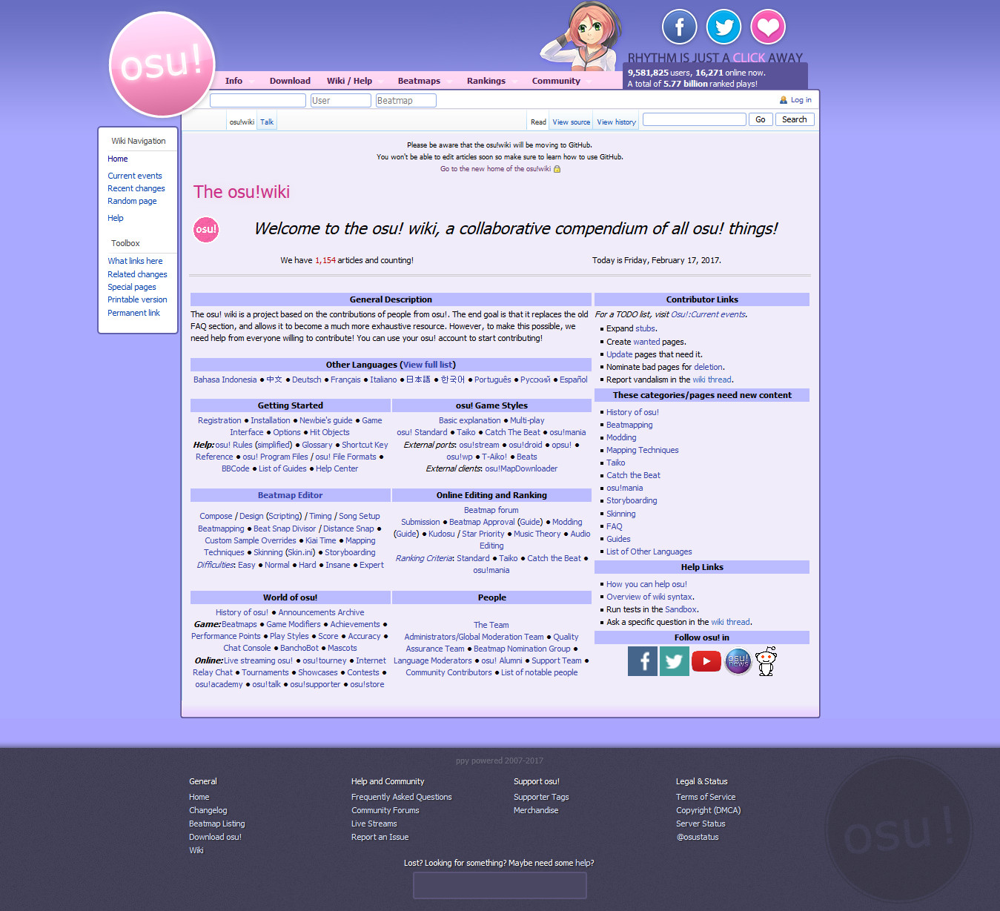
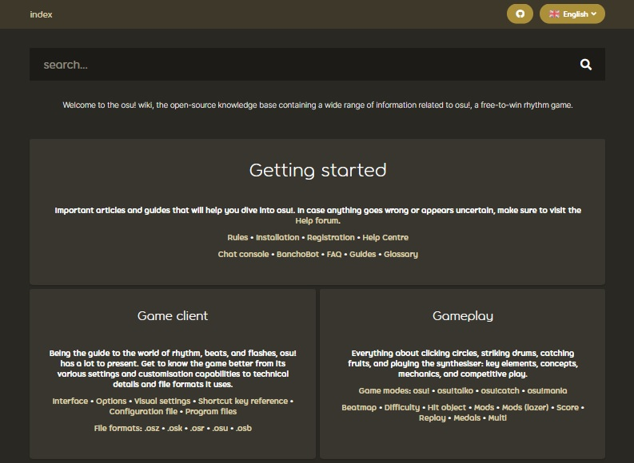

# История osu! wiki

::: alert-note
**См. также:** [Администраторы osu! wiki](/wiki/People/osu!_wiki_maintainers)
:::

В этой статье описаны основные события **истории osu! wiki** от эпохи MediaWiki до настоящего времени.

<!--Документация за период с 2018 по 2021 год отсутствует.-->

## MediaWiki (2011 — 2017)

### 2011

#### Декабрь

- **2011-12-05:** Были заложены основы osu! wiki, а ::{ flag=AU }:: [Ephemeral](https://osu.ppy.sh/users/102335) внёс первые правки.
- **2011-12-06:** osu! wiki [стала доступна широкой публике](https://osu.ppy.sh/community/forums/topics/68525).

### 2012

#### Ноябрь

- **2012-11-29:** ::{ flag=MX }:: [Repflez](https://osu.ppy.sh/users/201392) и ::{ flag=RU }:: [Dellirium](https://osu.ppy.sh/users/519032) были [назначены](https://osu.ppy.sh/community/forums/posts/1944044) администраторами MediaWiki osu! wiki.

### 2013

#### Январь

- **2013-01-27:** ::{ flag=AU }:: [peppy](https://osu.ppy.sh/users/2) [интегрировал](https://osu.ppy.sh/community/forums/posts/2082803) osu! wiki в дизайн [основного сайта](https://osu.ppy.sh/).

### 2014

#### Декабрь

- **Неизвестная дата:** osu! wiki стала полноценным информационным центром osu! после переноса в неё таких ключевых страниц, как [команда osu!](/wiki/People/osu!_team) и [Правила](/wiki/Rules).
- **Неизвестная дата:** ::{ flag=NZ }:: [deadbeat](https://osu.ppy.sh/users/128370) и ::{ flag=DE }:: [Loctav](https://osu.ppy.sh/users/71366) были назначены администраторами MediaWiki osu! wiki.

### 2015

#### Декабрь

- **Неизвестная дата:** В osu! wiki пришло много новых участников, занимавшихся переводом статей на свои родные языки.
- **Неизвестная дата:** ::{ flag=RU }:: [Dellirium](https://osu.ppy.sh/users/519032) перестал быть администратором, а его место занял ::{ flag=FR }:: [Shiro](https://osu.ppy.sh/users/113005).

### 2016

#### Февраль

- **2016-02-22:** ::{ flag=PL }:: [Ukami](https://osu.ppy.sh/users/820865) и ::{ flag=PL }:: [Galkan](https://osu.ppy.sh/users/169570) были назначены администраторами MediaWiki osu! wiki.

#### Апрель

- **2016-04-01:** ::{ flag=PH }:: [Nathanael](https://osu.ppy.sh/users/2295078) был назначен администратором MediaWiki osu! wiki.

#### Август

- **2016-08-30:** osu! wiki на базе MediaWiki начала выводиться из эксплуатации в пользу версии в репозитории GitHub, хотя оставалась доступной до тех пор, пока версия на GitHub не была готова к развёртыванию со всеми перенесёнными страницами и изображениями.

### 2017

#### Июнь

- **2017-06-26:** osu! wiki на базе MediaWiki была [официально выведена из эксплуатации](https://discord.com/channels/188630481301012481/218677502141399041/328851556453711872). Ссылки на старую вики теперь перенаправляли на новую вики на базе GitHub. [Снимок старой вики без функций MediaWiki можно найти здесь](https://web.archive.org/web/20171115173938/https://osu.ppy.sh/old-wiki/Main_Page).

## Репозиторий GitHub (2016 — настоящее время)

### 2016

#### Август

- **2016-08-26:** ::{ flag=AU }:: [peppy](https://osu.ppy.sh/users/2) [создал репозиторий osu-wiki](https://github.com/ppy/osu-wiki/tree/3433cbeeda9303a470647cad1c338d43f4272a2e).

#### Сентябрь

- **2016-09-02:** ::{ flag=US }:: [craftu](https://osu.ppy.sh/users/16468119) и ::{ flag=US }:: [XYLOO](https://osu.ppy.sh/users/27809907) завершили перенос большей части содержимого старой osu! wiki из MediaWiki в репозиторий, оставив только изображения и некоторые синтаксические ошибки, вызванные различиями между [Wikitext](https://en.wikipedia.org/wiki/Help:Wikitext) в MediaWiki и [Markdown](https://en.wikipedia.org/wiki/Markdown) на GitHub.

### 2017

#### Январь

- **2017-01-26:** ::{ flag=AU }:: [Ephemeral](https://osu.ppy.sh/users/102335) рассказал о предстоящей интеграции репозитория GitHub с самим сайтом osu! в [публикации о встрече разработчиков](https://blog.ppy.sh/post/156390386433/2017-01-dev-meeting).
- **Неизвестная дата:** ::{ flag=JP }:: [nanaya](https://osu.ppy.sh/users/2387883) завершил работу над серверной частью новой osu! wiki, благодаря чему вики удалось полностью интегрировать с сайтом osu!.

#### Май

- **2017-05-22:** [Архив osu!news](https://osunews.tumblr.com/), ранее размещавшийся на Tumblr, был перенесён в osu! wiki.
- **2017-05-30:** В вики были добавлены [перенаправления страниц](https://github.com/ppy/osu-web/pull/1144).

#### Июнь

- **Неизвестная дата:** ::{ flag=PL }:: [TPGPL](https://osu.ppy.sh/users/3944705) получил особые права на запись в репозитории osu! wiki.
- **2017-06-19:** В вики была добавлена [функция поиска](https://github.com/ppy/osu-web/pull/1259).

### 2018

#### Февраль

- **2018-02-07:** В вики были добавлены [теги статей](https://github.com/ppy/osu-web/pull/2331), позволившие улучшить результаты поиска.

### 2021

#### Май

- **2021-05-12:** В вики были добавлены [инфобоксы](https://github.com/ppy/osu-web/pull/7546).

#### Июнь

- **2021-06-01:** ::{ flag=ID }:: [GPR](https://osu.ppy.sh/users/10721349) реализовал [оверлей osu! wiki](https://github.com/ppy/osu/pull/12950) в [osu!(lazer)](/wiki/Client/Release_stream/Lazer), позволив открывать некоторые страницы вики непосредственно из клиента osu!(lazer).

#### Август

- **2021-08-08:** В вики была добавлена [поддержка галерей](https://github.com/ppy/osu-web/pull/8126).
- **2021-08-12:** В вики были добавлены [сноски](https://github.com/ppy/osu-web/pull/8125).

### 2026

#### Июль

- **2026-07-06:** Чтобы сделать вводные пояснения более заметными, были добавлены [стилизованные выноски](https://github.com/ppy/osu-web/pull/13079), которые отображаются с символом и цветной вертикальной линией слева.
- **2026-07-30:** Был добавлен [компонент карточки пользователя](https://github.com/ppy/osu-web/pull/13125), который при наведении на ссылку профиля отображает карточку пользователя с различной статистикой, аналогично тегу `[profile]` [BBCode](/wiki/BBCode).
