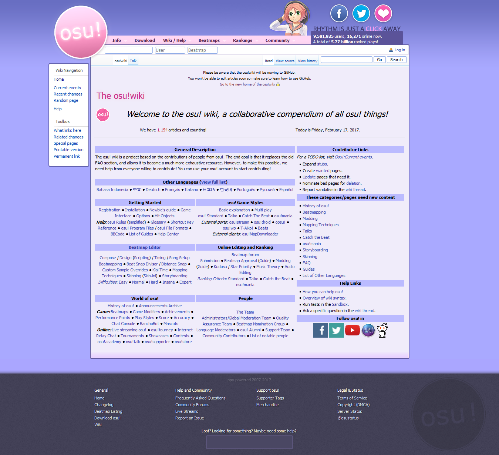

# osu!wiki history

## MediaWiki (2011 - 2017)

Date, Time | Description
---|---
05 December 2011, 08:13 am | First edit of osu!wiki by Ephemeral.
06 December 2011 | [osu!wiki is now live!](https://osu.ppy.sh/forum/t/68525).
November 2012 | osu!wiki now has 3 admins (Dellirium, Repflez). Previously, only peppy was the admin.
27 January 2013, 6:12 am | peppy integrated the osu!wiki with the main site design. [Link to peppy post](http://osu.ppy.sh/forum/t/68479/start=124).
2014 | osu!wiki becomes an actual information centre of osu!, replacing most of the web copies such as [The Team](/wiki/People/The_Team) and [Rules](/wiki/Rules). Also, osu!wiki now has 5 admins (Loctav, deadbeat).
2015 | osu!wiki received major translation updates from other languages. Dellirium has been replaced by Shiro as one of the admins of osu!wiki.
22 February 2016 | osu!wiki now has 8 admins (Ukami and Galkan).
01 April 2016 | osu!wiki now has 9 admins (Nathanael).
30 August 2016 | osu!wiki running on MediaWiki is being deprecated for GitHub repository version. The current osu!wiki will stay until the GitHub version is ready to be deployed with all the pages and images ported.
June 2017 | osu!wiki running on MediaWiki is officially deprecated. The link now points to the new osu-web interface using the osu!wiki resources made in the GitHub repository. [A temporary backup of the osu!wiki without the MediaWiki functionality can be found here.](https://osu.ppy.sh/old-wiki/Main_Page)

## GitHub repository (2017 - current)

Date | Description
---|---
26 August 2016 | [peppy created osu-wiki repository](https://github.com/ppy/osu-wiki/tree/3433cbeeda9303a470647cad1c338d43f4272a2e "osu-wiki repository"). craftu and Xyloo ported the MediaWiki content to the repository in a week.
September 2016| Most of the pages except the images are moved to the repository, with unsolved syntax-translation errors stemming from language difference between Markdown and MediaWiki. Starting team consists of Repflez (leader), TPGPL (editor), MegaApplePi (editor), sr229 (editor), cl8n (editor), miterosan (editor), marcostudios (editor), Trehorna123 (editor), Xyloo (port), craftu (port), and peppy (owner).
January 2017 | osu!web support of osu!wiki done by nanaya.
05 January 2017 | [osu!wiki project suggested by Ephemeralis](https://github.com/ppy/osu-wiki/projects/1 "osu!wiki 2017 project by Ephemeralis").
26 January 2017 | osu!wiki got mentioned on [ppy blog](http://pppy.tumblr.com/post/156390386433/2017-01-dev-meeting "ppy blog - 2017-01 DEV MEETING").
22 May 2017 | [osu!news archive is now stored on osu!wiki (in text form only)](https://github.com/ppy/osu-wiki/pull/252 "Initial commit of all tumblr news posts by peppy").
30 May 2017 | [Page redirection is finally implemented in osu!wiki](https://github.com/ppy/osu-web/pull/1144 "osu!wiki - redirects by MegaApplePi")
June 2017 | TPGPL is promoted with write-access for the osu!wiki repository. Search service on osu!web for osu!wiki is implemented.