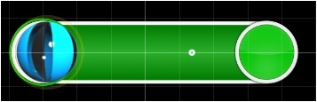

# Hit Objects

A hit object is the core gameplay element in osu!. There are three types of hit objects:

-   Hit Circle
-   Slider
-   Spinner

Hit circles and sliders are encountered frequently, while spinners typically only appear occasionally. Everything you interact with during the course of a beatmap is a hit object.

## Hit Circle

Hit circles, or "hit markers" in the DS games, are coloured circles with a number on them that shows its place in a combo. These are outlined with another circle (the approach circle) shrinking around it. Once the approach circle outline overlaps the hit circle's border, the player should click on/tap the hit circle, earning a set number of points (50, 100, or 300) based on how accurate they were (e.g. if they clicked too early, their points would be reduced). Tapping regular hit circles gives a very small boost to the life bar, and at the end of a combo a bigger boost will be awarded if the player did well in that combo.

## Slider

A slider consists of two hit circles with a track between them that can be either straight, angled (e.g. a sharp 45 degree turn), or bezier curved. An approach circle is around the beginning hit circle of the slider. Once the approach circle reaches its border, like with hit circles, the player must click on/tap the beginning of the slider and then, keeping the button pressed, follow a moving ball (called a slider ball) along the track until the other hit circle is reached. If there is a reverse arrow graphic at that point, the player follows the slider ball back along the same path and repeats as long as a reverse arrow graphic is visible.

Slider ticks are small circles that appear in regular intervals along a slider's path. The player only fails to completely clear a slider if the cursor is not on the slider ball range (defined by the circle around the ball) and/or the mouse button is not pressed while the slider ball is passing over a tick. Not keeping the cursor on the slider or the button pressed at any other time during a slider's path will not yield any penalty (though it is not advised as it could easily result in a slip-up). Users can adjust the number of ticks on their beatmap's sliders in the Timing section of the editor. More ticks make the combo rise faster (1x more per tick) and thus offer the opportunity for higher scores, but at the same time they provide more chances for the player to fail to clear the slider. Each cleared slider tick is worth 10 points regardless of the combo.

Passing over either an end of the slider of a slider tick will award a minute boost to the life bar; just barely enough to keep it at where it is most of the time. The boost is the same for both the hit circles and the ticks.

Sliders are often mapped to long sounds in the music. They are also used to carry the rhythm, especially when the rhythm would be very complex without a slider or not suitable for a hit circle, and are sometimes used to replace streams of hit circles for the easier difficulty.

### Inserting Sliders into a Beatmap

To create a slider in a [beatmap](/wiki/Beatmaps), first go to the selection menu on the left and select the Slider icon (make sure you're in the point you want your slider to start at). Then, click once to create the slider's start point. To create another slider control point, click somewhere else on the grid and it will create a control point as reference for curves. Double-clicking will make the control point red and the slider will make a linear change of direction at the exact position of the red slider point instead of the normal gradual curve.

When you're done with your slider, simply right click anywhere on the grid.

You are free to move/add/remove slider control points after the slider is finished. You can remove control points by right clicking them after the slider has been selected, or add a control point by holding control and clicking anywhere on the slider lines (double click or control+click a slider point to make a red control point). Adding slider repeats is as simple as clicking your slider on the timeline and holding and dragging the end through the timeline to create/remove slider repeats.

Here's a guide on making sliders: [Making Good Sliders](/wiki/Mapping_Techniques/Making_Good_Sliders)

### Inserting hitsounds into sliders

This may seem obvious at first to experienced players. However, this is one of the most common questions asked. To insert [hitsounds](/wiki/Glossary) into sliders, you first want to ask yourself where you want your hitsound. Is it at the start? At the body? At the end? On a slider repeat? To do so, first click on the slider. Then, click on the part of the slider you want to add the hitsound to (it will be highlighted red). This is more easily done by clicking on it in the [timeline](/wiki/Beatmap_Editor/Timelines). (When using kick sliders, it will be easier if you zoom in the timeline.) Then, just click the hitsound you want to add from the list at the right.

### Slider Speed

A **slider's speed** defines how much time it takes to travel a given distance--or equivalently, how far the slider travels in a given time.

Slider speed is measured in *hundreds of [osupixels](/wiki/Glossary/#osupixel) per beat,* so a slider with a speed of 1.00 will travel 100 osupixels (or, 100 pixels at 640x480 resolution) in one full beat. This means that sliders with a particular speed setting will travel faster when the BPM is higher.

Slider speed can be assigned from the Timing tab from the editor main window. You can also assign a multiplier to this speed value by adding an inheriting [timing section](/wiki/Beatmap_Editor/Timing).

It has recently become popular to use slider speeds which are multiples of 0.16. (for instance, 1.60, 1.76, 1.92, etc.) This has the effect of lining up the endpoint of a straight horizontal/vertical slider with osu!'s grid when the slider begins and ends on a whole or half beat, but has its drawbacks when it comes to slightly curved sliders.

### Slider Tick Rate

Slider tick rate is the rate that slider tick appears in slider. For example, slider tick rate 1 means that slider ticks appears once per beat. However, as the slider ticks does not appear in the two end-points of a slider, some slider does not contain any slider tick. For example, a 1-beat slider does not contain slider tick in slider tick rate 1.

Typical slider tick rate includes 1, 2 and 4. 3 is also available but used rarely. In the past slider tick 4 is widely used but slider tick rate 1 and 2 are used more popularly. Slider tick rate 0.5 (slider tick per 2 beat) is also available in the past but it is unrankable now.

## Spinner

A spinner is a circle that takes up the entire height of the play area. Below the spinner is a number showing the spins per minute (RPM). The player should hold the mouse button down and spin in either a clockwise or anti-clockwise direction. As long as the mouse button is held down, the cursor is locked on the Spinner’s area, so the player need not worry about going outside it. Once the player has spinned for a while (dependent on the difficulty and length of the spinner), the spinner will be cleared, glowing white. Any continuous spins after this will award 1000 point bonuses per approximate spin. Spinning a spinner provides a continuous minor boost to the [Life Bar](/wiki/Glossary) depending on the spinning speed.

**Note:** The superseded default skin (osu!default by peppy) has a different variant of spinner. In this, there is an approach circle to the spinner and on either side of the spinner there are spinner bars. The player must spin to fill them up before the spinner is completed.
