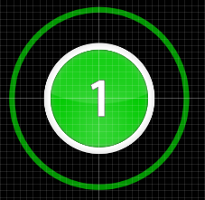
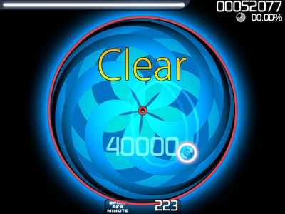

# Objek Ketukan

Sebuah benda hit adalah elemen gameplay inti di osu!. Ada tiga jenis objek hit:

- Hit Circle
- Slider
- Spinner

Hit circles dan sliders yang ditemui secara teratur, sementara Spinner hanya muncul sesekali. Segala sesuatu yang Anda berinteraksi dengan selama Beatmap adalah objek hit.

## Hit Circle

Disebut Hit Marker di [DS games](/wiki/Glossary). Ini adalah lingkaran berwarna dengan nomor (tergantung pada tempatnya dalam [Combo](/wiki/Glossary)) dengan garis lingkaran lain ([Approach Circle](/wiki/Glossary)) menyusut di sekitarnya. Setelah garis Pendekatan Lingkaran tumpang tindih perbatasan Hit Circle, pemain harus [Tap](/wiki/Glossary) Hit Circle, mendapatkan sejumlah poin (50, 100 atau 300) tergantung pada seberapa akurat penyadapan nya, dan mungkin mencetak [Beat!](/wiki/Score) atau [Elite Beat!jika](/wiki/Score) lingkaran adalah akhir combo. Tapping Lingkaran Hit biasa memberikan dorongan yang sangat kecil untuk [Life Bar](/wiki/Glossary), dan dorongan yang baik jika itu adalah lingkaran akhir combo.

## Slider

Sebuah Slider terdiri dari dua Lingkaran Hit dengan jalan yang lurus atau Curve Bezier antara mereka. Sebuah Lingkaran Pendekatan adalah sekitar awal Hit Lingkaran Slider. Setelah Circle Pendekatan mencapai perbatasan, pemain harus tekan awal Slider dan kemudian, menjaga tombol ditekan, ikuti (dengan kursor nya) gambar grafis bergerak \[disebut Slider Ball - Sebuah Grafis (berbentuk bola secara default) yang bergerak sepanjang jalan Slider didasarkan pada BPM dan Slider Velocity yang diberikan oleh mapper\] sepanjang jalan Slider sampai akhir Hit Lingkaran tercapai. Jika ada panah grafis terbalik pada saat itu, pemain mengikuti Slider Bola kembali sepanjang jalan yang sama dan mengulangi selama panah grafis terbalik terlihat.

Slider Tick adalah lingkaran kecil yang muncul dalam interval reguler sepanjang jalan Slider ini. Pemain hanya gagal untuk benar-benar jelas Slider jika kursor tidak di kisaran Slider Ball dan / atau tombol tidak ditekan sedangkan Slider Ball melewati tanda centang. Tidak menjaga kursor pada Slider atau tombol ditekan pada waktu lainnya selama jalan Slider akan benar-benar tidak menghasilkan hukuman apapun. Pengguna dapat menyesuaikan jumlah Tick pada Beatmap mereka Sliders. Tick Lebih membuat Combo naik lebih cepat dan dengan demikian menawarkan kesempatan untuk skor yang lebih tinggi, tetapi pada saat yang sama mereka memberikan lebih banyak kesempatan bagi pemain gagal untuk menghapus Slider. Setiap dibersihkan Slider Tick bernilai 10 poin (terlepas dari Combo).

Slider sering dipetakan ke suara panjang dalam musik. Mereka juga digunakan untuk membawa irama (terutama ketika irama akan sangat kompleks tanpa slider atau tidak cocok untuk menggunakan Hit Circles), dan kadang-kadang digunakan untuk menggantikan aliran Circles Hit untuk kesulitan mudah.

## Spinner

Sebuah Spinner adalah sebuah lingkaran yang mengambil seluruh ketinggian area bermain dan memiliki Spinner Metre di kedua sisi. Sebuah garis melingkar yang besar mirip dengan [Approach Circle](/wiki/Glossary) muncul di perbatasan Spinner dan secara bertahap menyatu pada pusatnya. Pemain harus tahan tombol mouse ke bawah dan berputar baik searah jarum jam atau arah berlawanan jarum jam. Selama tombol mouse ditekan, kursor terkunci di daerah Spinner, sehingga pemain tidak perlu khawatir tentang pergi luar. Spinner dihapus jika semua tingkatan Spinner Meter diisi sebelum Pendekatan Lingkaran yang mencapai pusat. Tergantung pada pengaturan kesulitan masing-masing [beatmap](/wiki/Glossary), nomor yang berbeda dari spin diminta untuk mengisi setiap tingkat Spinner Meter (senilai 100 poin). Jika pemain mengisi Spinner Meter sebelum Lingkaran Pendekatan mencapai pusat Spinner itu, setiap putaran tambahan sebelum waktu habis akan penghargaan pemain dengan 1.000 poin bonus (masing-masing menerima bonus multiplier tergantung pada saat pemain [Combo](/wiki/Combo)). Berputar sebuah Spinner memberikan dorongan kecil terus menerus ke [Life Bar](/wiki/Glossary) tergantung pada kecepatan rotasi.

**Catatan:** Skin default sekarang \[osu! by peppy\] tidak memiliki Circles Pendekatan dan Spinner Meter, Skin default digantikan \[osu!default by peppy\] memilikinya.
