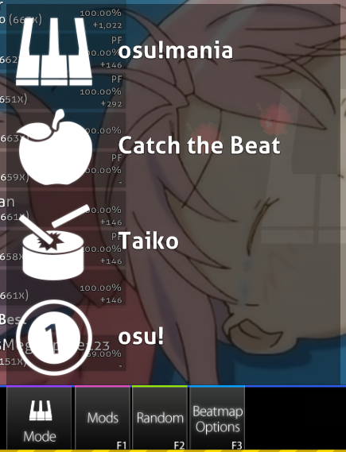
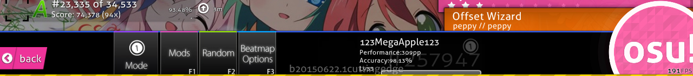
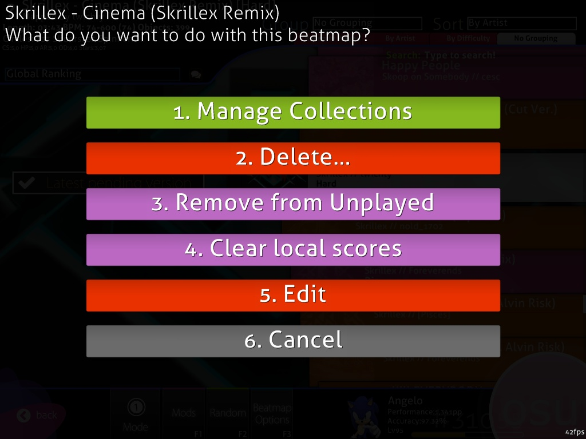
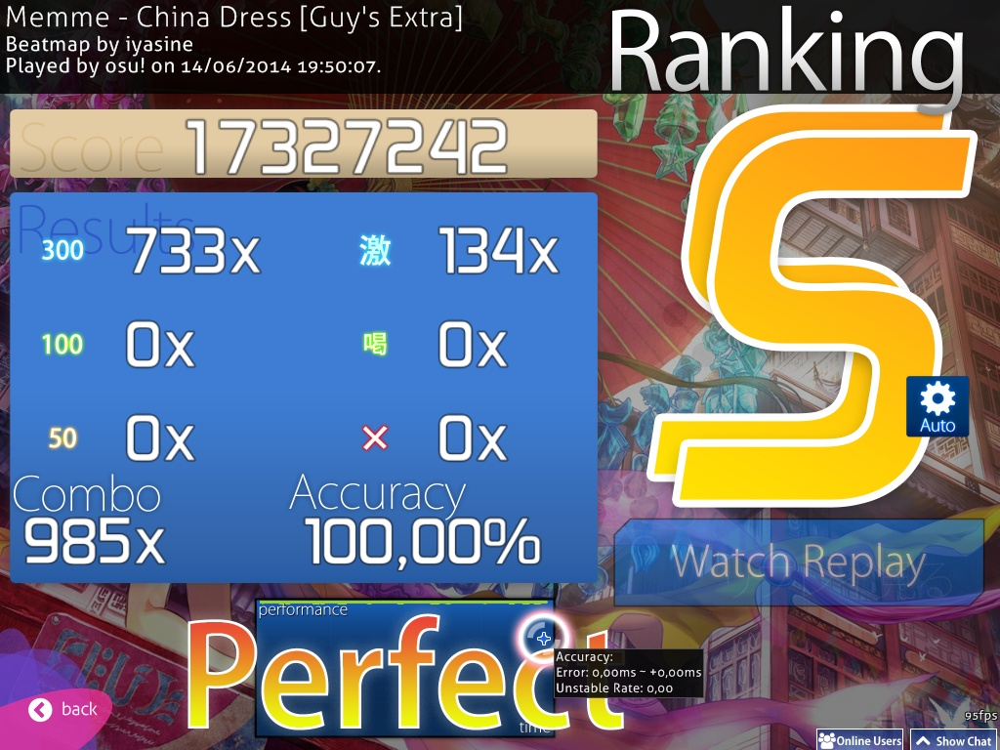
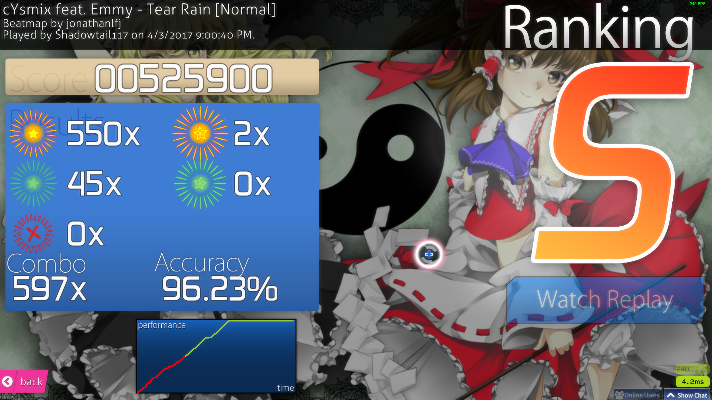
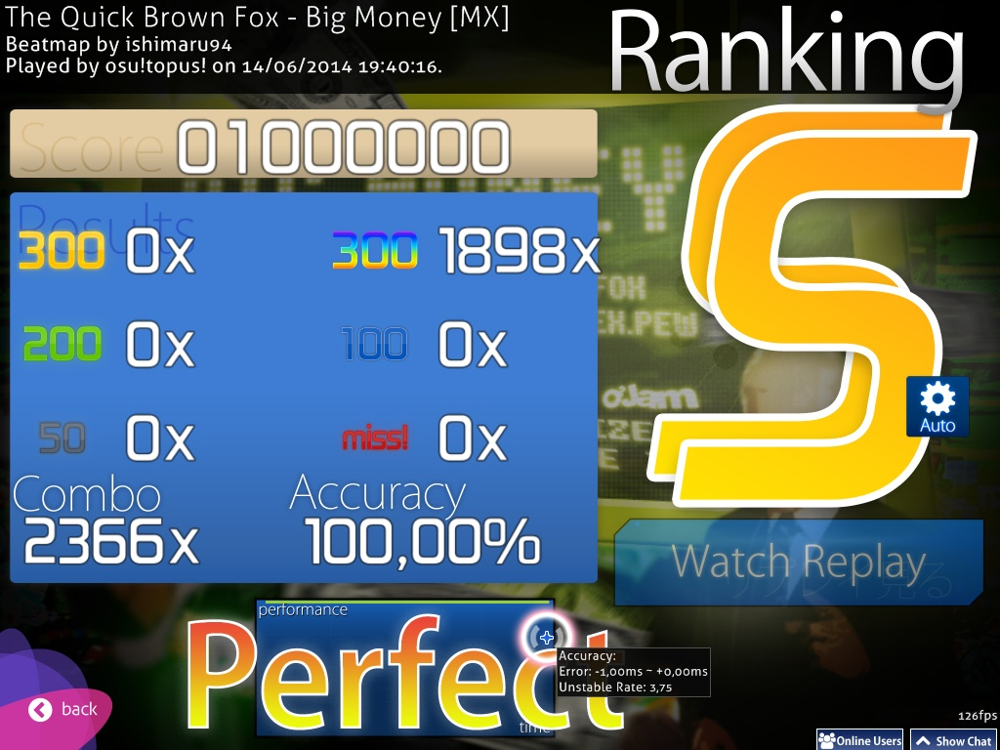
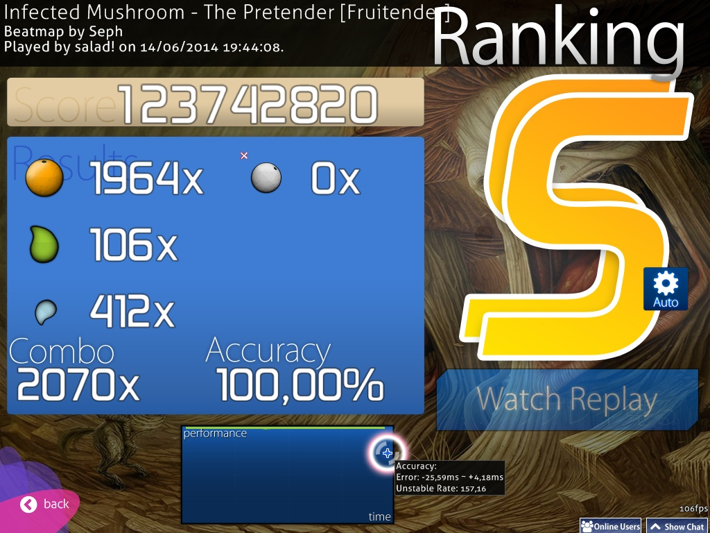
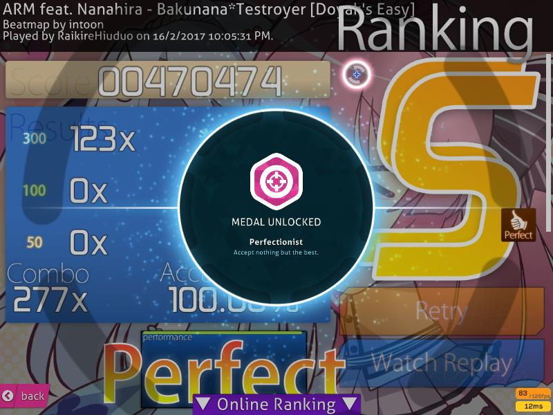

<!-- TODO: formatting kinda sucks. removed `needs_cleanup` tag because at least it gets the job done by explaining the images -->

# Interface

## Main Menu

The [osu!cookie](/wiki/Glossary#cookie) \[1\] pulses according to the [BPM](/wiki/Beatmapping/Beats_per_minute) of any song currently playing on the main menu. In addition, bars will extend out of the osu!cookie in accordance to the song's volume. If no song is playing, it pulses at a slow 60 BPM. The elements of the main menu are as follows:

- \[2\] Click Play (`P`) or the logo to switch to the Solo mode song selection screen.
- \[3\] Click Edit (`E`) to open the Editor mode song selection screen.
- \[4\] Click Options (`O`) to go to the Options screen.
- \[5\] Click Exit (`Esc`) to exit osu!.
- \[6\] A random useful tip is displayed below the menu.
- \[7\] In the lower-left is a link to the osu! website, as well as copyright information.
- \[8\] Connection result to [Bancho](/wiki/Glossary#bancho)! In this picture it is not shown, but the connection result looks like a chain link.
- \[9\] In the bottom right are the chat controls for the extended [chat window](/wiki/Chat_Console) (called "Player List" here) and the regular chat window (`F9` & `F8`, respectively).
- \[10\] In the upper right is the osu! jukebox which plays the songs in random order. The top shows the song currently playing. The buttons, from left to right, do as follows:
  - Previous Track
  - Play
  - Pause
  - Stop (the difference between Play and Stop is that Stop will reset the song to the beginning, while Pause simply pauses it)
  - Next Track
  - View Song Info. This toggles the top bar showing the song info between being permanent and temporary. When permanent, the info bar will stay visible until it fades out with the rest of the UI. When temporary, it will disappear a little while after a song has been chosen. It will stay hidden until it is toggled again, or another song plays.
- \[11\] The number of beatmaps you have available, how long your osu!client has been running, and your system clock.
- \[12\] Your profile, click on it to display the User Options (see below).

## User Options

Access this screen by clicking your profile at the top left of the main menu. You cannot access the Chat Consoles while viewing the user option screen. You can select any item by pressing the corresponding number on the option:

1. `View Profile`: Opens up your profile page in your default web browser.
2. `Sign Out`: Sign out of your account (after signing out, the [Options](/wiki/Options) sidebar will prompt you to sign in).
3. `Change Avatar`: Open up the edit avatar page in your default web browser.
4. `Close`: Close this dialog

## Play Menu

- Click `Solo` (`P`) to play alone.
- Click `Multi` (`M`) to play with other people. You will be directed to the [Multi](/wiki/Multi) Lobby (see below).
- Click `Back` to return to the main menu.

## Multi Lobby

*Main page: [Multi](/wiki/Multi)*

1. Your rank in the match. This is also shown next to your name.
2. Your profile information.
3. The jukebox.
4. Player list - displays player names, their rank (host or player), their mods activated (if any, see \#7), their osu! ranking, and their team (if applicable).
5. The name of the match and the password settings.
6. The beatmap selected. It shows the beatmap as it would in the solo song selection screen.
7. The mods that you have activated (see #12), as well as the option to select them. The option marked "Free Mods" toggles whether or not players can select their own mods. If yes, they can pick any combination of mods *except for speed-altering mods like Double Time*. If no, the host decides what mods will be used. The host can pick speed-altering mods regardless of whether or not Free Mods is turned on.
8. The team mode and win conditions.
9. The ready button.
10. The [chat console](/wiki/Chat_Console).
11. The leave button.
12. Where your activated mods appear.

## Song Selection Screen

You can identify the current mode selected by either looking at the icon in the bottom right, above Mode, or by looking at the transparent icon in the center of the screen. These are the four you will see:

-  is [osu!](/wiki/Game_Modes/osu!)
-  is [osu!taiko](/wiki/Game_Modes/osu!taiko)
-  is [osu!catch](/wiki/Game_Modes/osu!catch)
-  is [osu!mania](/wiki/Game_Modes/osu!mania)

Before continuing on, this screen has too many elements to note with easily, noticeable numbers. The subsections below will focus on one part of the screen at a time, starting from the top down and left to right.

### Beatmap Information

This area displays **information on the beatmap difficulty currently selected.** By default, the beatmap whose song is heard in the osu! jukebox is selected when entering the selection screen. In the top left is the ranked status of the beatmap. The title is next. Normally, the romanised title is shown, but if you select `Prefer metadata in original language` in the [Options](/wiki/Options), it will show the Unicode title; this is shown in the upper picture. The beatmapper is also shown, and beatmap information is shown below. From left to right, the values are as follows:

- **Length**: The total length of the beatmap, from start to finish and including breaks. Not to be confused with [drain time](/wiki/Glossary#drain-time).
- **BPM**: The BPM of the beatmap. If (like in the lower picture) there are two BPMS and one in parentheses, this means that the BPM changes throughout the song. It shows the slowest and fastest BPMs, and the value in parentheses is the BPM at the start of the beatmap.
- **Objects**: The total amount of [hit objects](/wiki/Hit_Objects) in the beatmap.
- **Circles**: The total amount of hit circles in the beatmap.
- **Sliders**: The total amount of sliders in the beatmap.
- **Spinners**: The total amount of spinners in the beatmap.
- **OD**: The Overall Difficulty of the beatmap.
- **HP**: The drain rate of your HP. In osu!, this is how much of an HP loss you receive upon missing a note, how fast the life bar idly drains, and how much HP is received for hitting a note. In osu!mania, this is the same except there is no idle HP drain. In osu!taiko, this determines how slowly the HP bar fills and how much HP is lost when a note is missed. osu!catch is the same as osu!.
- **Stars**: The star difficulty of the beatmap. This is graphically visible in the beatmap rectangle itself.

### Group and Sort

Click on one of the tabs to **sort your song list according to the selected criterion**.

**Group** - Most options organize beatmaps into various expandable groups:

- `No grouping` - Beatmaps will not be grouped but will still be sorted in the order specified by Sort.
- `By Difficulty` - Beatmaps will be grouped by their star difficulty, rounded to the nearest whole number.
- `By Artist` - Beatmaps will be grouped by the artist's first character of their name.
- `Recently Played` - Beatmaps will be grouped by when you last played them.
- `Collections` - This will show the collections you have created. *Note that this will hide beatmaps not listed in a collection!*
- `By BPM` - Beatmaps will be grouped according to BPM in multiples of 60, starting at 120.
- `By Creator` - Beatmaps will be grouped by the beatmap creator's name's first character.
- `By Date` Added - Beatmaps will be grouped according to when they were added, from today to 4+ months ago.
- `By Length` - Beatmaps will be grouped according to their length: 1 minute or less, 2 minutes or less, 3, 4, 5, and 10.
- `By Mode` - Beatmaps will be grouped according to their game mode.
- `By Rank Achieved` - Beatmaps will be sorted by the highest rank achieved on them.
- `By Title` - Beatmaps will be grouped by the first letter of their title.
- `Favourites` - Only beatmaps you have favorited online will be shown.
- `My Maps` - Only beatmaps you have mapped (that is, whose creator matches your profile name) will be shown.
- `Ranked Status` - Beatmaps will be grouped by their ranked status: ranked, pending, not submitted, unknown, or loved.

The first five groupings are available in tabs below Group and Sort.

**Sort** - Sorts beatmaps in a certain order

- `By Artist` - Beatmaps will be sorted alphabetically by the artist's name's first character.
- `By BPM` - Beatmaps will be sorted lowest to highest by their BPM. For maps with multiple BPMs, the highest will be used.
- `By Creator` - Beatmaps will be sorted alphabetically by the creator's name's first character.
- `By Date Added` - Beatmaps will be sorted from oldest to newest by when they were added.
- `By Difficulty` - Beatmaps will be sorted from easiest to hardest by star difficulty. *Note that this will split apart mapsets!*
- `By Length` - Beatmaps will be sorted from shortest to longest by length.
- `By Rank Achieved` - Beatmaps will be sorted from poorest to best by the highest rank achieved on them.
- `By Title` - Beatmaps will be sorted alphabetically by the first character of their name.

### Search

*Note: You cannot have the chat console or the options sidebar open if you want to search; otherwise, anything you type will be perceived as chat text or as an options search query.*

Only beatmaps that match the criteria of your search will be shown. By default, any search will be matched against the beatmaps' artists, titles, creators, and tags.

In addition to searching these fields, you can use filters to search through other metadata by combining one of the supported filters with a comparison to a value (for example, `ar=9`).

Supported filters:

- `artist`: Name of the artist
- `creator`: Name of the beatmap creator
- `ar`: Approach Rate
- `cs`: Circle Size
- `od`: Overall Difficulty
- `hp`: HP Drain Rate
- `keys`: Number of keys (osu!mania maps only)
- `stars`: Star Difficulty
- `bpm`: Beats per minute
- `length`: Length in seconds
- `drain`: Drain Time in seconds
- `mode`: Mode. Value can be `osu`, `taiko`, `catchthebeat`, or `mania`, or `o`/`t`/`c`/`m` for short.
- `status`: Ranked status. Value can be `ranked`, `approved`, `pending`, `notsubmitted`, `unknown`, or `loved`, or `r`/`a`/`p`/`n`/`u`/`l` for short.
- `played`: Time since last played in days
- `unplayed`: Unplayed maps. No value (use `unplayed=` for unplayed maps or `unplayed!=` for played maps)
- `speed`: Saved osu!mania scroll speed. Always 0 for unplayed maps or if the [Remember osu!mania scroll speed per beatmap](/wiki/Options#gameplay) option is off

Supported comparisons:

- `=` or `==`: Equal to
- `!=`: Not equal to
- `<`: Less than
- `>`: Greater than
- `<=`: Less than or equal to
- `>=`: Greater than or equal to

You may also enter a beatmap or beatmapset ID in your search to get a single result.

### Rankings

 A variety of things can appear in this space:

- A "Not Submitted" box denotes a beatmap that has not been uploaded to the osu! site using the Beatmap Submission System.
- An "Update to latest version" box appears if there is a new version of the beatmap available for download. Click on the button to update.
  - **Note:** Once you update the beatmap, it cannot be reversed. If you want to preserve the older version for some reason (say, to keep scores), then do not update.
- A "Latest pending version" box appears means that the beatmap has been uploaded to the osu!website but is not ranked yet.
- If replays matching the view setting of the beatmap exist, they will be displayed instead of a box denoting the ranked/played status of the beatmap. This is shown in the above picture.
  - Under public rankings (e.g. Global, Friends, etc.), your high score will be shown at the bottom, as well as your rank on the leaderboard.
- A "No records set!" box means that there are no replays for the current view setting (this is typically seen in the Local view setting if you just downloaded or edited the beatmap).
  - Note: Scores for Multi are not counted as records.

These are the view settings:

- Local Ranking
- Country Ranking\*
- Global Ranking
- Global Ranking (Selected Mods)\*
- Friend Ranking\*

\*Requires you to be an [osu!supporter](/wiki/osu!supporter) to access them.

Click the word bubble icon to call up the **Quick Web Access** screen for the selected beatmap:

- Press `1` or click the `Beatmap Listing/Scores` button and your default internet browser will pull up the Beatmap Listing and score page of the beatmap set the selected beatmap belongs to.
- Press `2` or click `Beatmap Topic` and your default itnternet browser will pull up the forum thread of the beatmap set the selected beatmap belongs to.
- Press `3` or click `Quick Reply` and your default internet browser will pull up a page where you can compose a reply to the forum thread of the beatmap set the selected beatmap belongs to.
- Press `4` or `Esc` or click `Cancel` to return to the Song Selection Screen.

While you are on the Quick Web Access Screen, you cannot access the Chat and Extended Chat Consoles.

### Song

The song list displays all available beatmaps. Different beatmaps may have different coloured boxes:

- **Pink**: This beatmap has not been played yet.
- **Orange**: This beatmap has been played, or all beatmaps in this mapset have been played.
- **Light Blue**: Other beatmaps in the same set, shown when a mapset is expanded.
- **White**: Currently selected beatmap.

You can navigate the beatmap list by using the mouse wheel, using the up and down arrow keys, dragging it while holding the left mouse button or clicking the right mouse button (previously known as Absolute Scrolling), which will move the scroll bar to your mouse's Y position. Click on a box to select that beatmap and display its information on the upper left, high scores (if any) on the left and, if you've cleared it, the letter grade of the highest score you've achieved. Click the box again, press `Enter` or click the osu!cookie at the lower right to begin playing the beatmap.

### Gameplay toolbox

This section can be called the gameplay toolbox. We will cover each button's use from left to right.

Press `Esc` or click the `Back` button to return to main menu.

Click on the `Mode` button to open up a list of gameplay modes available on osu!. Click on your desired gameplay mode and osu! will switch to that gameplay mode style - the scoreboard will change accordingly. Alternatively, you can press `Ctrl` and `1` (osu!), `2` (osu!taiko), `3` (osu!catch), or `4` (osu!mania) to change the gamemode.

The background transparent icon and the "Mode" box will change to depict what mode is currently selected.

Click the `Mods` button or press `F1` to open the **[Mod Selection Screen](/wiki/Game_Modifiers)**.

In this screen, you can apply modifications ("mods" for short) to gameplay. Some mods lower difficulty and apply a multiplier that lowers the score you achieve. Conversely, some mods increase the difficulty, but apply a multiplier that increases the score you achieve. Finally, some mods modify gameplay in a different way. [Relax](/wiki/Game_Modifiers#relax) and [Auto Pilot](/wiki/Game_Modifiers#auto-pilot) fall in that category.

Place your mouse on a mod's icon to see a short description of its effect. Click on an icon to select or deselect that mod. Some mods, like Double Time, have multiple variations; click on the mod again to cycle through. The score multiplier value displays the combined effect the multipliers of the mod(s) of you have selected will have on your score. Click "Reset all mods" or press 1 to deselect all currently selected mods. Click `Close` or press `2` or `Esc` to return to the Song Selection Screen.

While you are on the Mod Selection Screen, you cannot access the Chat and Extended Chat Consoles. In addition, skins can alter the text and/or icon of the mods, but the effects will still be the same.

Click the `Random` button or press `F2` to have the game **randomly scroll through all of your beatmaps and pick one.** You cannot select a beatmap yourself until it has finished scrolling.

*Note: You can press `Shift` + the `Random` button or `F2` to go back to the beatmap you had selected before you randomized your selection.*

Click the `Beatmap Options` button or press `F3` or right-click from mouse to call up the **Beatmap Options Menu for options on the currently selected beatmap**.

- Press `1` or click the `Manage Collections` button to bring up the Collections screen - here, you can manage pre-existing collections, as well as add or remove the currently selected beatmap or mapset to or from a collection.
- Press `2` or click `Delete...` to delete the \[1\] currently selected mapset, \[2\] delete the currently selected beatmap, or \[3\] delete all beatmaps. The last option is a joke; clicking it will cause the game to notify you that you can't delete all of your beatmaps at once.
  - Note that deleted beatmaps are moved to the Recycle Bin.
- Press `3` or click `Remove from Unplayed` to mark an unplayed beatmap as played (that is, change its box colour from pink to orange).
- Press `4` or click `Clear local scores` to delete all records of the scores you have achieved in this beatmap.
- Press `5` or click `Edit` to open the selected beatmap in osu!'s Editor.
- Press `6` or `Esc` or click `Close` to return to the Song Selection Screen.

Click on **your user panel** to access the **User Options Menu**.

Click the **[osu!cookie](/wiki/Glossary#cookie)** to **start playing the selected beatmap**.

## Ranking Screen

### Grade Screen

This is the grade screen shown after you have successfully passed the beatmap. You can access your online results by scrolling down or pressing the obvious button.

**Note:** The grade skin will vary by skin used.

Below are the grade screens of the other game modes.

### Online Leaderboard

 was edited in.")

This is your online leaderboard. You can go here by scrolling down from the results screen. Your Local Scoreboard will show your name and the score as usual.

1. You can change the name to record for this replay here.
2. Your player bar. It shows your [PP](/wiki/Performance_Points), Global Rank, Total Score, Overall [Accuracy](/wiki/Accuracy), and level bar.
3. Your options regarding the Beatmap.
   1. Export Replay as `.osr`: Save the replay that can be used online.
   2. Online Favourite: Make the Beatmap as your Online Favourite. It will show on your online profile under Beatmaps->Favourite Beatmaps
4. Here is the difference made to your profile. This shows how far you've moved up or down the Global Ranking, how much was added to your Total Score, and how much your Overall Accuracy changed. The text fades out rather quickly, so don't miss it!
5. Self-explanatory. Will not appear if offline, or if the beatmap is not uploaded.
   1. Map Rank: Your Ranking on the map. The ranking includes replays that featured mods, even if you didn't use any yourself.
   2. Overall: Your profile standing on the gamemode you just played, not just the beatmap.
   3. Accuracy: Will only be counted when your old score is surpassed. Accuracy is the average of all passed beatmaps.
   4. Ranked Score: Your Ranked Score. If it's an approved song, it will not increase at all.
   5. Total Score: Grand total score. This will always increase even if you fail or don't surpass a high score in a beatmap. This counts towards your level.
   6. To Next Rank: How much score you need to move your current map ranking position up.
6. Same as #4, but it is reserved for monthly [Ranking Charts](https://osu.ppy.sh/rankings/osu/charts)
7. Beatmap song with its history of plays and pass rate.
8. Beatmap Rating. Use your personal discretion based on whether you enjoy the beatmap or not. Best left alone if you can't decide.
9. Return to Song Selection.

Above is what it looks like to receive a medal.
