# Interface

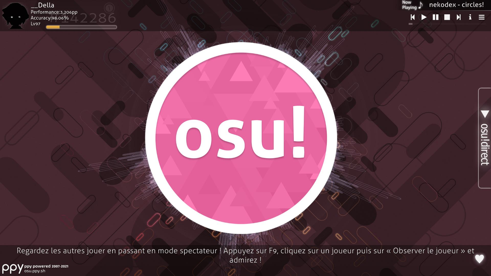

## Menu principal

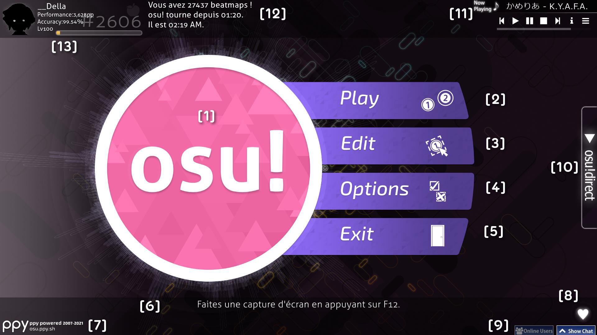

L'[osu!cookie](/wiki/Glossary/Cookie) \[1\], situé au milieu de l'écran bat en fonction du [BPM](/wiki/Beatmapping/Beats_per_minute) de la musique en cours de lecture. On peut également voir plusieurs barres autour du logo qui changent de taille en fonction du volume de la musique. Si aucun morceau n'est joué, le logo bat par défaut à un rythme de 60 BPM.

Voici les éléments du menu principal (les raccourcis clavier sont indiqués entre parenthèses) :

- \[2\] Cliquez sur `Play` (`P`) ou sur le logo pour accéder au menu concernant le mode de jeu (Solo ou Multi).
- \[3\] Cliquez sur `Edit` (`E`) pour ouvrir le menu de sélection des beatmaps dans l'[éditeur](/wiki/Beatmap_Editor).
- \[4\] Cliquez sur `Options` (`O`) pour afficher l'écran des [options](/wiki/Options).
- \[5\] Cliquez sur `Exit` (`Echap`) pour fermer osu!.
- \[6\] Sous le menu sont affichés des conseils utiles et aléatoires sur comment tirer le meilleur parti d'osu!, et parfois une bannière concernant un évènement en cours (par exemple un tournoi).
- \[7\] Dans le coin inférieur gauche se situe un lien vers le site web d'osu! ainsi que des informations sur son copyright.
- \[8\] Le statut de la connexion à [Bancho](/wiki/Bancho_(server))!. Il n'est pas présent sur l'image ci-dessus, mais le statut est représenté par un maillon de chaîne.
- \[9\] En bas à droite se trouvent les boutons de contrôles du [tchat](/wiki/Chat_Console)(les raccourcis clavier sont `F8` pour le bouton "Show Chat" et `F9` pour le bouton "Online Users").
- \[10\] En haut à droite se situe un jukebox qui joue les musiques que vous possédez dans le jeu dans un ordre aléatoire. La partie la plus haute indique la musique en cours de lecture. Les boutons, de gauche à droite, effectuent ces actions :
  - Passer à la musique précédente
  - Jouer la musique
  - Mettre en pause la musique
  - Arrêter la musique (La différence avec le bouton de pause est que la musique recommence du début au lieu de reprendre là où on l'a arrêtée)
  - Passer à la musique suivante
  - Voir le nom de la musique. Cette option permet de rendre cet affichage permanent ou temporaire. Si son statut est permanent, il restera présent à l'écran jusqu'à ce qu'on change de menu. Si son statut est temporaire, il disparaîtra au bout de quelques secondes après le choix de la musique et restera caché jusqu'à ce que son statut soit changé ou qu'une autre musique se joue.
  - Afficher la liste des musiques présentes dans le jeu
- \[11\] A côté de votre profil se situe le nombre de beatmaps que vous possédez, le temps depuis lequel osu! est en marche et l'heure qu'affiche votre ordinateur.
- \[12\] Dans le coin supérieur gauche se trouve votre profil, cliquez dessus pour afficher vos options d'utilisateur.

## Options d'utilisateur

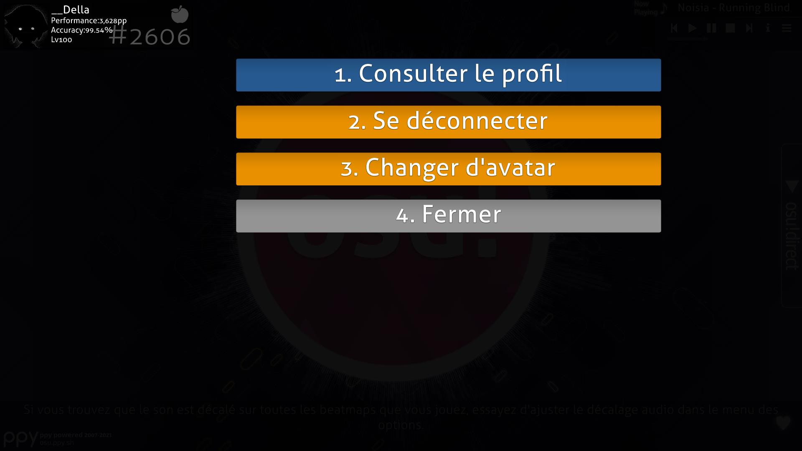

Accédez à cet écran en cliquant sur votre profil se trouvant en haut à gauche de votre écran (sur le menu principal). Aucune commande liée au tchat ne sera accessible depuis ce menu. Vous pouvez sélectionner un élément en appuyant sur le numéro correspondant à ​​l'option.

1. `Consulter le profil`: Ouvre la page contenant votre profil plus en détail dans votre navigateur Internet.
2. `Se déconnecter`: Vous déconnecte d'osu! (le menu latéral des [options](/wiki/Options) apparaîtra, vous permettant de rentrer votre pseudonyme et votre mot de passe)
3. `Changer d'avatar`: Ouvre la page permettant de modifier votre photo de profil via votre navigateur Internet.
4. `Fermer` : Ferme la fenêtre.

## Menu de jeu

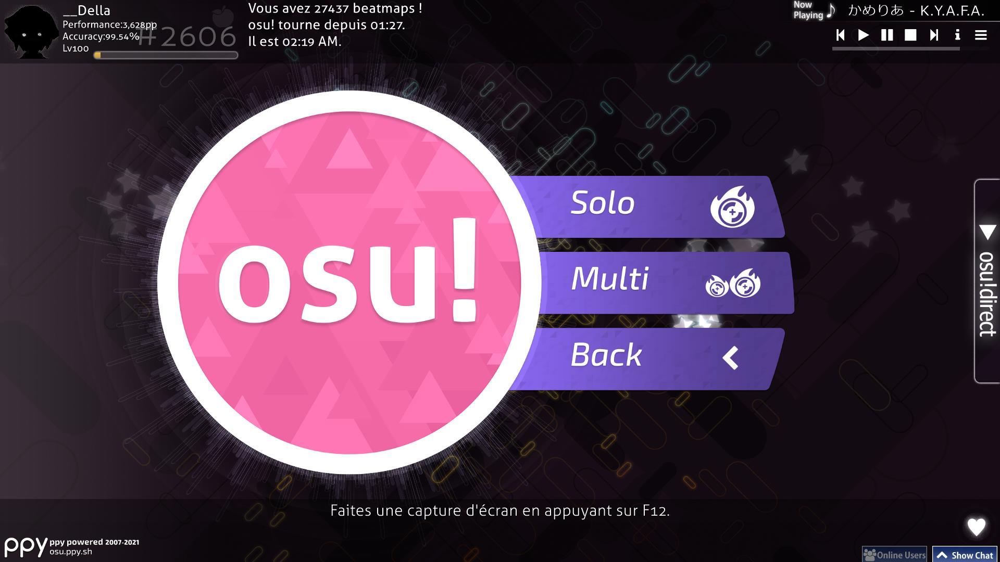

- Cliquez sur `Solo` (`P`) pour jouer seul.
- Cliquez sur `Multi` (`M`) pour jouer avec d'autres personnes.
- Cliquez sur `Back` pour revenir au menu principal.

## Le hall multijoueur

*Pour plus d'informations: [Multi](/wiki/Multi)*

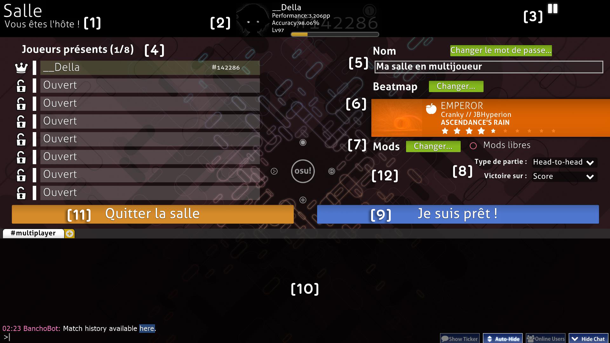

- \[1\] Votre rang dans la salle. Vous pouvez être soit l'hôte (si vous avez crée la salle ou si l'hôte précédent vous a donné ce rôle), soit un participant. Ce rang est également affiché à côté de votre nom.
- \[2\] Votre profil.
- \[3\] Le jukebox.
- \[4\] La liste des joueurs. On peut y voir le nom des joueurs, leur rang (hôte ou participant), les [mods](/wiki/Game_modifier) qu'ils ont choisis (s'il y en a, voir #7), leur classement sur osu!, ainsi que leur équipe (si le type de partie est réglé sur `Team VS` ou `Tag-team VS`).
- \[5\] Le nom de la salle et les paramètres du mot de passe.
- \[6\] La beatmap choisie. Elle est montrée comme dans l'écran de sélection de beatmaps dans le mode Solo.
- \[7\] Les [mods](/wiki/Game_modifier) que vous avez activé (voir #12), ainsi que l'option pour les sélectionner. L'option intitulée "Mods libres" décide de si les joueurs peuvent choisir leurs propres mods ou non. Si elle est activée, les joueurs peuvent choisir n'importe quelle combinaison de mods *sauf les mods altérant la vitesse de la beatmap, c'est-à-dire [Double Time](/wiki/Game_modifier/Double_Time) et [Half Time](/wiki/Game_modifier/Half_Time)*. Si elle est désactivée, l'hôte décide de quels mods seront utilisés. L'hôte peut choisir les mods altérant la vitesse de la beatmap peu importe si l'option "Mods libres" est activée ou non.
- \[8\] Le type de partie et les conditions de victoire.
- \[9\] Le bouton "Je suis prêt !".
- \[10\] La [console de tchat](/wiki/Chat_Console).
- \[11\] Le bouton "Quitter la salle".
- \[12\] Là où se trouvent les mods activés par l'hôte.

## Écran de sélection des beatmaps

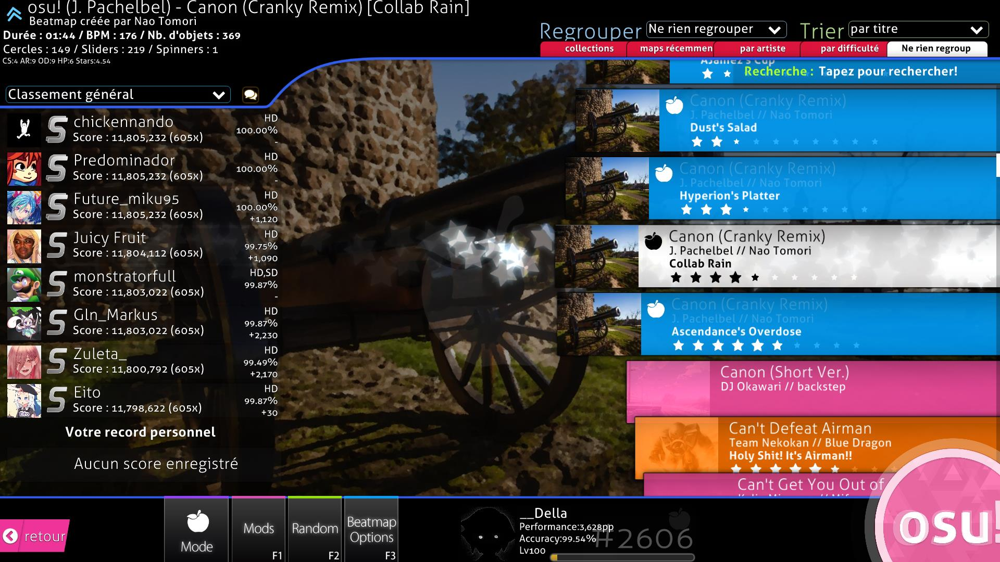

Vous pouvez identifier le mode actuellement choisi en regardant soit l'icône située au dessus de "Mode" en bas à gauche, soit l'icône transparente au milieu de l'écran. Voici les quatre icônes que vous verrez en jeu:

-  correspond au mode [osu!](/wiki/Game_mode/osu!)
-  correspond au mode [osu!taiko](/wiki/Game_mode/osu!taiko)
-  correspond au mode [osu!catch](/wiki/Game_mode/osu!catch)
-  correspond au mode [osu!mania](/wiki/Game_mode/osu!mania)

Avant de continuer, on peut voir que cet écran contient beaucoup trop d'éléments pour qu'il soit annoté avec des numéros faciles à identifier. Les sections ci-dessous vont donc se concentrer sur une partie de l'écran à la fois, en partant de haut en bas et de gauche à droite.

### Informations sur la beatmap

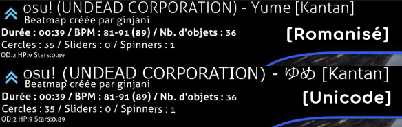

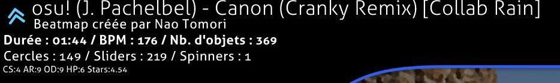

Dans cette partie de l'écran se situent **les informations sur la difficulté de la beatmap sélectionnée.** Par défaut, la beatmap dont la musique est jouée par le jukebox est sélectionnée dans l'écran de sélection de beatmaps. En haut à gauche se situe la catégorie de la map (par exemple, deux chevrons signifient que la beatmap est *classée.*). À sa droite se situe le titre de la beatmap. Par défaut, le titre romanisé est affiché, mais si vous sélectionnez `Métadonnées des maps dans leur langue d'origine dès que possible` dans les [options](/wiki/Options), le titre au format Unicode sera affiché, comme on peut voir sur la première image. Le créateur de la beatmap est également affiché, ainsi que les informations de la beatmap en dessous. De gauche à droite, on peut lire :

- **Durée**: La durée totale de la beatmap, du début à la fin et en comptant les pauses. À ne pas confondre avec le [drain time](/wiki/Gameplay/Drain_time).
- **BPM**: Le BPM de la beatmap. Si (comme sur la deuxième image) deux BPM sont présents, dont un entre parenthèses, cela veut dire que le BPM change pendant la musique. On peut y voir le BPM le plus lent et le BPM le plus rapide, tandis que la valeur entre parenthèses est le BPM au début de la beatmap.
- **Objets**: Le nombre total d'[objets](/wiki/Hit_object) dans la beatmap.
- **Cercles**: Le nombre total de cercles dans la beatmap.
- **Sliders**: Le nombre total de sliders dans la beatmap.
- **Spinners**: Le nombre total de spinners dans la beatmap.
- **OD**: L'[overall difficulty](/wiki/Beatmapping/Overall_difficulty) de la beatmap.
- **HP**: Le taux de drain de votre barre de vie. Dans osu! et osu!catch, cette valeur détermine combien de PV (points de vie) sont perdus en manquant une note, combien de PV sont gagnés en cliquant sur une note, et à quelle vitesse la barre de vie se vide lorsqu'aucune action n'est effectuée. Dans osu!mania, son fonctionnement est identique excepté que la barre de vie ne se vide pas toute seule. Dans osu!taiko, cette valeur détermine à quelle vitesse la barre de vie se remplit et combien de PV sont perdus quand une note est manquée.
- **Stars**: Le star rating de la beatmap. Il est également visible sur le rectangle de la beatmap.

### Regrouper et trier

Cliquez sur un des onglets pour **trier votre liste de beatmaps en fonction du critère choisi**.

**Regrouper** - La plupart de ces options organisent les beatmaps en plusieurs groupes:

- `Ne rien regrouper` - Les beatmaps ne seront pas regroupées, mais seront quand même triées dans l'ordre choisi dans le menu Trier.
- `Par artiste` - Les beatmaps seront regroupées en fonction de la première lettre du nom de l'artiste.
- `Par BPM` - Les beatmaps seront regroupées en fonction de leur BPM par intervalle de 60 (par exemple, si le BPM d'une beatmap est égal à 150, elle sera rangée dans le groupe "120-180").
- `Par créateur` - Les beatmaps seront regroupées en fonction de la première lettre du nom du mappeur.
- `Par date d'ajout` - Les beatmaps seront regroupées en fonction de la date à laquelle elles ont été ajoutées au jeu (les groupes vont d'aujourd'hui à plus de 4 mois).
- `Par difficulté` - Les beatmaps seront regroupées en fonction de leur star rating (arrondi à l'entier près).
- `Par durée` - Les beatmaps seront regroupées en fonction de leur durée: 1 minute ou moins, 2 minutes ou moins, 3, 4, 5, et 10.
- `Par mode` - Les beatmaps seront regroupées en fonction de leur mode de jeu respectif.
- `Par note reçue` - Les beatmaps seront regroupées en fonction de la note la plus haute obtenue sur celles-ci.
- `Par titre` - Les beatmaps seront regroupées en fonction de la première lettre de leur titre.
- `Collections` - Les collections que vous avez créées seront affichées. *Attention : ce paramètre cachera toutes les beatmaps ne faisant pas parties d'une collection!*
- `Favoris` - Seules les beatmaps faisant partie de vos favoris (visibles sur votre profil en ligne) seront affichées.
- `Mes beatmaps` - Seules les beatmaps que vous avez créées (ou dont le nom du créateur correspond au vôtre) seront affichées.
- `Statuts en ligne` - Les beatmaps seront regroupées en fonction de leur statut : classée, qualifiée, en attente, inconnue ou loved.
- `Maps récemment jouées` - Les beatmaps seront regroupées en fonction de la date à laquelle vous les avez jouées pour la dernière fois.

Certains de ces paramètres sont disponibles dans des onglets en dessous des menus Regrouper et Trier.

**Trier** - Trie les beatmaps dans un ordre précis

- `Par artiste` - Les beatmaps seront triées alphabétiquement par la première lettre du nom de l'artiste.
- `Par BPM` - Les beatmaps seront triées en fonction de leur BPM, du plus bas au plus haut. Si une beatmap contient plusieurs BPMs, le BPM le plus haut sera utilisé.
- `Par créateur` - Les beatmaps seront triées alphabétiquement par la première lettre du nom du créateur de celles-ci.
- `Par date d'ajout` - Les beatmaps seront triées en fonction de la date d'ajout, de la plus vieille à la plus récente.
- `Par difficulté` - Les beatmaps seront triées en fonction de leur star rating, du plus bas au plus haut.  *Attention : ce paramètre séparera les difficultés des sets de beatmaps!*
- `Par durée` - Les beatmaps seront triées en fonction de leur durée, de la plus courte à la plus longue.
- `Par note reçue` - Les beatmaps seront triées en fonction de la note la plus haute obtenue sur celles-ci, de la pire à la meilleure.
- `Par titre` - Les beatmaps seront triées alphabétiquement par la première lettre de leur titre.

### Rechercher

*Remarque : Il est impossible d'effectuer une recherche tout en ayant la console de tchat ou le menu des options ouvert. En effet, tout ce qui sera écrit sera considéré comme un message dans le chat ou une recherche dans les options.*

Seules les beatmaps correspondant aux critères présents dans votre recherche seront affichés. Par défaut, les recherches correspondront aux artistes, titres, créateurs et mots-clés des beatmaps.

En plus de rechercher des mots en particulier, vous pouvez utiliser des filtres pour effectuer une recherche en fonction d'autres données en combinant un des filtres pris en charge (voir ci-dessous) avec une comparaison associée à une valeur (par exemple, `hp>6`).

Filtres disponibles :

- `artist`: Nom de l'artiste
- `creator`: Nom du créateur de la beatmap
- `ar`: Taux d'approche
- `cs`: Taille des cercles
- `od`: Overall difficulty
- `hp`: Taux de drain de la barre de vie
- `keys`: Nombre de touches (uniquement en osu!mania et pour les beatmaps converties)
- `stars`: Difficulté (en étoiles)
- `bpm`: Battements par minute
- `length`: Durée (en secondes)
- `drain`: drain time (en secondes)
- `mode`: Le mode de jeu. La valeur peut être `osu`, `taiko`, `catchthebeat`, ou `mania` (ou, pour faire court, `o`/`t`/`c`/`m`).
- `status`: Le statut en ligne. La valeur peut être `ranked`, `approved`, `pending`, `notsubmitted`, `unknown`, ou `loved`, (ou, pour faire court, `r`/`a`/`p`/`n`/`u`/`l`).
- `played`: Le temps depuis la dernière fois que la beatmap a été jouée (en jours).
- `unplayed`: Affiche uniquement les beatmaps non jouées. Une comparaison sans valeur ajoutée doit être utilisée (la comparaison en elle-même est ignorée).
- `speed`: La vitesse de défilement sauvegardée dans le mode osu!mania. Cette valeur sera toujours égale à 0 sur les beatmaps non jouées si l'option [Se souvenir des vitesses de défilement sur chaque map osu!mania](/wiki/Options#gameplay) est désactivée.

Comparaisons supportées:

- `=` or `==`: Égal à
- `!=`: N'est pas égal à
- `<`: Inférieur à
- `>`: Supérieur à
- `<=`: Inférieur ou égal à
- `>=`: Supérieur ou égal à

Vous pouvez également écrire l'identifiant d'une difficulté ou d'une beatmap pour n'obtenir qu'un seul résultat.

### Classements

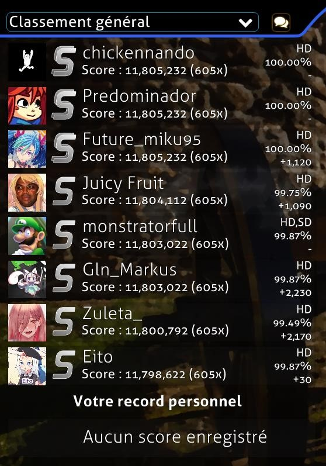

Une variété d'éléments peuvent apparaître dans cette section :

- Une boîte "Not Submitted" qui indique qu'une beatmap n'a soit pas été mise en ligne sur le site d'osu! en utilisant le système de mise en ligne de beatmap (via l'éditeur), soit supprimée par le créateur de celle-ci.
- Une boîte "Update to latest version" qui apparaît si une nouvelle version de la beatmap a été mise en ligne par le créateur. Cliquez sur celle-ci pour la télécharger.
  - **Remarque:** Une fois que la beatmap a été mise à jour, il est impossible de revenir en arrière. Si vous voulez garder l'ancienne version de celle-ci (par exemple, pour garder vos scores), ne la mettez pas à jour.
- Une boîte "Latest pending version" signifie que la beatmap a été mise en ligne sur le site d'osu!, mais n'est pas encore classée.
- Si des replays correspondant au paramètre d'affichage de la beatmap existent, ils seront affichés à la place de la boîte indiquant le statut de celle-ci, comme on peut le voir sur l'image ci-dessus.
  - En dessous des classements de la beatmap (par exemple, Général, National, etc.), votre meilleur score sera affiché, ainsi que votre rang dans celui-ci.
- Une boîte "No records set!" indiquant qu'il n'existe aucun replay pour le paramètre d'affichage actuel (celle-ci apparaît généralement dans le classement local si vous venez de télécharger ou d'éditer une beatmap).
  - **Remarque :** Les parties effectuées en multijoueur ne sont généralement pas comptées comme étant des records.

Voici les paramètres d'affichage disponibles:

- Classement local
- Classement national\*
- Classement général
- Général (mods sélectionnés)\*
- Classement des amis\*

\*Pour y accéder, vous devez être un [osu!supporter](/wiki/osu!supporter).

Cliquez sur l'icône contenant deux bulles pour accéder au menu permettant **l'accès rapide aux pages web** de la beatmap :

- Appuyez sur `1` ou cliquez sur le bouton `Infos beatmap/classements` et votre navigateur affichera les informations ainsi que les classements de la beatmap à laquelle appartient la difficulté choisie.
- Appuyez sur `2` ou cliquez sur le bouton `Topic de la beatmap` et votre navigateur affichera la page concernant le topic de la beatmap à laquelle la difficulté choisie appartient.
- Appuyez sur `3` ou `Echap` ou cliquez sur le bouton `Cancel` pour retourner au menu de sélection de beatmaps.

Tant que vous êtes sur ce menu, il est impossible d'accéder à la console de tchat et à la console de tchat étendue.

### Beatmaps

La liste de beatmaps affiche toutes les beatmaps que vous avez installées. Chaque beatmap peut contenir des boîtes de couleurs différentes :

- **Rose**: Cette beatmap n'a pas encore été jouée.
- **Orange**: Au moins une des difficultés de cette beatmap a été jouée.
- **Bleu clair**: Les autres difficultés d'une beatmap (visibles quand celle-ci est sélectionnée).
- **Blanc**: La difficulté actuellement choisie.

Vous pouvez naviguer dans la liste de beatmaps de différentes façons : en utilisant la molette de la souris, en appuyant sur les touches `Flèche vers le haut` et `Flèche vers le bas` du clavier, en la faisant glisser tout en maintenant enfoncée le clic gauche de la souris, ou encore en effectuant un clic droit (Cette action va déplacer la barre de défilement directement vers la position Y de la souris. On appelle cela le **défilement absolu**.).
Cliquez sur une boîte pour sélectionner une beatmap et afficher ses informations en haut à gauche, les records (s'il y en a) à gauche et, si vous l'avez complétée, la note que vous avez reçue ainsi que votre score le plus haut. Pour commencer la beatmap, appuyez une nouvelle fois sur la boîte, sur le logo d'osu! en bas à droite ou appuyez sur `Entrée`.

### Boîte à outils du jeu

Cette section peut être appelée la boîte à outils de jeu. On va expliquer l'utilisation de chaque bouton de gauche à droite.

Appuyez sur `Echap` ou cliquez sur le bouton `Retour` pour retourner au menu principal.

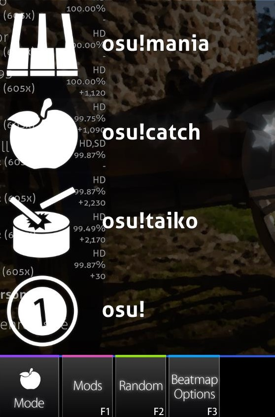

Cliquez sur le bouton  `Mode` pour ouvrir la liste des modes de jeu disponibles sur osu!. Cliquez sur le mode que vous désirez jouer et osu! va changer le style de jeu. Les classements sont également changés. Alternativement, vous pouvez appuyer sur `Ctrl`, puis sur `1` (osu!), `2` (osu!taiko), `3` (osu!catch), ou `4` (osu!mania) pour changer de mode de jeu.

L'icône transparente au milieu de l'écran ainsi que celle dans le bouton `Mode` vont changer pour représenter le mode choisi.

Cliquez sur le bouton `Mods` ou appuyez sur `F1` pour accéder à l'**[écran de sélection des mods](/wiki/Game_modifier)**.

Sur cet écran, vous pouvez modifier le gameplay. Certains mods baissent la difficulté de la beatmap et appliquent un multiplicateur qui diminue le score que vous obtenez. Inversement, certains mods augmentent la difficulté tout en appliquant un multiplicateur qui augmente le score obtenu. Enfin, certains mods changent le gameplay d'une autre manière. Les mods [Relax](/wiki/Game_modifier/Relax) et [Auto Pilot](/wiki/Game_modifier/Autopilot) tombent dans cette catégorie.

Mettez le curseur au dessus de l'icône d'un mod pour voir une description courte de son effet sur le gameplay. Cliquez sur celui-ci pour le sélectionner ou le déselectionner. Certains mods, comme le mod [Double Time](/wiki/Game_modifier/Double_Time), ont plusieurs variations. Cliquez une nouvelle fois sur ce mod pour voir les différentes versions de celui-ci.
Le multiplicateur de score affiché au dessus indique l'effet combiné des multiplicateurs du ou des mods choisi(s) sur votre score. Cliquez sur `Réinitialiser` ou appuyez sur `1` pour déselectionner tous les mods choisis actuellement. Cliquez sur `Fermez` ou appuyez sur `2` pour retourner à l'écran de sélection de beatmaps.

Tant que vous êtes sur ce menu, il est impossible d'accéder à la console de tchat et à la console de tchat étendue. De plus, les skins peuvent altérer le texte et/ou les icônes des mods, mais leurs effets resteront identiques.

Cliquez sur le bouton `Random` ou appuyez sur `F2` pour que le jeu **choisisse aléatoirement une beatmap parmi toutes celles présentes à l'écran**. Vous ne pouvez pas choisir une beatmap vous-même pendant que le jeu choisit pour vous.

*Remarque : Pour revenir à la beatmap choisie avant que le jeu en choisisse une au hasard, appuyez sur `Shift`, puis sur le bouton `Random` ou sur `F2`.*

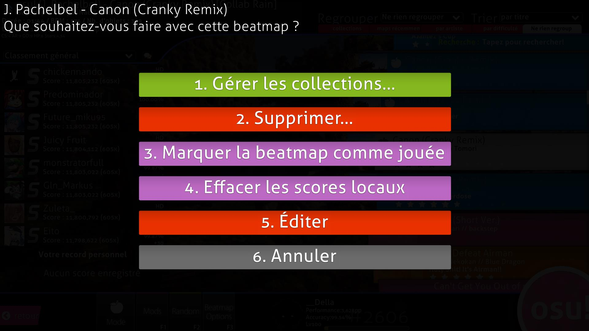

Cliquez sur le bouton `Beatmap Options`, appuyez sur `F3` ou faites un clic droit sur une beatmap pour afficher le **menu des options de la beatmap sélectionnée**.

- Appuyez sur `1` ou cliquez sur `Gérer les collections...` pour afficher le menu des collections. Ici, vous pouvez gérer les collections déjà existantes, ainsi qu'ajouter ou retirer la beatmap choisie dans ou d'une collection.
- Appuyez sur `2` ou cliquez sur `Supprimer...` pour supprimer \[1] la difficulté actuellement choisie, \[2] la beatmap actuellement choisie, ou \[3] **TOUTES les beatmaps VISIBLES**.
  - Les beatmaps supprimées sont déplacées vers la Corbeille de votre ordinateur.
- Appuyez sur `3` ou cliquez sur `Marquer la beatmap comme jouée` pour marquer une beatmap non jouée comme étant jouée (et ainsi changer sa couleur de rose à orange).
- Appuyez sur `4` ou cliquez sur `Effacer les scores locaux` pour supprimer tous les replays des scores que vous avez effectués sur cette beatmap. Seuls les scores présents dans le classement local seront supprimés.
- Appuyez sur `5` ou cliquez sur `Éditer` pour ouvrir la beatmap choisie dans l'éditeur d'osu!.
- Appuyez sur `6`, sur `Echap` ou cliquez sur `Annuler` pour retourner à l'écran de sélection des beatmaps.

Cliquez sur votre **profil** pour accéder aux **options d'utilisateur**.

Cliquez sur le **[logo d'osu!](/wiki/Glossary/Cookie)** pour **commencer à jouer la beatmap sélectionnée**.

## Écran des résultats

Voici l'écran des résultats affiché après que vous ayez réussi à terminer une beatmap. Vous pouvez accéder à vos résultats en ligne en glissant vers le haut ou en cliquant sur le bouton en bas.

**Remarque :** L'écran des résultats peut changer en fonction du skin choisi.

Ci-dessous se trouvent les écrans de résultat pour les autres modes de jeu.

### Classement en ligne

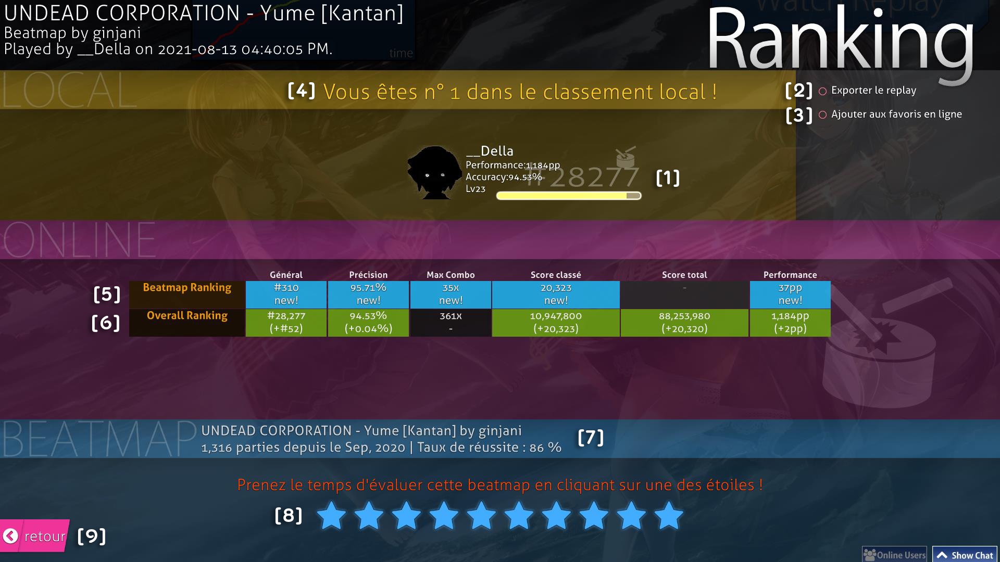

Voici votre classement en ligne. Vous pouvez y accéder en glissant l'écran des résultats vers le haut. Votre tableau des scores locaux montrera toujours votre nom et votre score.

1. Votre profil. Il montre vos [PP](/wiki/Performance_points), votre rang global, votre score total, votre [précision](/wiki/Gameplay/Accuracy) globale, ainsi que votre niveau.
2. `Exporter le replay`: Vous pouvez regarder votre performance sur la beatmap plus tard soit en l'ouvrant depuis le classement local, soit en allant dans votre dossier `Replays` et en cliquant dessus.
3. `Ajouter aux favoris en ligne`: Ajoute la beatmap dans vos favoris, qui sont situés sur votre profil osu! dans la section "Beatmaps".
4. Classement local: Tous vos scores sont stockés sur votre ordinateur. Pour les voir, retournez sur [l'écran de sélection des beatmaps](#écran-de-sélection-des-beatmaps), puis sélectionnez `Classement local` dans le menu déroulant à gauche.
5. La section `Beatmap Ranking`. Elle est disponible uniquement pour les beatmaps avec un classement en ligne (elle doit être [qualifiée](/wiki/Beatmap/Category#qualified), [classée](/wiki/Beatmap/Category#ranked), ou [loved](/wiki/Beatmap/Category#loved)). Vous devez également être en ligne pour voir cette section.
   1. `Général`: Votre position dans le classement de la beatmap, où vous pouvez vous mesurer à d'autres joueurs qui ont utilisé des [mods](/wiki/Game_modifier), même si vous n'en avez pas utilisé.
   2. `Précision`: La [précision](/wiki/Gameplay/Accuracy) avec laquelle vous avez jouée la beatmap. Elle n'est comptée que si vous avez battu votre ancien record.
   3. `Max Combo`: Votre plus grand combo sur la beatmap jouée.
   4. `Score classé`: Votre [meilleur score](/wiki/Score#ranked-score) sur la beatmap.
   5. `Score total`: N'est pas pris en compte puisqu'il n'affecte en rien votre position dans le classement.
   6. `Performance`: Le nombre de [PP unweighted](/wiki/Performance_points#pourquoi-n'ai-je-pas-gagné-la-totalité-des-pp-d'une-beatmap-que-j'ai-jouée-?) obtenus sur cette partie.
6. La section `Overall Ranking`. Elle est disponible uniquement pour les beatmaps avec un classement en ligne. Vous devez également être en ligne pour voir cette section.
   1. `Général`: Votre classement global sur la beatmap.
   2. `Précision`: Votre [précision](/wiki/Gameplay/Accuracy#accuracy) globale sur toutes les beatmaps que vous avez jouées.
   3. `Max Combo`: Votre plus grand combo sur toutes les beatmaps que vous avez jouées.
   4. [`Score classé`](/wiki/Score#score-classé): Le nombre total de points que vous avez obtenu sur toutes les beatmaps ayant un classement en ligne que vous avez jouées, chaque beatmap ne comptant qu'une seule fois.
   5. [`Score total`](/wiki/Score#score-total): Le fonctionnement est identique à celui du score classé, mais il prend en compte toutes les beatmaps présentes sur le site d'osu!, ainsi que les beatmaps que vous avez quittées avant la fin et celles que vous avez échouées. Ce score compte dans votre niveau.
   6. `Performance`: Affiche votre nombre total de Points de Performance, ainsi que le nombre de PP que votre score vaut.
7. Informations sur la beatmap, ainsi que le nombre de parties jouées et le taux de réussite sur celle-ci.
8. Note globale de la beatmap. Vous pouvez noter la beatmap que vous venez de jouer en fonction de si vous l'avez aimée ou non. Si vous n'arrivez pas à vous décider, mieux vaut ne pas y toucher.
9. Cliquez ici pour retourner au menu de sélection de beatmaps.

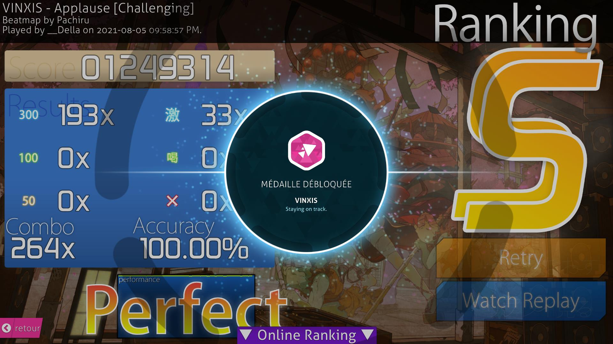

Ci-dessus, on peut voir ce qui se passe quand on obtient une médaille.
