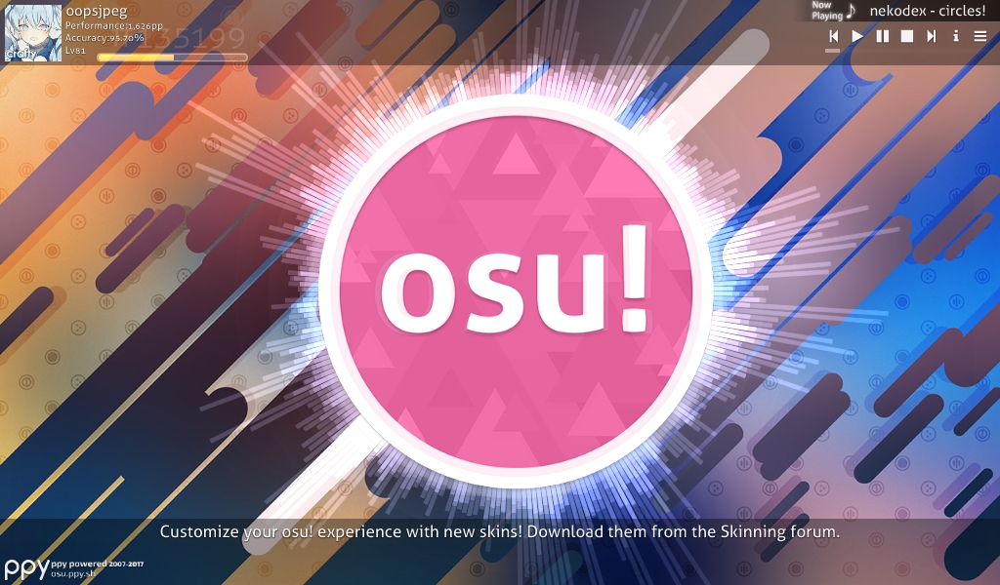
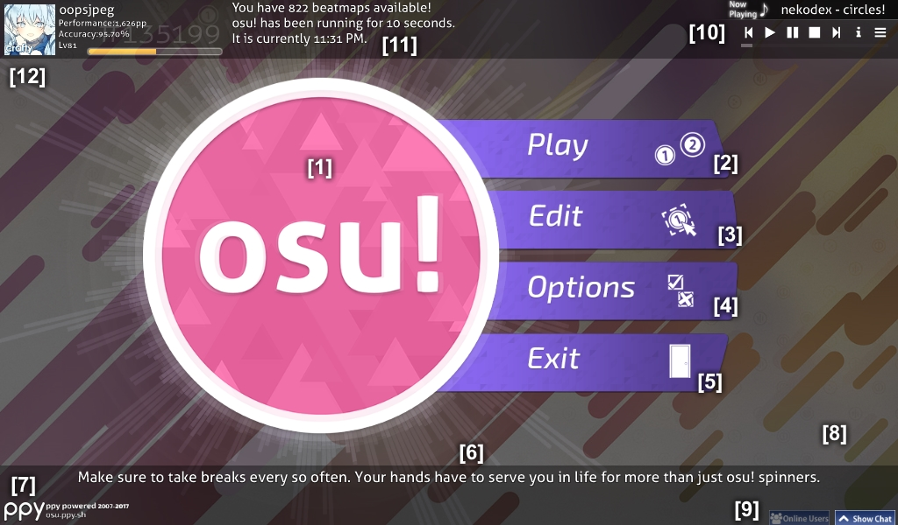
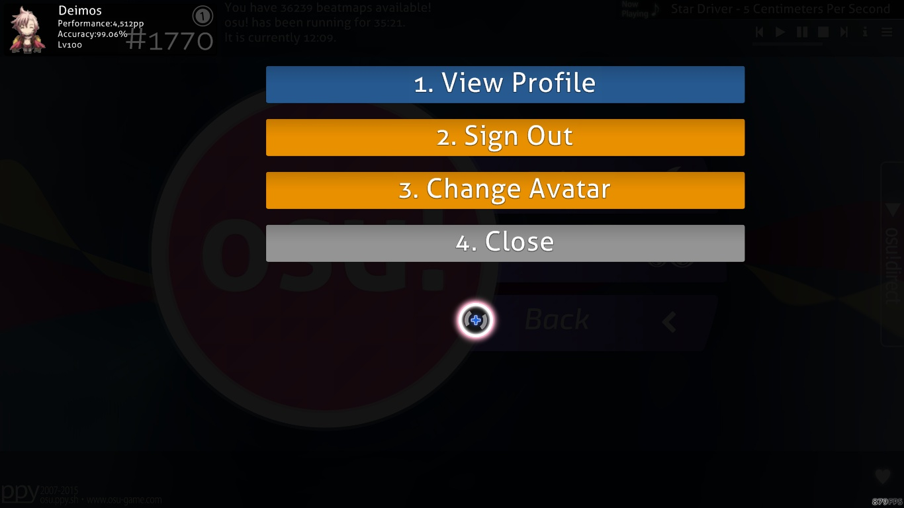
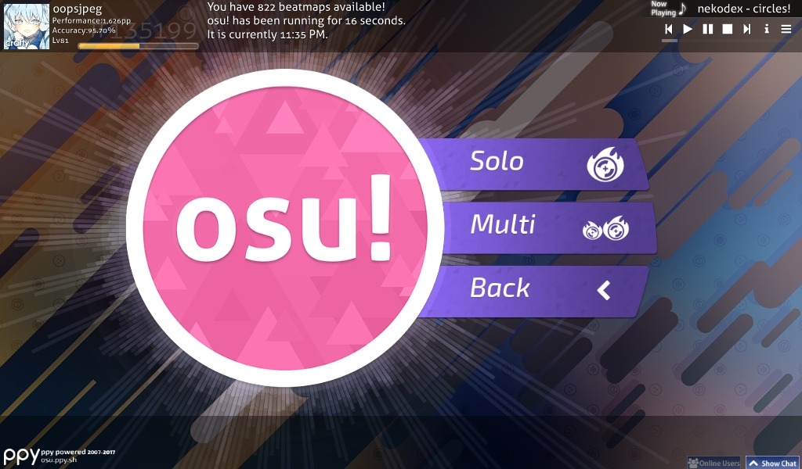
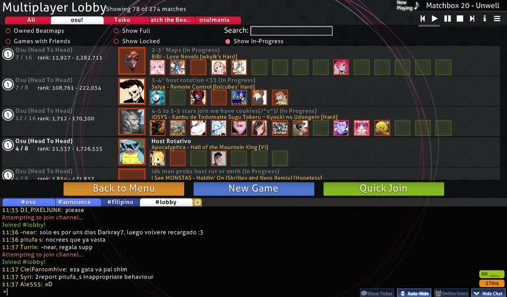
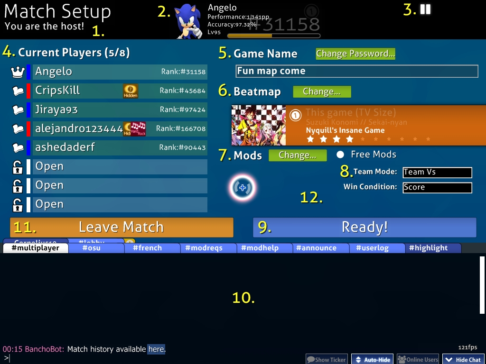
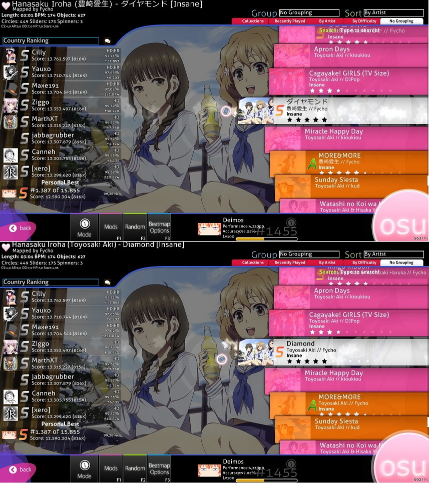
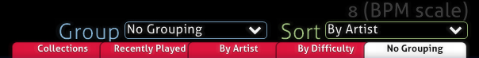
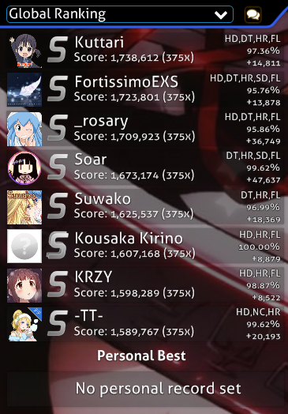
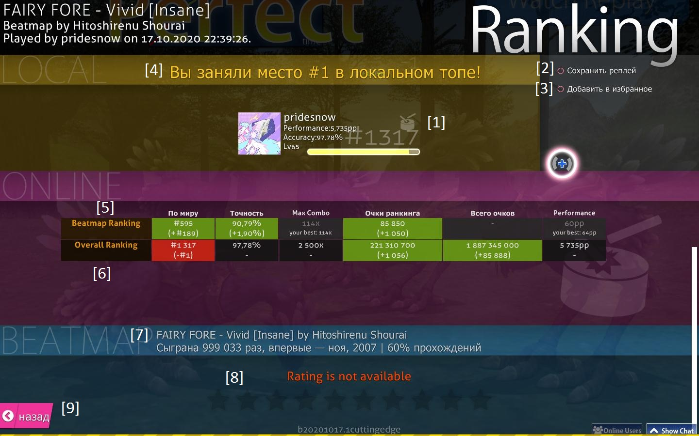

# Interface de jeu

## Menu principal

Sur l'écran d'introduction s'affiche le logo d'osu! au centre de l'écran. Il bat suivant le [BPM](/wiki/Beatmapping/Beats_per_minute) d'une musique en cours de lecture. Si aucun morceau n'est joué, celui-ci bat à un rythme lent par défaut. Le raccourci clavier est entre parenthèses.

-   \[2\] Appuyez sur Play (P) ou cliquez sur le logo pour accéder au menu principal.
-   \[3\] Pressez E ou cliquez sur "Edit" pour ouvrir le menu de sélection des musiques dans l'[éditeur](/wiki/Beatmap_Editor).
-   \[4\] Pressez O ou cliquez sur "Options" pour afficher l'écran des [options](/wiki/Options).
-   \[5\] Pressez Echap ou cliquez sur "Exit" pour fermer osu!.
-   \[6\] Une astuce utile et aléatoire est généralement affichée sous le menu.
-   \[7\] Dans le coin inférieur gauche se trouve un lien vers le site web d'osu!.
-   \[8\] Le statut de la connexion à Bancho!
-   \[9\] En bas à droite se trouve les boutons de contrôles du [chat](/wiki/Internet_Relay_Chat)(dont les raccourcis clavier sont F8 et F9).
-   \[10\] Dans le coin supérieur droit se trouve la jukebox d 'osu!, dont l'ordre de la lecture des morceaux est aléatoire.
-   \[11\] A côté de votre panneau d'utilisateur, le nombre de beatmaps, le temps depuis lequel le programme est en marche et l'heure qu'affiche votre ordinateur.
-   \[12\] Dans le coin supérieur gauche se trouve votre panneau d'utilisateur, cliquez dessus pour afficher vos options en tant que tel.

### Options d'utilisateur

Accédez à cet écran en cliquant sur votre panneau d'utilisateur se trouvant en haut à gauche de votre écran d'introduction. Vous ne pourrez accéder à aucune commande liée au chat sur ce panel. Vous pouvez sélectionner un élément en appuyant sur le numéro correspondant à ​​l'option.

1.  **View Profile**: Ouvre votre page profil dans votre navigateur Internet.
2.  **Sign Out**: Vous déconnecte et fait apparaître la fenêtre de connexion.
3.  **Change Avatar**: Ouvre la page de modification de votre avatar dans votre navigateur Internet.
4.  **Close** : Ferme la fenêtre.

## Menu de jeu

-   Cliquez sur Solo (P) pour jouer seul.
-   Cliquez sur Multi (M) pour jouer avec d'autres personnes.
-   Cliquez sur Back pour revenir au menu principal.

### Le hall multijoueur

*Pour plus d'informations: [Multi](/wiki/Multi)*

### Ecran de sélection des beatmaps

NB: Vous pourrez identifier le mode spécifique de chaque beatmap en jetant un coup d'oeil aux motifs blancs s'illustrant par les 4 icônes suivantes :

"osu!" pour [osu!](/wiki/Game_Modes/osu!), "Tambour" pour [osu!taiko](/wiki/Game_Modes/osu!taiko), "Pomme" pour [osu!catch](/wiki/Game_Modes/osu!catch) et "Piano" pour [osu!mania](/wiki/Game_Modes/osu!mania)

Parce que cet écran a trop d'éléments à noter par des numéros facilement visibles, cette section se concentrera sur une partie de l'écran à la fois, en partant du haut de gauche à droite, puis en continuant vers le bas. Les sauts de ligne(s) seront utilisés pour diviser l'écran en trois pour faciliter leur consultation et leur compréhension.

#### Informations sur la Beatmap

Cette zone affiche les informations de la difficulté actuellement sélectionnée. Par défaut, la beatmap sélectionnée sera celle qui était jouée dans le jukebox au moment de l'ouverture de l'écran de sélection. La valeur de BPM affichée est la moyenne entre la valeur la plus rapide et la plus lente de la beatmap. "Objects" correspond au nombre total d'[éléments](/wiki/Hit_Objects) de la map. Un coeur en haut à gauche signifie que la beatmap est Rankée tandis qu'une flamme indique qu'elle est Approuvée. Le titre Unicode (i.e avec caractères non-latins) sera affiché si l'option ["Métadonnées des maps dans leur langue d'origine"](/wiki/Options#langue) est activée.

-   Style: {Source} ({Artiste}) - {Titre} \[{Difficulté sélectionnée}\]

#### Grouper et Trier (Group and Sort)

Cliquez sur un des onglets pour **trier votre liste de chansons en fonction du critère sélectionné**
**Grouper**- La plupart des options organisent les beatmaps en plusieurs groupes expansibles

-   Ne rien regrouper - Les beatmaps ne seront pas regroupées (mais apparaitront tout de même dans l'ordre choisi)
-   Par artiste-Par la première lettre, nombre ou caractère du nom de l'artiste
-   Par BPM- Par battements par minute dans les multiples de 60
-   Par créateur- Par le nom du mappeur
-   Par date d'ajout- Par aujourd'hui, hier, la semaine dernière, et plusieurs groupes de 1 jusqu'à plus de 5 mois
-   Par difficulté- Par nombre d'étoiles (arrondi au chiffre le plus proche)
-   Par durée-Par nombre de minutes: cinq groupes pour moins de 1-5 et deux pour moins et plus de 10
-   Par mode- Par un des 4 modes
-   Par note reçue- Par note: D,C,B,A,S,SS, Silver S, Silver SS
-   Par titre-Par la première lettre, nombre ou caractère du titre
-   Collections-Par vos collections, triées alphabétiquement: les beatmaps n'étant dans aucune collection n'apparaitront pas
-   Favorites-N'apparaissent que vos beatmaps favorites
-   Mes maps- N'apparaissent que les sets de maps que vous avez créés.
-   Par statuts-Par le statut d'une beatmap: ranked, pending, not submitted ou unknow
-   Récemment jouées-Par les mêmes groupes que "par date d'ajout", sauf pour les dernières parties

**Trier** - Trier les maps dans un certain ordre

-   Par Artiste - Par nom d'artiste, alphabétiquement
-   Par BPM - Par BPM, dans l'ordre croissant (utilise la plus haute valeur pour les maps au BPM variable)
-   Par Créateur - Par mappeur, alphabétiquement
-   Par Date d'Ajout - Par date d'ajout, du plus ancien au plus récent
-   Par Difficulté - Par difficulté, dans l'ordre croissant
-   Par Durée - Par durée, dans l'ordre croissant
-   Par Note reçue - Par note
-   Par Titre - Par titre, alphabétiquement

#### Rechercher

Tapez du texte n'importe où sur l'écran de sélection ([la console de chat](/wiki/Chat_Console) ne doit pas être ouverte où ce sera consideré comme un message de chat) et la recherche va être activée. Notes:

#### Classement

Cet espace peut afficher le tableau de classement ou différents messages :

-   Un message "not yet submitted" indique que la beatmap n'a pas encore été envoyée en ligne.
-   Un message "Update to latest version" indique qu'une version mise à jour de cette difficulté est disponible en ligne. Cliquez sur le message pour la télécharger.
    -   **Note:** La version actuelle sera écrasée.
-   Un message "Latest version but not approved" indique que la beatmap a été envoyée sur le site osu! mais qu'elle n'a pas encore été rankée.
-   Un message "No records set!" indique qu'aucun score n'a encore été enregistré pour cette beatmap (si le classement global est sélectionné) ou que vous n'avez jamais terminé la beatmap en solo (si le classement local est sélectionné).
    -   Note: Un score réalisé en mode Multi n'est pas enregistré dans le classement local.
-   Un message "Not yet uploaded" indique que vous êtes le créateur de la beatmap et que vous ne l'avez pas encore soumise sur le site osu!.

**Tableau de classement:**

| Nom | Fonction |
| :-- | :-- |
| Local Ranking | Affiche les scores réalisés par des joueurs locaux. N'enregistre pas les scores réalisés en multi. |
| Country Ranking | **osu!supporter requis!** Affiche votre classement par rapport aux joueurs de votre pays. |
| Global Ranking | Affiche les 50 meilleurs scores en ligne. Il est possible de voir leur écran des résultat et leur replay en cliquant sur leur ligne. |
| Global Ranking (Selected Mod) | **osu!supporter requis!** Affiche le classement global des scores réalisés avec les mods sélectionnés. |
| Friend Ranking | **osu!supporter requis!** Affiche le classement des meilleurs performances des personnes dans votre liste d'amis. Ne fonctionne pas avec [BanchoBot](/wiki/BanchoBot) ou si votre liste d'amis est vide. |

## Ranking screen

### Grade screen

This is the grade screen after you successfully passed the beatmap. You can access your Online results by scrolling down or pressing the obvious button.

**Note:** The grade skin will vary by skin used.

### Online score leader-board

Note: The back transparent leitmotif is based on what mode you played in.

 is [osu!](/wiki/Game_Modes/osu!),  is [osu!taiko](/wiki/Game_Modes/osu!taiko),  is [osu!catch](/wiki/Game_Modes/osu!catch) and  is [osu!mania](/wiki/Game_Modes/osu!mania)

This is your online leader-board. You can go here by scrolling down from the results screen. Your Local Scoreboard will show your name and the score as usual.

1.  You can change your name here to put on the Local Scoreboard.
2.  Your player bar. It shows whether your pp, pp rank, total score, and accuracy increases or decreases. Your level bar will increase based on score.
3.  Your options regarding the Beatmap.
    1.  Export Replay as .osr: Save the replay that can be used online.
    2.  Online Favourite: Make the Beatmap as your Online Favourite. It will show on your online profile under Beatmaps->Favourite Beatmaps

4.  Self-explanatory. Will not appear if offline.
    1.  Map Rank: Your Ranking on the map. It will count along with mod plays score ranking despite you are not using any mods.
    2.  Overall: Your profile standing. Basically, your Ranking place ranked score in that specific game mode.
    3.  Accuracy: Will only be counted when your old score is surpassed. Accuracy is the average of all passed beatmaps.
    4.  Ranked Score: Your Ranked Score. If it's an approved song, it will not increase at all.
    5.  Total Score: Grand total score. Always increasing despite you failed the song or not surpassing old score. Affects your level bar.
    6.  To Next Rank: How much score you need to move your current map ranking position up.

5.  Same as 4, but it is reserved for monthly [Ranking Charts](https://osu.ppy.sh/rankings/osu/charts)
6.  Achievement unlock. Any achievement you unlock will be shown here. Full list of possible achievements can be found at [Achievements](/wiki/Medals) page
7.  Beatmap song with it's history of plays and pass rate.
8.  Beatmap Rating. Use your personal discretion based on whether you enjoy the beatmap or not. Best left alone if you can't decide.
9.  Return to Song Selection.
