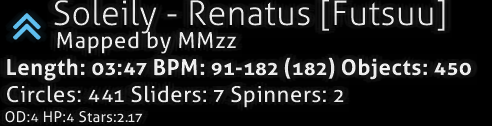

<!--Logo definitions-->
[Osu!]: /wiki/shared/mode/osu.png
[Taiko]: /wiki/shared/mode/taiko.png
[Ctb]: /wiki/shared/mode/catch.png
[Mania]: /wiki/shared/mode/mania.png
[Heart]: /wiki/shared/icon/heart.gif
[Fire]: /wiki/shared/icon/flame.gif

# Interfejs

## Menu główne

[Osu!cookie](/wiki/Glossary/#cookie) pulsuje zgodnie z [BPM](/wiki/Glossary/#BPM) piosenki aktualnie granej w menu głównym. Dodatkowo, z osu!cookie będą wysuwały się prostokąty, zgodnie z głośnością piosenki. Jeżeli nie gra żadna muzyka, pulsuje w wolnym tempie 60 BPM. Elementy menu głównego to:

-   \[2\] Kliknij Play (`P`) lub logo osu!, by przejść do wyboru piosenek w trybie jednoosobowym.
-   \[3\] Kliknij Edit (`E`), aby przejść do wyboru piosenek w trybie edycji.
-   \[4\] Kliknij Options (`O`), aby przejść do ustawień gry.
-   \[5\] Kliknij Exit (`Esc`), aby wyjść z gry.
-   \[6\] Losowa porada jest wyświetlana pod menu.
-   \[7\] W lewym dolnym rogu znajduje się link do strony osu! oraz informacje o prawach autorskich.
-   \[8\] Wynik łączenia się z [Bancho](/wiki/Glossary/#Bancho)! Nie jest przedstawiony na tym zdjęciu, jednak wygląda jak ogniwo łańcucha.
-   \[9\] W prawym dolnym rogu znajdują się opcje rozwijanego [czatu](/wiki/Chat_Console) (nazwanego tutaj "Listą Graczy") oraz regularne okno czatu (skróty to kolejno `F8` i `F9`).
-   \[10\] W prawym górnym rogu znajduje się szafa grająca osu!, która gra piosenki w losowej kolejności. Na górze wyświetlana jest aktualnie odtwarzana piosenka. Przyciski od lewej do prawej mają funkcję:
    - Poprzedni Utwór
    - Odtwarzanie
    - Pauza
    - Stop (różnica pomiędzy Pauzą a Stopem polega na tym, że przycisk Stop cofa utwór do jego początku, natomiast Pauza zatrzymuje na danym momencie)
    - Następny Utwór
    - Zobacz Informacje o Utworze. Ten przycisk przełącza górny pasek wyświetlający informację o utworze pomiędzy trybem stałym a tymczasowym. Jeżeli jest w trybie stałym, pasek informacyjny zostanie widoczny, dopóki nie zaniknie razem z resztą interfejsu. Jeżeli jest w trybie tymczasowym, zaniknie po chwili od wybrania piosenki i pozostanie ukryty, dopóki nie zostanie ponownie włączony lub dopóki nie zagra następny utwór.
-   \[11\] Liczba dostępnych beatmap, informacja o tym, jak długo twój klient osu! jest włączony oraz twój czas systemowy.
-   \[12\] Twój profil, kliknij na niego aby wyświetlić Opcje Użytkownika (patrz pod spodem).

## Opcje Użytkownika

Uzyskaj dostęp do tego ekranu poprzez kliknięcie na swój profil, znajdujący się w lewym górnym rogu menu głównego. Podczas korzystania z ekranu opcji użytkownika nie masz dostępu do Czatu. Możesz wybrać dowolną opcję, naciskając na cyfrę z nią powiązaną:

1. `Zobacz Profil`: Otwiera twoją stronę profilową w domyślnej przeglądarce
2. `Wyloguj Się`: Wyloguj się ze swojego konta (po wylogowaniu, boczny pasek [Opcji](/wiki/Options) poprosi cię o zalogowanie się)
3. `Zmień Avatar`: Otwiera stronę edycji avatara w twojej domyślnej przeglądarce
4. `Zamknij`: Zamyka okno dialogowe

## Menu Rozgrywki

-   Kliknij `Solo` (`P`), aby włączyć tryb jednoosobowy.
-   Kliknij `Multi` (`M`), aby grać z innymi ludźmi. Zostaniesz przeniesiony do Lobby [Trybu Wieloosobowego](/wiki/Multi) (patrz poniżej).
-   Kliknij `Back`, aby powrócić do menu głównego.

## Lobby Trybu Wieloosobowego

*Pełne wyjaśnienie: [Tryb Weloosobowy](/wiki/Multi)*

1. Twoja ranga w meczu. Jest także wyświetlana obok twojej nazwy użytkownika.
2. Informacje o twoim profilu.
3. Szafa grająca.
4. Lista graczy - wyświetla nazwy użytkownika, rangę (host lub gracz), aktywowane mody (jeżeli są aktywowane, zobacz #7), ich ranking w osu! oraz ich drużynę (jeżeli istnieje na nie podział).
5. Nazwa meczu i ustawienia hasła.
6. Wybrana beatmapa. Wyświetlana dokładnie tak samo jak w ekranie gry jednoosobowej.
7. Mody, które aktywowałeś (zobacz #12), jak również opcja wybrania ich. Opcja "Free Mods" określa, czy gracze mogą samodzielnie wybierać swoje własne mody. Jeżeli jest zaznaczona, gracze mogą wybrać jakąkolwiek kombinację modów, *z wyjątkiem modów zmieniających szybkość mapy jak Double Time*. Jeżeli opcja jest odznaczona, host decyduje o tym, jakie mody zostaną użyte. Host może wybrać mody zmieniające szybkość mapy, bez względu na to, czy opcja jest zaznaczona.
8. Tryb drużynowy i warunki wygranej.
9. Przycisk gotowości do gry.
10. [Konsola czatu](/wiki/Chat_Console).
11. Przycisk wyjścia z meczu.
12. Tam pojawiają się twoje aktywowane mody.

### Ekran Wyboru Piosenki

Możesz odróżnić aktualnie wybrany tryb gry poprzez spojrzenie na ikonę w prawym dolnym rogu, nad przyciskiem Mode lub na transparentną ikonę na środku ekranu. Oto cztery ikony, które możesz zobaczyć:

- ![][Osu!] to [osu!](/wiki/osu!)
- ![][Taiko] to [osu!taiko](/wiki/osu!taiko)
- ![][Ctb] to [osu!catch](/wiki/osu!catch)
- ![][Mania] to [osu!mania](/wiki/osu!mania)

Zanim przejdziemy dalej, trzeba wspomnieć o tym, że ten ekran ma zbyt wiele elementów, by oznaczyć je za pomocą prostych numerków. Podsekcje poniżej będą skupiały się na małych częściach ekranu, zaczynając od góry do dołu i od lewej do prawej.

### Informacje o Beatmapach

Ta część wyświetla *informacje na temat poziomu trudności aktualnie wybranej beatmapy*. Domyślnie, beatmapa, której piosenkę słyszymy poprzez szafę grającą osu!, jest automatycznie wyubierana, gdy przechodzimy do ekranu wyboru piosenki. W lewym górnym rogu wyświetlona jest informacja o statusie rankingowym beatmapy. Obok znajduje się tytuł. Domyślnie, wyświetlany jest zromanizowany tytuł, lecz jeżeli wybierzesz opcję `Stosuj oryginalne nazewnictwo` w [Opcjach](/wiki/Options/), będzie wyświetlany oryginalny tytuł; jak pokazano na obrazku powyżej. Wyświetlany jest także twórca beatmapy, a informacje o beatmapie wyświetlane są pod spodem. Od lewej do prawej wyświetla wartości:

- **Długość**: Całkowita długość beatmapy, od początku do końca, z uwzględnieniem przerw. Nie można jej jednak mylić z [Czasem Poboru Życia](/wiki/Glossary/#drain-time).
- **BPM**: Uderzenia na minutę mapy. Jeżeli (tak jak przedstawiono to na dolnym obrazku) wyświetlone są dwie liczby oddzielone myślnikiem oraz jedna w nawiasie, oznacza to, że BPM zmienia się w trakcie trwania piosenki. Pokazuje najwolniejsze i najszybsze BPM, a wartość w nawiasie to BPM na początku mapy.
- **Obiekty**: Ilość [obiektów](/wiki/Hit_Objects/) na mapie.
- **Kółka**: Ilość kółek na mapie.
- **Slidery**: Ilość sliderów na mapie.
- **Spinnery**: Ilość spinnerów na mapie.
- **OD**: Ogólny poziom trudności mapy.
- **HP**: Tempo poboru życia. W osu!standard określa on ilość życia jaką tracisz, gdy przegapisz notę, jak szybko samoistnie pobierane jest życie z twojego paska życia i jak dużo życia dostajesz, kiedy uderzysz w notę. W osu!mania działa to tak samo, z wyjątkiem tego, że w tym trybie gry życie nie jest samoistnie pobierane z twojego paska życia. W osu!taiko, HP determinuje jak szybko pasek życia się wypełnia oraz jak dużo życia tracisz, gdy przegapisz notę. W osu!catch działa to tak samo jak w osu!standard.
- **Stars**: Trudność mapy wyrażona w gwiazdkach. Jest ona także graficznie przedstawiona w prostokącie beatmapy.

### Grupowanie i Sortowanie

Kliknij na zakładki, aby **posortować twoją listę piosenek zgodnie z wybranym kryterium**.

**Grupowanie** - Większość opcji organizuje beatmapy w różne, rozwijane grupy:

- `Bez grup` - Beatmapy nie będą pogrupowane, jednak wciąż posortowane zgodnie z opcją wybraną na liście Sortuj.
- `Po Trudności` - Beatmapy będą pogrupowane względem swojej trudności w gwiazdkach, zaokrąglonej do najbliższej liczby całkowitej.
- `Po Wykonawcy` - Beatmapy będą pogrupowane względem pierwszej litery nazwy/imienia wykonawcy.
- `Ostatnio Zagrane` - Beatmapy będą pogrupowane względem ostatniego razu, gdy je zagrałeś.
- `Zbiory` - Ta opcja wyświetli zbiory, które stworzyłeś. *Notka: Ta opcja ukryje beatmapy, które nie są częścią twoich zbiorów!*
- `Po BPM` - Beatmapy będą pogrupowane względem swojego BPM w grupach co 60 BPM, zaczynając od 120.
- `Po Twórcy` - Beatmapy będą pogrupowane względem pierwszej litery nazwy/imienia twórcy.
- `Po Dacie Dodania` - Beatmapy będą pogrupowane względem czasu, kiedy zostały dodane, licząc od dzisiaj do maksymalnie 4 miesięcy wstecz.
- `Po Długości` - Beatmapy będą pogrupowane względem ich długości: 1 minuta lub mniej, 2 minuty lub mniej, 3, 4, 5 i 10.
- `Po Trybie Gry` - Beatmapy będą pogrupowane względem trybu gry, dla którego zostały stworzone.
- `Po Uzyskanej Ocenie` - Beatmapy będą pogrupowane względem najwyższej oceny uzyskanej na nich.
- `Po Tytule` - Beatmapy będą pogrupowane względem pierwszej litery ich tytułu.
- `Ulubione` - Zostaną wyświetlone tylko beatmapy, które dodałeś do ulubionych online.
- `Moje Mapy` - Zostaną wyświetlone tylko beatmapy, które stworzyłeś (tzn. beatmapy, których nazwa twórcy zgadza się z twoją nazwąz użytkownika).
- `Stan Rankingu` - Beatmapy będą pogrupowane względem ich statusu rankingowego: rankingowe, oczekujące, niewysłane i loved.
Pierwsze pięć grupowań dostępnych jest jako karty nad listami Grupuj i Sortuj.

**Sortowanie** - Sortuje beatmapy w określonej kolejności.

- `Po Wykonawcy` - Beatmapy będą posortowane alfabetycznie względem pierwszej litery nazwy/imienia wykonawcy.
- `Po BPM` - Beatmapy będą posortowane względem ich BPM, od najmniejszego do największego. Dla map ze zmieniającym się BPM zostanie użyta najwyższa wartość.
- `Po Twórcy` - Beatmapy będą posortowane alfabetycznie względem pierwszej litery nazwy/imienia twórcy.
- `Po Dacie Dodania` - Beatmapy będą posortowane względem daty dodania, od najnowszej do najstarszej.
- `Po Trudności` - Beatmapy będą posortowane względem ich trudności w gwiazdkach, od najłatwiejszej do najtrudniejszej.
- `Po Długości` - Beatmapy będą posortowane względem ich długości, od najkrótszej do najdłuższej.
- `Po Uzyskanej Ocenie` - Beatmapy będą posortowane względem uzyskanej oceny, od najlepszej do najgorszej.
- `Po Tytule` - Beatmapy będą posortowane alfabetycznie względem pierwszej litery ich tytułu.

## Wyszukiwanie

*Notka: Podczas wyszukiwania piosenek czat oraz pasek ustawień muszą być zamknięte, w przeciwnym razie wszystko co piszesz, zostanie uznane za wiadomość na czacie lub jako wyszukiwanie w ustawieniach.*

- Tylko beatmapy, które spełniają kryteria wyszukiwania będą wyświetlane, co jest dość oczywiste.
- Dodatkowo, podczas wyszukiwania beatmap możesz użyć filtrów lub przeszukać metadatę. Aby to zrobić użyj list filtrów przedstawionych poniżej wraz z symbolem: `=` (równa się) lub `==`, `<` (mniejsze od), `>` (większe od), `<=` (mniejsze lub równe), `>=` (większe lub równe) lub `!=` (nierówne).
- `ar` - Approach Rate
- `cs` - Rozmiar Kółek
- `od` - Ogólny Poziom Trudności
- `hp` - Tempo Pobioru Życia
- `keys` - Ilość klaiwiszy (tylko osu!mania)
- `stars` - Poziom Trudności Wyrażony w Gwiazdkach
- `bpm` - Uderzenia na minutę
- `lenght` - Długość mapy w sekundach
- `drain` - Czas Poboru Życia w sekundach
- `mode` - Tryb Gry - możliwe wartości to ``osu``, ``taiko``, ``catchthebeat``, ``mania`` lub w skrócie ``o/t/c/m``.
- `status` - Stan Rankingu - możliwe wartości to ``ranked``, ``approved``, ``pending``, ``notsubmitted``, ``loved`` lub w skrócie ``r/a/p/n/l``.
- `played` - Czas, gdy ostatnią grałeś daną mapę w dniach.
- `unplayed` - Mapy, których nigdy nie grałeś - bez wartości (użyj ``unplayed=`` dla map, których nigdy nie grałeś i ``unplayed!=`` dla map, które zostały przez ciebie zagrane).
- `speed` - Zapisana prędkość przewijania osu!manii - używaj 0 dla map, których nigdy nie grałeś lub jeżeli opcja [Zapamiętaj szybkość przewijania każdej mapy w osu!manii](/wiki/Options/#Gameplay) jest wyłączona.

### Rankingi

W tej sekcji może znaleźć się wiele komunikatów:

- Komunikat "Not submited" oznacza beatmapę, która nie została przesłana na stronę osu! przy użyciu Systemu Zgłaszania Beatmap.
- Komunikat "Update to latest version" oznacza, że istnieje nowsza wersja beatmapy. Kliknij na komunikat, by ją pobrać.
- **Notka: Procesu aktualizacji beatmapy nie można cofnąć. Jeżeli z jakiegoś powodu chcesz zagrać w starą wersję mapy (np. żeby zatrzymać swoje wyniki), nie aktualizuj mapy.**
- Komunikat "Latest pending version" oznacza, że mapa została przesłana na stronę osu!, jednak nie jest jeszcze rankingowa.
- Jeżeli istnieją powtórki odpowiadające twoim ustawieniom wyświetlania beatmap, zostaną wyświetlone zamiast komunikatu określającego status mapy. Jest to przedstawione na obrazku powyżej.
- Twój wynik będzie wyświetlany na spodzie rankingów publicznych (np. Globalnych, Znajomych, itd.), tak samo jak twoje miejsce w rankingu.
- Komunikat "No records set!" oznacza, że dla danej beatmapy nie ma dostępnych powtórek zgodnych z twoimi ustawieniami wyświetlania (jest to głównie zauważalne podczas wyświetlania rankingu lokalnego, jeśli dopiero pobrałeś lub edytowałeś mapę).
- Notka: Wyniki w grze wieloosobowej nie są liczone jako powtórki.

To są dostępne ustawienia wyświetlania:

- Ranking Lokalny
- Ranking Krajowy\*
- Ranking Globalny
- Ranking Globalby (Wybrane Mody)\*
- Ranking Znajomych\*

\*Musisz posiadać status [donatora](/wiki/osu!supporter), by używać tej funkcji.

Kliknij ikonę dymka, aby przywołać ekran **Szybkiego Dostępu do Mapy w Internecie** dla wybranej beatmapy:

- Naciśnij `1` lub kliknij 
