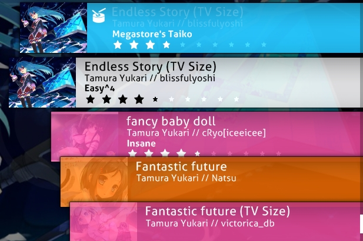

<!--Logo definitions-->
[Osu!]: /wiki/shared/mode/osu.png
[Taiko]: /wiki/shared/mode/taiko.png
[Ctb]: /wiki/shared/mode/catch.png
[Mania]: /wiki/shared/mode/mania.png
[Heart]: /wiki/shared/icon/heart.gif
[Fire]: /wiki/shared/icon/flame.gif

# Interfejs

## Menu główne

[Osu!cookie](/wiki/Glossary/#cookie) pulsuje zgodnie z [BPM](/wiki/Glossary/#BPM) piosenki aktualnie granej w menu głównym. Dodatkowo, z osu!cookie będą wysuwały się prostokąty, zależnie od głośnością piosenki. Jeżeli nie gra żadna muzyka, pulsuje w wolnym tempie 60 BPM. Elementy menu głównego to:

-   \[2\] Kliknij Play (`P`) lub logo osu!, by przejść do wyboru piosenek w trybie jednoosobowym.
-   \[3\] Kliknij Edit (`E`), aby przejść do wyboru piosenek w trybie edycji.
-   \[4\] Kliknij Options (`O`), aby przejść do ustawień gry.
-   \[5\] Kliknij Exit (`Esc`), aby wyjść z gry.
-   \[6\] Losowa porada jest wyświetlana pod menu.
-   \[7\] W lewym dolnym rogu znajduje się link do strony osu! oraz informacje o prawach autorskich.
-   \[8\] Symbol łączenia się z [Bancho](/wiki/Glossary/#Bancho)! Nie jest przedstawiony na tym zdjęciu, jednak wygląda jak ogniwo łańcucha.
-   \[9\] W prawym dolnym rogu znajdują się opcje rozwijanego [czatu](/wiki/Chat_Console) (nazwanego tutaj "Listą Graczy") oraz regularne okno czatu (skróty to kolejno `F8` i `F9`).
-   \[10\] W prawym górnym rogu znajduje się szafa grająca osu!, która gra piosenki w losowej kolejności. Na górze wyświetlana jest aktualnie odtwarzana piosenka. Przyciski od lewej do prawej mają funkcję:
    - Poprzedni Utwór
    - Odtwarzanie
    - Pauza
    - Stop (różnica pomiędzy Pauzą a Stopem polega na tym, że przycisk Stop cofa utwór do jego początku, natomiast Pauza zatrzymuje na danym momencie)
    - Następny Utwór
    - Zobacz Informacje o Utworze. Ten przycisk przełącza górny pasek wyświetlający informację o utworze pomiędzy trybem stałym a tymczasowym. Jeżeli jest w trybie stałym, pasek informacyjny zostanie widoczny, dopóki nie zaniknie razem z resztą interfejsu. Jeżeli jest w trybie tymczasowym, zaniknie po chwili od wybrania piosenki i pozostanie ukryty, dopóki nie zostanie ponownie włączony lub dopóki nie zagra następny utwór.
-   \[11\] Liczba dostępnych beatmap, informacja o tym, jak długo twój klient osu! jest włączony oraz twój czas systemowy.
-   \[12\] Twój profil, kliknij na niego aby wyświetlić Opcje Użytkownika (patrz pod spodem).

## Opcje Użytkownika

Uzyskaj dostęp do tego ekranu poprzez kliknięcie na swój profil, znajdujący się w lewym górnym rogu menu głównego. Podczas korzystania z ekranu opcji użytkownika nie masz dostępu do Czatu. Możesz wybrać dowolną opcję, naciskając na cyfrę z nią powiązaną:

1. `Zobacz Profil`: Otwiera twoją stronę profilową w domyślnej przeglądarce
2. `Wyloguj Się`: Wyloguj się ze swojego konta (po wylogowaniu, boczny pasek [Opcji](/wiki/Options) poprosi cię o zalogowanie się)
3. `Zmień Avatar`: Otwiera stronę edycji awatara w twojej domyślnej przeglądarce
4. `Zamknij`: Zamyka okno dialogowe

## Menu Rozgrywki

-   Kliknij `Solo` (`P`), aby włączyć tryb jednoosobowy.
-   Kliknij `Multi` (`M`), aby grać z innymi ludźmi. Zostaniesz przeniesiony do Lobby [Trybu Wieloosobowego](/wiki/Multi) (patrz poniżej).
-   Kliknij `Back`, aby powrócić do menu głównego.

## Lobby Trybu Wieloosobowego

*Pełne wyjaśnienie: [Tryb Wieloosobowy](/wiki/Multi)*

1. Twoja ranga w meczu. Jest także wyświetlana obok twojej nazwy użytkownika.
2. Informacje o twoim profilu.
3. Szafa grająca.
4. Lista graczy - wyświetla nazwy użytkownika, rangę (host lub gracz), aktywowane mody (jeżeli są aktywowane, zobacz #7), ich ranking w osu! oraz ich drużynę (jeżeli istnieje na nie podział).
5. Nazwa meczu i ustawienia hasła.
6. Wybrana beatmapa. Wyświetlana dokładnie tak samo jak w ekranie gry jednoosobowej.
7. Mody, które aktywowałeś (zobacz #12), jak również opcja wybrania ich. Opcja "Free Mods" określa, czy gracze mogą samodzielnie wybierać swoje własne mody. Jeżeli jest zaznaczona, gracze mogą wybrać jakąkolwiek kombinację modów, *z wyjątkiem modów zmieniających szybkość beatmapy jak Double Time*. Jeżeli opcja jest odznaczona, host decyduje o tym, jakie mody zostaną użyte. Host może wybrać mody zmieniające szybkość beatmapy, bez względu na to, czy opcja jest zaznaczona.
8. Tryb drużynowy i warunki wygranej.
9. Przycisk gotowości do gry.
10. [Konsola czatu](/wiki/Chat_Console).
11. Przycisk wyjścia z meczu.
12. Tam pojawiają się twoje aktywne mody.

### Ekran Wyboru Piosenki

Możesz odróżnić aktualnie wybrany tryb gry poprzez spojrzenie na ikonę w prawym dolnym rogu, nad przyciskiem Mode lub na transparentną ikonę na środku ekranu. Oto cztery ikony, które możesz zobaczyć:

- ![][Osu!] oznacza [osu!standard](/wiki/osu!)
- ![][Taiko] oznacza [osu!taiko](/wiki/osu!taiko)
- ![][Ctb] oznacza [osu!catch](/wiki/osu!catch)
- ![][Mania] oznacza [osu!mania](/wiki/osu!mania)

Zanim przejdziemy dalej, trzeba wspomnieć o tym, że ten ekran ma zbyt wiele elementów, by oznaczyć je za pomocą prostych numerków. Podsekcje poniżej będą skupiały się na małych częściach ekranu, zaczynając od góry do dołu i idąc od lewej do prawej.

### Informacje o Beatmapach

Ta część wyświetla *informacje na temat poziomu trudności aktualnie wybranej beatmapy*. Domyślnie, beatmapa, której piosenkę słyszymy poprzez szafę grającą osu!, jest automatycznie wybierana gdy przechodzimy do ekranu wyboru piosenki. W lewym górnym rogu wyświetlona jest informacja o statusie rankingowym beatmapy. Obok znajduje się tytuł. Domyślnie, wyświetlany jest zromanizowany tytuł, lecz jeżeli wybierzesz opcję `Stosuj oryginalne nazewnictwo` w [Opcjach](/wiki/Options/), będzie wyświetlany oryginalny tytuł; tak jak pokazano na obrazku powyżej. Wyświetlany jest także twórca beatmapy, a informacje o beatmapie wyświetlane są pod spodem. Od lewej do prawej wyświetlane są wartości:

- **Długość**: Całkowita długość beatmapy, od początku do końca, z uwzględnieniem przerw. Nie można jej jednak mylić z [Czasem Poboru Życia](/wiki/Glossary/#drain-time).
- **BPM**: Uderzenia na minutę beatmapy. Jeżeli (tak jak przedstawiono to na dolnym obrazku) wyświetlone są dwie liczby oddzielone myślnikiem oraz jedna w nawiasie, oznacza to, że BPM zmienia się w trakcie trwania piosenki. Pierwsza liczba to najwolniejsze BPM, natomiast druga - najszybsze, a wartość w nawiasie to BPM na początku beatmapy.
- **Obiekty**: Ilość [obiektów](/wiki/Hit_Objects/) na beatmapie.
- **Kółka**: Ilość kółek na beatmapie.
- **Slidery**: Ilość sliderów na beatmapie.
- **Spinnery**: Ilość spinnerów na beatmapie.
- **OD**: Ogólny poziom trudności beatmapy.
- **HP**: Tempo poboru życia. W osu!standard określa on ilość życia jaką tracisz, gdy przegapisz notę, jak szybko samoistnie pobierane jest życie z twojego paska życia i jak dużo życia dostajesz, kiedy uderzysz w notę. W osu!mania działa to podobnie, jedynym  wyjątkiem jest to, że w tym trybie gry życie nie jest samoistnie pobierane z twojego paska życia. W osu!taiko, HP determinuje jak szybko pasek życia się wypełnia oraz jak dużo życia tracisz, gdy przegapisz notę. W osu!catch działa to tak samo jak w osu!standard.
- **Stars**: Trudność beatmapy wyrażona w gwiazdkach. Jest ona także graficznie przedstawiona w prostokącie beatmapy.

### Grupowanie i Sortowanie

Kliknij na zakładki, aby **posortować twoją listę piosenek zgodnie z wybranym kryterium**.

**Grupowanie** - Większość opcji organizuje beatmapy w różne, rozwijane grupy:

- `Bez grup` - Beatmapy nie będą pogrupowane, jednak wciąż posortowane zgodnie z opcją wybraną na liście Sortuj.
- `Po Trudności` - Beatmapy będą pogrupowane względem  trudności w gwiazdkach, zaokrąglonej do najbliższej liczby całkowitej.
- `Po Wykonawcy` - Beatmapy będą pogrupowane względem pierwszej litery nazwy/imienia wykonawcy.
- `Ostatnio Zagrane` - Beatmapy będą pogrupowane względem ostatniego zagrania.
- `Zbiory` - Ta opcja wyświetli zbiory, które stworzyłeś. *Notka: Ta opcja ukryje beatmapy, które nie są częścią twoich zbiorów!*
- `Po BPM` - Beatmapy będą pogrupowane względem BPM w grupach co 60 BPM, zaczynając od 120.
- `Po Twórcy` - Beatmapy będą pogrupowane względem pierwszej litery nazwy/imienia twórcy.
- `Po Dacie Dodania` - Beatmapy będą pogrupowane względem czasu, kiedy zostały dodane, licząc od dzisiaj do maksymalnie 4 miesięcy wstecz.
- `Po Długości` - Beatmapy będą pogrupowane względem długości: 1 minuta lub mniej, 2 minuty lub mniej, 3, 4, 5 i 10.
- `Po Trybie Gry` - Beatmapy będą pogrupowane względem trybu gry, dla którego zostały stworzone.
- `Po Uzyskanej Ocenie` - Beatmapy będą pogrupowane względem najwyższej uzyskanej oceny.
- `Po Tytule` - Beatmapy będą pogrupowane względem pierwszej litery tytułu.
- `Ulubione` - Zostaną wyświetlone tylko beatmapy, które dodałeś do ulubionych online.
- `Moje Mapy` - Zostaną wyświetlone tylko beatmapy, które stworzyłeś (tzn. beatmapy, których nazwa twórcy zgadza się z twoją nazwąz użytkownika).
- `Stan Rankingu` - Beatmapy będą pogrupowane względem statusu rankingowego: rankingowe, oczekujące, niewysłane i loved.
Pierwsze pięć grupowań dostępnych jest jako karty nad rozwijanymi listami Grupuj i Sortuj.

**Sortowanie** - Sortuje beatmapy w określonej kolejności.

- `Po Wykonawcy` - Beatmapy będą posortowane alfabetycznie względem pierwszej litery nazwy/imienia wykonawcy.
- `Po BPM` - Beatmapy będą posortowane względem BPM, od najmniejszego do największego. Dla beatmap ze zmiennym BPM zostanie użyta najwyższa wartość.
- `Po Twórcy` - Beatmapy będą posortowane alfabetycznie względem pierwszej litery nazwy/imienia twórcy.
- `Po Dacie Dodania` - Beatmapy będą posortowane względem daty dodania, od najnowszej do najstarszej.
- `Po Trudności` - Beatmapy będą posortowane względem trudności w gwiazdkach, od najłatwiejszej do najtrudniejszej.
- `Po Długości` - Beatmapy będą posortowane względem długości, od najkrótszej do najdłuższej.
- `Po Uzyskanej Ocenie` - Beatmapy będą posortowane względem uzyskanej oceny, od najlepszej do najgorszej.
- `Po Tytule` - Beatmapy będą posortowane alfabetycznie względem pierwszej litery tytułu.

## Wyszukiwanie

*Notka: Podczas wyszukiwania piosenek czat oraz pasek ustawień muszą być zamknięte, w przeciwnym razie wszystko co piszesz, zostanie uznane za wiadomość na czacie lub wyszukiwanie w ustawieniach.*

- Tylko beatmapy, które spełniają kryteria wyszukiwania będą wyświetlane, co jest dość oczywiste.
- Dodatkowo, podczas wyszukiwania beatmap możesz użyć filtrów lub przeszukać metadatę. Aby to zrobić użyj filtrów przedstawionych poniżej wraz z symbolem: `=` (równa się) lub `==`, `<` (mniejsze od), `>` (większe od), `<=` (mniejsze lub równe), `>=` (większe lub równe) oraz `!=` (nierówne).
- `ar` - Czas na kliknięcie kółka
- `cs` - Rozmiar Kółek
- `od` - Ogólny Poziom Trudności
- `hp` - Tempo Pobioru Życia
- `keys` - Ilość klaiwiszy (tylko osu!mania)
- `stars` - Poziom Trudności Wyrażony w Gwiazdkach
- `bpm` - Uderzenia na minutę
- `lenght` - Długość mapy w sekundach
- `drain` - Czas Poboru Życia w sekundach
- `mode` - Tryb Gry - możliwe wartości to ``osu``, ``taiko``, ``catchthebeat``, ``mania`` lub w skrócie ``o/t/c/m``.
- `status` - Stan Rankingu - możliwe wartości to ``ranked``, ``approved``, ``pending``, ``notsubmitted``, ``unknown``, ``loved`` lub w skrócie ``r/a/p/n/u/l``.
- `played` - Odstęp czasu, w kórym grałeś daną mapę w dniach.
- `unplayed` - Mapy, których nigdy nie grałeś - bez wartości (użyj ``unplayed=`` dla map, których nigdy nie grałeś i ``unplayed!=`` dla map, które zostały przez ciebie zagrane).
- `speed` - Zapisana prędkość przewijania osu!manii - używaj 0 dla map, których nigdy nie grałeś lub jeżeli opcja [Zapamiętaj szybkość przewijania każdej mapy w osu!manii](/wiki/Options/#Gameplay) jest wyłączona.

### Rankingi

W tej sekcji może znaleźć się wiele komunikatów:

- Komunikat "Not submited" oznacza beatmapę, która nie została przesłana na stronę osu! przy użyciu Systemu Zgłaszania Beatmap.
- Komunikat "Update to latest version" oznacza, że istnieje nowsza wersja beatmapy. Kliknij na komunikat, by ją pobrać.
- **Notka: Procesu aktualizacji beatmapy nie można cofnąć. Jeżeli z jakiegoś powodu chcesz zagrać w starą wersję beatmapy (np. żeby zatrzymać swoje wyniki), nie aktualizuj jej.**
- Komunikat "Latest pending version" oznacza, że beatmapa została przesłana na stronę osu!, jednak nie jest jeszcze rankingowa.
- Jeżeli istnieją wyniki odpowiadające twoim ustawieniom wyświetlania, zostaną wyświetlone zamiast komunikatu określającego status beatmapy. Jest to przedstawione na obrazku powyżej.
- Twój wynik będzie wyświetlany na spodzie rankingów publicznych (np. Globalnych, Znajomych, itd.), tak samo jak twoje miejsce w rankingu.
- Komunikat "No records set!" oznacza, że dla danej beatmapy nie ma dostępnych powtórek zgodnych z twoimi ustawieniami wyświetlania (jest to głównie zauważalne podczas wyświetlania rankingu lokalnego, jeśli dopiero pobrałeś lub edytowałeś mapę).
- Notka: Wyniki w grze wieloosobowej nie są liczone jako powtórki.

Dostępne ustawienia wyświetlania:

- Ranking Lokalny
- Ranking Krajowy\*
- Ranking Globalny
- Ranking Globalby (Wybrane Mody)\*
- Ranking Znajomych\*

\*Musisz posiadać [status donatora](/wiki/osu!supporter), by używać tej funkcji.

Kliknij ikonę dymka, aby przywołać ekran **Szybkiego Dostępu do Mapy w Internecie** dla wybranej beatmapy:

- Naciśnij `1` lub kliknij przycisk z napisem `Lista Map/Wyniki` aby twoja domyślna przeglądarka wyświetliła stronę z listą beatmap dostępnych w danym beatmapsecie oraz z wynikami osiągniętymi na danej beatmapie przez graczy.
- Naciśnij `2` lub kliknij przycisk z napisem `Temat Beatmapy na Forum` aby twoja domyślna przeglądarka wyświetliła temat na forum danego beatmapsetu.
- Naciśnij `3` lub kliknij przycisk z napisem `Szybka Odpowiedź` aby twoja domyślna przeglądarka wyświetliła stronę, na której możesz odpowiedzieć do tematu na forum danego beatmapsetu.
- Naciśnij `4` lub `Esc` albo kliknij na przycisk z napisem `Anuluj` aby przejść do Ekranu Wyboru Piosenki.

Kiedy wyświetlany jest ekran Szybkiego Dostępu do Mapy w Internecie, nie możesz korzystać z Konsoli Czatu oraz Konsoli Rozwijanego Czatu.

### Piosenka

Lista piosenek wyświetla wszystkie dostępne beatmapy. Każda beatmapa oznaczona jest jakimś kolorem:

- **Różowy**: Ta beatmapa nie została jeszcze przez ciebie zagrana.
- **Pomarańczowy**: Ta beatmapa została zagrana lub wszystkie beatmapy z danego beatmapsetu zostały zagrane.
- **Jasny Niebieski**: Inne beatmapy w tym samym beatmapsecie, widoczne gdy beatmapset jest rozwinięty.
- **Biały**: Aktualnie wybrana beatmapa.

Możesz nawigować listą beatmap przy użyciu kółka myszy, strzałek w górę oraz w dół, poprzez przeciąganie listy za pomocą lewego przycisku myszy lub poprzez kliknięcie prawym przyciskiem myszy (metoda zwana wcześniej Absolutnym Przewijaniem), co przewinie listę do pozycji Y twojego kursora. Aby wybrać beatmapę kliknij na nią lewym przyciskiem myszy - gdy to zrobisz, w lewym górnym rogu pojawią się informacje o beatmapie; po lewej twoje najlepsze wyniki (jeżeli takie istnieją) i jeżeli przeszedłeś daną mapę - ocena twojego najlepszego wyniku przedstawiona za pomocą litery. Naciśnij na beatmapę jeszcze raz, `Enter` lub osu!cookie w prawej dolnej części ekranu aby włączyć beatmapę.

### Przybornik Gry

Ta sekcja może być nazywana przybornikiem gry. Omówimy użycie każdego przycisku od lewej do prawej.

Naciśnij `Esc` lub kliknij przycisk z  `Back` aby powrócić do menu głównego.

Naciśnij przycisk z  `Mode` aby otworzyć listę dostępnych trybów gry. Kliknij na ikonkę trybu gry, który najbardziej ci odpowiada a osu! zmieni go dla ciebie - tablice wyników odpowiednio się zmienią. Możesz także nacisnąć `Ctrl` a następnie `1` (osu!standard), `2` (osu!taiko), `3` (osu!catch) lub `4` (osu!mania) by zmienić tryb gry.

Transparentna ikona w tle oraz przycisk "Mode" zmienią się tak by przedstawić aktualnie wybrany tryb gry.

Kliknij przycisk z `Mods` lub naciśnij `F1` aby wyświetlić **[Ekran Wyboru Modów](/wiki/Game_Modifiers/)**.

Na tym ekranie możesz zastosować modyfikacje (w skrócie "mody") zmieniające rozgrywkę. Niektóre mody zmniejszają poziom trudności i nakładają mnożnik, który pomniejszy wynik jaki osiągniesz, za to inne zwiekszają poziom trudności i nakładają mnożnik, który powiększy wynik jaki osiągniesz. Niektóre mody zmieniają rozgrywkę w zupełnie inny sposób. [Relax](/wiki/Game_Modifiers/#Relax) i [Auto Pilot](/wiki/Game_Modifiers/#Auto_Pilot) należą do tej kategorii.
Najedź kursorem na ikonkę moda aby zobaczyć krótki opis tego, jak zmienia rozgrywkę. Kliknij na ikonkę by zaznaczyć lub odznaczyć tego moda. Niektóre mody, takie jak Double Time, mają różne wariacje; kliknij na nie ponownie, by przejść dalej. Wartość mnożnika wyświetla łączny efekt jaki mody, które wybrałeś bedą miały na twój wynik. Kliknij `Resetuj mody` lub naciśnij `1` aby odznaczyć wszystkie aktualnie wybrane mody. Kliknij `Zamknij` lub naciśnij `2` albo `Esc` aby powrócić do Ekranu Wyboru Piosenki.

Gdy znajdujesz się na Ekranie Wyboru Modów nie możesz korzystać z Konsoli Czatu oraz Konsoli Rozwijanego Czatu. Skórki mogą zmienić tekst lub ikonę moda, ale nigdy nie zmienią jego efektu.

Kliknij przycisk `Random` lub naciśnij `F2` aby **wylosować beatmapę**. Dopóki gra nie ukończy losowania nie możesz wybrać beatmapy samemu.

*Notka: Możesz nacisnąć `Shift` + przycisk `Random` lub `F2` aby powrócić do mapy zaznaczonej przed losowaniem.*

Kliknij na przycisk `Beatmap Options` lub naciśnij `F3` albo naciśnij na beatmapę prawym przyciskiem myszy aby przywołać **Menu Opcji Beatmapy, dla aktualnie wybranej beatmapy**.

-   Naciśnij `1` lub kliknij przycisk `Zarządzaj kolekcjami` aby przywołać ekran Kolekcji - tutaj możesz zarządzać wcześniej stworzonymi kolekcjami oraz dodać lub usunąć aktualnie wybraną beatmapę z/do kolekcji.
-   Naciśnij `2` lub kliknij przycisk `Usuń...` aby usunąć \[1\] aktualnie wybrany mapset, \[2\] aktualnie wybraną beatmapę lub \[3\] usunąć wszystkie beatmapy.
    - Zauważ, że usunięte beatmapy są przenoszone do kosza.
-   Naciśnij `3` lub kliknij przycisk `Zaznacz jako zagrane` aby oznaczyć mapę, której nigdy nie grałeś jako zagraną (zmienić kolor jej oznaczenia z różowego na pomarańczowy).
-   Naciśnij `4` lub kliknij przycisk `Wyczyść wyniki lokalne` aby usunąć wszystkie wyniki, które osiągnąłeś na danej beatmapie.
-   Naciśnij `5` lub kliknij przycisk `Edytuj` aby otworzyć wybraną mapę w edytorze osu!
-   Naciśnij `6` lub `Esc` albo kliknij przycisk `Zamknij` aby powrócić do Ekranu Wyboru Piosenki.

Kliknij na **twój panel użytkownika** aby uzyskać dostęp do **Menu Opcji Użytkownika**.

Kliknij **[osu!cookie](/wiki/cookie)** aby **włączyć wybraną beatmapę**.

## Ekran Rankingowy

### Ekran Oceny

Tak wygląda ekran oceny zaraz po tym, gdy przejdziesz mapę. Możesz uzyskać dostęp do wyników online, przewijając w dół lub naciskając oczywisty przycisk.

**Notka:** Wygląd oceny będzie się zmieniał w zależności od użytej skórki.

Pod spodem znajdują się ekrany ocen innych trybów gry.

### Ranking Online

To jest twój ranking online. Możesz do niego przejść poprzez przewinięcie w dół na ekranie oceny. Twój Ranking Lokalny będzie pokazywać twoją nazwę użytkownika oraz wynik, tak jak zwykle.

1. Tutaj możesz zmienić nazwę użytkownika wyświetlaną przy tym wyniku.
2. Twój pasek gracza. Pokazuje twoje [PP](/wiki/pp), twój Ranking Globalny, Całkowity Wynik i Ogólną [Precyzję](/wiki/Accuracy) wraz z paskiem doświadczenia.
3. Twoje opcje dotyczące beatmapy.
    1.  Zapisz powtórkę jako plik `.osr`.
    2.  Dodaj beatmapę do ulubionych. Twoje ulubione beatmapy są wyświetlane w sekcji "Ulubione beatmapy".
4. Tutaj widzimy jak bardzo spadłeś lub wskoczyłeś w Rankingu Globalnym, jak dużo punktów zostało dodanych do twojego Całkowitego Wyniku oraz jak bardzo zmieniła się twoja Całkowita Prezycja, dzięki zagraniu tej beatmapy.
5. Tu chyba nic nie trzeba wyjaśniać. Nie pojawi się, jeżeli jesteś offline lub beatmapa została zaktualizowana.
    1.  Ranking: Twoje miejsce w Rankingu Ogólnym mapy. Obejmuje także powtórki zawierające mody, nawet jeżeli sam żadnych nie używałeś.
    2.  Ogólne: Twoje miejsce w Rankingu Ogólnym trybu gry, w którym obecnie się znajdujesz, nie tylko w rankingu beatmapy.
    3.  Precyzja: Będzie naliczana tylko wtedy, kiedy pobijesz swój poprzedni rekord. Jest średnią wszystkich beatmap, które przeszedłeś.
    4.  Rankingowy wynik: Twój wynik rankingowy. Jeżeli jest to zatwierdzona beatmapa, nie podniesie się wcale.
    5.  Łączny wynik: Twój wynik całkowity. Wzrośnie nawet jeżeli nie przejdziesz beatmapy lub nie pobijesz swojego poprzedniego wyniku.
    6.  Do następnego miejsca: Jak dużo punktów potrzebujesz aby wznieść się w rankingu beatmapy.
6. To samo co w punkcie 4, jednak pojawiają się tutaj tylko comiesięczne [Rankingi](https://osu.ppy.sh/p/chart)
7. Beatmapa wraz z historią zagrań i wkaźnikiem przejścia.
8. Ocena mapy. Szczerze oceń mapę. Jeżeli nie możesz się zdecydować - pomiń ocenianie.
9. Wróć do Wyboru Piosenki.

Na górze widzimy, jak wygląda zdobycie medalu.
 
