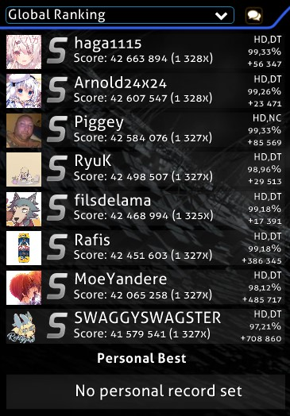
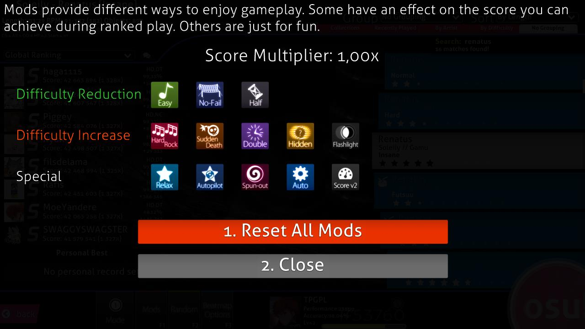

<!-- TODO: formatting kinda sucks. removed `needs_cleanup` tag because at least it gets the job done by explaining the images -->

# Интерфейс

## Главное меню

[Osu!cookie](/wiki/Glossary#cookie) \[1\] пульсирует согласно [BPM](/wiki/Beatmapping/Beats_per_minute) любой песни, которая играет в главном меню. К тому же, линии выходят из osu!cookie в соответствии с громкостью песни. Если ни одна песня не играет, osu!cookie пульсирует на медленных 60 BPM. Элементы главного меню следующие:

- \[2\] Нажмите Play (`P`) или на логотип, чтобы переключиться на экран выбора песни для одиночного режима
- \[3\] Нажмите Edit (`E`), чтобы открыть экран выбора песни для для режима редактора.
- \[4\] Нажмите Options (`O`), чтобы открыть меню настроек.
- \[5\] Нажмите Exit (`Esc`), чтобы выйти из osu!.
- \[6\] Случайный полезный совет отображается под меню.
- \[7\] В левом нижнем углу находится ссылка на сайт osu! и информация об авторском праве.
- \[8\] Результат подключения к [Bancho](/wiki/Glossary#bancho)! На этой картинке не показано, но результат подключения выглядит как звено цепи.
- \[9\] Снизу справа находятся кнопки управления чатом для отображения расширенного [окна чата](/wiki/Chat_Console) (названного "Online users" здесь) и обычного окна чата (`F9` & `F8` соответственно).
- \[10\] Сверху справа растположен музыкальный проигрыватель osu!, который проигрывает песни в случайном порядке. Наверху показана песня, играющая в настоящий момент. Кнопки, слева направо, делают следующее:
  - Предыдущий трек
  - Играть
  - Пауза
  - Остановить (различие между паузой и остановкой в том, что остановка сбросит песню к началу, тогда как пауза просто приостановит воспроизведение)
  - Следующий трек
  - Показать информацию о песне. Кнопка переключает верхнюю полосу, отображающую информацию о песне, между режимами постоянного и временного отображения. Когда включен первый, полоса с информацией останется видимой до тех пор, пока её не закроет другая часть пользовательского интерфейса. В режиме временного отображения она пропадёт спустя небольшое время после выбора песни. Полоса останется невидимой, пока её не включат, или не запустится другая песня.
- \[11\] Число доступных карт, как долго работает osu!client и время на системных часах компьютера.
- \[12\] Ваш профиль, нажмите, чтобы отобразить настройки пользователя (смотри ниже).

## Настройки пользователя

Откройте это меню нажатием на ваш профиль в левом верхнем углу главного меню. Вы не можете открыть окна чата, пока просматриваете меню настроек пользователя. Вы можете выбрать любой элемент нажатием соответствующей цифры:

1. `Открыть профиль`: Открывает страницу вашего профиля в браузере по умолчанию на вашем компьютере.
2. `Выйти`: Позволяет выйти из аккаунта (после выхода [меню настроек](/wiki/Options) сбоку предложит вам войти).
3. `Поменять аватарку`: Открывает страницу изменения аватарки в браузере по умолчанию на вашем компьютере.
4. `Отмена`: Закрывает это меню

## Игровое меню

- Нажмите `Solo` (`P`), чтобы играть одному.
- Нажмите `Multi` (`M`), чтобы играть с другими людьми. Вы будете перенаправлены на лобби the [мультиплеера](/wiki/Multi) (смотри ниже).
- Нажмите `Back`, чтобы вернуться в главное меню.

## Лобби мультиплеера

*Основная страница: [Мультиплеер](/wiki/Multi)*

1. Ваш статус в матче. Также показывается рядом с вашим именем.
2. Информация о вашем профиле.
3. Проигрыватель.
4. Список игроков - показывает имена игроков, их статус (хост или игрок), их активированные [моды](/wiki/Game_modifier) (если такие есть, смотри \#7), их рейтинг в osu! и их команду (если это применимо).
5. Название матча и настройка пароля.
6. Выбранная карта. Показывает карту так, как она бы выглядела на экране выбора песни одиночного режима.
7. [Моды](/wiki/Game_modifier), которые вы активировали (смотри #12), а также кнопка для их выбора. Настройка "Свободные моды" определяет, могут ли игроки выбирать моды на своё усмотрение. Если да, они могут задать любую комбинацию модов, *кроме модов, изменяющих скорость, например, [Double Time](/wiki/Game_modifier/Double_Time)*. Если нет, хост определяет, какие моды будут использованы. Хост может выбирать влияющие на скорость моды независимо от того, включены ли "Свободные моды".
8. Режим игры и условие победы.
9. Конпка "Можно начинать".
10. [Окно чата](/wiki/Chat_Console).
11. Кнопка "Покинуть комнату".
12. Выбранные вами моды.

## Экран выбора песни

Вы можете определить выбранный режим игры, посмотрев на иконку снизу слева, над "Mode" или на прозрачную иконку в центре экрана. Вы можете увидеть четыре варианта:

-  - [osu!](/wiki/Game_mode/osu!)
-  - [osu!taiko](/wiki/Game_mode/osu!taiko)
-  - [osu!catch](/wiki/Game_mode/osu!catch)
-  - [osu!mania](/wiki/Game_mode/osu!mania)

Прежде чем продолжить, этот экран имеет слишком много элементов, чтобы поверхностно их рассмотреть, значительное число. В подразделах ниже будут рассмотрены части этого экрана по-отдельности, сверху вниз и слева направо.

### Информация о карте

Эта область показывает **информацию о сложности выбранной карты.** По умолчанию карта, песню которой играет проигрыватель osu!, будет выбрана при открытии экрана выбора песни. В левом верхнем углу расположен статус ранкинга карты. Далее идёт её название. Обычно показывается романизированное название, но если вы выбрали `Метаданные на языке оригинала` в [настройках](/wiki/Options), он будет в формате Юникода; это показано на верхней картинке. Автор карты также указывается, а информация о карте расположена ниже. Слева направо, значения обозначают следующее:

- **Длина**: Общая длительность карты, от начала до конца, включая перерывы. Не путать с [drain time](/wiki/Glossary#drain-time).
- **BPM**: BPM карты. Если указано два значения BPM, и одно из них взято в скобки (как на картинке ниже), это означает, что BPM меняется на протяжении песни. Они показывают наименьший и наибольший BPM, а значение в скобках - BPM в начале карты.
- **Объекты**: Общее количество [игровых объектов](/wiki/Hit_Objects) карты.
- **Ноты**: Общее количество нот карты.
- **Слайдеры**: Общее количество слайдеров карты.
- **Спиннеры**: Общее количество спиннеров карты.
- **OD**: Общая сложность карты.
- **HP**: Скорость убывания HP. В osu! показывает, как много HP вы теряете при промахе, как быстро полоса убывает в состоянии покоя, сколько HP восстанавливается при попадании по ноте. В osu!mania показывает то же, исключая убывание в состоянии покоя. В osu!taiko определяет, как медленно заполняется полоса HP и как много HP теряется при промахе. В osu!catch показывает то же, что и в osu!.
- **Stars**: Сложность карты, выраженная в звёздах. Также графически отображается на прямоугольнике карты.

### Группировать и сортировать

Нажмите на одну из вкладок, чтобы **отсортировать список песен согласно выбранным критериям**.

**Группировать** - Большинство опций организуют карты в различные расширяемые группы:

- `Всё вместе` - Карты не будут объединены в группы, но по-прежнему будут упорядочены, как указано в поле Сортировать.
- `По сложности` - Карты будут сгруппированы по сложности в звёздах, округлённой до ближайшего целого числа.
- `По артисту` - Карты будут сгруппированы по первой букве имени исполнителя.
- `По дате игры` - Карты будут сгруппированы по дате последней игры.
- `Коллекции` - Показывает созданные вами коллекции. *Обратите внимание, что карты, не помещённые в коллекции, не будут показаны!*
- `По BPM` - Карты будут сгруппированы в соответствии с BPM, кратным 60, начиная со 120.
- `По автору` - Карты будут сгруппированы по первой букве имени создателя карты.
- `По дате добавления` - Карты будут сгруппированы согласно дате их добавления, с текущего дня до 4+ месяцев назад when they were added, from today to 4+ months ago.
- `По длине` - Карты будут сгруппированы согласно их длительности: 1 минута или меньше, 2 минуты или меньше, 3, 4, 5 и 10.
- `По режиму` - Карты будут сгруппированы в соответствии с их режимом игры.
- `По результатам` - Карты будут сгруппированы по высшему рангу, полученному на них.
- `По названию` - Карты будут сгруппированы по первой букве их названия.
- `Избранное` - Только карты, которые вы пометили как избранные на сайте, будут показаны.
- `Мои карты` - Только карты, которые вы создали (то есть имена их создателей совпадают с вашим) будут показаны.
- `По статусу` - Карты будут сгруппированы по сатусу их ранкинга: ранкнутые, ожидающие, неопубликованные, неизвестные или любимые.

Первые пять вариантов группировки доступны во вкладках ниже Группировать и Сортировать.

**Сортировать** - Сортирует карты в заданном порядке

- `По артисту` - Карты будут отсортированы в алфавитном порядке по первой букве имени артиста.
- `По BPM` - Карты будут отсортированы в порядке возрастания по их BPM. Для карт с множественным BPM будет использовано наибольшее значение.
- `По автору` - Карты будут отсортированы в алфавитном порядке по первой букве имени автора.
- `По дате добавления` - Карты будут отсортированы давно добавленных до недовно добавленных.
- `По сложности` - Карты будут отсортированы от простых к сложным по звёздам. *Обратите внимание, что это разделит мапсеты!*
- `По длине` - Карты будут отсортированы в порядке возрастания их длительности.
- `По результатам` - Карты будут отсортированы от худших к лучшим результатам, полученным на них.
- `По названию` - Карты будут отсортированы в алфавитном порядке по первой букве их названия.

### Поиск

*Обратите внимание: Вы не можете оставить открытыми окно чата или боковое меню настроек, если вы хотите воспользоваться поиском карт, в противном случае всё, что вы напишете будет восприниматься как текст сообщения или как поиск настроек.*

Только карты, отвечающие критериям поиска будут показаны. По умолчанию любой поисковый запрос будет сравниваться с артистом, названием, создателем и тегами карты.

В дополнение к поиску по этим полям, вы можете использовать фильтры, чтобы искать по другим метаданным, объединяя один из поддерживаемых фильтров и сравнение со значением (например, `ar=9`).

Поддерживаемые фильтры:

- `artist`: Имя артиста
- `creator`: Имя создателя карты
- `ar`: Approach Rate (время появления нот)
- `cs`: Circle Size (размер нот)
- `od`: Overall Difficulty (общая сложность)
- `hp`: HP Drain Rate (скорость убывания HP)
- `keys`: Количество клавиш (только для osu!mania и конвертированных карт)
- `stars`: Star Difficulty (сложность в звёздах)
- `bpm`: Beats per minute (удары в минуту)
- `length`: Длина в секундах
- `drain`: Drain Time (длина карты, не считая перерывов) в секундах
- `mode`: Режим. Может быть `osu`, `taiko`, `catchthebeat` или `mania` или `o`/`t`/`c`/`m` для краткости.
- `status`: Статус ранкинга. Может быть `ranked`, `approved`, `pending`, `notsubmitted`, `unknown` или `loved` или `r`/`a`/`p`/`n`/`u`/`l` для краткости.
- `played`: Время, прошедшее с последней попытки, в днях.
- `unplayed`: Показывает только несыгранные карты. Не требует значения для сравнения. Значение для этого фильтра будет игнорироваться.
- `speed`: Сохранённая скорость прокрутки для osu!mania. Всегда 0 для несыгранных карт или если опция [Своя скорость для каждой карты osu!mania](/wiki/Options#gameplay) выключена.

Поддерживаемые сравнения:

- `=` или `==`: Равно
- `!=`: Неравно
- `<`: Меньше чем
- `>`: Больше чем
- `<=`: Меньше или равно
- `>=`: Больше или равно

### Рекорды

 В этом месте могут появиться различные надписи:

- Надпись "Not Submitted" указывает на то, что карта не была загружена на сайт osu!, используя Систему Представления Карт или была удалена её создателем.
- Надпись "Update to latest version" появляется, если есть новая версия карты, доступная для скачивания. Нажмите на кнопку, чтобы обновить карту.
  - **Обратите внимание:** обновление карты необратимо. Если вы хотите сохранить старую версию по какой-то причине (скажем, для сохранения очков), то не обновляйте её.
- Надпись "Latest pending version" означает, что карта была загружена на сайт osu!, но она пока не оценена.
- Если есть рекорды, соответствующие настройкам просмотра карты, они будут отображены вместо надписей, обозначающих статус карты. Это показано на картинке выше.
  - Под публичными результатами (например, топ мира, топ друзей, и т.д.), будет показан ваш лучший результат и место в топе лидеров.
- Надпись "No records set!" означает, что не установлены рекорды для текущего режима просмотра (обычно надпись появляется в Локальном топе, если вы только что скачали или отредактировали карту).
  - Обратите внимание: результат в мультиплеере не считается рекордом.

Существуют следующие настройки просмотра:

- Локальный топ
- Топ страны\*
- Топ мира
- Топ мира (выбранные моды)\*
- Топ друзей\*

\*Требует тег [osu!supporter](/wiki/osu!supporter) для использования.

Нажмите на маленький значок кружка для слов рядом с меню выбора режима просмотра, чтобы вызвать **Ссылки, связанные с этой картой** для выбранной карты:

- Нажмите `1` или кнопку `Рекорды и информация о карте`, и ваш браузер по умолчанию откроет страницу с подробной информацией о мапсете, в который входит выбранная карта, и установленными на нём рекордами.
- Нажмите `2` или `Тема карты на форуме`, и ваш интернет-браузер по умолчанию откроет страницу модерации мапсета, в который входит выбранная карта.
- Нажмите `3`, или `Esc`, или `Отмена`, чтобы вернуться к экрану выбора песни.

Пока вы находитесь в меню "Ссылки, связанные с этой картой", вы не можете открыть окна чата и расширенного чата.

### Песни

Список песен показывает все доступные карты. Разные карты могут иметь разные цвета:

- **Розовый**: Эта карта ещё не сыграна.
- **Оранжевый**: Как минимум одна карта мапсета пройдена.
- **Голубой**: Другие карты одного мапсета, показывается, когда мапсет развёрнут.
- **Белый**: Выбранная карта.

Вы можете перемещаться по списку карт, используя колёсико мыши, стрелки вверх и вниз на клавиатуре, передвигая его курсором при нажатой левой кнопке мыши или нажимая правую кнопку мыши (способ ранее был известен как Абсолютная прокрутка), которая будет перемещать полосу прокрутки в позицию курсора по оси Y. Нажмите на прямоугольник, чтобы выбрать карту и отобразить информацию о ней слева сверху, лучшие результаты (если есть) слева и, если вы очистили их, буквенную оценку лучшего результата, полученного вами. Нажмите ещё раз на прямоугольник, на osu!cookie внизу справа или нажмите `Enter`, чтобы начать играть карту.

### Инструменты геймплея

Этот раздел можно назвать инструментами геймплея. Мы рассмотрим каждую кнопку слева направо.

Нажмите `Esc` или кнопку `Назад` , чтобы вернуться в главное меню.

Нажмите на кнопку `Mode`, чтобы открыть список режимов игры, доступных в osu!. Нажмите на желаемый режим игры, и osu! переключится на него, таблица лидеров изменится в соответствии с выбранным режимом. Также вы можете нажать `Ctrl` и `1` (osu!), `2` (osu!taiko), `3` (osu!catch) или `4` (osu!mania), чтобы изменить режим игры.

Прозрачная иконка фона и кнопка "Mode" изменятся, чтобы отобразить, какой режим выбран в данный момент.

Нажмите на кнопку `Mods` или на `F1`, чтобы открыть **[Окно выбора модификаторов](/wiki/Game_modifier)**.

На этом экране вы можете применить модификации ("моды" для краткости) к геймплею. Некоторые моды понижают сложность и множитель очков, что понижает количество получаемых вами очков. И наоборот, некоторые моды повышают сложность и множитель очков, что увеличивает количество получаемых вами очков. В конце концов, некоторые моды изменяют геймплей по-другому. [Relax](/wiki/Game_modifier/Relax) и [Auto Pilot](/wiki/Game_modifier/Autopilot) попадают в эту категорию.

Наведите курсор на иконку мода, чтобы увидеть краткое описание его действия. Нажмите на иконку, чтобы выбрать или отменить выбор этого мода. Некоторые моды, такие как  Double Time, имеют несколько вариантов; нажимайте на мод, чтобы переключаться между ними. Множитель счёта показывает общий эффект множителей выбранных модов на ваш счёт. Нажмите `Сбросить все моды` или `1`, чтобы отменить выбор всех выбранных модов. Нажмите `Отмена`, или `2`, или `Esc`, чтобы вернуться к экрану выбора песни.

Пока вы находитесь в окне выбора модификаторов, вы не можете получить доступ к чату и расширенному чату. Также скины могут изменять описание и/или иконки модов, но их действие останентся тем же.

Нажмите на кнопку `Random` или `F2`, чтобы дать игре **случайно прокрутить все ваши карты и выбрать одну из них.** Вы не можете выбирать каррты самостоятельно, пока прокрутка не завершится.

*Обратите внимание: Вы можете нажать `Shift` + кнопка `Random` или `F2`, чтобы вернуться к выбранной до активиции случайного выбора карте.*

Нажмите кнопку `Beatmap Options`, `F3` или нажмите правой кнопкой мыши, наведясь на карту, чтобы вызвать **Меню опций карты для взаимодействия с выбранной картой**.

- Нажмите `1` или кнопку `Управление коллекциями`, чтобы отобразить окно коллекций: здесь вы можете управлять ранее созданными коллекциями, добавлять в коллекцию или удалять из неё текущую карту или мапсет.
- Нажмите `2` или `Удалить...`, чтобы удалить \[1\] выбранный мапсет, \[2\] выбранную карту или \[3\] **ВСЕ НАЙДЕННЫЕ карты**.
  - Note that deleted beatmaps are moved to the Recycle Bin.
- Нажмите `3` или `Убрать из несыгранных`, чтобы пометить несыгранную карту как сыгранную (при этом её цвет поменяется с розового на оранжевый).
- Нажмите `4` или `Очистить локальный топ`, чтобы удалить все локальные рекорды, которые вы поставили на этой карте (онлайн-рекорды не удалятся).
- Нажмите `5` или `Редактировать`, чтобы открыть выбранную карту в редакторе osu!.
- Нажмите `6` или `Esc` или нажмите `Отмена`, чтобы вернуться на экран выбора песни.

Нажмите на **панель вашего пользователя**, чтобы открыть **меню настроек пользователя**.

Нажмите **[osu!cookie](/wiki/Glossary#cookie)**, чтобы **начать играть выбранную карту**.

## Экран результатов

Экран результатов показывается после того, как вы успешно прошли карту. Вы можете узнать свои онлайн-результаты, пролистав страницу вниз или нажав соответствующую кнопку.

**Обратите внимание:** вид экрана результатов может отличаться в зависимости от установленного пользовательского скина.

Ниже представлены экраны результатов других режимов игры.

### Онлайн-результат

Это ваши онлайн-результаты. Вы можете посмотреть их, пролистав вниз на экране результатов. Рядом с вашим локальным результатом бодет показано ваше имя и счёт, как обычно.

1. Панель игрока. Показывает ваши [PP](/wiki/Performance_Points), место в топе мира, общий счёт, суммарную [точность](/wiki/Accuracy) и шкалу уровня.
2. `Сохранить реплей`: Вы можете посмотреть свой реплей позже, открыв его из локального топа или из папки `Replays` двойным щелчком.
3. `Добавить в избранное`: Включите карту в ваш список избранного, который расположен на странице вашего профиля osu! в разделе "Карты".
4. Локальный топ: Все ваши результаты хранятся на вашем компьютере. Чтобы увидеть их, перейдите на [экран выбора песни](#song-selection-screen), затем выберите `Локальный топ` из выпадающего меню слева.
5. `Beatmap Ranking`. Доступно только для карт с онлайн-топом ([квалифицированных](/wiki/Beatmap/Category#qualified), [ранкнутых](/wiki/Beatmap/Category#ranked) или [любимых](/wiki/Beatmap/Category#loved)). Вам также нужно быть в сети, чтобы увидеть этот раздел.
   1. `Overall`: Ваша позиция в списке лидеров карты, где вы соревнуетесь с игроками, использующими [моды](/wiki/Game_modifier), даже если вы не используете их.
   2. `Accuracy`: Как [точно](/wiki/Accuracy) вы сыграли карту. Будет обсчитана только когда вы побьёте предыдущий рекорд.
   3. `Max Combo`: Длиннейшее комбо на сыгранной карте.
   4. `Ranked Score`: Ваш [лучший счёт](/wiki/Score#ranked-score) на карте.
   5. `Total Score`: Суммарный счёт. Не учитывается и не влияет на позицию в рейтинге.
   6. `Performance`: Количество [невзвешенных PP](/wiki/Performance_points#why-didnt-i-gain-the-full-amount-of-pp-from-a-map-i-played), которые вы получили за прохождение карты.
6. `Overall Ranking`. Доступно только для карт с онлайн-топом. Вам также нужно быть в сети, чтобы увидеть этот раздел.
   1. `Overall`: Ваш рейтинг в мире.
   2. `Accuracy`: Средняя [точность](/wiki/Accuracy#accuracy) среди всех карт, которые вы сыграли.
   3. `Max Combo`: Длиннейшее комбо среди всех карт, которые вы сыграли.
   4. [`Ranked Score`](/wiki/Score#ranked-score): Число очков, полученных за все ранкнутые карты, которые вы сыграли, каждая считается только один раз.
   5. [`Total Score`](/wiki/Score#total-score): То же, что и ranked score, но учитывает все доступные на сайте osu! карты, а также недоигранные и проваленные попытки. Засчитывается в ваш уровень.
   6. `Perfomance`: Отображает общее количество очков производительности (PP), а также какой вклад внесла эта игра в это количество.
7. Информация о карте: количество игр и процент прохождений.
8. Рейтинг карты. Оцените карту на своё усмотрение, опираясь на то, понравилась ли она вам. Если вы не уверены - лучше не оценивайте.
9. Нажмите здесь, чтобы вернуться на экран выбора песни.

Сверху показано, как выглядит получение медали.
