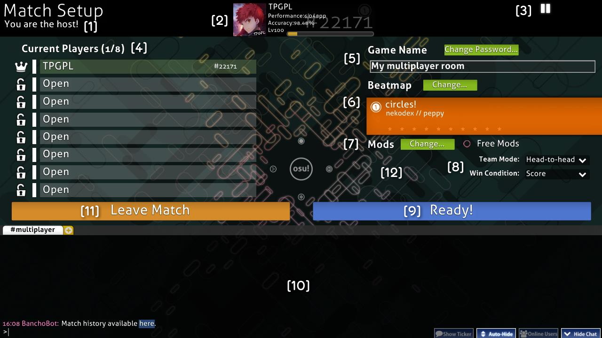
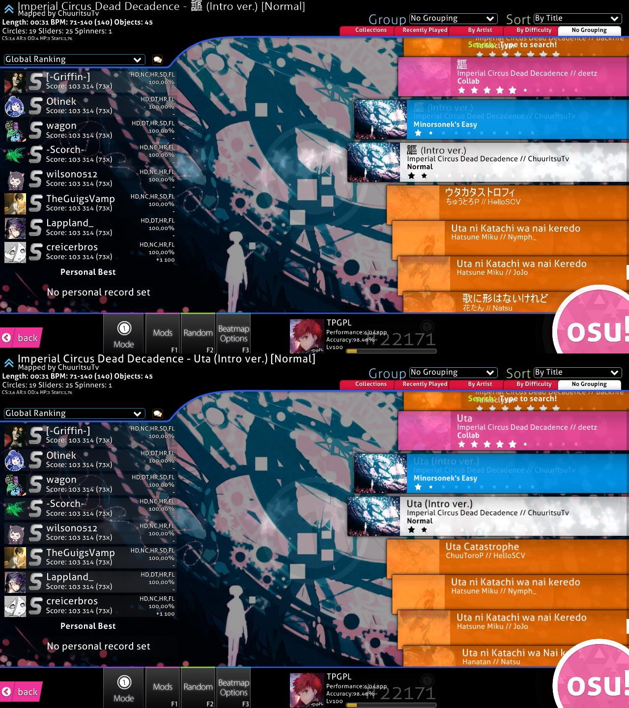
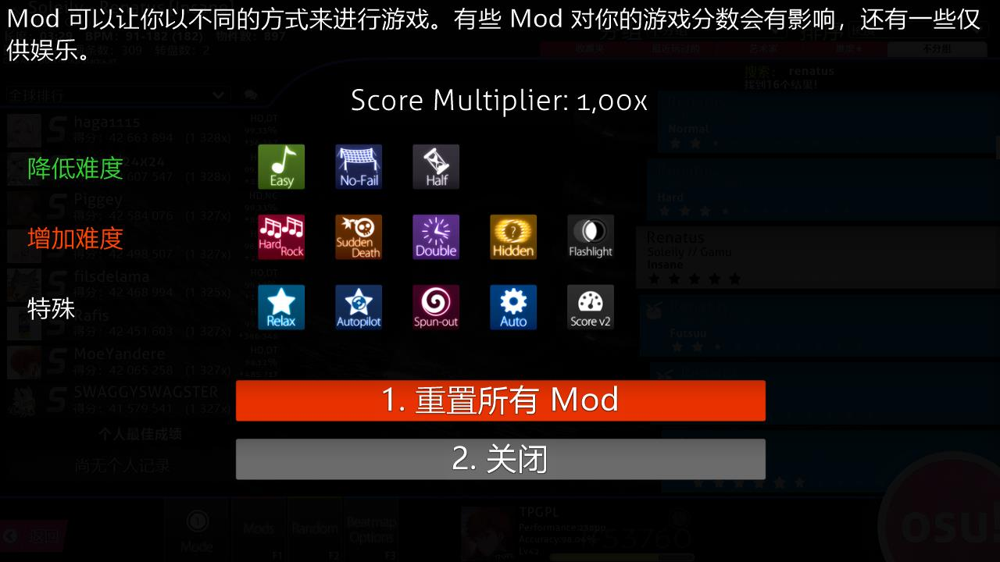
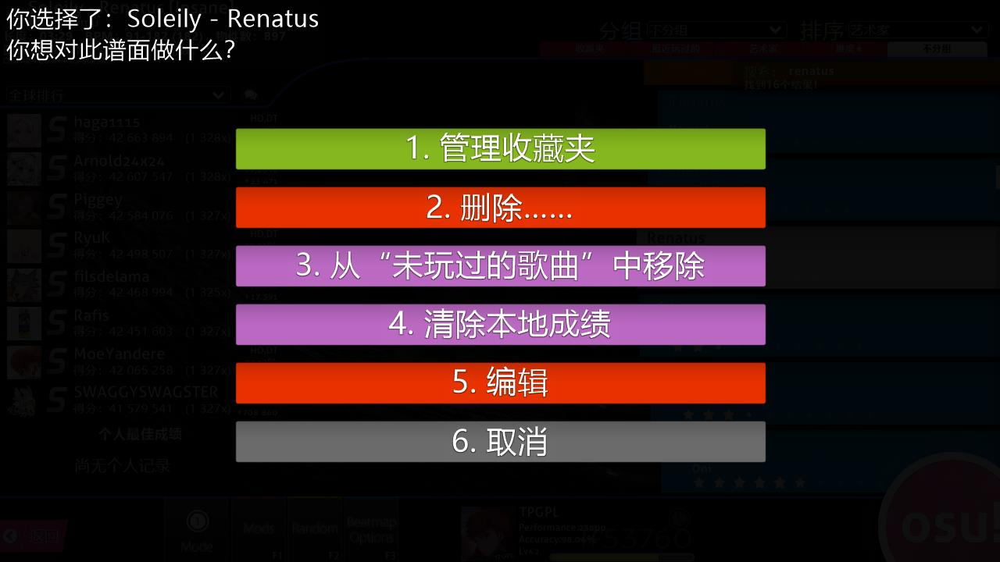
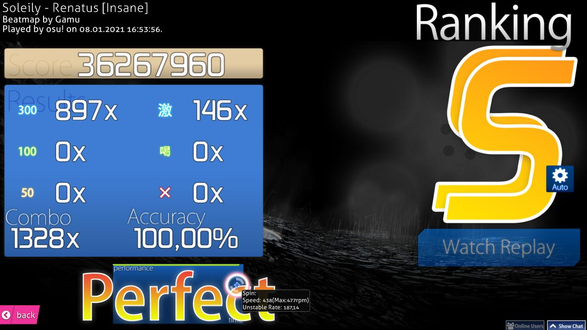
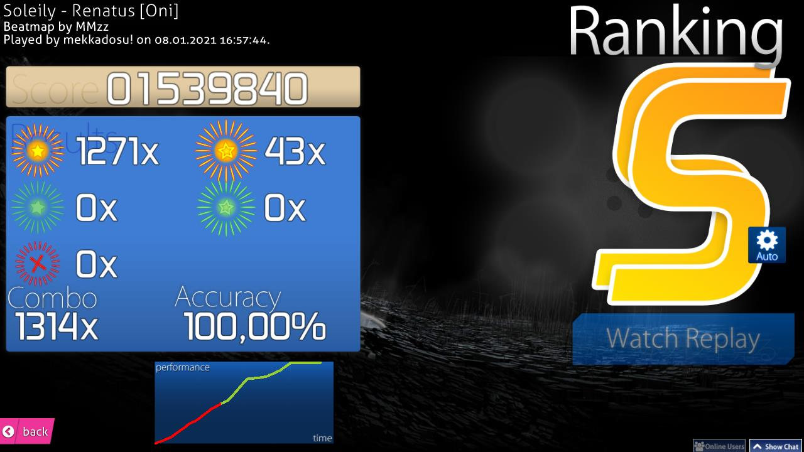
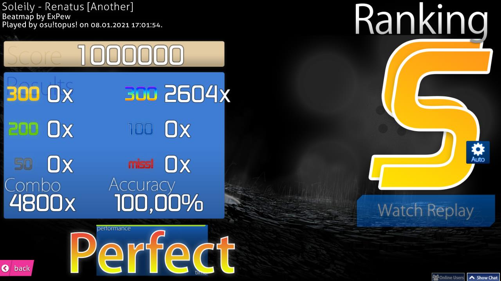
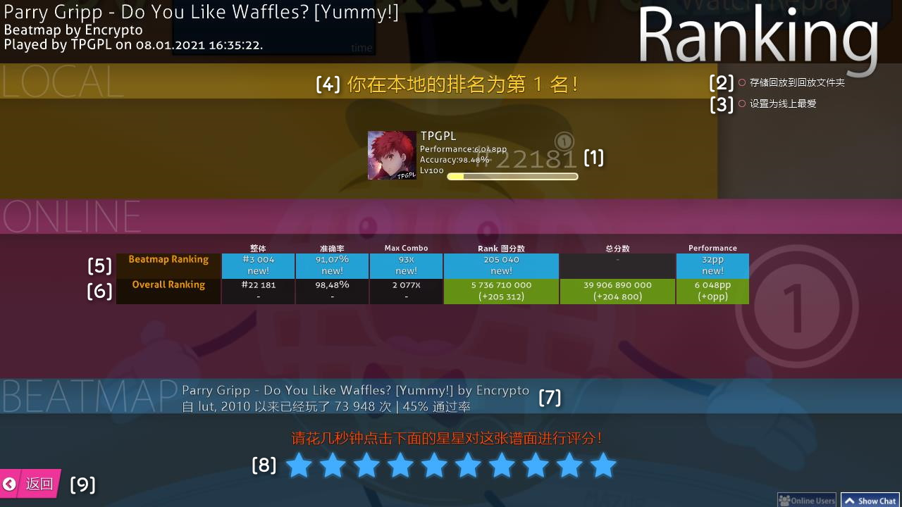
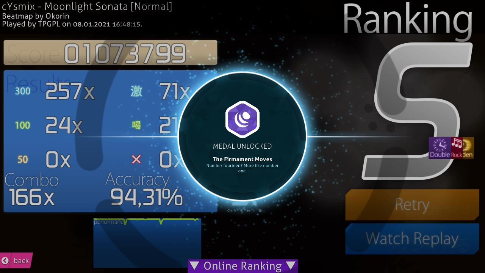

# 界面

## 主菜单

[osu!粉饼](/wiki/Glossary#cookie) \[1\]随着 [BPM](/wiki/Beatmapping/Beats_per_minute) 跳动，此外，从osu!粉饼延伸出来的条的长度与歌曲的音量一致。如果没有在播放歌曲或者暂停播放，osu!粉饼就会以60BPM的速度跳动。主菜单的元素如下：

- \[2\] 点击 Play （`P`） 或者 osu! 标志进入次级选择界面。
- \[3\] 点击 Edit （`E`） 进入地图编辑器的歌曲选择界面。
- \[4\] 点击 Option （`O`） 进入设置界面。
- \[5\] 点击 Exit （`Esc`） 退出 osu!
- \[6\] 在主菜单下方会有随机的游戏提示。
- \[7\] 左下角是 osu! 官网的链接，以及版权信息。
- \[8\] 与[Bancho](/wiki/Glossary#bancho)的连接状态，在这张图总没有显示，但是连接的结果应该像一个链条。
- \[9\] 右下角的是扩展[聊天窗口](/wiki/Chat_Console)的控制开关 (叫做"玩家列表") 和常规聊天窗口 （分别对应 `F9` 和 `F8`）。
- \[10\] 在右上角是osu!随机播放歌曲的控制器。顶部显示了当前正在播放的歌曲。从左到右，这些按钮的作用如下:
  - 上一首
  - 播放
  - 暂停
  - 停止 （与暂停不同的是，点击播放和停止会使歌曲从头播放，而暂停只是单纯的暂停）
  - 下一首
  - 浏览歌曲信息。 这个按钮会切换顶部歌曲信息是永久显示还是临时显示。当设置为永久显示时，歌曲信息将永久显示直到他与其他UI一起淡出。 当设置为临时显示时，他将会在歌曲被选择后一段时间消失直到被状态切换或者播放另一首歌时被唤出。
- \[11\] 你拥有的谱面数量，osu!的运行时间，和你的系统时间。
- \[12\] 用户面板，点击显示用户选项（见下文）。

### 用户选项

点击屏幕左上角的用户面板以打开用户选项。此时将无法使用聊天界面。点击相应的选项以完成操作。

1. `查看个人资料`：在浏览器中打开玩家主页。
2. `注销`：退出登录 （退出登录后，[设置](/wiki/Options) 侧边栏会提醒你登录）。
3. `修改头像`：在浏览器中打开更改头像页面。
4. `关闭` ：关闭此窗口。

## 游戏界面

- 点击 `Solo`（`P`）以进行单机游戏
- 点击 `Multi`（`M`）以进行多人联机，你会被重定向至[多人游戏](/wiki/Multi)大厅（见下文）。
- 点击 `Back` (`B`) 以返回主菜单

### 联机大厅

*详见词条： [Multi](/wiki/Multi)*

1. 你在房间中的身份。这也会显示在你名字前面。
2. 你的个人信息
3. 音乐控制器
4. 玩家列表 - 显示玩家的名字，他们的身份（房主或玩家），他们选择的[mods](/wiki/Game_modifier) （参见 #7），他们的osu!排名和他们的队伍（如果可用）。
5. 房间的名字和密码设定。
6. 选中的谱面。应与在单人模式中相同的样式显示。
7. 选中的[mods](/wiki/Game_modifier) （参见 #12），以及设置，叫做“Free Mods”的选项决定玩家是否能选择自己想使用的mods。如果启用，他们可以选择任意组合的mods*除了影响速度的模组，如[Double Time](/wiki/Game_modifier/Double_Time)。如果禁用，则由房主来决定使用什么模组，房主可以使用影响速度的mods不论Free Mods是否开启。
8. 分组方式和胜利条件，
9. 准备按钮
10. [聊天窗口](/wiki/Chat_Console)。
11. 离开按钮。
12. 你使用的mods。

### 选歌界面

你可以通过左下方的图标上方的模式，屏幕中间的透明图标来确定当前的游戏模式。你一共能看到四个模式：

- 是[osu!](/wiki/Game_mode/osu!)模式。
- 是[osu!taiko](/wiki/Game_mode/osu!taiko)模式。
- 是[osu!catch](/wiki/Game_mode/osu!catch)模式。
- 是[osu!mania](/wiki/Game_mode/osu!mania)模式。

在继续之前，这个界面有太多的元素以至于很难使用数字标记。下面的子节将从上到下，从左到右来介绍界面的每一部分

### 谱面

这里显示**你所选的谱面难度信息**。默认情况下，进入选个界面时选中的谱面是你在主界面的音乐播放器中听到的歌。左上角会显示谱面的Rank状态。旁边是歌曲标题。正常情况下，会显示罗马化标题，但是如果在[设置](/wiki/Options)中选择了`以原语言显示歌曲信息`时，会显示Unicode标题；这在上面的图片中进行了表示，然后谱面信息会显示在下方。从左到右依次如下：

- **长度**：谱面的总长度，从开始到结束包括休息时间。不要与[掉血时间](/wiki/Glossary#drain-time)混淆。
- **BPM**：谱面的BPM。如果谱面有两个BPM （如下图所示） 而一个在括号里，这意味着BPM在歌曲中有变化。它显示这个谱面最快和最慢的BPM，而括号里的BPM时谱面开始时歌曲的BPM。
- **物件数**：在谱面中所有[击打物件](/wiki/Hit_Objects)的数量。
- **圈数**：谱面中所有圈的数量。
- **滑条数**：谱面中所有滑条的数量。
- **转盘数**：谱面中所有转盘的数量。
- **OD**：谱面的总体难度。
- **HP**：HP的消耗速度。在osu!中，这是你Miss一个音符会减少的HP，以及你击打一个物件得到的HP。在osu!mania中，这是相同的但是没有闲置HP消耗。在osu!taiko中，这决定你填充HP条的速度以及你Miss音符后消耗的血量。osu!catch与osu!模式的HP系统相同。
- **Stars**：谱面的难度星级。这在选图列表中以图像可见。

### 分组和排序

点击其中一个标签会**根据所选标准排序你的歌曲列表**。

**分组** - 根据选项使谱面分类

- `不分组` - 谱面将不会分组，但仍会根据排序设置进行排序。
- `难度⭐` - 谱面将会根据它们的难度星级分组，取决于整数位。
- `艺术家` - 谱面将会根据艺术家的首字母分组。
- `最近玩过的` - 谱面将会根据你上一次游玩的时间分组。
- `收藏夹` - 会显示你创建的收藏夹。*注意：没有在收藏夹的谱面将会隐藏！*
- `BPM` - 谱面将根据它们的BPM分组，每60一个组，从120开始。
- `作图者` - 谱面将根据作图者的首字母分组。
- `添加日期` - 谱面将会根据它们的添加时间分组，从今天到5个月前
- `长度` - 谱面将会根据他们的长度分组：小于1分钟，小于二分钟，3，4，5，直到大于10分钟。
- `游戏模式` - 谱面将会根据它们的游戏模式分组。
- `成绩评级` - 谱面将会根据最高的成绩评价分组。
- `标题` - 谱面将会根据它们标题的首字母分组。
- `在线收藏` - 只会显示你在线收藏的谱面
- `Ranked状态` - 谱面将会根据它们的Ranked状态分组：Ranked，保留，未提交，未知，和Loved。

前五个分组在分组和排序选项下面的标签中可用

**排序** - 按照一定的顺序排序谱面

- `艺术家` - 谱面将会根据艺术家的首字母顺序排序
- `BPM` - 谱面将根据BPM从低到高排序，对于有多BPM的谱面使用最高的那个。
- `作图者` - 谱面将根据作图者的首字母排序。
- `添加日期` - 谱面将根据添加日期从最晚到最早排序
- `难度⭐` - 谱面将从最简单的难度到最难的难度排序。*注意这将会分割谱面集*
- `长度` -  谱面将根据长度分类，从最短到最长。
- `成绩评级` - 谱面将从最差的成绩到最好的成绩排序。
- `标题` - 谱面将根据标题的首字母排序

### 搜索

*注意：你不能在打开聊天窗口或设置侧边栏时搜索；否则你的输入会被视为聊天文本或选项搜索。*

只有匹配您的搜索条件的谱面才会显示出来。默认情况下，任何搜索都将与谱面的艺术家、标题、创建者和标签相匹配。

除了搜索这些字段之外，您还可以使用过滤器来搜索其他元数据，方法是将一个受支持的过滤器与一个值比较（例如，`ar=9`）。

支持的过滤器：

- `artist`: 艺术家的名字
- `creator`： 谱面制作者的名字
- `ar`： 缩圈速度
- `cs`： 圈圈大小
- `od`： 总体难度
- `hp`： 掉血速度
- `keys`： 按键数量（仅osu!mania或转谱有效）
- `stars`： 难度星级
- `bpm`： 每分钟节拍数
- `length`： 谱面长度，单位：秒
- `drain`： 掉血时间，单位：秒
- `mode`： 游戏模式。 值可以为 `osu`， `taiko`， `catchthebeat`， 和 `mania`， 或者 `o`/`t`/`c`/`m` 这些缩写。
- `status`： Ranked状态。 值可以为 `ranked`， `approved`， `pending`， `notsubmitted`， `unknown`， 和 `loved`， 或者 `r`/`a`/`p`/`n`/`u`/`l` 这些缩写。
- `played`：据你上次游玩这张谱面的时间，单位：天
- `unplayed`: 显示你没有游玩过谱面。 不允许使用比较的值，比较本身已经被忽略了。
- `speed`: 在osu!mania谱面中保存的下落速度，这个值在未游玩谱面或 [记住每张地图的osu!mania下落速度](/wiki/Options#gameplay) 选项为关时永远为0。

支持的比较符：

- `=` 和 `==`： 等于
- `!=`： 不等于
- `<`： 小于
- `>`： 大于
- `<=`： 小于等于
- `>=`： 大于等于

你也可以输入谱面ID和谱面集ID来获得一个单一的结果。

### 排名

各种各样的东西可以出现在这里：

- “Not Submiited” 意味着这张谱面没有通过铺面提交系统提交至osu!网站或被谱面制作者删除。
- “Update to latest version”意味着这张谱面有更新的版本可以下载，点击这个按钮以更新。
  - **注意：**一旦你更新了谱面，将无法还原。如果您出于某种原因（比如为了保存分数）希望保留较旧的版本，那么就不要更新。
- “Latest pending version”意味着这张谱面被上传到了osu!网站但还没Ranked。
- 如果回放对应谱面存在，它们将被显示，而不是显示谱面的排名/游玩状态的框。如图所示。
  - 在公开排名（例如全球排名，好友排名，等等），你的最好成绩以及排名将会显示在底下。
- “No records set!” 意味着没有目前排名设置的回放（这在你刚刚下载或者编辑谱面后在本地排名看到）。
  - 多人游戏的分数将不记为成绩

有以下排名显示设置

- 本地排名
- 国内排名\*
- 全球排名
- 全球排名（所选Mods）\*
- 好友排名\*

点击旁边的“对话”按钮将唤出这个谱面的**快捷访问**屏幕：

- 按下`1`或者点击`歌曲列表/成绩`然后你的默认浏览器会打开这张谱面的列表以及分数排名。
- 按下`2`或者点击`该谱面的官方讨论帖`将会打开这张谱面的讨论帖。
- 按下`3`，`Esc`或者点击`取消`会返回到选歌界面。

当你在快捷访问界面时，你无法打开聊天窗口和扩展聊天窗口。

### 歌曲

歌曲列表会显示所有可用的谱面。不同的谱面可能会有不同的颜色：

- **粉色**：这张谱面你还没有游玩过。
- **橙色**：你已经游玩过这张谱面，或者这个谱面集的其中一张谱面你游玩过了。
- **亮蓝色**：其他这张谱面集的谱面，当一个谱面集被展开。
- **白色**：当前选中的谱面。

你可以通过使用鼠标滚轮、使用上下箭头键、按住鼠标左键拖动或单击鼠标右键(以前称为绝对滚动)来导航谱面列表，这将把滚动条移动到您的鼠标的Y位置。单击一个方框，选择谱面，并在左上角显示它的信息，在左边显示高分(如果存在)，如果你通过了它，则显示你所取得的最高分的成绩评级。再次点击方框，按“Enter”或点击osu!在右下角的cookie开始游玩谱面。

### 游玩工具箱

这一部分叫做游玩工具箱。我们将会从左到右依次讲述各个按钮的功能。

按下`Esc`或点击`返回`按钮返回到主界面。

点击`Mode`按钮来打开可用的游戏模式列表。点击你想要游玩的游戏模式然后osu!会自动切换到那个模式的风格 - 排行榜也会自动切换，或者你可以使用`Ctrl`和`1`（osu!），`2`（osu!taiko），`3`（osu!catch），和`4`（osu!mania）来更换游戏模式。

背景透明图标和“Mode”按钮会更改至当前选中的游戏模式的图标。

点击`Mods`按钮或者按下`F1`来打开 **[Mod选择界面](/wiki/Game_modifier)**。

在这个界面，你可以进行游戏修改（“mods”是它的缩写）。一些mods可以降低难度并且会应用分数倍增器降低你获得的分数。相反的，一些mods可以增加难度，但是会应用分数倍增器增加你获得的分数。最后，一些mods会更改你的游戏方式。例如[Relax](/wiki/Game_modifier/Relax)和[Auto Pilot](/wiki/Game_modifier/Autopilot)都属于这一类。

把你的鼠标放在一个mod的图标上，可以看到它的效果的简短描述。点击一个图标来选择或取消选择那个mod。有些mod，比如Double Time，有多种变体;再次点击mod循环通过。分数乘数值显示你所选择的mod的乘数，对你的分数有综合影响。点击“重置所有mod”或按`1`取消当前选择的所有mod。点击`关闭`或按`2`或“`Esc`返回到歌曲选择界面。

当您在Mod选择屏幕上时，您不能使用聊天窗口和扩展聊天窗口。此外，皮肤可以改变mods的文字和/或图标，但在游戏中的效果仍然是一样的。

点击`Random`按钮或者按下`F2`让游戏**随机滚动并从你的所有谱面中选择一张**，你不能在滚动结束前选择谱面。

*注意：你可以通过按下`Shift`然后点击`Random`按钮或者`F2`来回到你随机选择前选中的谱面。*

点击`Beatmap Options`按钮或按下`F3`或者右键谱面可以唤出**当前选中谱面的谱面菜单**。

- 按下`1`或者点击`管理收藏夹`按钮来打开收藏夹界面 - 在这里你可以管理先前存在的收藏，你也可以从收藏夹添加或者删除你当前选择的谱面。
- 按下`2`或者点击`删除.....`来删除\[1\] 这个谱面集的所有谱面， \[2\] 只删除当前选择的谱面，或者 \[3\] 删除所有可见的谱面。
  - 注意被删除的谱面会被移动到回收站。
- 按下`3`或者点击`从“未玩过的歌曲”中移除`将会标记这张未游玩谱面为游玩过了（也会更改颜色从粉红至橙色）。
- 按下`4`或点击`清除本地成绩`会删除所有你在这张谱面上获得的分数。
- 按下`5`或点击`编辑`将会在osu!编辑器打开当前谱面。
- 按下`6`或按下`Esc`或点击`取消`会返回选歌界面。

点击**你的用户面板**以唤出**用户选项**。

点击 **[osu!粉饼](/wiki/Glossary#cookie)** 来**游玩当前选择的谱面**

## 结算界面

### 成绩界面

这个是当你完成一个谱面之后等级界面。你可以通过下滑或者点击底部的按钮来查看你的在线结算结果。

**注意：** 等级界面会随着自己使用的皮肤变化。

下面是其他游戏模式的成绩界面。

### 在线排行榜

这是你的在线排行榜。你可以通过下滑或者点击底部的按钮来查看你的在线结果。你的本地分数榜通常将会显示你的名字和你的分数。

1. 你的玩家信息榜。这里会显示你的[PP](/wiki/Performance_Points)，全球排名，总分数，总体[准确度](/wiki/Accuracy)，和经验条。
2. `存储回放到回放文件夹`：你可以稍后观看回放或者在本地排名中打开，或者在`Replays`文件夹中双击打开。
3. `设置为线上最爱`：添加谱面到线上收藏，它位于你osu!个人资料界面的谱面下。
4. 本地排行榜：你所有的分数都会保存在你的电脑上。要查看他们，转到[选歌界面](#song-selection-screen)，然后在左侧下拉栏点击`本地排行`。
5. `Beatmap Ranking`部分。仅当谱面拥有在线排行榜([qualified](/wiki/Beatmap/Category#qualified)，[ranked](/wiki/Beatmap/Category#ranked)，或者[loved](/wiki/Beatmap/Category#loved))时可用。
   1. `整体`：你在这个谱面排行榜的位置，你可以与使用了[mods](/wiki/Game_modifier)的人竞争尽管你没有使用[mods](/wiki/Game_modifier)。
   2. `准确度`：你这次游玩的[精确度](/wiki/Accuracy#accuracy)，只有新分数超过旧分数时才会计算。
   3. `Max Combo`：你这次游玩时达到的最高Combo。
   4. `Ranked图分数`：你在这张谱面的[最好成绩](/wiki/Score#ranked-score)。
   5. `总分数`：不考虑，因为它不会影响你的在线排名。
   6. `Performance`：你在这次游玩获得的[未权重计算过的pp](/wiki/Performance_points#why-didnt-i-gain-the-full-amount-of-pp-from-a-map-i-played)。
6. `Overall Ranking`部分。也仅当谱面拥有在线排行榜时可用。
   1. `整体`：你的世界排名。
   2. `准确度`：你所有游玩过的图的[平均精确度](/wiki/Accuracy#accuracy)。
   3. `Max Combo`：你所有谱子中获得的最长的Combo。
   4. [`Ranked分数`](/wiki/Score#ranked-score)：你在每张Ranked图中最高分数的总和。
   5. [`总分数`](/wiki/Score#total-score)：与Ranked分数相同，但是它计算所有上传到osu!网站(除了未上传或未更新至最新版的谱面)谱面的每一次游玩分数，包括未游玩完整或失败的成绩。
   6. `Performance`：你资料的总PP数
7. 谱面的通过率和总游玩数
8. 谱面评分。根据你是否喜欢谱面进行评价。如果你不能决定，最好不要管它。
9. 返回选歌界面

上图是获得成就的样子。
