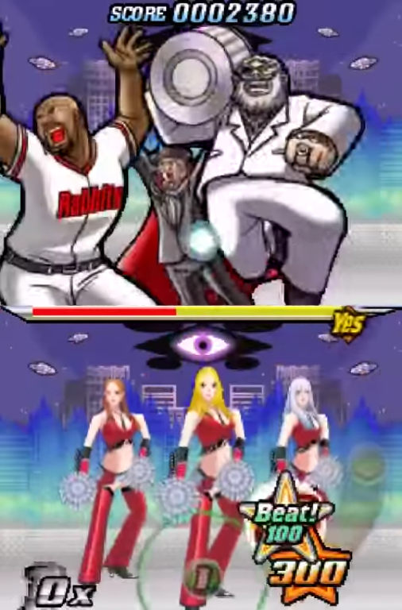
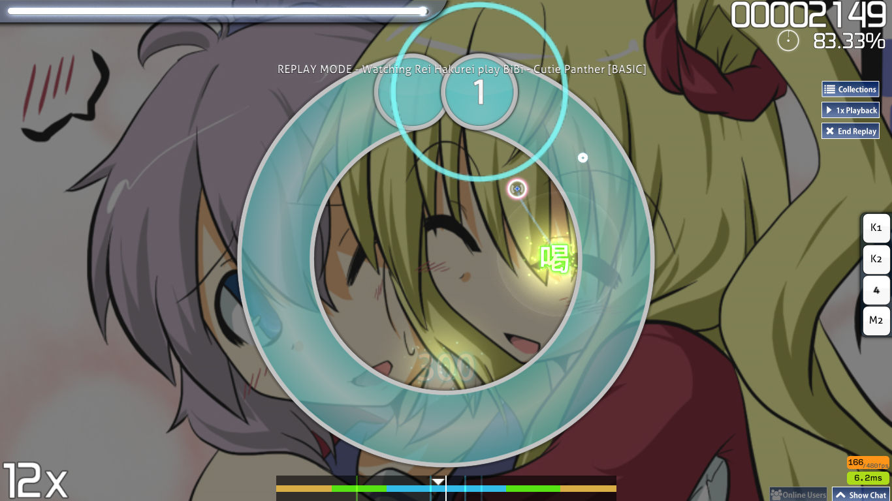
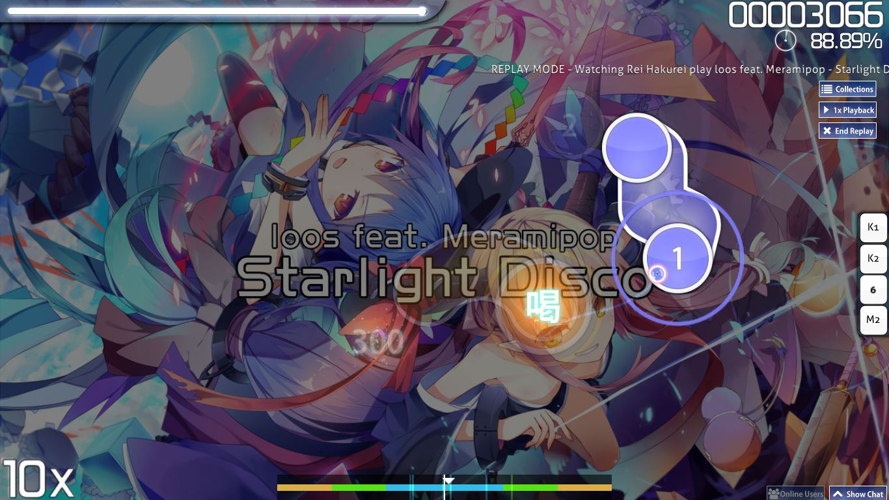

---
tags:
  - "100"
  - katsu
---

# Katu

*See also: [Geki](/wiki/Geki)*

*Not to be confused with osu!taiko's Katu*

**Katu (喝)**, *Katsu*, or *Beat!*, is a [scoring](/wiki/Score) term used when a player has completed a comboset without achieving the highest possible [accuracy](/wiki/Gameplay/Accuracy) on every note.
However, this can't be achieved by having a 50 or lower in the combo itself.

There are two kind of Katu, which is based on the combo finishing judgment. A 300-ended Katu rewards more health bonus than 100-ended Katu, but always worse than a Geki.

This idea originates from the Nintendo DS game Elite Beat Agents which is one of the games the [osu!standard](/wiki/Game_mode/osu!) [game mode](/wiki/Game_mode) is based on.

## Screenshots

In here provided the screenshots of obtaining a Katu/Katsu/Beat from Elite Beat Agents, Ouendan 2, and osu! itself.

 

## Example gameplay links

- [Elite Beat Agents: Without a Fight/Jumpin' Jack Flash - YouTube](https://www.youtube.com/watch?v=wPOCmzY_fqs)
- [Osu! Tatakae! Ouendan 2: Countdown - YouTube](https://www.youtube.com/watch?v=6us1tY8jOSI)

## On other game modes

### osu!taiko

This is the judgment given when you hit big notes at same time. osu!taiko have more leniency on handling both health bonus and score bonus for hitting both keys within short timespan.

### osu!mania

On osu!mania, Katu is replaced with **200**. As the name states it gives 200 worth of score with slight penalty on the scoring side.

## Other game aspects

### Storyboard (DS Games)

This triggers the second-tier on the storyboard during the gameplay. Usually shown with natural spirit shown during the sequence.

### Storyboard (osu!)

Storyboard in osu! mostly intended for osu!standard mode.
Obtaining Katu make several events occurs:

- Fail Layer activates.
- Pass Layer deactivates.
- Triggers "Failing" handler if transitioning from Pass state.

To note that Fail side of storyboard in osu! is different than DS Games.
