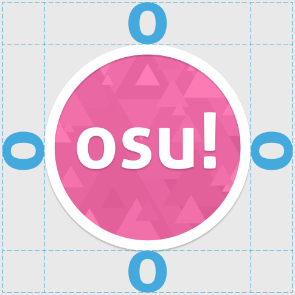
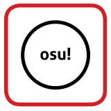
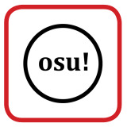
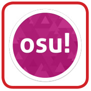
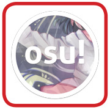

# osu! identity guidelines

## osu! cookie logo

### Cookie usage restrictions

#### Single colour

This is the single colour version of the osu! cookie logo. This version of the logo is very versatile and can be adapted to many design styles.

Please use the original file as the base, and do not create the logo from scratch.

#### Full colour

This is the full colour version of the osu! cookie logo. The subtle drop shadow is part of the full colour logo.

Please use the logo as provided by the Design Kit without any modification.

### Clear space area

Please give the cookie some breathing space. Use the "o" in "osu!" as the measurement of space.

### Single colour cookie usage restrictions

Since osu! is community-driven, the osu! cookie logo is designed to be simple and versatile; it can adapt to many designs with ease. There's no strict colour restriction to the colour of the cookie.

*Note: Radial gradients are not recommended as the ring and the middle element might appear in completely different colours.*

---

 effects on the cookie.")

### Full colour cookie usage restrictions

Since osu! is community-driven, the osu! cookie logo is designed to be simple and versatile; it can adapt to many designs with ease. There's no strict colour restriction to the colour of the cookie. All the restrictions applied on the single colour cookie applies to the full colour cookie too.

