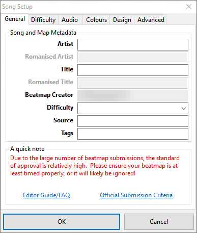
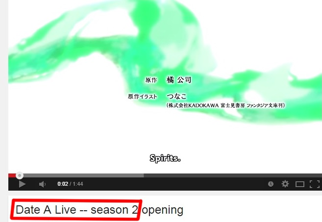

# Finding Metadata

Metadata in _osu!_ is a set of data that describes the song of a [beatmap](/wiki/beatmap).
_osu!_ uses this metadata in many places (e.g. song selection and searching on both osu!client and osu!web).

You put metadata in the `General` tab of the [song setup](/wiki/song_setup).

## Getting Basic Information

First, you need to know some basic information of the song.

Of course, you may have found it somewhere like YouTube or SoundCloud and had obtained the audio by any means.

More than likely, you already know what song you want to map or you've stumbled upon a song when searching.
In such case where you've stumbled upon a song, look around the site for some basic information on the song.

**Nobody** will be able to figure out the song title exactly while listening to it for the first few times.
However, if you are lucky and do guess what the song is it won't hurt to look up the song information to make sure.

Take that information and above and put it into google! BUT, if you happen to find the song information in the video.
YOU can use it! (but make sure you check the official site to see if it uses (TV Size) etc.

## Searching

Now that you've searched in Google, a list of results should pop up!
You can use Reference sites to help you find the official website.
From there try to find the Japanese Romanticized version of the name of the anime.
PUT that inside the search box (If you are Japanese and already know it, just type it in).
Once there you should be able to find the official website! (you can add official website to your search) to narrow it down.

The video has the artist : sweet ARMS , use that for the artist.

In this case, the Japanese name for Date a Live II is デート・ア・ライブⅡ , put that in google, the first result that shows up should be it , which is 
<http://date-a-live-anime.com/>.

Look around and you should find it

<http://date-a-live-anime.com/book/cd03.html>

The title is : 01. Trust in you (TV Size)

You can use ANY source, as long as its Official.

## tl;dr

You can use **any** source, as long as that source an **official source**.

## Trivia

- Original forum post: [[Guide] Metadata](https://osu.ppy.sh/forum/t/249288)
