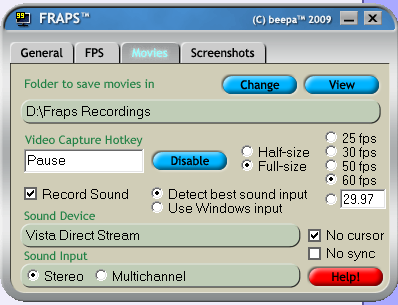
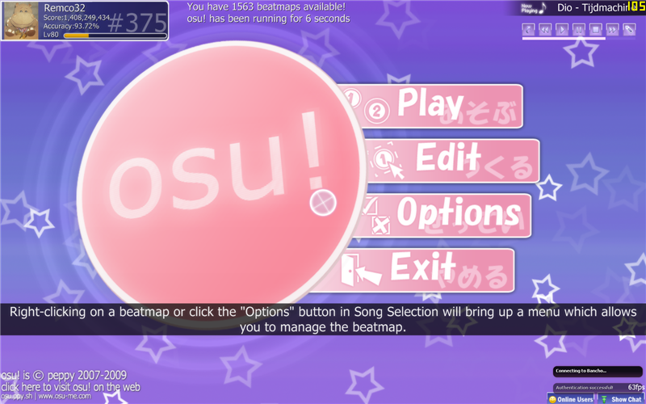

Making nice recording for Youtube
===================================

[Want to use Virtualdub instead of Sony Vegas? Click here!](http://osu.ppy.sh/forum/viewtopic.php?p=252802#p252802)

Always wanted to make a video for Youtube about osu!, but never figured a good way to make it happen? I'll explain in this thread how you can do that.
**Please note that there are more ways to do this, this is just my way.**
[See result of this tutorial here (Watch in HD and fullscreen!)](http://youtube.com/watch?v=JRGhQh69geI)

Requirements
============

-   Fraps
-   Sony Vegas (Never ever use Windows Moviemaker, it will lower the quality of the video drastically!)

Configuring Fraps
-----------------

Open Fraps, and lets screw around with the settings.

Make sure that:

-   You make the Video Capture Hotkey a key that won't be in the way;
-   If you get a output video that has a jumpy framerate, that you limit the framerate to 30. If this isn't the case, just use 60 FPS;
-   If you get a output video that has a low framerate, that you record 'half-size'. The video will be the half of the resolution its recorded from (alternatively: you could run osu! in a lower resolution when recording);
-   You have enough free space left on your harddisc. If not, the video will end early when there isn't anymore space left to store;
-   No Cursor is checked
-   YOU RECORD SOUND! There is nothing worse then osu! videos with later added music.

Recording your gameplay
=======================

Open osu! whilst Fraps is running. If everything goes right (and if you haven't disabled this feature), you'll see a yellow FPS counter in a corner of the screen.

Now, go to the thing that you want to record. i.e: a replay of yourself getting a highscore! When you are at the part where you want to start the recording, press your Video Capture Hotkey. The FPS counter might drop and must turn red. You are now recording. Look for a minute if the FPS rate isn't changing allot. If so, try some of these tips listed above.

Press the Video Capture Hotkey again to stop recording.

Editing your output video
=========================

Drag and drop the video on the timeline in Vegas. If there are multiple files, Vegas will add them to the end of the previous part automatically.

You can do some optional editing now.

Rendering your video
====================

Now that you are done editing the video, go to 'File', then click 'Render As'
Use the following options (depending on your Vegas version):
 

Press the save button, and your video will be done in a couple of minutes. It's now ready for Youtube!
Please note that it will take some time before the video will be available in high res on Youtube, be patient!
[This is my video after uploading it to Youtube](http://youtube.com/watch?v=Icbvko8W2yI)

**Now, go make videos and spread osu!**
Guide done by [Remco32](http://osu.ppy.sh/u/9199), original thread [here](https://osu.ppy.sh/forum/t/18112)
