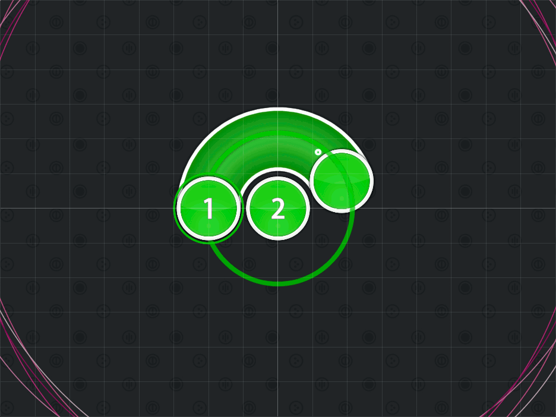
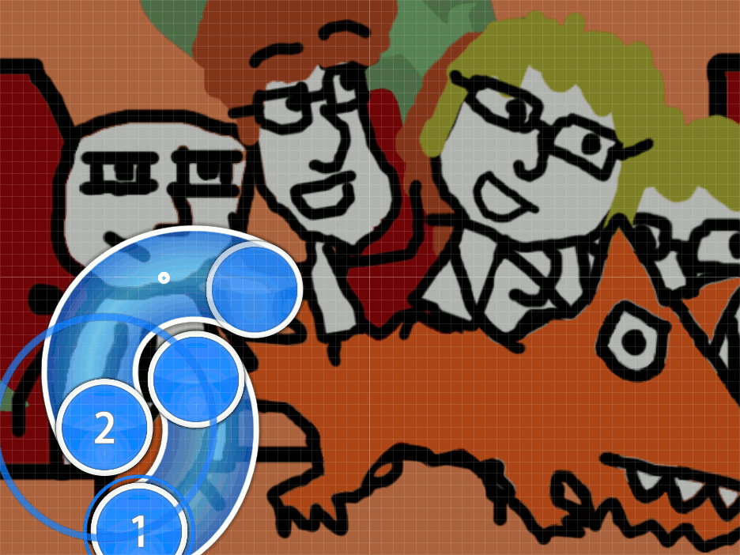
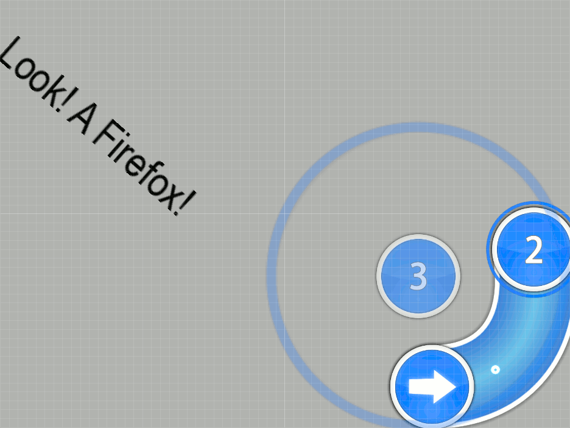

# Blanket Combos

_Also known as: **Blanket Formation**_

Nominator: [m980](https://osu.ppy.sh/u/3288)

Blanket Combos is made up of a slider or a hit circle (as the base) with a slider that surrounds that object.
Spacing between these two objects are very imporant as they are not allowed to overlay each other!

## Examples

- [Mika - Big Girl (You Are Beautiful) (Agent Spin Here) \[MetalMario\]](https://osu.ppy.sh/b/39133)

- [Mika - Big Girl (You Are Beautiful) (Agent Spin Here) \[iNiS980\]](https://osu.ppy.sh/b/38696)
