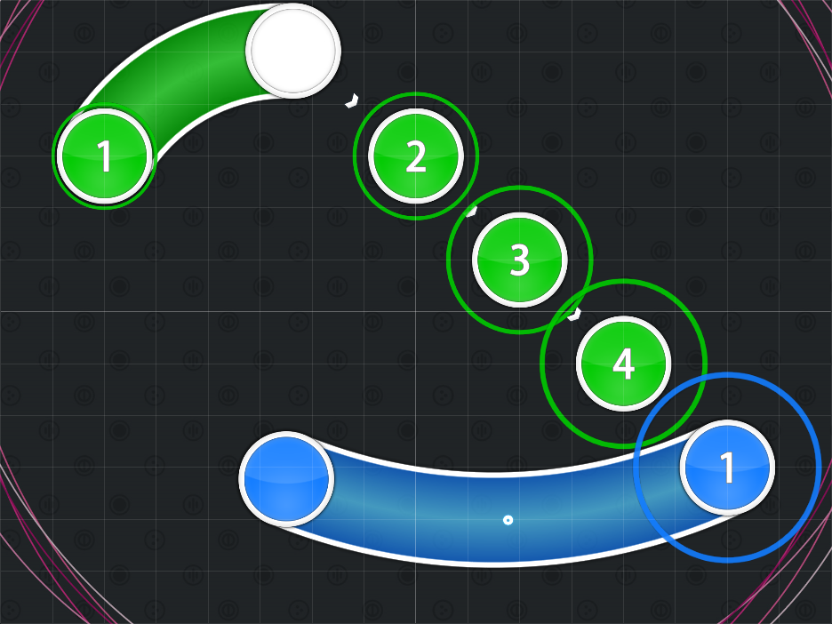
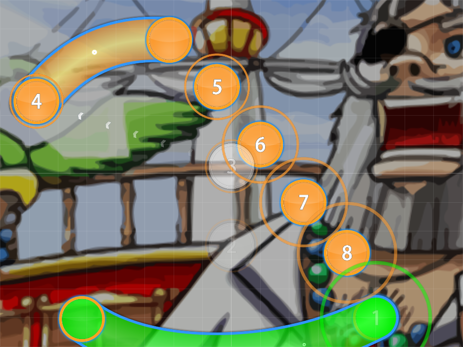
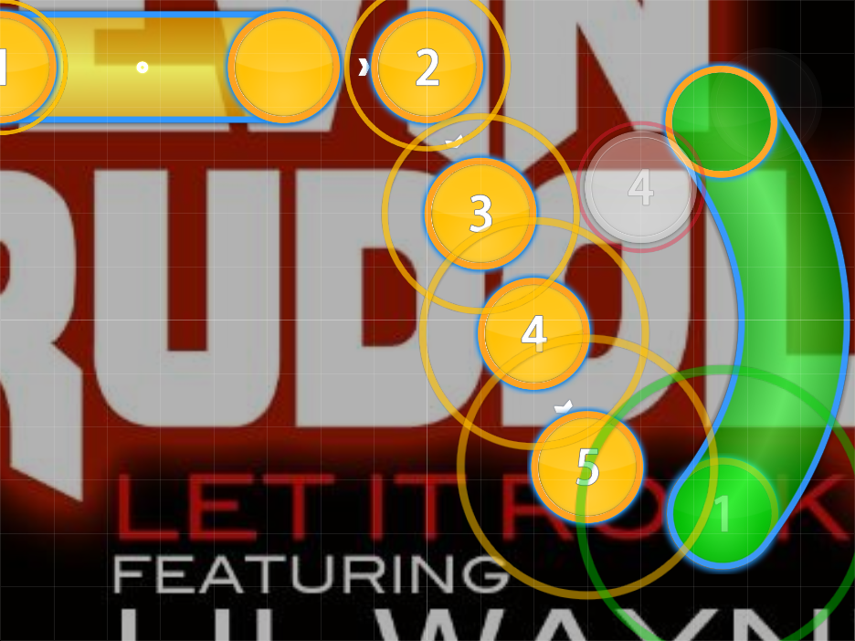
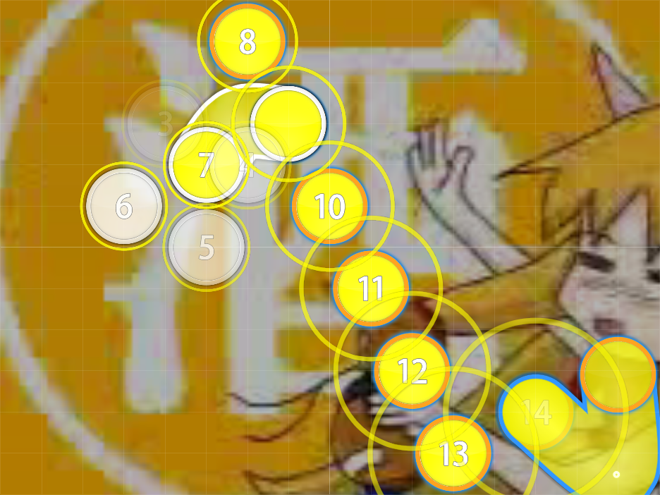

# Divebomb Combos

Nominator: [m980](https://osu.ppy.sh/u/3288)

Divebomb Combos are made up of a straight line of hitobjects traveling from the top of the screen (or the middle) towards the bottom.
This makes the hitobjects appear as if they are diving.

The last object should always be a slider.

## Examples

- [The Village People - Y.M.C.A. (Rolled) \[Hard Rock!\]](https://osu.ppy.sh/b/4501)

- [Kevin Rudolf ft. Lil Wayne - Let It Rock (m980) \[HARD ROCK!\]](https://osu.ppy.sh/b/24492)

- [IOSYS - Utage wa Eien ni ~SHD~ (DJPop) \[SOLO\]](https://osu.ppy.sh/b/31819)
