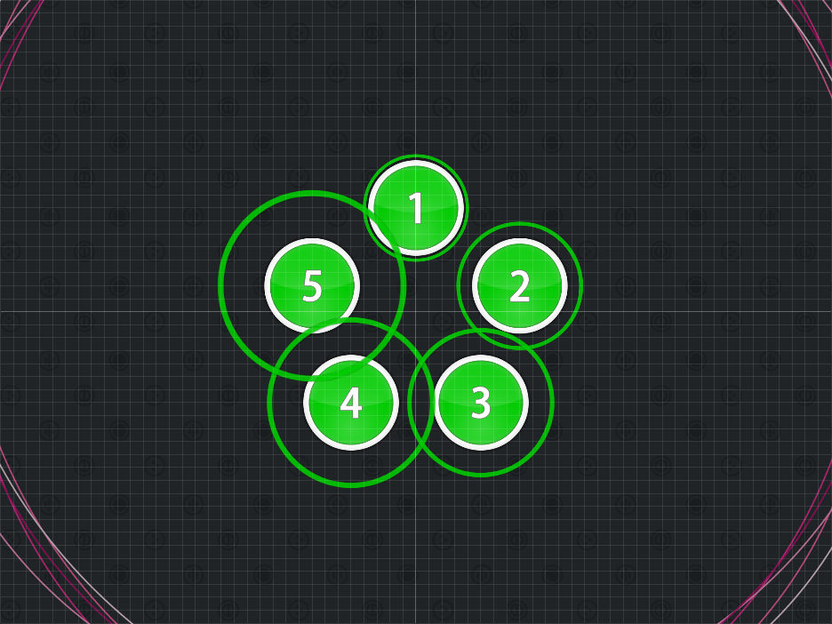
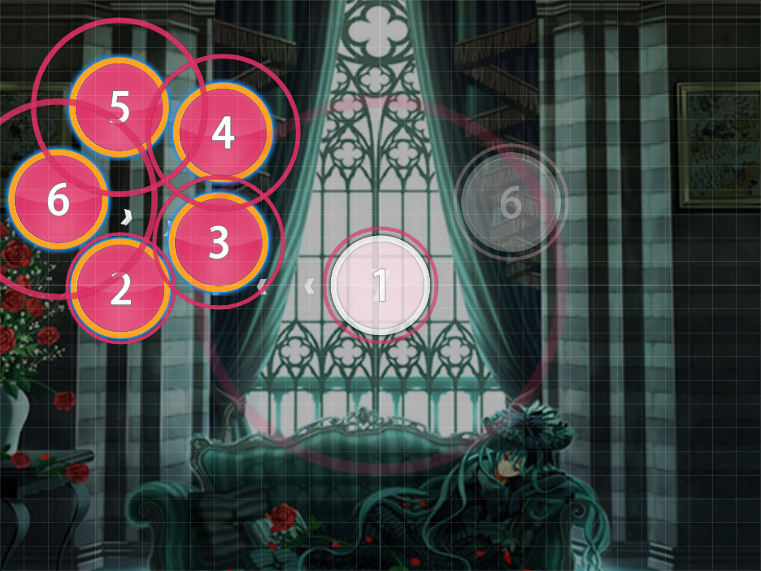
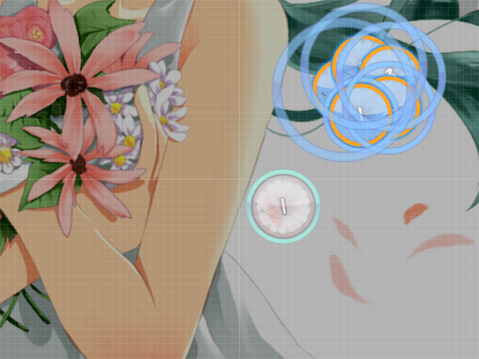

# Flower Combos

_Also known as: **Flower Formation**_

Nominator: [0_o](https://osu.ppy.sh/u/56708)

Flower Combos consist of 5 or more hitcircles that are all placed around a central point.
The central point can be a hitcircle or a slider.

The hitobjects are usually a half beat apart.

Alternativly, you could use the end of a slider as the first point (or the start of a slider as the last point) of the flower.

These are really similar to [Star Formation](../Star_Formation/).
However, the difference here is that this forces the player to go along the edges of the hitcircles, not through it.

## Examples

- [nomico - Bad Apple!! (James) \[Normal\]](https://osu.ppy.sh/b/29833)

- [Marguerite du Pre - Marie Antoinette (Mystearica) \[Hyper\]](https://osu.ppy.sh/b/36409)

- [DJ Okawari - Flower Dance (JauiPlaY) \[Flower\]](https://osu.ppy.sh/b/123417)
