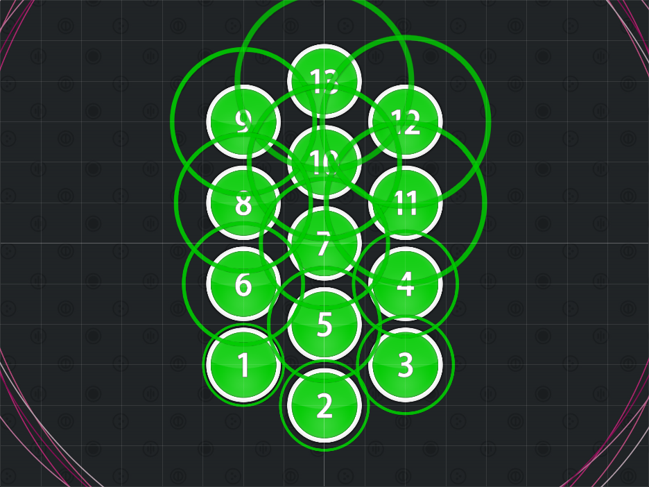

# Honeycomb Beats

Nominator: MetalMario201

Honeycomb Beats is a stream of hit circles that are usually half beats apart.
These are placed in a fashion that they all fit on a hexagonal grid.

Using this technique will cause confusion as to what the order of hit circles are by looking at the circles alone.
This forces the player to look at the numbers and/or the approach circles to figure out the order or memorize them.

This could be combined with a low Approach Rate to confuse the player.

## Examples

