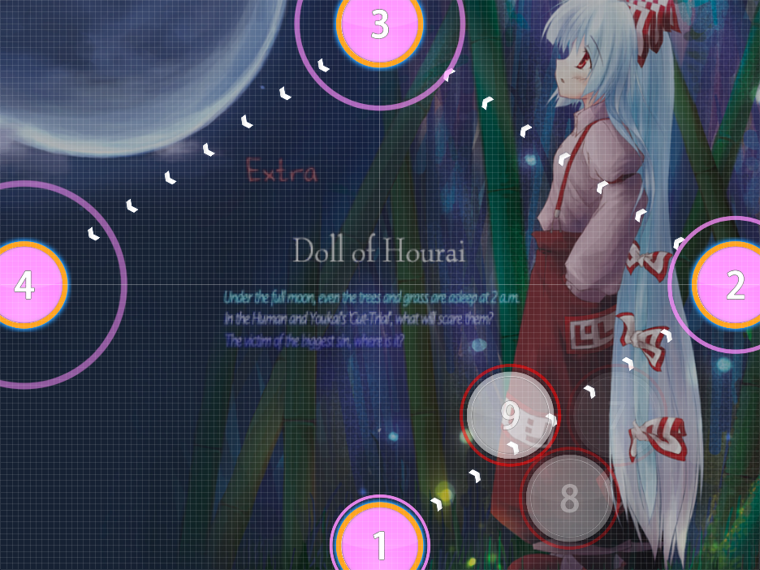
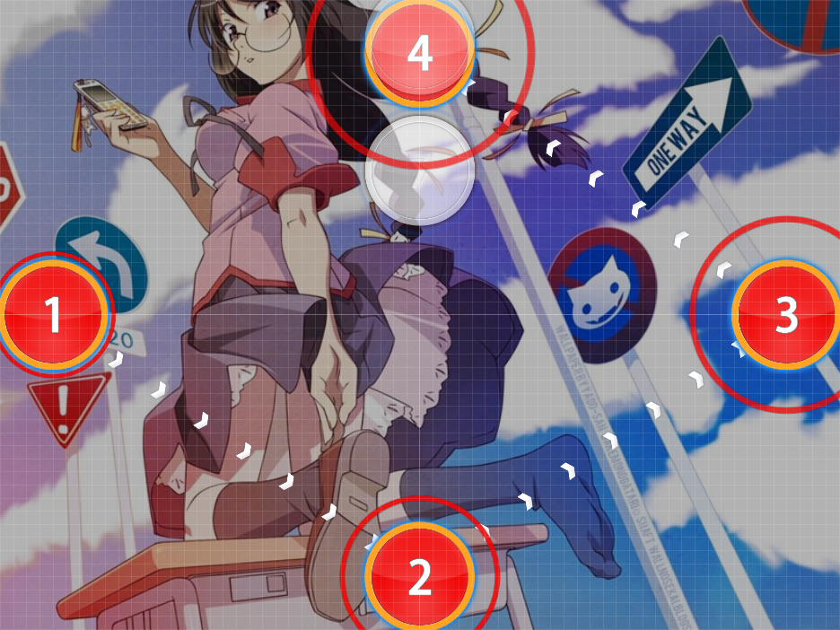
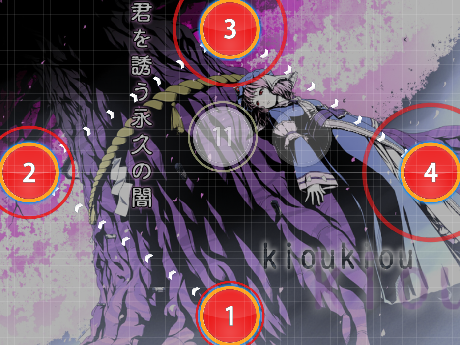

# QQ Diamonds

Nominator: [Lybydose](https://osu.ppy.sh/u/64501)

QQ Diamonds are four circles placed one beat apart from each other in a diamond pattern along the four edges (not corners) of the screen.
This is similar to [Diamond Formation](../Diamond_Formation/), but these are placed at the ends of the x-axis and y-axis.

In gaming, "QQ" originates from Warcraft II, where the player is able to press `Alt` + `Q` + `Q` to immediately leave the battle.
When a player in the chat tells you to "QQ", they are telling you to leave because you are unskilled to play.

## Examples

- [ZUN - Reach for the Moon, Immortal Smoke (Lybydose) \[Lunatic\]](https://osu.ppy.sh/b/33535)

- [Horie Yui - Sugar Sweet Nightmare (kioukiou) \[Hard\]](https://osu.ppy.sh/b/56877)

- [SYNC.ART'S feat. Sakaue Nachi - Forever Cherryblossom (S i R i R u) \[Collab\]](https://osu.ppy.sh/b/62819)
