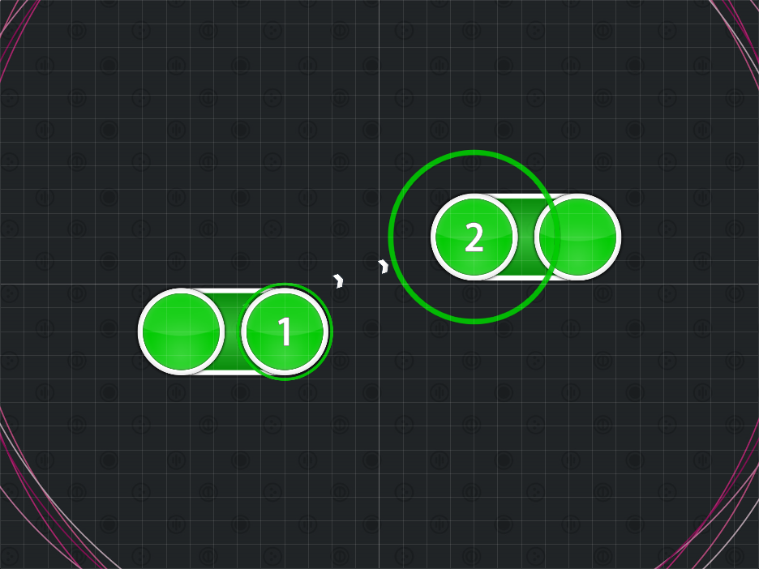

# Reversed Zig-Zag Sliders

_Also known as: **Reversed Zig-Zag Formation**_

Nominator: 

Reversed Zig-Zag Sliders is a variation of the [Zig-Zag Sliders](../Zig-Zag_Sliders/) but has the sliders point outwards and away from the next slider.
This creates a quick jump for the player.

## Examples

