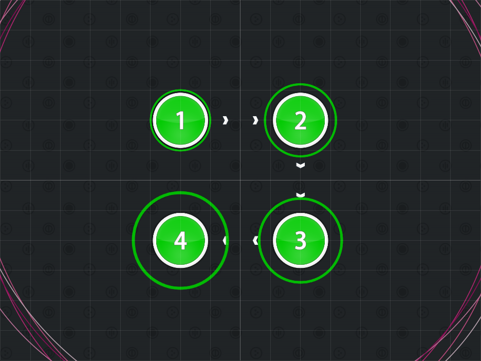
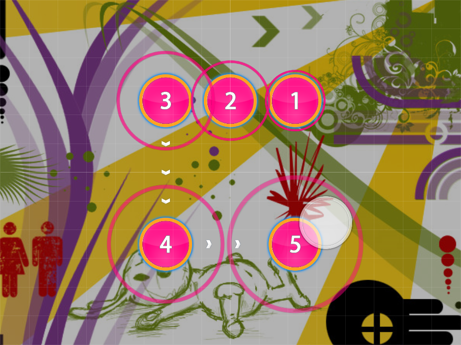
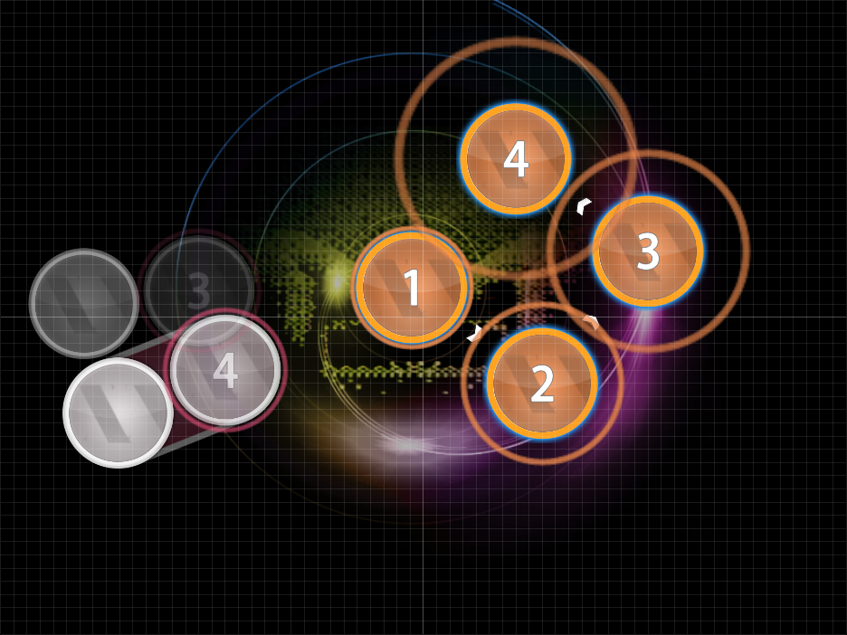

# Square Formation

Nominator: Beuchi-chan

Basically, this is 4 hitcircles forming a square shape.
These usually have some space between each other.
The square can be angled to form a diamond.
The order of the combos forces the player to go along the square rather than through it.

## Examples

- [KOTOKO - Oboetete ii yo (James) \[Hard\]](https://osu.ppy.sh/b/29075)

- [Wiklund - Whip the Blip (Ultimate) \[nullPointLOL's Insane\]](https://osu.ppy.sh/b/36003)
