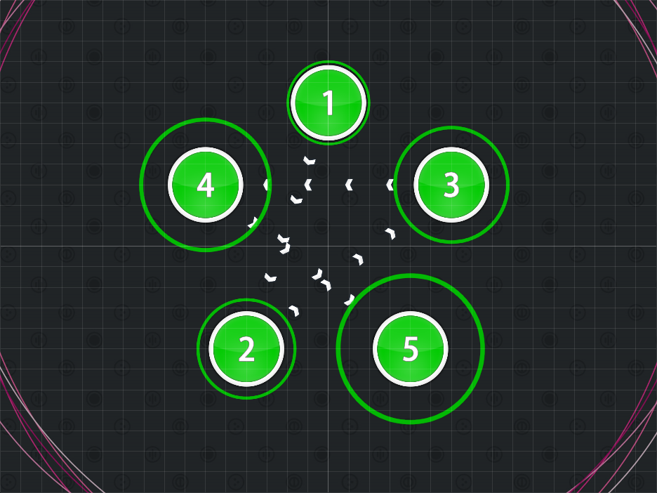
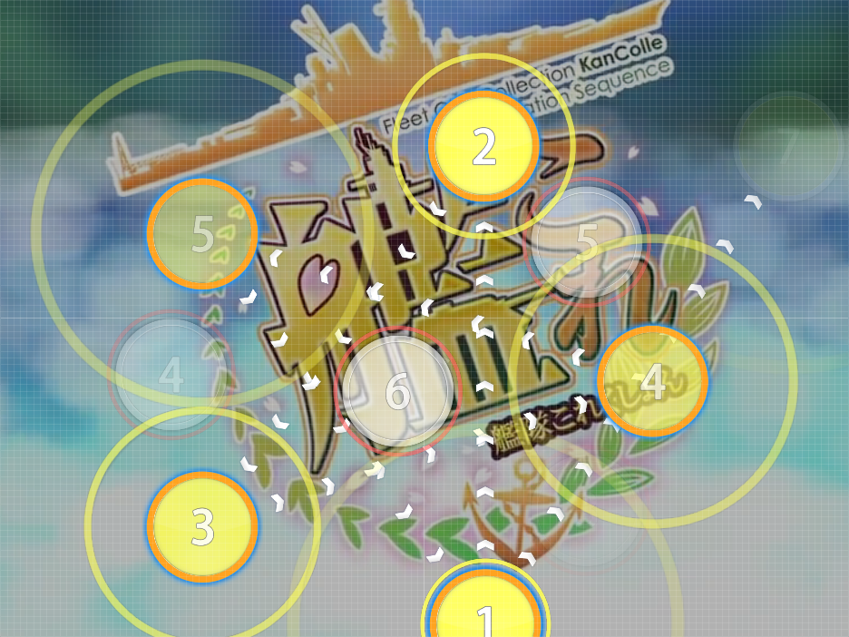
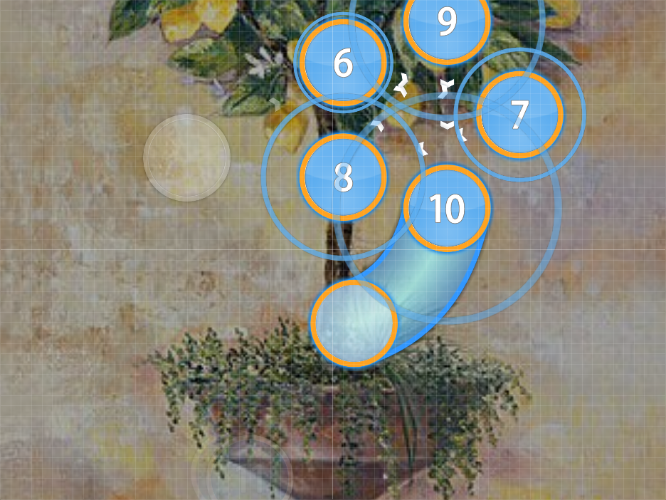
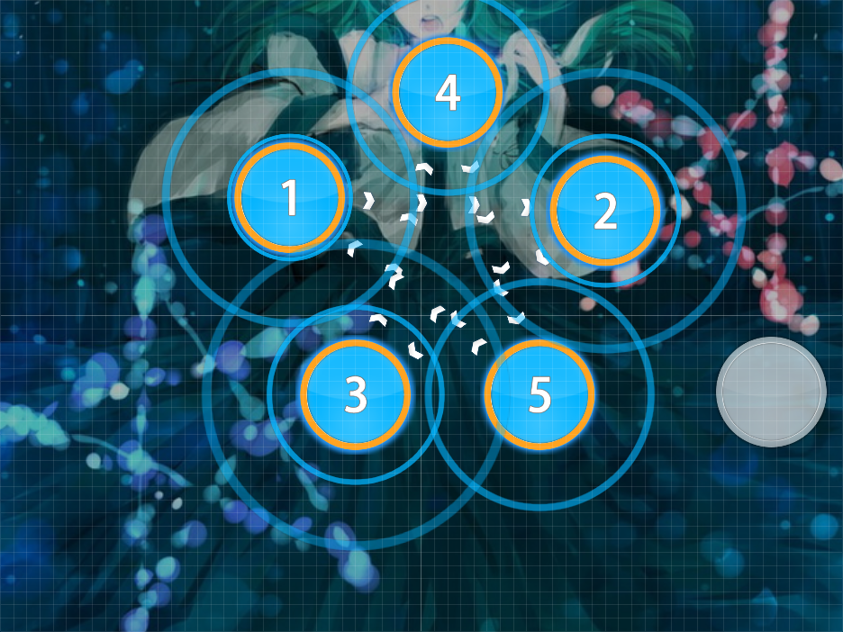
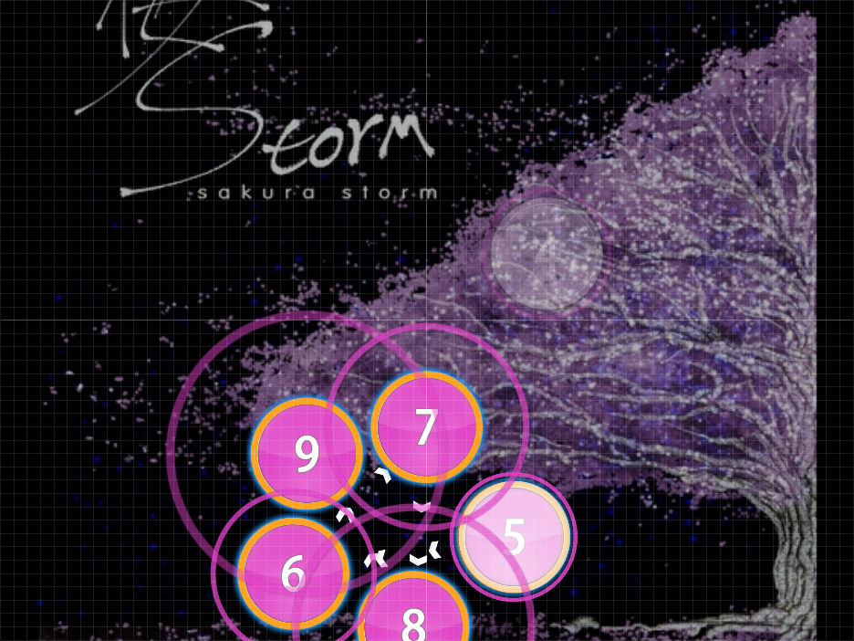

# Star Formation

Nominator: [Xgor](https://osu.ppy.sh/u/98661)

A Star Formation is a 5 pointed star, using 5 or 6 hit circles (the sixth one would usually be placed underneath the first point to complete the star).
The star can visually appear by following the followpoints.

Star Formations can be used to make jumps.

Alternativly, you could use the end of a slider as the first point (or the start of a slider as the last point) of the star.

These are really similar to [Flower Combos](../Flower_Combos/).
However, the difference here is that this forces the player to go through to form a star, instead of going around it.

## Examples

- [AKINO from bless4 - MIIRO (Asphyxia) \[Extra\]](https://osu.ppy.sh/b/601405)

- [DJ Mars - Lemon Tree (MetalMario201) \[Hard\]](https://osu.ppy.sh/b/34045)

- [IOSYS - Poinsettia (Aakiha) \[Lunatic\]](https://osu.ppy.sh/b/65233)

- [Ryu* - Sakura Storm (ouranhshc) \[Alazy\]](https://osu.ppy.sh/b/53851)