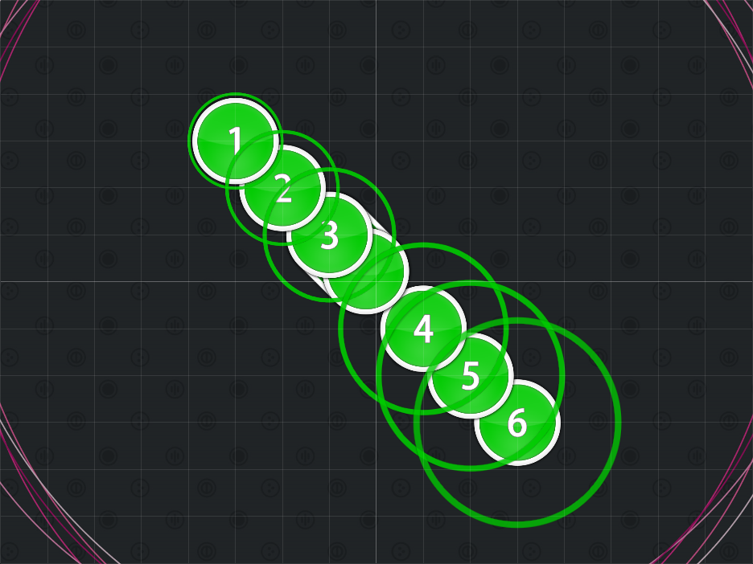
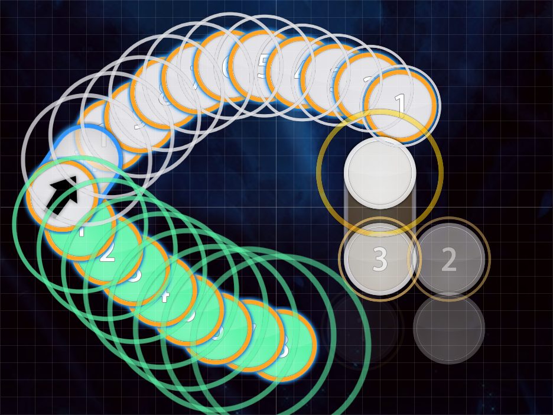

# The Kickstream

Nominator: [Daru](https://osu.ppy.sh/u/32480)

The Kickstream uses a kick slider (a really short slider) inside of a stream.
This forces the player to pause in the middle of the stream to complete the kick, before continuing the stream.

## Examples

- Jun Wakita - Shounen A (Mystearica) \[Another\](https://osu.ppy.sh/b/36161)
