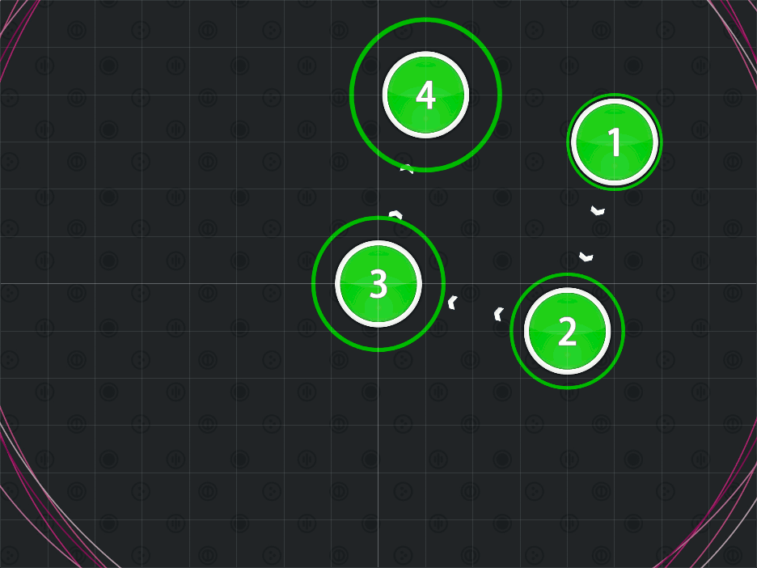
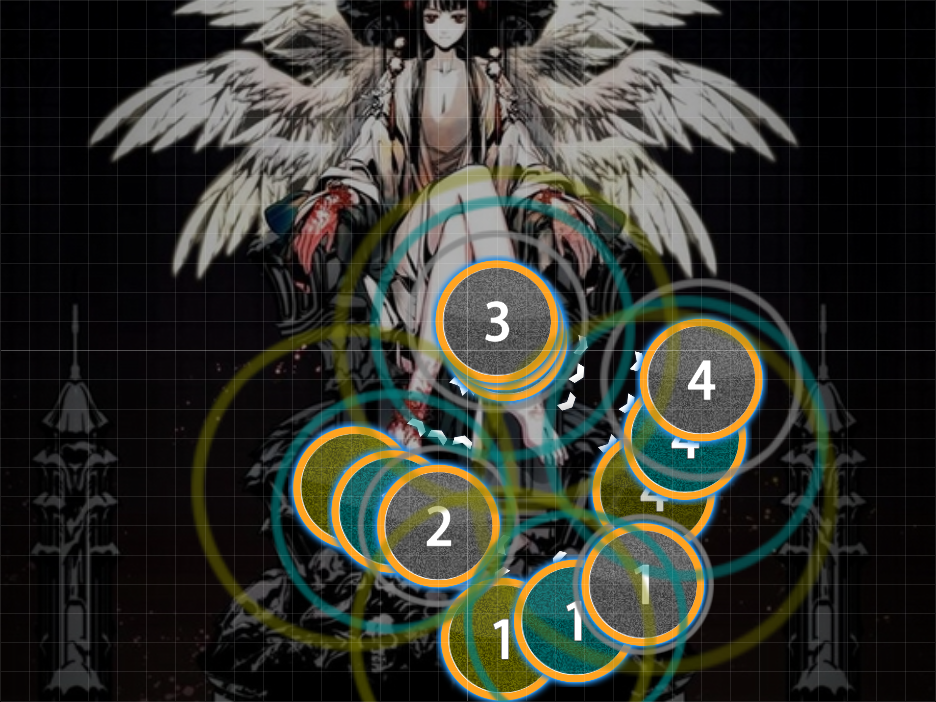
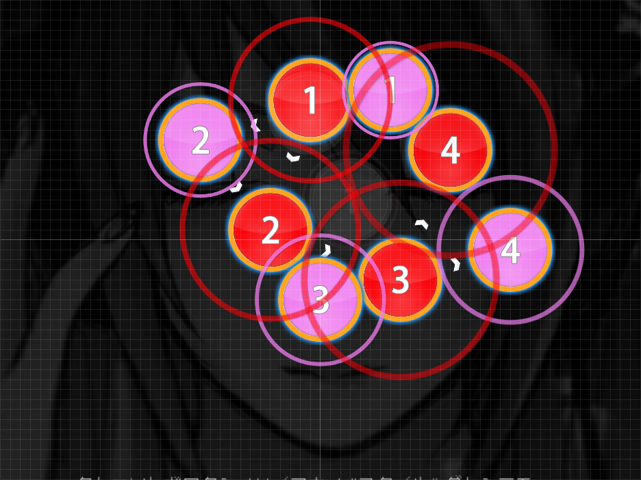

# Tornado Formation

Nominator: [Dragvon](https://osu.ppy.sh/u/126927)

Tornado Formation are sets of notes that forces the player to tap circles in a circular motion at a high rate.
This is basically a combination of small jumps (distance-wise) and streams (reaction time-wise).

This can also be a [Square Formation](../Square_Formation/) and/or [Diamond Formation](../Diamond_Formation/) repeated a few times, where one of the notes acts like a pivot point.

## Examples

- [M2U - Nightmare (ignorethis) \[HD\]](https://osu.ppy.sh/b/57777)

- [Megurine Luka - DYE (Shinxyn) \[Hard\]](https://osu.ppy.sh/b/48075)
