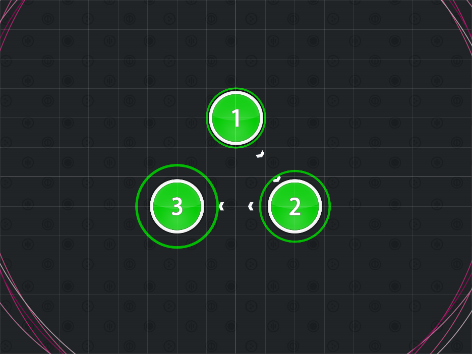
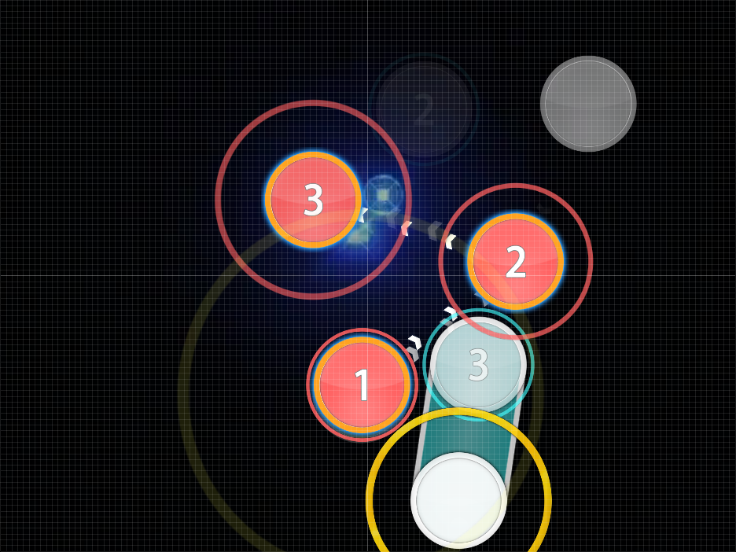
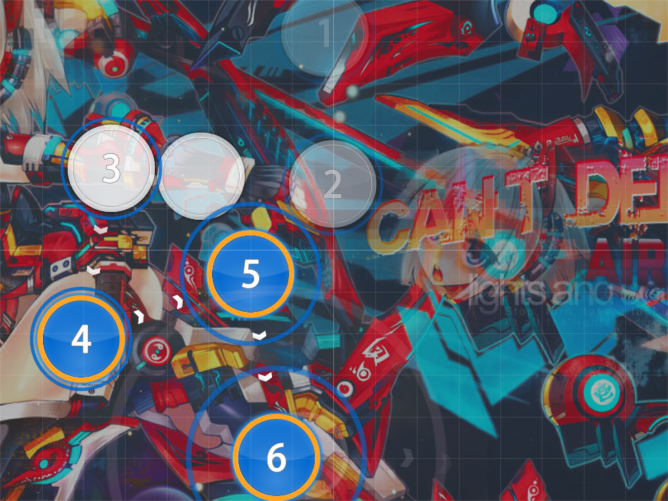
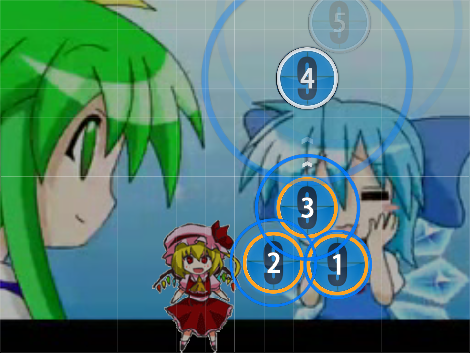

# Triangle Beats

_Also known as: **Triangle Formation**_

Nominator: [kingcobra52](https://osu.ppy.sh/u/9934)

This is a very common mapping technique where 3 hit circles are arranged in a triangle.
The order of the 3 hit circles nor the size of the triangle does not matter.

## Examples

- [AKINO from bless4 - MIIRO (Asphyxia) \[No Dap's Extra\]](https://osu.ppy.sh/b/659648)

- [Hanatan - Airman ga Taosenai (SOUND HOLIC Ver.) (Natsu) \[CRN's Extra\]](https://osu.ppy.sh/b/338682)

- [NicoNicoDouga - Cirno de Gozaimasu! (Mafiamaster) \[Normal\]](https://osu.ppy.sh/b/21565)
