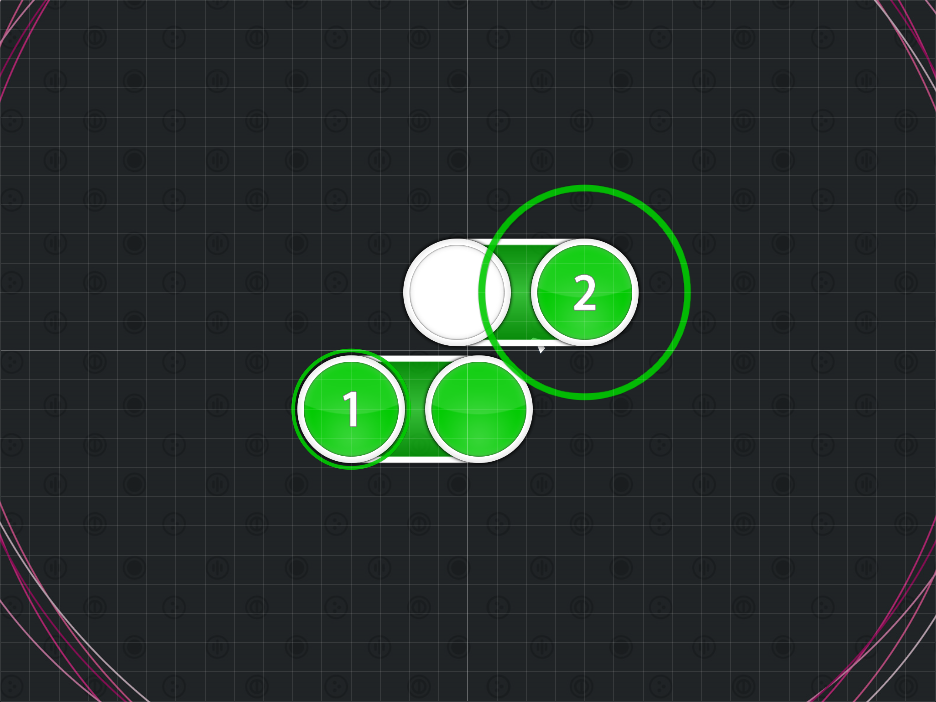
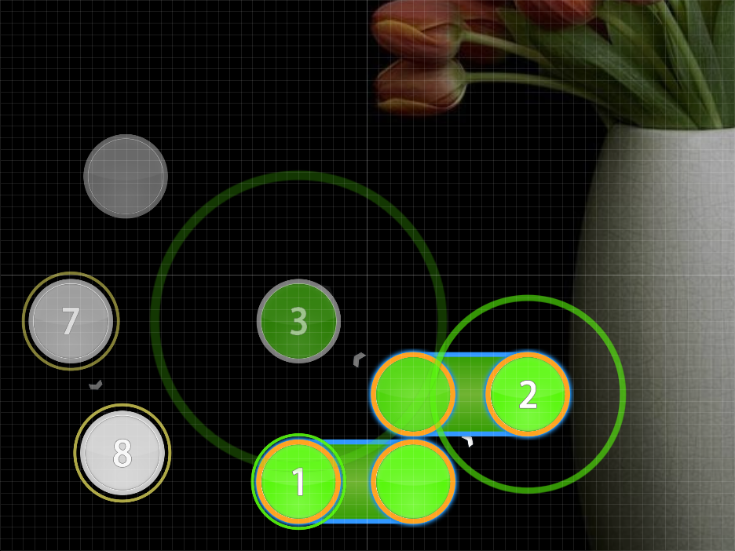

# Zig-Zag Sliders

_Also known as: **Zig-Zag Formation**_

Nominator: [0_o](https://osu.ppy.sh/u/56708)

Zig-Zag Sliders are made up of 1/2 sliders that are arranged in an inwards zig-zag pattern.

This technique needs at least two sliders that are a half beat long and are arranged something similar to the above image.

## Examples

- [Imogen Heap - Aha! (Ellipse) \[Hectic\]](https://osu.ppy.sh/b/36067)
