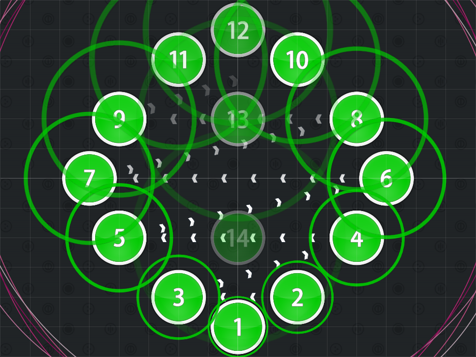
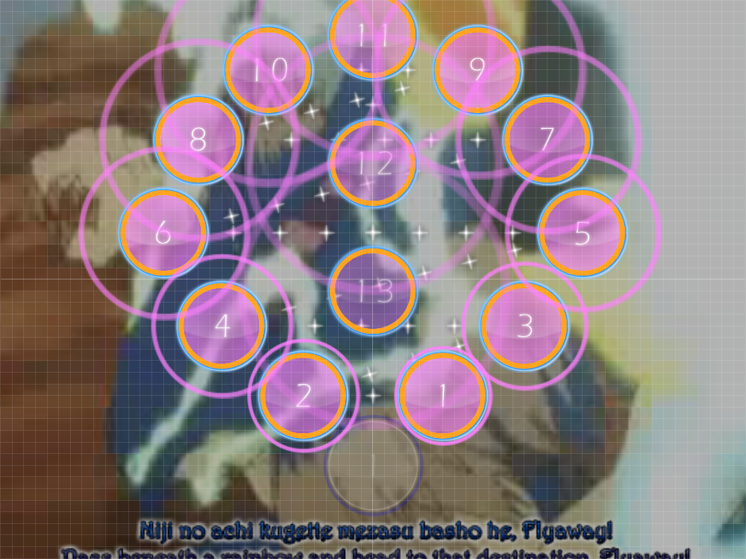

# ztrot Spacing

_Also known as: **ztrot Formation**_

Nominator: JarJarJacob

ztrot Spacing uses consistant beats placed in a circle-like shape.
The distance between each note increases, then decreases.
The following hitcircles will always be on opposite sides of the "circle".

It is recommended to do this with half (or more) beats apart from each other.

After the "circle" is completed, a few more hitcircles are placed to go straight through it.

## Examples

- [BACK-ON - Flyaway (ztrot) \[Fly Away!!!\]](https://osu.ppy.sh/b/37249)
