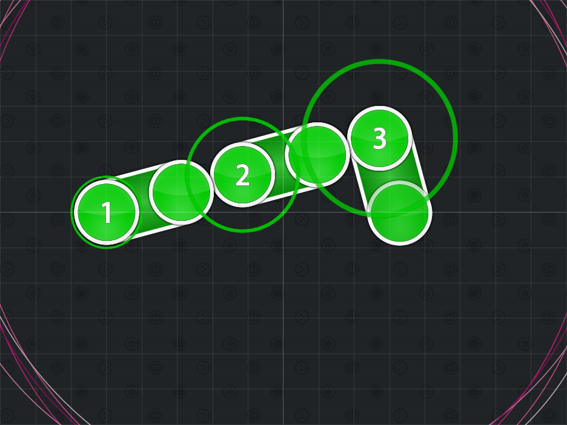
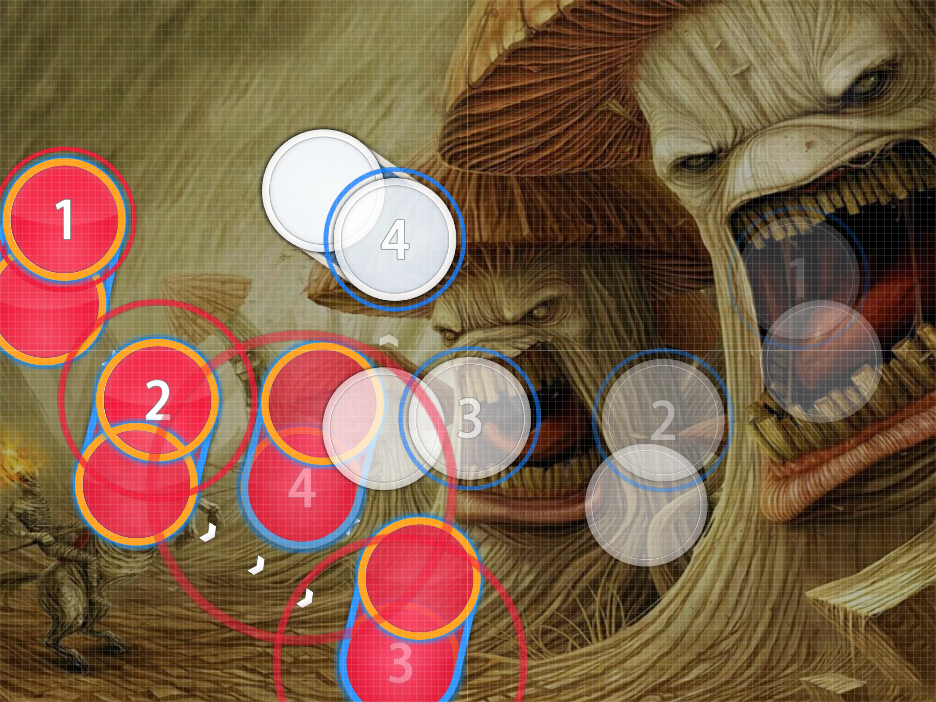

# 15 Degree Patterns

Nominator: [grumd](https://osu.ppy.sh/u/530913)

15 Degree Patterns is a slider exclusive technique.
You start off by mapping a section with only horizontal and vertical sliders.
You then rotate them 15 degrees clockwise or counterclosewise.

This adds a more style to a group of sliders.

## Tutorial

1. Find a section in your beatmap that only contains horizontal (left and right) and vertical (up and down) sliders only.
2. Select those sliders by either `Ctrl` + clicking on them or by dragging along the timeline.
3. Press `Ctrl` + `Shift` + `R`
4. Enter `15` in the text box.
   - You can choose either clockwise or counterclosewise, it doesn't really matter.
5. Voilà, your done!

## Examples

- [goreshit - the nature of dying (grumd) \[The Nature of Dying\]](https://osu.ppy.sh/b/152078)

- [PSY - GANGNAM STYLE (yeahyeahyeahhh) \[OPPAN YEAH30 STYLE\]](https://osu.ppy.sh/b/169089)

- [Infected Mushroom - The Pretender (RLC) \[Pretender\]](https://osu.ppy.sh/b/221777)

- [Infected Mushroom - Sa'eed (TicClick) \[TicCataline\]](https://osu.ppy.sh/b/179507)

- [Rohi - Kakuzetsu Thanatos (NatsumeRin) \[Rin\]](https://osu.ppy.sh/b/215238)
