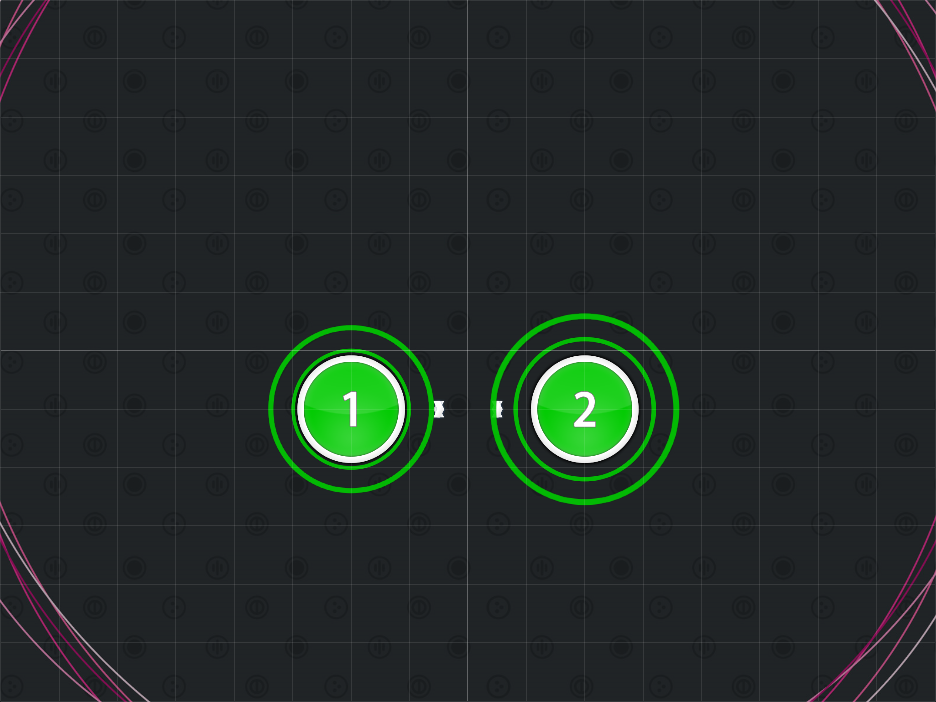
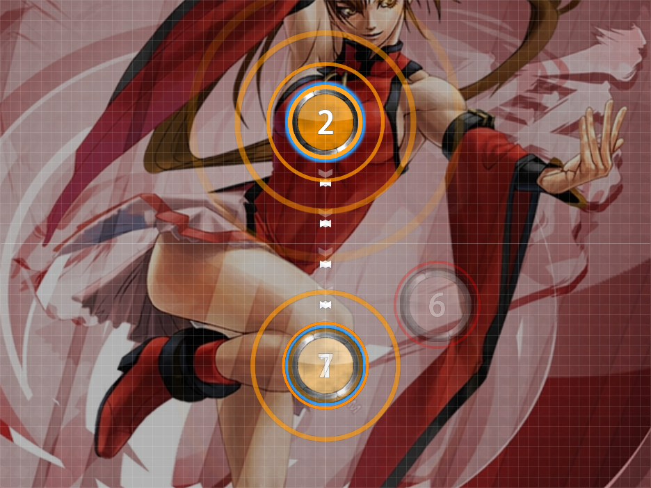

# Back and Forth Beats

Nominator: [kingcobra52](https://osu.ppy.sh/u/9934)

Back and Forth Beats are comprised of two stacks of beats (or more), with the odd notes in one stack and even notes in the other.
Using this requires the player to alternate between the two stacks.

It is encouraged to only be used for harder difficulties as this can be hard for newer players.

## Examples

- [capsule - JUMPER (Mafiamaster) \[Insane\]](https://osu.ppy.sh/b/73494)

- [Shin Hae Chul - Sticks and Stones (Bikko) \[Madness\]](https://osu.ppy.sh/b/66514)
