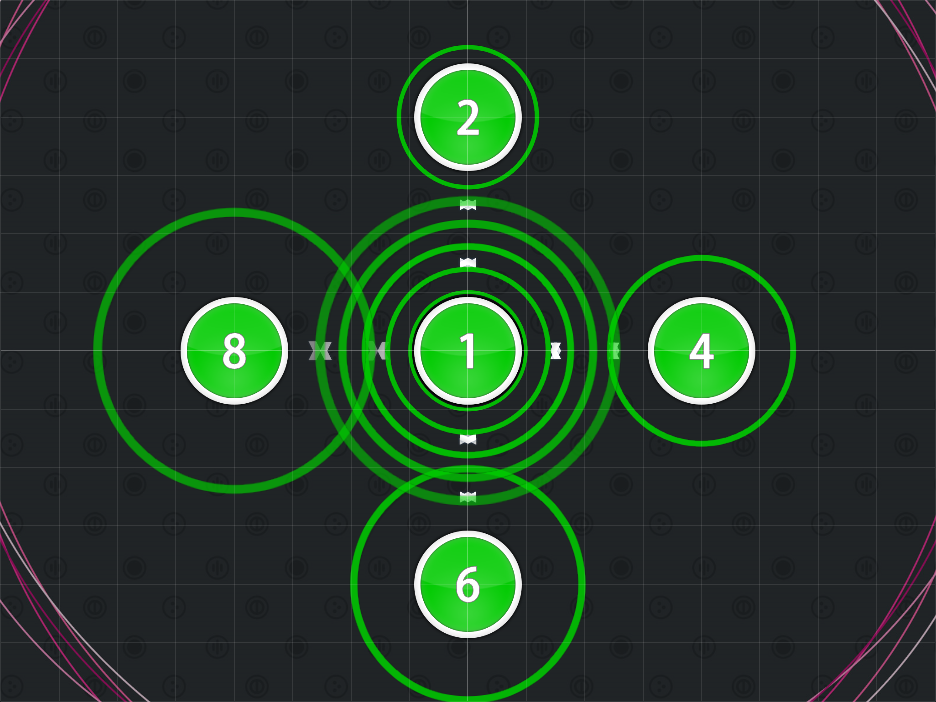
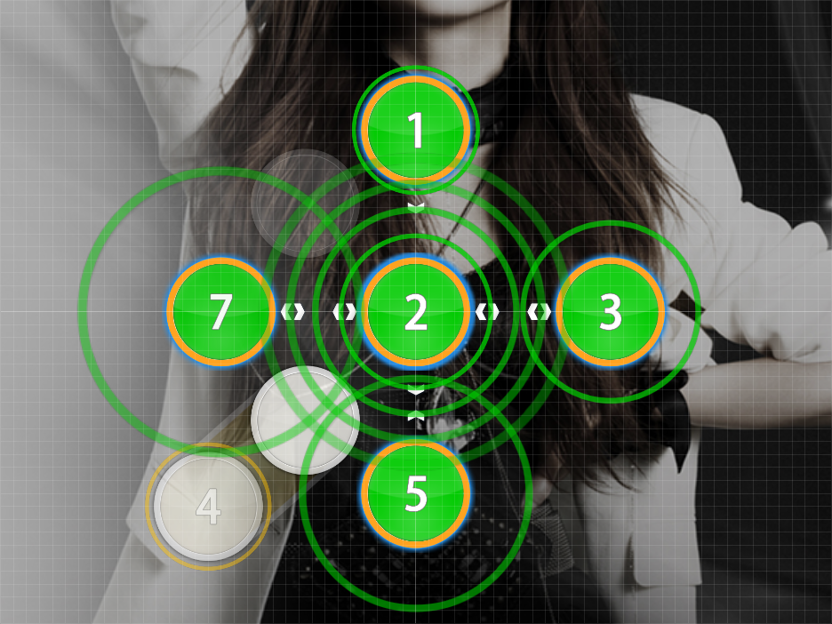
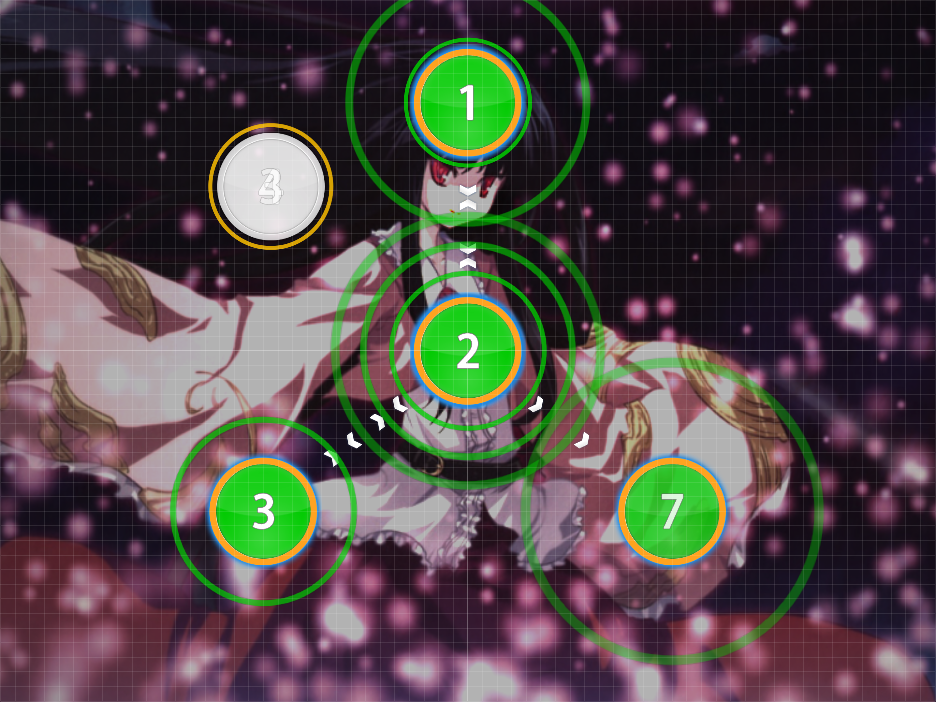
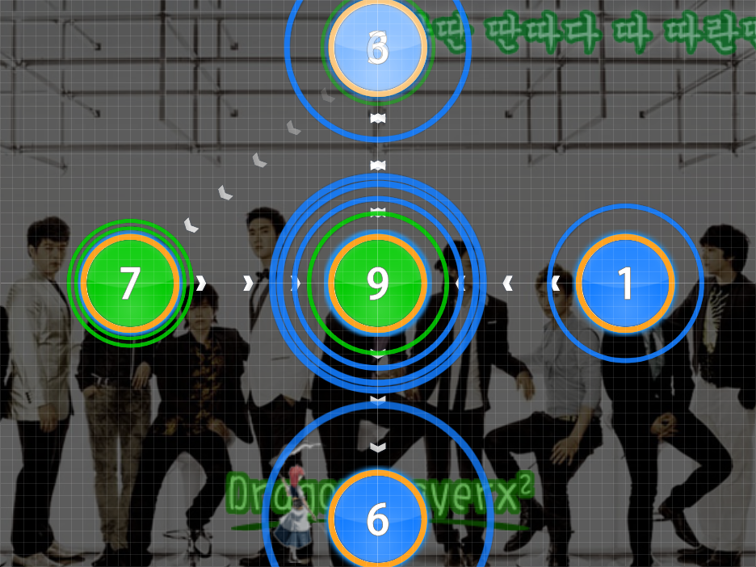
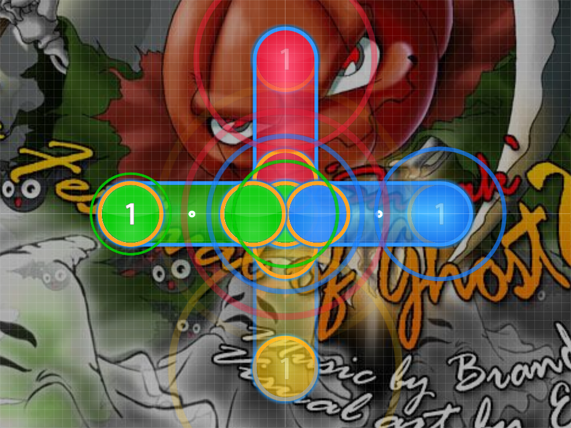
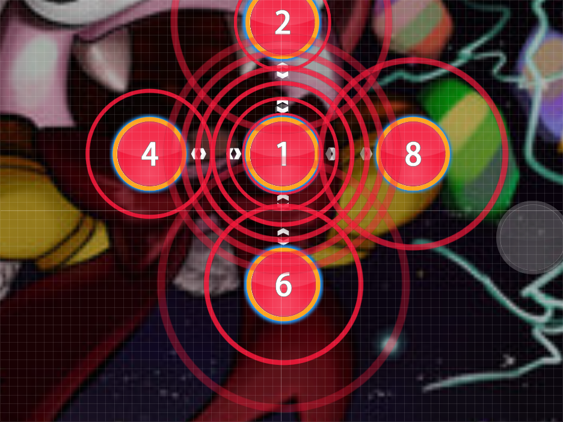

# Hub and Spoke

Nominator: Beuchi-chan

The Hub and Spoke formation is literally a hub with spokes peaking out.
This technique requires at least 8 to 9 hit objects that are half a beat apart from another.
Using this will force the player to not only move in a circular direction but also require them to return back to the center after an object was hit.
In general, this is basically the [QQ Diamonds](../../Formations/QQ_Diamonds/) technique with a center for every other hit object.

First, place the odd numbered combos in the center of where the hub and spoke is to be mapped (this part is the "hub").
The following, even, hit objects are to then be placed 0 degrees, 90 degrees, 180 degrees, 270 degrees (or vise versa) surrounding the "hub" (these are the "spokes").

It is very important to lay the hit objects out so that they go in a clockwise or counterclockwise direction.

The basic form of the Hub and Spoke uses 4 spokes.
You could, however, use 3, 5, or 6 spokes instead (when you do this, make sure that the degree measure remains equal for each spoke.

# Examples

- [BoA - I Did It For Love (Lena) \[Hard\]](https://osu.ppy.sh/b/61843)

- [Haru - Voyage 1969 (Instrumental) (Nexy) \[Hard\]](https://osu.ppy.sh/b/30824)

- [Super Junior - Sorry Sorry (thepianist) \[Sorry!\]](https://osu.ppy.sh/b/41939)

- [BRANDY - The Festival of Ghost 2 (darrihuka) \[DaRRi MIx\]](https://osu.ppy.sh/b/21422)

- [Jun Ishikawa - Marx Battle! (Zerostarry) \[m980 Hard\]](https://osu.ppy.sh/b/22620)
