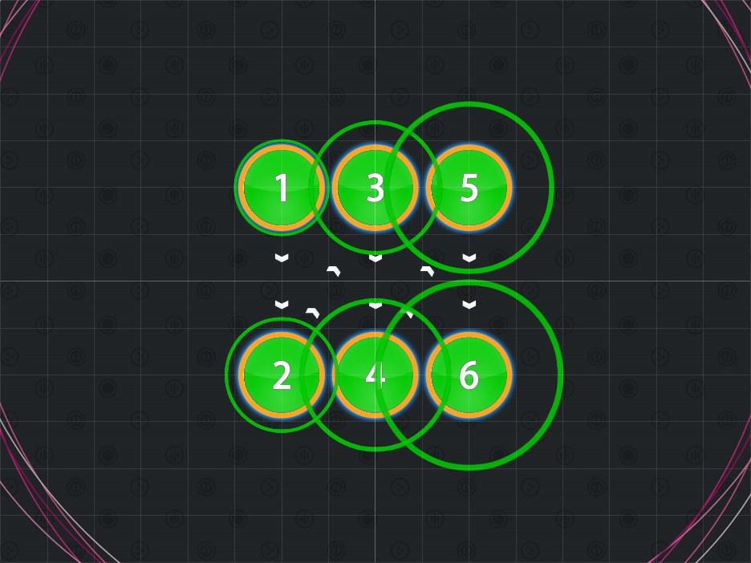
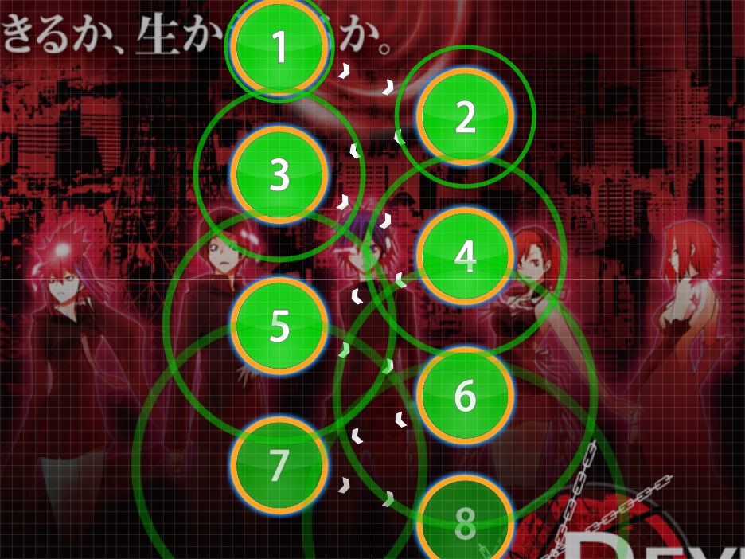
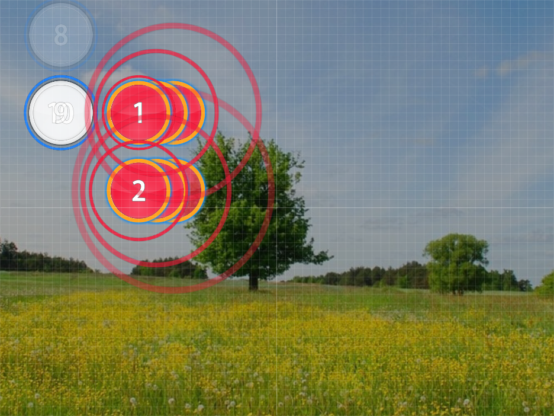

# Linear Back and Forth

Nominator: Derekku Chan

Linear Back and Forth is a variation of the [Back and Forth Beats](../Back_and_Forth_Beats/) spreads.
The difference is that there these don't use stacks rather, they require the player to move along back and forth between the hit objects.
It is very important that the mapper makes it clear as to the direction of where the spread is heading.

## Examples

- [Aya Ishihara - Reset (Full ver) (Bikko) \[Madness\]](https://osu.ppy.sh/b/65756)

- [Lucky Twice - Lucky (CrazyBanana) \[EEeee's Hard\]](https://osu.ppy.sh/b/34901)
