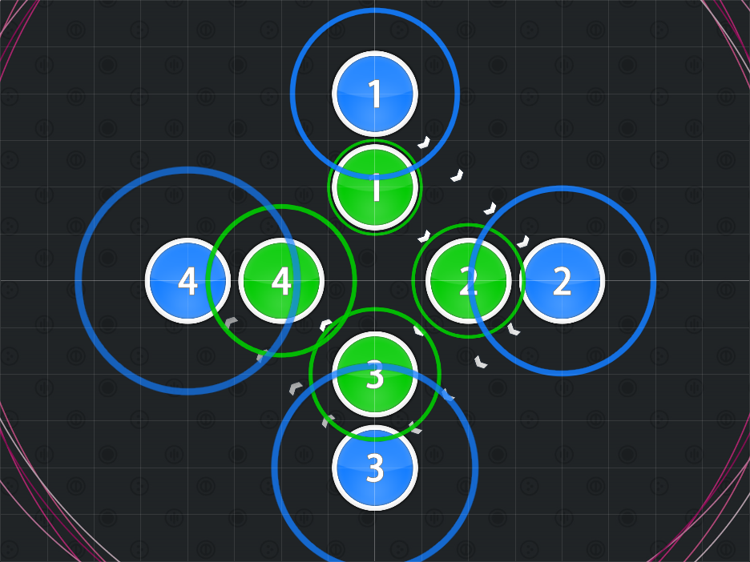
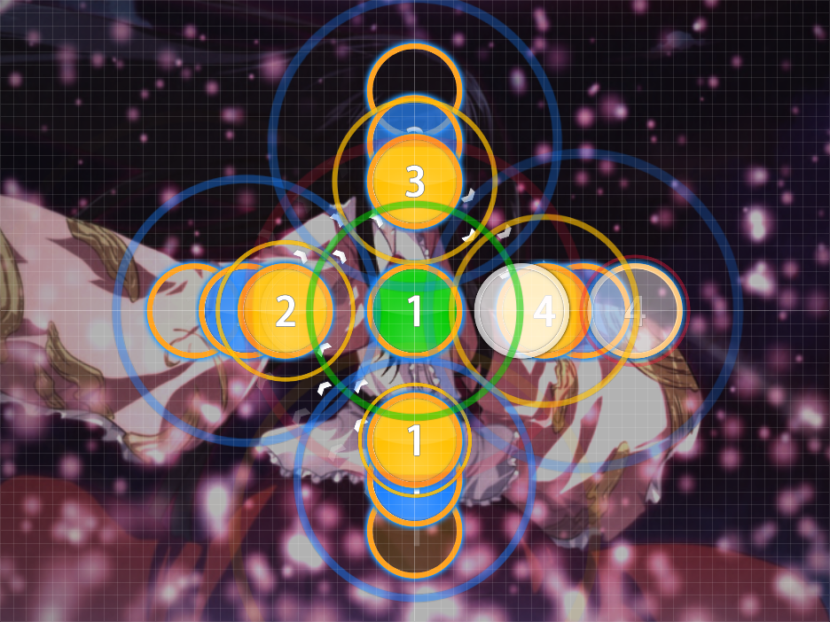

# Spacing Out

Nominator: [Pasonia](https://osu.ppy.sh/u/43345)

Spacing Out refers to hit objects in where they are placed distance-wise, not time.
This technique has the advantage of keeping a momentum in a tune running during that section of a map.
However, incorrect patternmapping can lead to an almost unplayable map.

## Examples

- [Haru - Voyage 1969 (Instrumental) (Nexy) \[Hard\]](https://osu.ppy.sh/b/30824)
