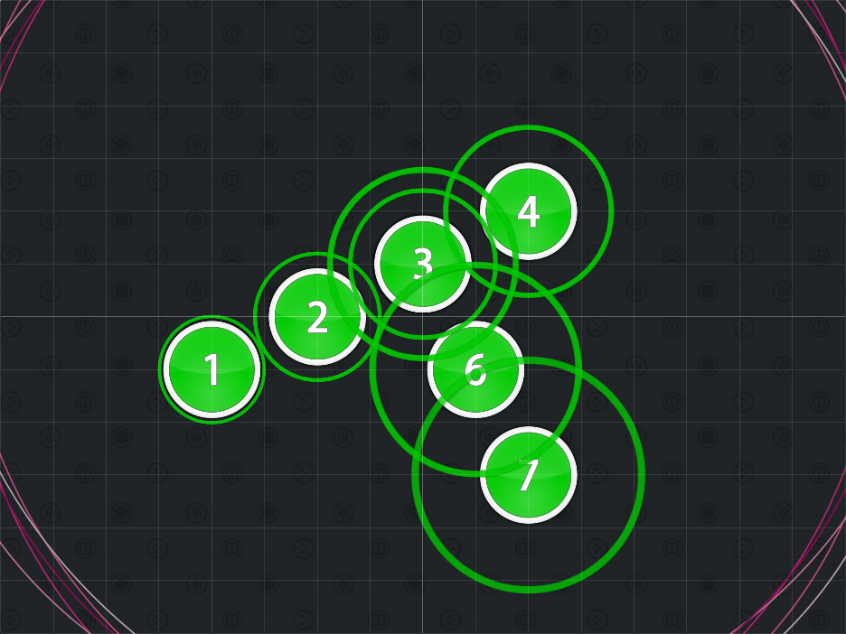
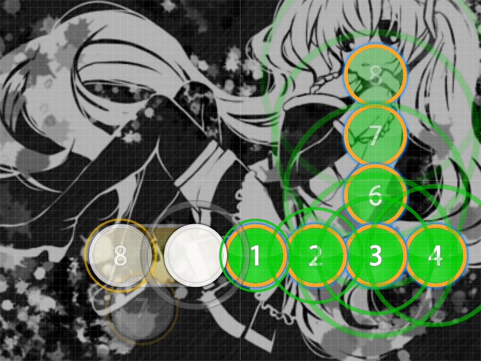
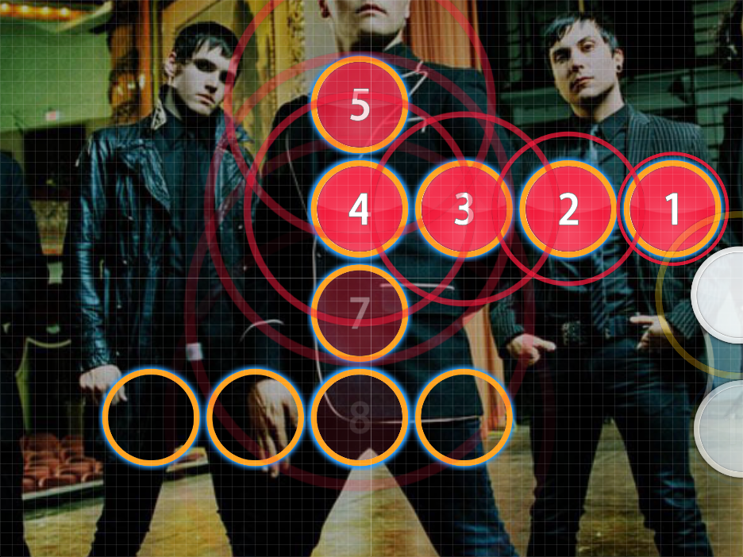

# Step-Too-Fars

Nominator: [OzzyOzrock](https://osu.ppy.sh/u/465153)

Step-Too-Fars uses a linear path of hit circles.
However, upon hitting the "end" of the line, the hit objects moves back one space (the hit circle before the line had ended) then changes direction.

## Examples

- [Hatsune Miku - Yokkyuu Fuman (luhan9527) \[Insane\]](https://osu.ppy.sh/b/65996)

- [m-flo loves CHEMISTRY - Astrosexy (mtmcl) \[Sexy\]](https://osu.ppy.sh/b/49101)

- [My Chemical Romance - The Sharpest Lives (Larto) \[Insane\]](https://osu.ppy.sh/b/75030)

- [Kawada Mami - See visionS (TV Size) (HakuNoKaemi) \[Nekoo's Insane\]](https://osu.ppy.sh/b/87339)
