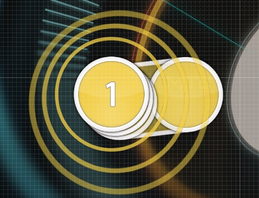

# Stack

A **stack** is a set of [hit objects](/wiki/Hit_Objects) that [overlap](/wiki/Mapping_Techniques/Overlap) each other in the playfield<!-- TODO: link -->. The most common objects that are stacked are [hit circles](/wiki/Hit_Objects#hit-circle).

Stacks are automatically created when hit objects are close to perfectly overlapping each other. The time between objects for this to occur is determined by the [beatmap](/wiki/Beatmaps)'s stack leniency<!-- TODO: link -->.

<!-- this is a stub -->
