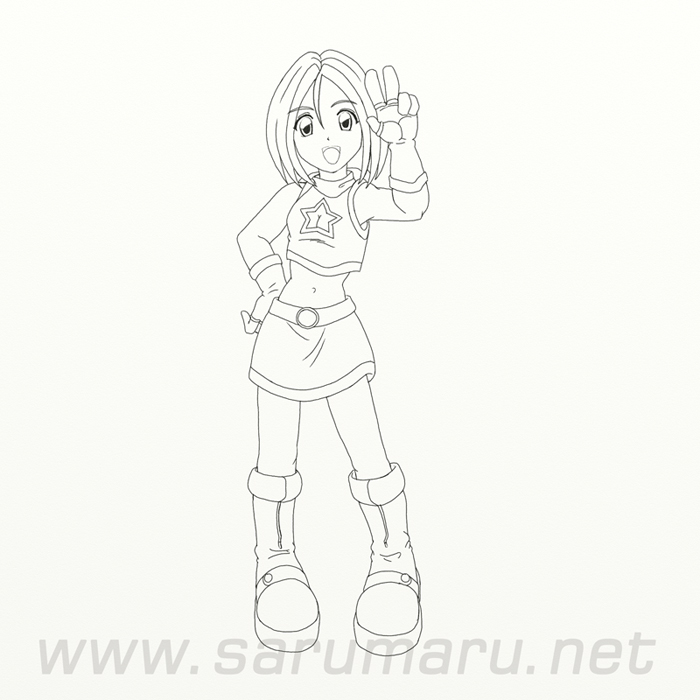
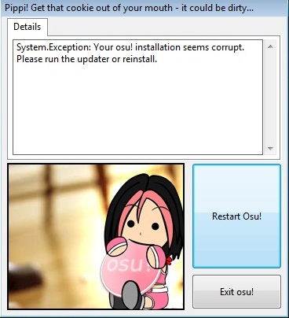
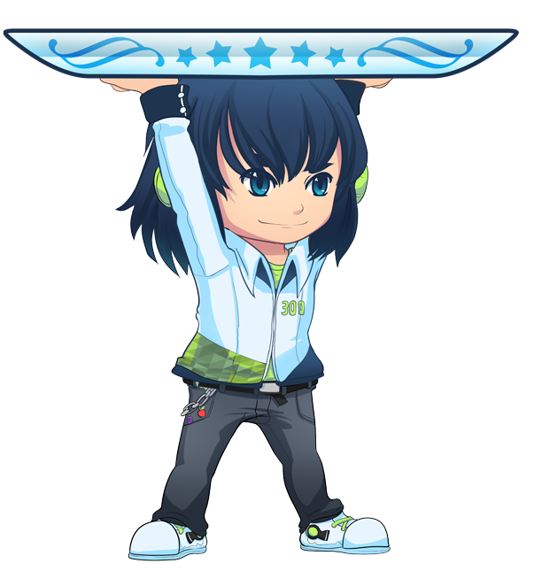
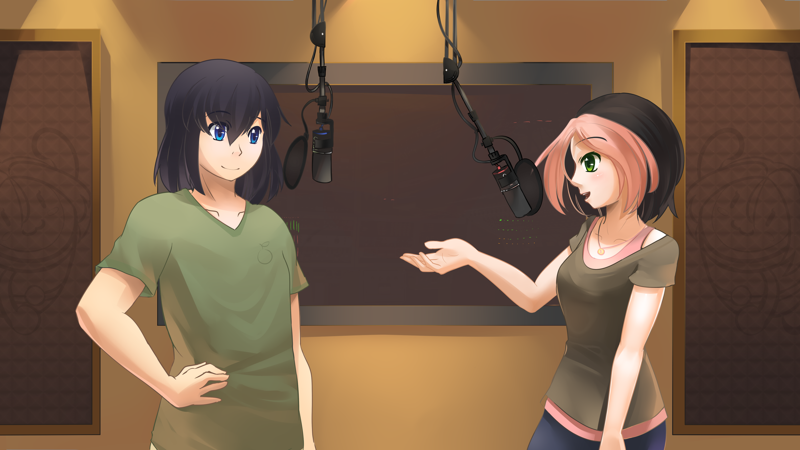

# Gallery

***[Clicca per tonare alla pagina delle Mascotte](/wiki/Mascots)***

## Originali osu!

### Pippi originali (vestito da idol)

 skin \"osu!default di peppy\".")
.")

.")

### Pippi corrente (outfit da DJ)

.")

### Yuzu

### Misc

.")

## Cameo

