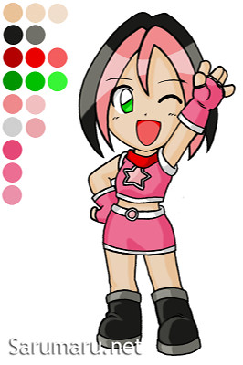
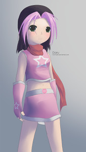

<!-- TODO: scrap this when relevant images can be put on the main mascots article with a proper gallery/slideshow feature. https://github.com/ppy/osu-web/issues/4257 -->

# 画廊

## 官方

### pippi

#### 原版 pippi（偶像装）

#### 现版 pippi（DJ 装）

#### 同人作品

有关 pippi 同人作品，请参见：

- [首届官方 osu! 同人艺术作品比赛结果！(Facebook)](https://www.facebook.com/media/set/?set=a.10152186520298282)
- [第二届 osu! 同人艺术作品比赛！(Facebook)](https://www.facebook.com/media/set/?set=a.10152291754173282)
- [第三届 osu! 同人艺术作品比赛！(Facebook)](https://www.facebook.com/media/set/?set=a.10152514671088282)
- [同人作品比赛 7：万圣节！](https://osu.ppy.sh/community/contests/5)
- [同人作品比赛 8：圣诞节](https://osu.ppy.sh/community/contests/36)
- [夏日 Mocha 同人作品比赛](https://osu.ppy.sh/community/contests/48)

### Yuzu

#### 同人作品

有关 Yuzu 同人作品，请参见：

- [第三届 osu! 同人艺术作品比赛！(Facebook)](https://www.facebook.com/media/set/?set=a.10152514671088282)
- [同人作品比赛 7：万圣节！](https://osu.ppy.sh/community/contests/5)
- [同人作品比赛 8：圣诞节](https://osu.ppy.sh/community/contests/36)
- [Yuzu 新外观设计比赛](https://osu.ppy.sh/community/contests/49)

### Maria

#### 同人作品

有关更多 Maria 同人作品，请参见：

- [同人作品比赛 8：圣诞节](https://osu.ppy.sh/community/contests/36)
- [同人作品比赛 9：春季](https://osu.ppy.sh/community/contests/45)

### Mocha

#### 同人作品

有关更多 Mocha 同人作品，请参见：

- [夏日 Mocha 同人作品比赛](https://osu.ppy.sh/community/contests/48)

### 杂项

## 客串

### 同人作品

有关客串吉祥物的同人作品，请参见：

- [夏日 Mocha 同人作品比赛](https://osu.ppy.sh/community/contests/48)

## 社区

包含社区创作吉祥物的同人作品，请参见：

- [同人作品比赛 6：osu!taiko 吉祥物](https://osu.ppy.sh/community/contests/2)
- [同人作品比赛 7：万圣节！](https://osu.ppy.sh/community/contests/5)
- [同人作品比赛 8：圣诞节](https://osu.ppy.sh/community/contests/36)
- [同人作品比赛 9：春季](https://osu.ppy.sh/community/contests/45)
- [夏日 Mocha 同人作品比赛](https://osu.ppy.sh/community/contests/48)
- [Yuzu 新形象设计比赛](https://osu.ppy.sh/community/contests/49)
