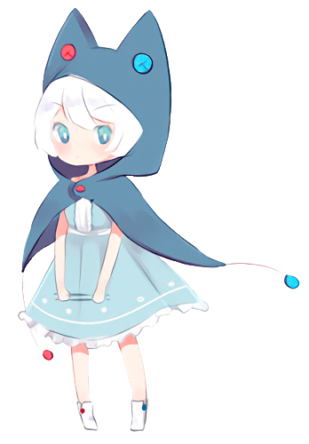

# Mascots

*See also: [Mascots/Gallery](/wiki/Mascots/Gallery)*

A YouTube video showcasing the osu! mascots can be seen at [Mascot Showcase](https://youtu.be/mJF2cAs_MrI).

## Official

###  pippi

pippi, stylized with a lowercase "p", is the osu!standard mascot that joined on 2008-07. She is also known as pippidon in osu!taiko and appeared in [Yandere Simulator](https://yanderesimulator.com) as an NPC. The initial concept art was created by [Sarumaru](/users/9427), the pippidon sprite was created by [crystalsuicune](/users/9974), and the current art was designed by [Daru](/users/32480).

###  Yuzu

<!-- *For the news post, see: [Meet Yuzu](/home/news/89483664163)* -->

Yuzu is the osu!catch mascot that joined on 2014-06-22. He was born on 2000-04-10, is 172cm tall, and weighs 65kg. His initial art design and catcher sprites were done by [ztrot](/users/6347) while Daru has created the comboburst art.

###  Maria

*For the news post, see: [Meet Maria - osu!mania’s new mascot!](/home/news/2016-04-20-meet-maria-osumanias-new-mascot)*

Maria is the osu!mania mascot that joined on 2016-03-04. Her art was designed by Daru.

###  Mocha

*For the news post, see: [The new osu!taiko mascot is here!](/home/news/2017-05-25-the-new-osutaiko-mascot-is-here)*

Mocha is the osu!taiko mascot. She was initially designed during the [sixth fanart contest](/community/contests/2) by [Crowie](/users/6894067), which has been ranked 21st from the polls.

## Cameos

### Ryūta Ippongi

> He is the hot-blooded leader of the cheer squad. He has a good soul and helps those around him who are in distress by standing up and fighting for them!

一本木龍太 (Ryūta Ippongi) was the osu!catch chibi-fruit catcher that had joined in 2008, but was replaced by [Yuzu](#yuzu) in 2014. He was created by [iNiS Corporation](https://en.wikipedia.org/wiki/INiS) and was once part of the old website. He also appeared in [Yandere Simulator](https://yanderesimulator.com) as an NPC.

Ryuuta was also featured in [LuigiHann](/users/1079)'s skin, [Elite Beat osu! HD (1.0 Complete!)](https://osu.ppy.sh/forum/t/190357/).

### Agent J

> An expert in many styles of dance ranging from hip-hop to ballet, J can mesmerize any living thing.

Agent J, also known as BA-2 (Beat Agent-2) or J, was one of the osu! mascots in 2008 but had retired in 2014. He was created by iNiS Corporation and was once part of the old website.

Agent J was also featured in LuigiHann's skin, [Elite Beat osu! HD (1.0 Complete!)](https://osu.ppy.sh/forum/t/190357/).

### Don

> Don is the protagonist of the [Taiko no Tatsujin](https://en.wikipedia.org/wiki/Taiko_no_Tatsujin) series. He is a taiko drum with a white edge and four legs, a red face (which appears to be moly orange), and a light blue body. Don's dream is to share the beauty of Taiko with the world. Three years have passed since he moved into the Wada House, and he's become quite popular around town. He has a monstrous appetite and sometimes has expensive shopping at the Wada House which may take over for the worst. He usually ends his sentences with "Ta-don", meaning "Ba-dum" in Japanese.

和田どん (Wada Don), also known as Don or Don-chan, was one of the osu! mascots for osu!taiko that joined in 2008-05. He is 48cm tall and weighs more than 100kg. He appears in the skin for osu!taiko. His art was designed by Yukiko Yokoo (横尾有希子) and was voiced by Narahashi Miki (楢橋 美紀).

## Community

### Aiko

Designed by [JMC](/users/774010), Aiko was one of the participants in the osu!taiko mascot design contest. She is an energetic girl with a passion for osu!taiko, even if she isn't the best at it! Sporting a pair of stylish "Tabi" shoes and a retinue of pippidon accessories, the mascot of yore lives on in this spunky girl. She's fairly short at only 154cm, and was born on 1999-04-06.

### Alisa

Designed by [\[ Glitch \]](/users/3781400), Alisa was one of the participants in the osu!taiko mascot design contest. She has been playing osu!taiko ever since her early childhood. Fond of playing songs for others, she is very musically oriented, and when she's not sleeping or eating, she's playing osu!taiko, or playing retro video games for kicks!

### Tama

Designed by [crystalsuicine](/users/9974), Tama was one of the younger participants in the osu!taiko mascot design contest at only age 15 (or is she?), Tama has a huge passion for taiko drumming. And thunderstorms. And especially festivals, where she snatches up any takoyaki she can find. Always up for the challenge, Tama hides a particularly mysterious past behind her youthful demeanor.

### Taikonator

Taikonator, also known as Taikonator 3000, was one of the participants in the osu!taiko mascot design contest. He has gained some traction as an inside joke and popularity for unknown reasons. His origins remains a mystery; despite this, he is far more unique than the other osu!taiko mascot design submissions and has made many appearances in various user fanart submissions.

### pyun

Designed by [pyun](/users/981534), pyun was one of the participants in the osu!taiko mascot design contest. She is seen in some of pyun's past fanart contest submissions.
