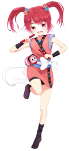
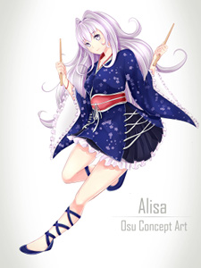
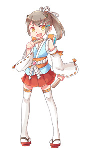
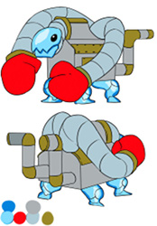
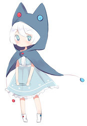

# Maskot

*Lihat juga: [Maskot/Galeri](/wiki/Mascots/Gallery).*

Terdapat sebuah video di Youtube yang menampilkan maskot osu!, konten tersebut bisa dilihat di [Mascot Showcase](https://youtu.be/mJF2cAs_MrI)

## Resmi

###  pippi

pippi, dituliskan dengan huruf "p" kecil, adalah maskot osu!standard yang bergabung pada Juli 2008. Dia juga dikenal sebagai pippidon di mode osu!taiko dan pippi merupakan salah satu NPC di game [Yandere Simulator](https://yanderesimulator.com). Konsep awal pippi awalnya dirancang oleh [Sarumaru](https://osu.ppy.sh/users/9427), sprite pippidon dibuat oleh [crystalsuicune](https://osu.ppy.sh/users/9974), dan konsep pippi yang terkini dirancang oleh [Daru](https://osu.ppy.sh/users/32480).

###  Yuzu

<!-- *Untuk postingan beritanya, lihat: [Meet Yuzu](https://osu.ppy.sh/home/news/89483664163).* -->

Yuzu adalah maskot osu!catch yang telah bergabung sejak 22 Juni 2014. Yuzu lahir pada 10 April 2000, tingginya 172cm, dan beratnya 65kg. Konsep awal dan sprite catcher Yuzu dirancang oleh [ztrot](https://osu.ppy.sh/users/6347) lalu Daru membuat comboburst-nya.

###  Maria

*Untuk postingan beritanya, lihat: [Meet Maria - osu!mania’s new mascot!](https://osu.ppy.sh/home/news/2016-04-20-meet-maria-osumanias-new-mascot).*

Maria adalah maskot osu!mania yang bergabung pada 4 Maret 2016. Maria dirancang oleh Daru.

###  Mocha

*Untuk postingan beritanya, lihat: [The new osu!taiko mascot is here!](https://osu.ppy.sh/home/news/2017-05-25-the-new-osutaiko-mascot-is-here).*

Mocha adalah maskot osu!taiko. Awalnya Mocha dirancang selama [kontes fanart keenam](https://osu.ppy.sh/community/contests/2) oleh [Crowie](https://osu.ppy.sh/users/6894067), yang telah menduduki peringkat 21 dari jajak pendapat.

## Cameos

### Ryūta Ippongi

> Dia adalah pemimpin regu cheerleader berdarah panas. Dia memiliki jiwa yang baik dan membantu orang-orang di sekitarnya yang sedang mengalami kesulitan dengan cara berdiri dan berjuang untuk mereka!

一本木龍太 (Ryūta Ippongi) adalah catcher chibi osu!catch yang telah bergabung pada sejak tahun 2008, tetapi digantikan oleh [Yuzu](#yuzu) pada tahun 2014. Dia dirancang oleh [iNis Corporation](https://en.wikipedia.org/wiki/INiS) dan pernah menjadi bagian dari situs web lama. Ryūta juga muncul sebagai NPC di game [Yandere Simulator](https://yanderesimulator.com).

Ryuuta juga ditampilkan di skin milik [LuigiHann](https://osu.ppy.sh/users/1079), bernamakan [Elite Beat osu! HD (1.0 Complete!)](https://osu.ppy.sh/community/forums/topics/190357/).

### Agen J

> Seorang ahli yang bisa melakukan banyak gaya tari mulai dari hip-hop hingga balet, J dapat memikat setiap makhluk hidup.

Agen J, dikenal juga sebagai BA-2 (Beat Agent-2) atau J, adalah salah satu maskot osu! di tahun 2008 tetapi telah pensiun pada tahun 2014. Dia dirancang oleh iNis Corporation dan pernah menjadi bagian dari situs web lama.

Agen J juga ditampilkan di skin milik [LuigiHann](https://osu.ppy.sh/users/1079), bernamakan [Elite Beat osu! HD (1.0 Complete!)](https://osu.ppy.sh/community/forums/topics/190357/).

### Don

> Don adalah protagonis dari serial [Taiko no Tatsujin](https://en.wikipedia.org/wiki/Taiko_no_Tatsujin). Dia adalah taiko drum dengan tepian putih yang memiliki empat kaki, wajah merah (yang tampak seperti jingga moly), dan tubuh berwarna biru muda. Mimpi Don adalah membagikan berbagai keindahan Taiko dengan dunia. Tiga tahun telah berlalu sejak dia pindah ke Rumah Wada, dan dia menjadi sangat populer di sekitar kota. Dia memiliki nafsu mengerikan dan kadang-kadang memiliki barang-barang mahal di Rumah Wada yang mungkin adalah hal buruk. Dia biasa mengakhiri kalimatnya dengan "Ta-don", yang berarti "Ba-dum" dalam bahasa Jepang.

和田どん (Wada Don), dikenal juga sebagai Don atau Don-chan, adalah salah satu maskot osu! untuk mode osu!taiko yang bergabung pada Mei 2008. Tingginya 48cm dengan beratnya yang melebihi 100kg. Dia muncul di skin osu!taiko. Dia dirancang oleh Yukiko Yokoo (横尾有希子) dan pengisi suaranya Narahashi Miki (楢橋 美紀).

## Komunitas

### Aiko

Dirancang oleh [JMC](https://osu.ppy.sh/users/774010), Aiko adalah salah satu peserta dalam kontes merancang maskot osu!taiko. Dia adalah gadis yang energik dengan hasrat untuk osu!taiko, bahkan meskipun dia bukan yang terbaik dalam hal itu! Berpenampilan sepasang sepatu olahraga "Tabi" bergaya dan aksesoris pippidon yang banyak, maskot masa lampau hidup dalam gadis gagah ini. Dia cukup pendek dengan tinggi hanya 154cm, dan lahir pada 6 April 1999.

### Alisa

Dirancang oleh [\[ Glitch \]](https://osu.ppy.sh/users/3781400), Alisa adalah salah satu peserta dalam kontes merancang maskot osu!taiko. Dia telah bermain osu!taiko sejak kecil. Gemar memainkan lagu untuk orang lain, dia orang yang sangat berorientasi terhadap musik, dan ketika dia tidak tidur atau makan, dia bermain osu!taiko, atau sekedar iseng bermain video game retro!

### Tama

Dirancang oleh [crystalsuicine](https://osu.ppy.sh/users/9974), Tama adalah salah satu peserta yang lebih muda dalam kontes merancang maskot osu!taiko dengan usia 15 tahun, Tama memiliki gairah besar terhadap taiko. Dan badai petir. Dan terutama festival, di mana dia akan merebut takoyaki jenis apa pun yang bisa dia temukan. Selalu siap menghadapi tantangan, Tama menyembunyikan masa lalu yang sangat misterius di balik sikap mudanya.

### Taikonator

Taikonator, juga dikenal sebagai Taikonator 3000, adalah salah satu peserta dalam kontes merancang maskot osu!taiko. Dia mendapatkan beberapa daya tarik sebagai lelucon dalam komunitas dan popularitas dengan alasan yang tidak diketahui. Asal-usulnya tetap menjadi misteri, meskipun demikian, ia jauh lebih unik daripada maskot kiriman peserta lainnya dan banyak muncul dalam berbagai kiriman fanart pengguna.

### pyun

Dirancang oleh [pyun](https://osu.ppy.sh/users/981534), pyun adalah salah satu peserta dalam kontes merancang maskot osu!taiko. Dia terlihat muncul dalam bebeberapa kiriman fanart pengguna milik pyun dahulu.
